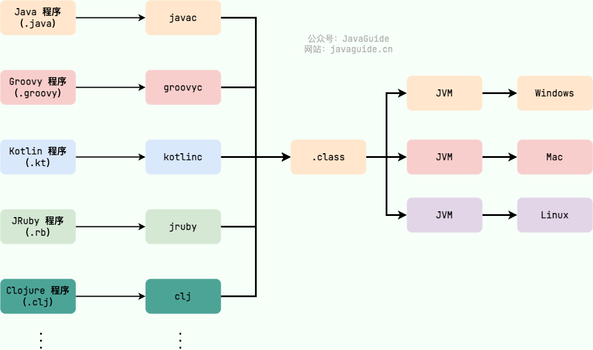
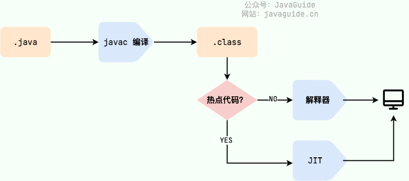
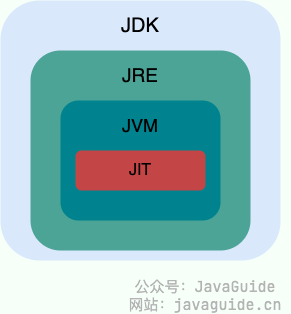
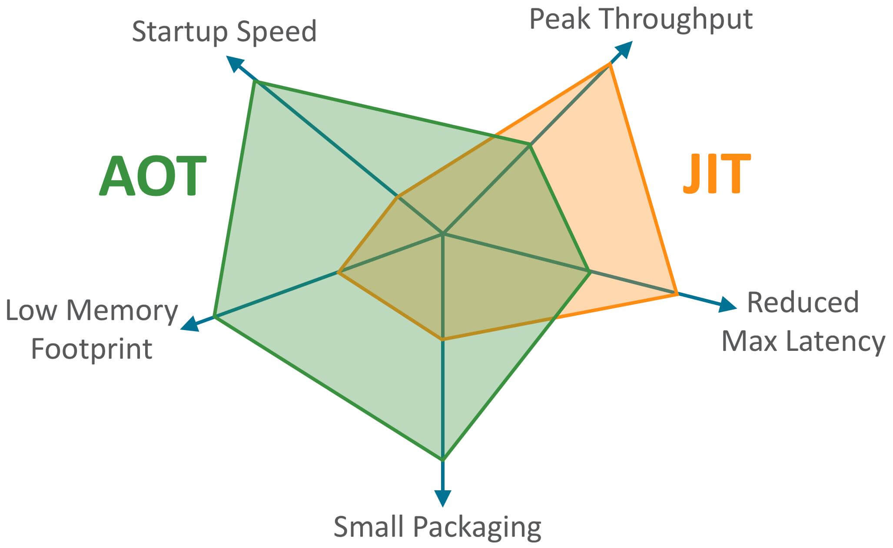

# 一、基础知识与概念

## 1、Java 语言的特点

- 面向对象

  > 封装、继承、多态

- 平台无关性

  > Java 虚拟机实现平台无关性

- 可靠性

  > 具备 异常处理 和 自动内存管理机制

- 支持网络编程且生态丰富，很方便

## 2、Java SE   vs   Java EE

- Java SE（Java Platform，Standard Edition）: Java 平台标准版，Java 编程语言的基础，它包含了支持 Java 应用程序开发和运行的核心类库以及虚拟机等核心组件。Java SE 可以用于构建桌面应用程序或简单的服务器应用程序。
- Java EE（Java Platform, Enterprise Edition ）：Java 平台企业版，建立在 Java SE 的基础上，包含了支持企业级应用程序开发和部署的标准和规范（比如 Servlet、JSP、JDBC 等）。 Java EE 可以用于构建分布式、可移植、健壮、可伸缩和安全的服务端 Java 应用程序，例如 Web 应用程序。

- Java ME（Java Platform，Micro Edition）。Java ME 是 Java 的微型版本，主要用于开发嵌入式消费电子设备的应用程序，例如手机、PDA、机顶盒、冰箱、空调等。Java ME 无需重点关注，知道有这个东西就好了，现在已经用不上。

## 3、JVM  vs  JDK  vs  JRE

### 3.1 JVM

Java 虚拟机（Java Virtual Machine, JVM）是运行 Java 字节码的虚拟机。JVM 有针对不同系统的特定实现（Windows，Linux，macOS），目的是使用相同的字节码，它们都会给出相同的结果。

**字节码 和 不同系统的 JVM 实现**是 Java 语言“一次编译，随处可以运行”的关键所在。

如下图所示，不同编程语言（Java、Groovy、Kotlin、JRuby、Clojure ...）通过各自的编译器编译成 `.class` 文件，并最终通过 JVM 在不同平台（Windows、Mac、Linux）上运行。

### 3.2 JDK

JDK（Java Development Kit）是一个功能齐全的 Java 开发工具包，供开发者使用，用于创建和编译 Java 程序。它包含了 JRE（Java Runtime Environment），以及编译器 javac 和其他工具，如 javadoc（文档生成器）、jdb（调试器）、jconsole（监控工具）、javap（反编译工具）等

### 3.3 JRE

JRE 是运行已编译 Java 程序所需的环境，主要包含以下两个部分：

1. **JVM** : 也就是我们上面提到的 Java 虚拟机。
2. **Java 基础类库（Class Library）**：一组标准的类库，提供常用的功能和 API（如 I/O 操作、网络通信、数据结构等）

简单来说，JRE 只包含运行 Java 程序所需的环境和类库，而 JDK 不仅包含 JRE，还包括用于开发和调试 Java 程序的工具。

不过，从 JDK 9 开始，就不需要区分 JDK 和 JRE 的关系了，取而代之的是模块系统（JDK 被重新组织成 94 个模块）+ [jlink](http://openjdk.java.net/jeps/282) 工具 (随 Java 9 一起发布的新命令行工具，用于生成自定义 Java 运行时映像，该映像仅包含给定应用程序所需的模块) 。并且，从 JDK 11 开始，Oracle 不再提供单独的 JRE 下载。

Java 应用可以通过新增的 jlink 工具，创建出只包含所依赖的 JDK 模块的自定义运行时镜像。这样可以极大的减少 Java 运行时环境的大小。

定制的、模块化的 Java 运行时映像有助于简化 Java 应用的部署和节省内存并增强安全性和可维护性。这对于满足现代应用程序架构的需求，如虚拟化、容器化、微服务和云原生开发，是非常重要的。

## 4、 字节码 与 JIT

在 Java 中，JVM 可以理解的代码就叫做字节码（即扩展名为 `.class` 的文件），它不面向任何特定的处理器，只面向虚拟机。Java 语言通过字节码的方式，在一定程度上解决了传统解释型语言执行效率低的问题，同时又保留了解释型语言可移植的特点。所以， Java 程序运行时相对来说还是高效的（不过，和 C、 C++，Rust，Go 等语言还是有一定差距的），而且，由于字节码并不针对一种特定的机器，因此，Java 程序无须重新编译便可在多种不同操作系统的计算机上运行。

需要格外注意的是 `.class->机器码` 这一步。在这一步 JVM 类加载器首先加载字节码文件，然后通过解释器逐行解释执行，这种方式的执行速度会相对比较慢。而且，有些方法和代码块是经常需要被调用的(也就是所谓的热点的字节码)，所以后面引进了 **JIT（Just in Time ）** 编译器，而 JIT 属于运行时编译。当 JIT 编译器完成第一次编译后，其会将热点字节码对应的机器码保存下来，下次可以直接使用。而我们知道，机器码的运行效率肯定是高于 Java 解释器的。这也解释了我们为什么经常会说 **Java 是编译与解释共存的语言**。

| 项目     | 解释执行               | 编译执行（JIT）            |
| -------- | ---------------------- | -------------------------- |
| 执行方式 | 一条一条翻译边执行     | 先全部翻译，再执行         |
| 执行效率 | 较慢（重复解释）❌      | 较快（机器码直接执行）✅    |
| 内存占用 | 较少✅                  | 较多❌                      |
| 启动速度 | 快✅                    | 稍慢❌                      |
| 开销     | 较小✅                  | 较大❌                      |
| 适合场景 | 小程序、短生命周期代码 | 长循环、频繁调用的热点代码 |

JDK、JRE、JVM、JIT 这四者的关系如下图所示。

## 5、为什么说Java是 编译和解释共存 的语言

### （1）阶段1：编译阶段（源代码 → 字节码）

- 由 `javac` 编译器完成
- 把 `.java` 源代码编译成 `.class` 字节码文件
- 这个阶段属于 静态编译（Static Compilation）
- 和 C/C++ 把代码编译成 .exe 可执行文件很像，只不过 Java 编译成的是平台无关的中间码

### （2）阶段2：运行阶段（字节码 → 机器码）

- JVM 加载 `.class` 文件
- 使用 解释器 把字节码逐条“翻译”为机器指令执行
- 对频繁代码使用 `JIT 编译器` 转换成机器码，提高效率
- 这属于 动态编译（Just-in-time Compilation）

总结：“**先编译，后解释（或编译）**执行”的混合模式

## 6、AOT 有什么优点？为什么不全部使用 AOT 呢？

JDK 9 引入了一种新的编译模式 **AOT(Ahead of Time Compilation)** 。和 JIT 不同的是，这种编译模式会在程序被执行前，就将字节码文件`.class`编译成机器码，属于静态编译（C、 C++，Rust，Go 等语言就是静态编译）。AOT 避免了 JIT 预热等各方面的开销，可以提高 Java 程序的启动速度，避免预热时间长。并且，AOT 还能减少内存占用和增强 Java 程序的安全性（AOT 编译后的代码不容易被反编译和修改），特别适合云原生场景。

可以看出，AOT 的主要优势在于启动时间、内存占用和打包体积。JIT 的主要优势在于具备更高的极限处理能力，可以降低请求的最大延迟。

### （1）**既然 AOT 这么多优点，那为什么不全部使用这种编译方式呢？**

前面也对比过 JIT 与 AOT，两者各有优点，只能说 AOT 更适合当下的云原生场景，对微服务架构的支持也比较友好。

除此之外，AOT 编译无法支持 Java 的一些动态特性，如反射、动态代理、动态加载、JNI（Java Native Interface）等。很多框架和库（如 Spring、CGLIB）都用到了这些特性。如果只使用 AOT 编译，那就没办法使用这些框架和库了，或者说需要针对性地去做适配和优化。举个例子，CGLIB 动态代理使用的是 ASM 技术，而这种技术大致原理是运行时直接在内存中生成并加载修改后的字节码文件也就是 `.class` 文件，如果全部使用 AOT 提前编译，也就不能使用 ASM 技术了。为了支持类似的动态特性，所以选择使用 JIT 即时编译器。

## 7、Java 和 C++ 的区别?

虽然，Java 和 C++ 都是面向对象的语言，都支持封装、继承和多态，但是，它们还是有挺多不相同的地方：

- Java 不提供指针来直接访问内存，程序内存更加安全
- Java 的类是单继承的，C++ 支持多重继承；虽然 Java 的类不可以多继承，但是接口可以多继承。
- Java 有自动内存管理垃圾回收机制(GC)，不需要程序员手动释放无用内存。
- C ++同时支持方法重载和操作符重载，但是 Java 只支持方法重载（操作符重载增加了复杂性，这与 Java 最初的设计思想不符）。
- …