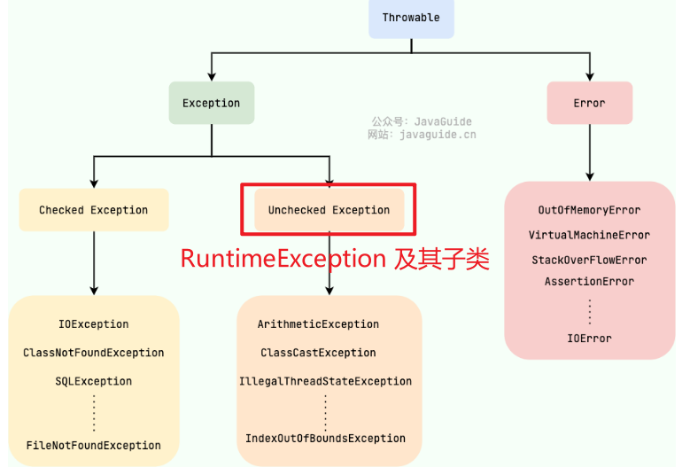
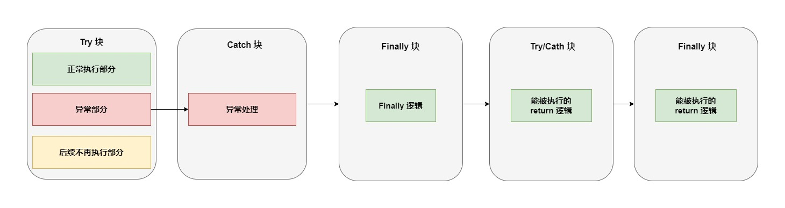

# 一、异常

## **Java 异常类层次结构图概览**：



## 1、Exception 和 Error 有什么区别？

在 Java 中，所有的异常都有一个共同的祖先 `java.lang` 包中的 `Throwable` 类。`Throwable` 类有两个重要的子类:

- **`Exception`** :程序本身可以处理的异常，可以通过 `catch` 来进行捕获。`Exception` 又可以分为 ：
  - Checked Exception (受检查异常，必须处理) ，即 **非** **RuntimeException** 及其子类
  - Unchecked Exception (不受检查异常，可以不处理)，即 **RuntimeException** 及其子类

- **`Error`**：`Error` 属于程序无法处理的错误 ，不建议通过`catch`捕获 。例如 Java 虚拟机运行错误（`Virtual MachineError`）、虚拟机内存不够错误(`OutOfMemoryError`)、类定义错误（`NoClassDefFoundError`）等 。这些异常发生时，Java 虚拟机（JVM）一般会选择线程终止。

  > ```java
  > try {
  >     throw new OutOfMemoryError("模拟内存溢出");
  > } catch (Error e) {
  >     System.out.println("捕获到了 Error: " + e.getMessage());
  > }
  > ```


## 2、Checked Exception 和 Unchecked Exception 有什么区别？

**Checked Exception** 即 受检查异常 ，Java 代码在编译过程中，如果受检查异常没有被 `catch`或者`throws` 关键字处理的话，就没办法通过编译。

除了`RuntimeException`及其子类以外，其他的`Exception`类及其子类都属于受检查异常 。

常见的受检查异常有：IO 相关的异常、`ClassNotFoundException`、`SQLException`...。

自定义案例如下：

- 自定义 Checked Exception 

  > 继承 `Throwable` 类
  >
  > ```java
  > public class MyCheckedException extends Throwable{
  >     public MyCheckedException(String message) {
  >         super(message);
  >     }
  > }
  > ```

- 自定义方法中，抛出 Checked Exception

  > 方法声明处，必须抛出 自定义的 Checked Exception `MyCheckedException`
  >
  > ```java
  > public class MyCheckedFunction {
  >     public void printException(Integer age) throws MyCheckedException {
  >         if(age == null){
  >             throw new MyCheckedException("年龄不能为空");
  >         }
  > 
  >         System.out.println("已获取到年龄：" + age);
  >     }
  > }
  > ```

- 调用该方法时，需要主动处理 Checked Exception

  > ```java
  > public static void main(String[] args) {
  >         MyFunction myFunction = new MyFunction();
  >         Integer age = 10;
  >     	 // 必须处理异常
  >         try {
  >             myFunction.printException(null);
  >         } catch (MyCheckedException e) {
  >             System.out.println("年龄获取失败");
  >             throw new RuntimeException(e);
  >         }
  > }
  > ```


**Unchecked Exception** 即 **不受检查异常** ，Java 代码在编译过程中 ，我们即使不处理不受检查异常也可以正常通过编译。

自定义案例如下：

- 自定义 Unchecked Exception

  > 继承 `RuntimeException`
  >
  > ```java
  > public class MyUnCheckedException extends RuntimeException{
  >     public MyUnCheckedException(String message) {
  >         super(message);
  >     }
  > }
  > ```

- 使用 Unchecked Exception

  > 使用该异常时，不用抛出和处理异常，也能通过编译
  >
  > ```java
  > public class MyUnCheckedFunction {
  > 
  >     public void printException(Integer age){
  >         if(age == null){
  >             throw new MyUnCheckedException("年龄不能为空");
  >         }
  > 
  >         System.out.println("已获取到年龄：" + age);
  >     }
  > }
  > ```

- 调用会出现 Unchecked Exception 的方法

  > 使用该方法时，即使不处理异常，也能通过编译
  >
  > ```java
  > public class TestException {
  >     public static void main(String[] args) {
  > 
  >         MyUnCheckedFunction myUnCheckedFunction = new MyUnCheckedFunction();
  >         myUnCheckedFunction.printException(null);
  > 
  >     }
  > }
  > 
  > ```
  
- 运行时抛出异常

  > ```java
  > Exception in thread "main" com.gc.exception.MyUnCheckedException: 年龄不能为空
  > 	at com.gc.exception.MyUnCheckedFunction.printException(MyUnCheckedFunction.java:7)
  > 	at com.gc.exception.TestException.main(TestException.java:15)
  > 
  > Process finished with exit code 1
  > ```

`RuntimeException` 及其子类都统称为非受检查异常，常见的有（建议记下来，日常开发中会经常用到）：

- `NullPointerException`(空指针错误)
- `IllegalArgumentException`(参数错误比如方法入参类型错误)
- `NumberFormatException`（字符串转换为数字格式错误，`IllegalArgumentException`的子类）
- `ArrayIndexOutOfBoundsException`（数组越界错误）
- `ClassCastException`（类型转换错误）
- `ArithmeticException`（算术错误）
- `SecurityException` （安全错误比如权限不够）
- `UnsupportedOperationException`(不支持的操作错误比如重复创建同一用户)
- ……

## 3、Throwable 类常用方法有哪些？

- `String getMessage()`: 返回异常发生时的详细信息

- `String toString()`: 返回异常发生时的简要描述

- `String getLocalizedMessage()`: 返回异常对象的本地化信息。使用 `Throwable` 的子类覆盖这个方法，可以生成本地化信息。如果子类没有覆盖该方法，则该方法返回的信息与 `getMessage()`返回的结果相同

- `void printStackTrace()`: 在控制台上打印 `Throwable` 对象封装的异常信息

  > ```java
  > public class TestException {
  >     public static void main(String[] args) {
  >         MyCheckedFunction myFunction = new MyCheckedFunction();
  > 
  >         try {
  >             myFunction.printException(null);
  >         } catch (MyCheckedException e) {
  >             System.out.println("1、getMessage(): " + e.getMessage());
  >             System.out.println("2、toString(): " + e.toString());
  >             System.out.println("3、getLocalizedMessage(): " + e.getLocalizedMessage());
  >             System.out.println("4、printStackTrace(): " );
  >             e.printStackTrace();
  >         }
  >     }
  > }
  > ```
  >
  > 输出结果：
  >
  > ```java
  > 1、getMessage(): 年龄不能为空
  > 2、toString(): com.gc.exception.MyCheckedException: 年龄不能为空
  > 3、getLocalizedMessage(): 年龄不能为空
  > 4、printStackTrace(): 
  > com.gc.exception.MyCheckedException: 年龄不能为空
  > 	at com.gc.exception.MyCheckedFunction.printException(MyCheckedFunction.java:6)
  > 	at com.gc.exception.TestException.main(TestException.java:8)
  > ```


## 4、try-catch-finally 如何使用？

- `try`块：用于捕获异常。其后可接零个或多个 `catch` 块，如果没有 `catch` 块，则必须跟一个 `finally` 块。

- `catch`块：用于处理 try 捕获到的异常。

- `finally` 块：无论是否捕获或处理异常，`finally` 块里的语句都会被执行。当在 `try` 块或 `catch` 块中遇到 `return` 语句时，`finally` 语句块将在方法返回之前被执行。

代码示例：

```java
try {
    System.out.println("Try to do something");
    throw new RuntimeException("RuntimeException");
} catch (Exception e) {
    System.out.println("Catch Exception -> " + e.getMessage());
} finally {
    System.out.println("Finally");
}
```

结果输出：

```java
Try to do something
Catch Exception -> RuntimeException
Finally
```

执行顺序：



**⚠注意：不要在 finally 语句块中使用 return!** 当 try 语句和 finally 语句中都有 return 语句时，try 语句块中的 return 语句会被忽略。这是因为 try 语句中的 return 返回值会先被暂存在一个本地变量中，当执行到 finally 语句中的 return 之后，这个本地变量的值就变为了 finally 语句中的 return 返回值。

案例：

- 如果 `finally`  块中也有 `return` 的话， `try-catch` 中能被执行到的 `return` 会被覆盖，返回 `finally` 中的值。 

  > 此案例中，抛出异常后，`try` 中的 `return` 将不会被执行，进入 `catch` 返回 `1` ，但是  `finally` 中也有 `return 2` ，因此 2 会覆盖 1，最终返回 2。
  >
  > ```java
  > public class ExceptionOrder {
  >     public int testExceptionOrder(){
  >         MyCheckedFunction fun = new MyCheckedFunction();
  >         try {
  >             fun.printException(null);	// 出现异常
  >             
  >             // ---------- 后续不再执行 ----------
  >             System.out.println("try after exception");
  >             return 0;
  >         } catch (MyCheckedException e) {
  >             e.printStackTrace();	// 输出异常信息
  >             return 1;
  >         }finally {
  >             System.out.println("finally");
  >             return 2;
  >         }
  >     }
  > }
  > ```
  >
  >   调用如下：
  >
  > ```java
  > public class TestException {
  >     public static void main(String[] args) {
  >         ExceptionOrder exceptionOrder = new ExceptionOrder();
  >         int i = exceptionOrder.testExceptionOrder();
  >         System.out.println(i);
  >     }
  > }
  > ```
  >
  > 输出：
  >
  > ```java
  > com.gc.exception.MyCheckedException: 年龄不能为空
  > 	at com.gc.exception.MyCheckedFunction.printException(MyCheckedFunction.java:6)
  > 	at com.gc.exception.ExceptionOrder.testExceptionOrder(ExceptionOrder.java:9)
  > 	at com.gc.exception.TestException.main(TestException.java:6)
  > finally
  > 2
  > ```

## 5、finally 中的代码一定会执行吗？

不一定的！在某些情况下，finally 中的代码不会被执行。

就比如说 finally 之前虚拟机被终止运行的话，finally 中的代码就不会被执行。

```java
try {
    System.out.println("Try to do something");
    throw new RuntimeException("RuntimeException");
} catch (Exception e) {
    System.out.println("Catch Exception -> " + e.getMessage());
    // 终止当前正在运行的Java虚拟机
    System.exit(1);
} finally {
    System.out.println("Finally");
}
```

输出：

```java
Try to do something
Catch Exception -> RuntimeException
```

另外，在以下 2 种特殊情况下，`finally` 块的代码也不会被执行：

1. 程序所在的线程死亡。
2. 关闭 CPU。

## 6、如何使用 try-with-resources 代替try-catch-finally？

1. **适用范围（资源的定义）：** 任何实现 `java.lang.AutoCloseable`或者 `java.io.Closeable` 的对象

2. **关闭资源和 finally 块的执行顺序：** 在 `try-with-resources` 语句中，任何 catch 或 finally 块在声明的资源关闭后运行

   > 案例如下：
   >
   > - 自定义资源类：
   >
   > ```java
   > public class MyResource implements AutoCloseable {
   >     private String name;
   > 
   >     public MyResource(String name) {
   >         this.name = name;
   >     }
   > 
   >     @Override
   >     public void close() {
   >         System.out.println("关闭资源: " + name);
   >     }
   > }
   > 
   > ```
   >
   > - 使用 try-with-resources
   >
   > ```java
   > public class TestTryWithResources {
   >     public static void main(String[] args) {
   >         try (MyResource res = new MyResource("Resource1")) {
   >             System.out.println("在 try 中执行");
   >             throw new RuntimeException("发生异常");
   >         } catch (Exception e) {
   >             System.out.println("进入 catch");
   >         } finally {
   >             System.out.println("进入 finally");
   >         }
   >     }
   > }
   > 
   > ```
   >
   > - 输出结果：
   >
   > ```java
   > 在 try 中执行
   > 关闭资源: Resource1
   > 进入 catch
   > 进入 finally
   > 
   > ```
   >
   > 

《Effective Java》中明确指出：

> 面对必须要关闭的资源，我们总是应该优先使用 `try-with-resources` 而不是`try-finally`。随之产生的代码更简短，更清晰，产生的异常对我们也更有用。`try-with-resources`语句让我们更容易编写必须要关闭的资源的代码，若采用`try-finally`则几乎做不到这点。

Java 中类似于`InputStream`、`OutputStream`、`Scanner`、`PrintWriter`等的资源都需要我们调用`close()`方法来手动关闭，一般情况下我们都是通过`try-catch-finally`语句来实现这个需求，如下：

```java
//读取文本文件的内容
Scanner scanner = null;
try {
    scanner = new Scanner(new File("D://read.txt"));
    while (scanner.hasNext()) {
        System.out.println(scanner.nextLine());
    }
} catch (FileNotFoundException e) {
    e.printStackTrace();
} finally {
    if (scanner != null) {
        scanner.close();
    }
}
```

使用 Java 7 之后的 `try-with-resources` 语句改造上面的代码：

```java
try (Scanner scanner = new Scanner(new File("test.txt"))) {
    while (scanner.hasNext()) {
        System.out.println(scanner.nextLine());
    }
} catch (FileNotFoundException fnfe) {
    fnfe.printStackTrace();
}
```

当然多个资源需要关闭的时候，使用 `try-with-resources` 实现起来也非常简单，如果你还是用`try-catch-finally`可能会带来很多问题。

通过使用分号分隔，可以在`try-with-resources`块中声明多个资源。

```java
try (BufferedInputStream bin = new BufferedInputStream(new FileInputStream(new File("test.txt")));
     BufferedOutputStream bout = new BufferedOutputStream(new FileOutputStream(new File("out.txt")))) {
    int b;
    while ((b = bin.read()) != -1) {
        bout.write(b);
    }
}
catch (IOException e) {
    e.printStackTrace();
}
```

## 7、异常使用有哪些需要注意的地方？

- 不要把异常定义为静态变量，因为这样会导致异常栈信息错乱。每次手动抛出异常，我们都需要手动 new 一个异常对象抛出。

  > ❌ 错误示例代码：
  >
  > ```java
  > public class MyException extends RuntimeException {
  >     public MyException(String message) {
  >         super(message);
  >     }
  > 
  >     // 错误做法：定义为 static 实例
  >     public static final MyException INSTANCE = new MyException("通用错误");
  > }
  > 
  > ```
  >
  > 使用：
  >
  > ```java
  > public class StaticExceptionDemo {
  >     public static void main(String[] args) {
  >         for (int i = 0; i < 3; i++) {
  >             try {
  >                 throw MyException.INSTANCE; // 重复抛出同一个异常对象
  >             } catch (Exception e) {
  >                 e.printStackTrace();
  >             }
  >         }
  >     }
  > }
  > 
  > ```
  >
  > ❌ 输出结果（关键问题）：
  >
  > ```java
  > MyException: 通用错误
  >     at StaticExceptionDemo.main(StaticExceptionDemo.java:7)
  >     ...（其他堆栈）
  > 
  > // 第二次、第三次堆栈与第一次相同！！！
  > 
  > ```
  >
  > - Throwable（包括 Exception）会在创建时记录栈帧信息（stack trace）；
  >
  > - 静态实例只 new 一次，所以后续再抛出的时候堆栈信息是旧的；
  >
  > - 你以为异常是在 main 第7行抛出的，其实可能是别的地方，但堆栈没更新！

- 抛出的异常信息一定要有意义。

- 建议抛出更加具体的异常，比如字符串转换为数字格式错误的时候应该抛出`NumberFormatException`而不是其父类`IllegalArgumentException`。

- 避免重复记录日志：如果在捕获异常的地方已经记录了足够的信息（包括异常类型、错误信息和堆栈跟踪等），那么在业务代码中再次抛出这个异常时，就不应该再次记录相同的错误信息。重复记录日志会使得日志文件膨胀，并且可能会掩盖问题的实际原因，使得问题更难以追踪和解决。

- ……

# 二、泛型

## 1、什么是泛型？有什么作用？

**Java 泛型（Generics）** 是 JDK 5 中引入的一个新特性。使用泛型参数，可以增强代码的可读性以及稳定性。

编译器可以对泛型参数进行检测，并且通过泛型参数可以指定传入的对象类型。比如 `ArrayList<Person> persons = new ArrayList<Person>()` 这行代码就指明了该 `ArrayList` 对象只能传入 `Person` 对象，如果传入其他类型的对象就会报错。

```java
ArrayList<E> extends AbstractList<E>
```

并且，原生 `List` 返回类型是 `Object` ，需要手动转换类型才能使用，使用泛型后编译器自动转换。

## 2、泛型的使用方式有哪几种？

泛型一般有三种使用方式:**泛型类**、**泛型接口**、**泛型方法**。

**1. 泛型类**：

```java
//此处T可以随便写为任意标识，常见的如T、E、K、V等形式的参数常用于表示泛型
//在实例化泛型类时，必须指定T的具体类型
public class Generic<T>{

    private T key;

    public Generic(T key) {
        this.key = key;
    }

    public T getKey(){
        return key;
    }
}
```

如何实例化泛型类：

```java
Generic<Integer> genericInteger = new Generic<Integer>(123456);
```


**2.泛型接口**：

```java
public interface Generator<T> {
    public T method();
}
```

实现泛型接口，不指定类型：

```java
class GeneratorImpl<T> implements Generator<T>{
    @Override
    public T method() {
        return null;
    }
}
```

实现泛型接口，指定类型：

```java
class GeneratorImpl implements Generator<String> {
    @Override
    public String method() {
        return "hello";
    }
}
```


**3.泛型方法**：

```java
public static < E > void printArray( E[] inputArray )
{
      for ( E element : inputArray ){
         System.out.printf( "%s ", element );
      }
      System.out.println();
 }
```

使用：

```java
// 创建不同类型数组：Integer, Double 和 Character
Integer[] intArray = { 1, 2, 3 };
String[] stringArray = { "Hello", "World" };
printArray( intArray  );
printArray( stringArray  );
```

> ⚠注意: 
>
> - `public static < E > void printArray( E[] inputArray )` 一般被称为静态泛型方法；在 java 中泛型只是一个占位符，必须在传递类型后才能使用。
> - 类在实例化时才能真正的传递类型参数，由于静态方法的加载先于类的实例化，也就是说类中的泛型还没有传递真正的类型参数，静态的方法的加载就已经完成了，所以静态泛型方法是没有办法使用类上声明的泛型的。只能使用自己声明的 `<E>`


## 3、项目中哪里用到了泛型？

- 自定义接口通用返回结果 `CommonResult<T>` 通过参数 `T` 可根据具体的返回类型动态指定结果的数据类型

  ```java
  public class CommonResult<T> {
      private int code;
      private String message;
      private T data;
  
      public CommonResult(int code, String message, T data) {
          this.code = code;
          this.message = message;
          this.data = data;
      }
  
      public static <T> CommonResult<T> success(T data) {
          return new CommonResult<>(200, "成功", data);
      }
  
      public static <T> CommonResult<T> error(String message) {
          return new CommonResult<>(500, message, null);
      }
  
      // Getter & Setter
      public int getCode() { return code; }
      public String getMessage() { return message; }
      public T getData() { return data; }
  }
  
  ```

  

- 定义 `Excel` 处理类 `ExcelUtil<T>` 用于动态指定 `Excel` 导出的数据类型

  - 此类假设使用第三方库（如 Apache POI 或 EasyExcel），这里只写结构和伪实现：

    ```java
    import java.util.List;
    
    public class ExcelUtil<T> {
    
        private Class<T> clazz;
    
        public ExcelUtil(Class<T> clazz) {
            this.clazz = clazz;
        }
    
        public void export(List<T> dataList, String filePath) {
            System.out.println("导出 Excel：" + filePath);
            System.out.println("数据类型：" + clazz.getSimpleName());
            for (T data : dataList) {
                System.out.println("行数据：" + data);
            }
        }
    }
    
    ```

  - 示例实体类：

    ```java
    public class User {
        private String name;
        private int age;
    
        public User(String name, int age) { this.name = name; this.age = age; }
        public String toString() { return name + " - " + age; }
    }
    
    ```

  - 使用示例：

    ```java
    List<User> userList = Arrays.asList(new User("张三", 25), new User("李四", 30));
    ExcelUtil<User> util = new ExcelUtil<>(User.class);
    util.export(userList, "users.xlsx");
    
    ```

  

- 构建集合工具类（参考 `Collections` 中的 `sort`, `binarySearch` 方法）。

  - 示例：

    ```java
    import java.util.Collections;
    import java.util.Comparator;
    import java.util.List;
    
    public class MyCollections {
    
        public static <T extends Comparable<? super T>> void sort(List<T> list) {
            Collections.sort(list);
        }
    
        public static <T> int binarySearch(List<? extends Comparable<? super T>> list, T key) {
            return Collections.binarySearch((List) list, key);
        }
    }
    
    ```

  - 使用示例：

    ```java
    List<Integer> nums = Arrays.asList(9, 5, 2, 8);
    MyCollections.sort(nums);
    System.out.println("排序后：" + nums);  // [2, 5, 8, 9]
    
    int index = MyCollections.binarySearch(nums, 5);
    System.out.println("查找 5 的索引：" + index);  // 1
    
    ```

- ……

