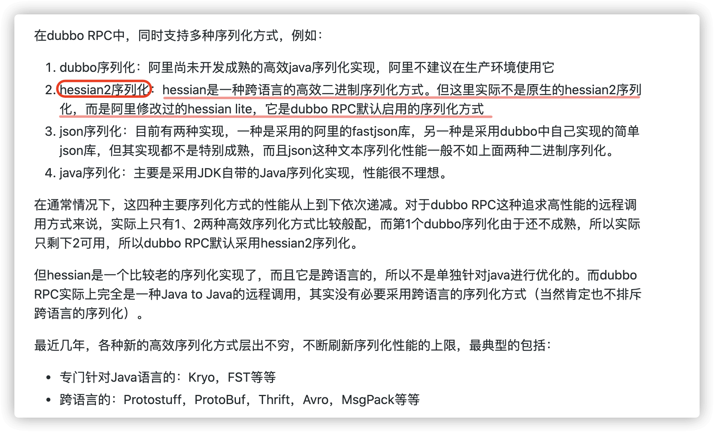
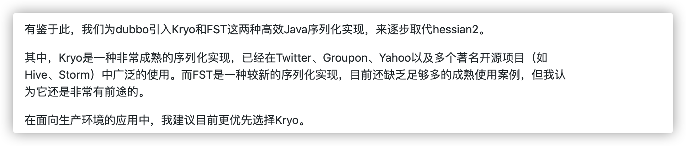

# 一、什么是序列化和反序列化?

如果我们需要持久化 Java 对象比如将 Java 对象保存在文件中，或者在网络传输 Java 对象，这些场景都需要用到序列化。

简单来说：

- **序列化**：将数据结构或对象转换成可以存储或传输的形式，通常是二进制字节流，也可以是 JSON, XML 等文本格式
- **反序列化**：将在序列化过程中所生成的数据转换为原始数据结构或者对象的过程

对于 Java 这种面向对象编程语言来说，我们序列化的都是对象（Object）也就是实例化后的类(Class)，但是在 C++这种半面向对象的语言中，struct(结构体)定义的是数据结构类型，而 class 对应的是对象类型。

下面是序列化和反序列化常见应用场景：

- 对象在进行网络传输（比如远程方法调用 RPC 的时候）之前需要先被序列化，接收到序列化的对象之后需要再进行反序列化；
- 将对象存储到文件之前需要进行序列化，将对象从文件中读取出来需要进行反序列化；
- 将对象存储到数据库（如 Redis）之前需要用到序列化，将对象从缓存数据库中读取出来需要反序列化；
- 将对象存储到内存之前需要进行序列化，从内存中读取出来之后需要进行反序列化。

维基百科是如是介绍序列化的：

> **序列化**（serialization）在计算机科学的数据处理中，是指将数据结构或对象状态转换成可取用格式（例如存成文件，存于缓冲，或经由网络中发送），以留待后续在相同或另一台计算机环境中，能恢复原先状态的过程。依照序列化格式重新获取字节的结果时，可以利用它来产生与原始对象相同语义的副本。对于许多对象，像是使用大量引用的复杂对象，这种序列化重建的过程并不容易。面向对象中的对象序列化，并不概括之前原始对象所关系的函数。这种过程也称为对象编组（marshalling）。从一系列字节提取数据结构的反向操作，是反序列化（也称为解编组、deserialization、unmarshalling）。

综上：**序列化的主要目的是通过网络传输对象或者说是将对象存储到文件系统、数据库、内存中。**


## 1、序列化协议对应于 TCP/IP 4 层模型的哪一层？

我们知道网络通信的双方必须要采用和遵守相同的协议。TCP/IP 四层模型是下面这样的，序列化协议属于哪一层呢？

1. 应用层
2. 传输层
3. 网络层
4. 网络接口层


如上图所示，OSI 七层协议模型中，表示层做的事情主要就是对应用层的用户数据进行处理转换为二进制流。反过来的话，就是将二进制流转换成应用层的用户数据。这不就对应的是序列化和反序列化么？

因为，OSI 七层协议模型中的应用层、表示层和会话层对应的都是 TCP/IP 四层模型中的应用层，所以序列化协议属于 TCP/IP 协议应用层的一部分。

# 二、常见序列化协议有哪些？

JDK 自带的序列化方式一般不会用 ，因为序列化效率低并且存在安全问题。比较常用的序列化协议有 Hessian、Kryo、Protobuf、ProtoStuff，这些都是基于二进制的序列化协议。

| 序列化方式       | 格式           | 是否跨语言 | 可读性 | 应用场景举例             |
| ---------------- | -------------- | ---------- | ------ | ------------------------ |
| Java默认序列化   | 二进制         | ❌          | ❌      | Java内部远程调用、缓存等 |
| JSON             | 文本           | ✅          | ✅      | Web API通信、前后端传输  |
| XML              | 文本           | ✅          | ✅      | 配置文件、SOAP协议等     |
| Protocol Buffers | 二进制（高效） | ✅          | ❌      | 微服务通信、移动端通信   |
| Thrift / Avro    | 二进制         | ✅          | ❌      | 高性能RPC通信            |

像 JSON 和 XML 这种属于文本类序列化方式。虽然可读性比较好，但是性能较差，一般不会选择。

## 1、JDK 自带的序列化方式

JDK 自带的序列化，只需实现 `java.io.Serializable`接口即可。

```java
@AllArgsConstructor
@NoArgsConstructor
@Getter
@Builder
@ToString
public class RpcRequest implements Serializable {
    private static final long serialVersionUID = 1905122041950251207L;
    private String requestId;
    private String interfaceName;
    private String methodName;
    private Object[] parameters;
    private Class<?>[] paramTypes;
    private RpcMessageTypeEnum rpcMessageTypeEnum;
}
```

### （1）**serialVersionUID 有什么作用？**

序列化号 `serialVersionUID` 属于版本控制的作用。反序列化时，会检查 `serialVersionUID` 是否和当前类的 `serialVersionUID` 一致。如果 `serialVersionUID` 不一致则会抛出 `InvalidClassException` 异常。强烈推荐每个序列化类都手动指定其 `serialVersionUID`，如果不手动指定，那么编译器会动态生成默认的 `serialVersionUID`。

### （2）**serialVersionUID 不是被 static 变量修饰了吗？为什么还会被“序列化”？**

`static` 修饰的变量是静态变量，属于类而非类的实例，本身是不会被序列化的。然而，`serialVersionUID` 是一个特例，`serialVersionUID` 的序列化做了特殊处理。当一个对象被序列化时，`serialVersionUID` 会被写入到序列化的二进制流中；在反序列化时，也会解析它并做一致性判断，以此来验证序列化对象的版本一致性。如果两者不匹配，反序列化过程将抛出 `InvalidClassException`，因为这通常意味着序列化的类的定义已经发生了更改，可能不再兼容。

✅ 官方说明如下：

> A serializable class can declare its own serialVersionUID explicitly by declaring a field named `"serialVersionUID"` that must be `static`, `final`, and of type `long`;
>
> 如果想显式指定 `serialVersionUID` ，则需要在类中使用 `static` 和 `final` 关键字来修饰一个 `long` 类型的变量，变量名字必须为 `"serialVersionUID"` 。

⚠也就是说，`serialVersionUID` **只是用来被 JVM 识别，实际并没有被序列化**。

✅ 详解如下：

#### a、`serialVersionUID` 是 `static final` 变量，为什么还会“被序列化”？

答案是：它其实并不会被真正序列化进对象的字节流中。
但它会在序列化和反序列化过程中被 JVM 拿来“参与比对”，起到了校验的作用，这就让人有“它被序列化”的错觉。

#### b、`serialVersionUID` 的作用到底是什么？

在 Java 的序列化机制中：

- 序列化时，会把类的 serialVersionUID 写入序列化流头中（不是对象数据部分，而是对象的元信息）。

- 反序列化时，JVM 会拿反序列化目标类的 serialVersionUID 和流中记录的 serialVersionUID 做比对。
  - 如果一致，就继续反序列化。
  - 如果不一致，就抛出 InvalidClassException。

这保证了 “序列化前和反序列化时的类版本必须一致”。

#### c、那为什么它是 `static` 的还能起作用？

这是因为：

- serialVersionUID 是被 JVM 读取的，不是被序列化的。

- JVM 在读取序列化流的时候，会从类定义中（通过反射）获取 serialVersionUID 静态变量的值来进行校验。

所以它被声明为 static，不会随对象被序列化，但却是序列化机制的重要组成部分。

#### d、如果不手动写 `serialVersionUID` 会怎样？

如果你不写，JVM 会根据类的结构自动计算一个 UID，但：

- 这个自动计算机制比较敏感，类一旦结构变了（加个字段、改个方法签名），UID 可能就变了；

- 导致你旧数据反序列化新类的时候失败（`InvalidClassException`）；

- 所以推荐手动声明一个固定的 `serialVersionUID`。

### （3）**如果有些字段不想进行序列化怎么办？**

对于不想进行序列化的变量，可以使用 `transient` 关键字修饰。

`transient` 关键字的作用是：阻止实例中那些用此关键字修饰的的变量序列化；当对象被反序列化时，被 `transient` 修饰的变量值不会被持久化和恢复。

关于 `transient` 还有几点注意：

- `transient` 只能修饰变量，不能修饰类和方法。
- `transient` 修饰的变量，在反序列化后变量值将会被置成类型的默认值。例如，如果是修饰 `int` 类型，那么反序列后结果就是 `0`。
- `static` 变量因为不属于任何对象(Object)，所以无论有没有 `transient` 关键字修饰，均不会被序列化。

#### （a）为什么需要 `transient`？

Java 的对象默认是可序列化的（前提是类实现了 Serializable 接口）。但是：

> 有些字段我们不希望被序列化，这是 transient 出现的原因。

例如：

```java
private transient String password;
```

#### （b）什么情况下我们不希望某个字段被序列化？

以下是一些典型场景：

1. 敏感信息（如密码、身份证号）

   ```java
   private transient String password;
   ```

   原因：安全性。不希望密码被写进硬盘、日志或通过网络传输。

2. 非持久化计算字段（缓存/临时值）

   ```java
   private transient int cachedHashCode;
   ```

   原因：这类字段可以在运行时重新计算，没有必要持久化。

3. 与特定平台或上下文有关的资源

   ```java
   private transient Socket socket;
   private transient Thread thread;
   ```

   ⚠原因：这些对象无法被序列化（比如线程、文件句柄、数据库连接等），序列化它们没有意义，反而会抛异常。

4. 避免循环引用或大型对象图

   有时你只想序列化核心数据，而不希望序列化一整棵复杂对象图。使用 transient 可以“切断”这类引用。

5. 节省空间

   某些字段占内存大，但不影响业务逻辑（如日志、缓存等），可以用 transient 跳过，减少序列化后的数据体积。

### （4）**为什么不推荐使用 JDK 自带的序列化？**

我们很少或者说几乎不会直接使用 JDK 自带的序列化方式，主要原因有下面这些原因：

- **不支持跨语言调用** : 如果调用的是其他语言开发的服务的时候就不支持了。
- **性能差**：相比于其他序列化框架性能更低，主要原因是序列化之后的字节数组体积较大，导致传输成本加大。
- **存在安全问题**：序列化和反序列化本身并不存在问题。但当输入的反序列化的数据可被用户控制，那么攻击者即可通过构造恶意输入，让反序列化产生非预期的对象，在此过程中执行构造的任意代码。相关阅读：[应用安全:JAVA 反序列化漏洞之殇 - Cryin](https://cryin.github.io/blog/secure-development-java-deserialization-vulnerability/)、[Java 反序列化安全漏洞怎么回事? - Monica](https://www.zhihu.com/question/37562657/answer/1916596031)。

### （5）为什么 JDK 自带序列化不支持跨语言，序列化后传递给前端却能被解析

- **JDK默认序列化是什么？**

  Java 默认的序列化是指使用 `ObjectOutputStream` 和 `ObjectInputStream` 将 Java 对象序列化为二进制（byte stream）格式。这种格式是 Java专用的私有格式，只能被Java程序识别。

  ```java
  ObjectOutputStream out = new ObjectOutputStream(new FileOutputStream("data.ser"));
  out.writeObject(myObject);
  ```

  > 这个序列化后的文件 `data.ser`，只有Java才能反序列化。Python、JavaScript等语言无法解析这种格式。

- **后端传递给前端的数据，并没有用 Java 序列化**

  后端传给前端的数据一般是通过 HTTP 接口传输的，常见的格式有：

  - ✅ JSON（最常见）

  - ✅ XML

  - ✅ Protobuf / Thrift（需要专用工具）

  - ❌ Java的原生序列化（二进制流）不会直接用来给前端

  比如在 Spring Boot 中常见的写法：

  ```java
  @GetMapping("/user")
  public User getUser() {
      return new User("Alice", 20);
  }
  ```

  虽然 `User` 是一个 Java 对象，但 Spring Boot 会自动将它转换成 JSON 字符串传给前端，如下：

  ```json
  {
    "name": "Alice",
    "age": 20
  }
  ```

  这个过程是通过 `Jackson` 或 `Gson` 等 JSON 序列化工具完成的，和 JDK 默认序列化完全无关。

- **总结对比**

  | 特性           | Java默认序列化    | JSON / XML等标准格式         |
  | -------------- | ----------------- | ---------------------------- |
  | 可读性         | ❌ 二进制，不可读  | ✅ 文本，可读                 |
  | 跨语言兼容性   | ❌ Java专用        | ✅ 跨语言（JS、Python都支持） |
  | 前后端通信常用 | ❌ 几乎不用        | ✅ 常用                       |
  | 用途           | Java对象保存/传输 | API数据交换                  |

- **结论**

  前端能解析后端返回的数据，是因为数据是以`JSON`格式传输的，而不是Java默认的二进制序列化格式。JDK默认序列化用于 Java 进程之间的通信或持久化，不适合用于前后端通信或跨语言调用。

## 2、Kryo

Kryo 是一个高性能的序列化/反序列化工具，由于其变长存储特性并使用了字节码生成机制，拥有较高的运行速度和较小的字节码体积。

另外，Kryo 已经是一种非常成熟的序列化实现了，已经在 Twitter、Groupon、Yahoo 以及多个著名开源项目（如 Hive、Storm）中广泛的使用。

[guide-rpc-framework](https://github.com/Snailclimb/guide-rpc-framework) 就是使用的 kryo 进行序列化，序列化和反序列化相关的代码如下：

```java
/**
 * Kryo serialization class, Kryo serialization efficiency is very high, but only compatible with Java language
 *
 * @author shuang.kou
 * @createTime 2020年05月13日 19:29:00
 */
@Slf4j
public class KryoSerializer implements Serializer {

    /**
     * Because Kryo is not thread safe. So, use ThreadLocal to store Kryo objects
     */
    private final ThreadLocal<Kryo> kryoThreadLocal = ThreadLocal.withInitial(() -> {
        Kryo kryo = new Kryo();
        kryo.register(RpcResponse.class);
        kryo.register(RpcRequest.class);
        return kryo;
    });

    @Override
    public byte[] serialize(Object obj) {
        try (ByteArrayOutputStream byteArrayOutputStream = new ByteArrayOutputStream();
             Output output = new Output(byteArrayOutputStream)) {
            Kryo kryo = kryoThreadLocal.get();
            // Object->byte:将对象序列化为byte数组
            kryo.writeObject(output, obj);
            kryoThreadLocal.remove();
            return output.toBytes();
        } catch (Exception e) {
            throw new SerializeException("Serialization failed");
        }
    }

    @Override
    public <T> T deserialize(byte[] bytes, Class<T> clazz) {
        try (ByteArrayInputStream byteArrayInputStream = new ByteArrayInputStream(bytes);
             Input input = new Input(byteArrayInputStream)) {
            Kryo kryo = kryoThreadLocal.get();
            // byte->Object:从byte数组中反序列化出对象
            Object o = kryo.readObject(input, clazz);
            kryoThreadLocal.remove();
            return clazz.cast(o);
        } catch (Exception e) {
            throw new SerializeException("Deserialization failed");
        }
    }

}
```

GitHub 地址：https://github.com/EsotericSoftware/kryo 。

## 3、Protobuf

Protobuf 出自于 Google，性能还比较优秀，也支持多种语言，同时还是跨平台的。就是在使用中过于繁琐，因为你需要自己定义 IDL 文件和生成对应的序列化代码。这样虽然不灵活，但是，另一方面导致 protobuf 没有序列化漏洞的风险。

> Protobuf 包含序列化格式的定义、各种语言的库以及一个 IDL 编译器。正常情况下你需要定义 proto 文件，然后使用 IDL 编译器编译成你需要的语言

一个简单的 proto 文件如下：

```java
// protobuf的版本
syntax = "proto3";
// SearchRequest会被编译成不同的编程语言的相应对象，比如Java中的class、Go中的struct
message Person {
  //string类型字段
  string name = 1;
  // int 类型字段
  int32 age = 2;
}
```

GitHub 地址：https://github.com/protocolbuffers/protobuf。

## 4、ProtoStuff

由于 Protobuf 的易用性较差，它的哥哥 Protostuff 诞生了。

protostuff 基于 Google protobuf，但是提供了更多的功能和更简易的用法。虽然更加易用，但是不代表 ProtoStuff 性能更差。

GitHub 地址：https://github.com/protostuff/protostuff。

## 5、Hessian

Hessian 是一个轻量级的，自定义描述的二进制 RPC 协议。Hessian 是一个比较老的序列化实现了，并且同样也是跨语言的。



Dubbo2.x 默认启用的序列化方式是 Hessian2 ,但是，Dubbo 对 Hessian2 进行了修改，不过大体结构还是差不多。

## 6、总结

Kryo 是专门针对 Java 语言序列化方式并且性能非常好，如果你的应用是专门针对 Java 语言的话可以考虑使用，并且 Dubbo 官网的一篇文章中提到说推荐使用 Kryo 作为生产环境的序列化方式。(文章地址：https://cn.dubbo.apache.org/zh-cn/docsv2.7/user/serialization/）。



像 Protobuf、 ProtoStuff、hessian 这类都是跨语言的序列化方式，如果有跨语言需求的话可以考虑使用。

除了我上面介绍到的序列化方式的话，还有像 Thrift，Avro 这些。

# 三、序列化案例

## 1、JDK 默认序列化

- 定义实体类，实现 `Serializable `接口

  ```java
  import java.io.Serializable;
  
  public class User implements Serializable {
      private String name;
      private int age;
  
      public User() {}
      public User(String name, int age) {
          this.name = name;
          this.age = age;
      }
  
      @Override
      public String toString() {
          return "User{name='" + name + "', age=" + age + '}';
      }
  }
  ```

  

- 使用 `ObjectOutputStream` 序列化/反序列化

  ```java
  import java.io.*;
  
  public class JdkSerializationTest {
  
      private static final String FILE_PATH = "user.jdk";
  
      public static void main(String[] args) throws Exception {
          User user = new User("Bob", 40);
  
          // 序列化
          try (ObjectOutputStream oos = new ObjectOutputStream(new FileOutputStream(FILE_PATH))) {
              oos.writeObject(user);
          }
  
          System.out.println("JDK 默认序列化完成");
  
          // 反序列化
          try (ObjectInputStream ois = new ObjectInputStream(new FileInputStream(FILE_PATH))) {
              User deserialized = (User) ois.readObject();
              System.out.println("反序列化结果：" + deserialized);
          }
      }
  }
  
  ```

  

## 2、Kryo 序列化

- 引入 Kryo 依赖

  ```xml
  <!-- kryo 序列化依赖-->
  <dependency>
      <groupId>com.esotericsoftware</groupId>
      <artifactId>kryo</artifactId>
      <version>5.6.0</version>
  </dependency>
  ```

- 定义实体类，实现 `Serializable `接口

  ```java
  import java.io.Serializable;
  
  public class User implements Serializable {
      private String name;
      private int age;
  
      public User() {}
      public User(String name, int age) {
          this.name = name;
          this.age = age;
      }
  
      @Override
      public String toString() {
          return "User{name='" + name + "', age=" + age + '}';
      }
  }
  ```

- 使用 `ObjectOutputStream` 序列化/反序列化

  ```java
  import com.esotericsoftware.kryo.Kryo;
  import com.esotericsoftware.kryo.io.Input;
  import com.esotericsoftware.kryo.io.Output;
  
  import java.io.FileInputStream;
  import java.io.FileOutputStream;
  
  public class KryoLocalTest {
  
      private static final String FILE_PATH = "user.kryo";
  
      public static void main(String[] args) throws Exception {
          Kryo kryo = new Kryo();
          kryo.setRegistrationRequired(false); // 不需要注册类
  
          // 序列化
          User user = new User("Alice", 30);
          try (Output output = new Output(new FileOutputStream(FILE_PATH))) {
              kryo.writeClassAndObject(output, user);
          }
  
          System.out.println("序列化完成");
  
          // 反序列化
          try (Input input = new Input(new FileInputStream(FILE_PATH))) {
              Object object = kryo.readClassAndObject(input);
              User deserializedUser = (User) object;
              System.out.println("反序列化得到：" + deserializedUser);
          }
      }
  }
  ```

⚠ 注意：

- Kryo 不是线程安全的，实际项目中应避免共享 Kryo 实例。

- 可以使用 kryo.setRegistrationRequired(true) 进一步提升性能，但需要手动 kryo.register(User.class)。

- Kryo 不需要实现 Serializable 接口，但我们经常仍然会写 implements Serializable，原因包括：

  | 原因                 | 说明                                                         |
  | -------------------- | ------------------------------------------------------------ |
  | ✅ 保持兼容性         | 如果类将来可能被用于 JDK 原生序列化场景（如 RMI、Session、Java缓存），加上更安全 |
  | ✅ IDE 检查习惯       | 有些框架或工具（如某些缓存/持久化系统）会默认检测是否实现了 `Serializable` |
  | ✅ 避免误用默认序列化 | 表明这个类是可以序列化的，即使用的是其他方式（比如 Kryo），也是一种显式的声明 |
  | ✅ 防止潜在 Bug       | 比如某些代码组件反射调用 `ObjectOutputStream`，加上后更健壮  |

### （1）Kryo 注册

🔍 什么是“注册类”？
Kryo 是一种 高性能二进制序列化工具，它在序列化对象时要保存对象的 类型信息，以便反序列化时知道该还原成哪个类。

Kryo 序列化类型的两种方式：

| 模式               | 说明                                                         | 示例         |
| ------------------ | ------------------------------------------------------------ | ------------ |
| **未注册（默认）** | Kryo 会将类的全名（如 `com.example.User`）序列化进数据中     | 占用较多字节 |
| **已注册**         | 你手动注册类，会分配一个小编号（int），只序列化编号，不写类名 | 更快更小     |

✅ `setRegistrationRequired(true)`  的作用
表示 你必须手动注册所有要序列化的类，否则 Kryo 会抛出异常，提示你没有注册这个类。

例子：

```java
Kryo kryo = new Kryo();
kryo.setRegistrationRequired(true);
kryo.register(User.class); // 👈 必须注册！

// 否则下面的写入会抛错【如果只开启注册选项，但没有注册实体类】
kryo.writeClassAndObject(output, new User("Tom", 18));

```

✅ 注册和不注册的对比

| 特性               | 不注册类（false）      | 注册类（true + register） |
| ------------------ | ---------------------- | ------------------------- |
| 是否必须手动注册类 | ❌ 否                   | ✅ 是                      |
| 序列化内容         | 写入完整类名（字符串） | 写入编号（int）           |
| 序列化大小         | 稍大                   | 更小                      |
| 序列化速度         | 稍慢                   | 更快                      |
| 兼容性             | 更灵活，类名变也能处理 | 不灵活，注册顺序不能变    |
| 出错容错           | 容错性强               | 出错概率大，顺序不能错    |
| 推荐场景           | 开发调试、简单项目     | 性能敏感、类型稳定的系统  |

🧠 加分理解：注册类的风险

> 注册顺序千万不要变！否则会反序列化成错误类型！

例子：

```java
kryo.register(User.class);  // 被分配 ID=0
kryo.register(Order.class); // 被分配 ID=1
```

如果改了顺序：

```java
kryo.register(Order.class); // 现在 ID=0
kryo.register(User.class);  // 现在 ID=1
```

那么你之前序列化的二进制就会错位反序列化，造成灾难性的错误（比如类型变错）。

因此你还可以用：

```java
kryo.register(User.class, 10);
kryo.register(Order.class, 11);
```

➡️ 显式指定注册 ID，防止顺序变化。
