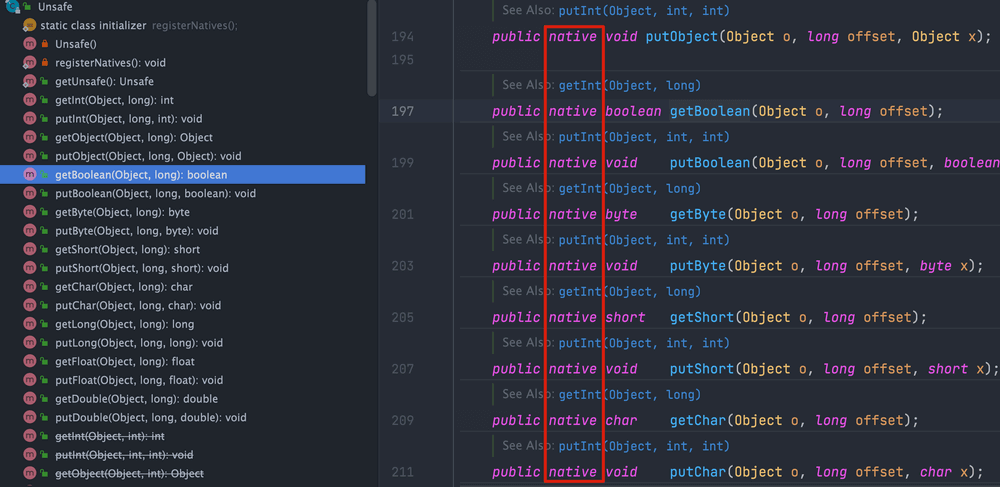
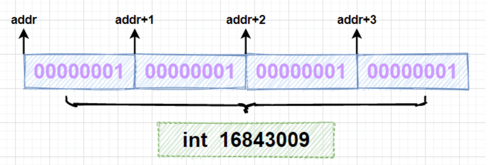
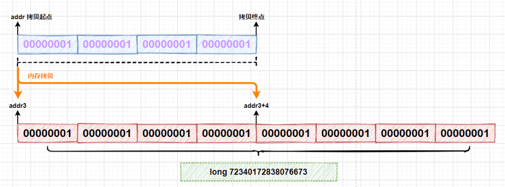
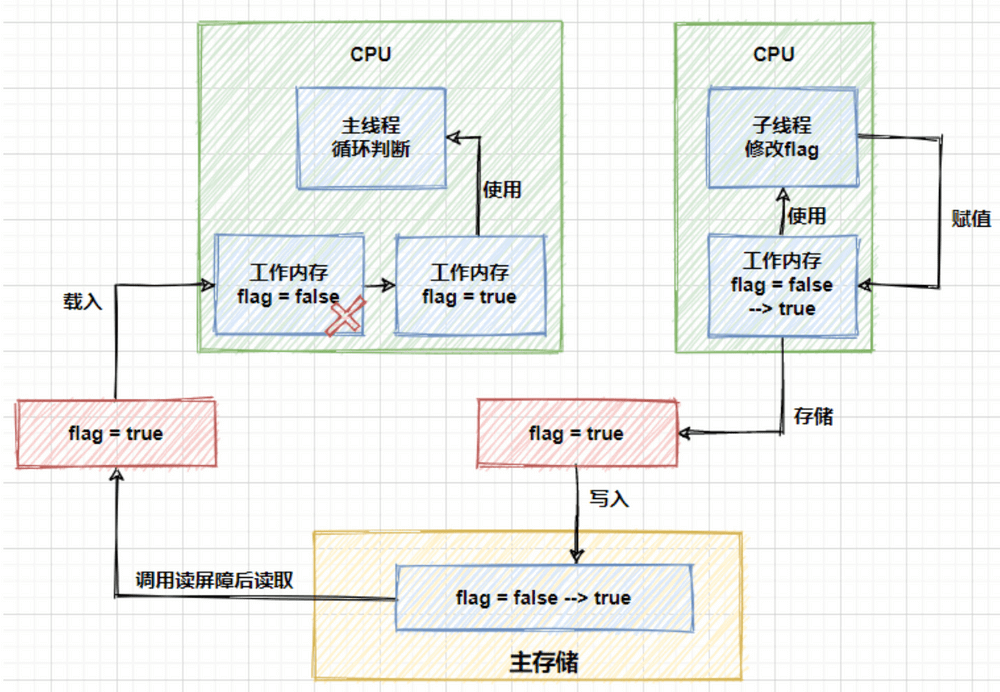

# 一、魔法类 Unsafe 详解

> 本文整理完善自下面这两篇优秀的文章：
>
> - [Java 魔法类：Unsafe 应用解析 - 美团技术团队 -2019](https://tech.meituan.com/2019/02/14/talk-about-java-magic-class-unsafe.html)
> - [Java 双刃剑之 Unsafe 类详解 - 码农参上 - 2021](https://xie.infoq.cn/article/8b6ed4195e475bfb32dacc5cb)

阅读过 JUC 源码的同学，一定会发现很多并发工具类都调用了一个叫做 `Unsafe` 的类。

那这个类主要是用来干什么的呢？有什么使用场景呢？这篇文章就带你搞清楚！

## 1、Unsafe 介绍

`Unsafe` 是位于 `sun.misc` 包下的一个类，主要提供一些用于执行低级别、不安全操作的方法，如直接访问系统内存资源、自主管理内存资源等，这些方法在提升 Java 运行效率、增强 Java 语言底层资源操作能力方面起到了很大的作用。但由于 `Unsafe` 类使 Java 语言拥有了类似 C 语言指针一样操作内存空间的能力，这无疑也增加了程序发生相关指针问题的风险。在程序中过度、不正确使用 `Unsafe` 类会使得程序出错的概率变大，使得 Java 这种安全的语言变得不再“安全”，因此对 `Unsafe` 的使用一定要慎重。

另外，`Unsafe` 提供的这些功能的实现需要依赖本地方法（Native Method）。你可以将本地方法看作是 Java 中使用其他编程语言编写的方法。本地方法使用 **`native`** 关键字修饰，Java 代码中只是声明方法头，具体的实现则交给 **本地代码**。



**为什么要使用本地方法呢？**

1. 需要用到 Java 中不具备的依赖于操作系统的特性，Java 在实现跨平台的同时要实现对底层的控制，需要借助其他语言发挥作用。
2. 对于其他语言已经完成的一些现成功能，可以使用 Java 直接调用。
3. 程序对时间敏感或对性能要求非常高时，有必要使用更加底层的语言，例如 C/C++甚至是汇编。

在 JUC 包的很多并发工具类在实现并发机制时，都调用了本地方法，通过它们打破了 Java 运行时的界限，能够接触到操作系统底层的某些功能。对于同一本地方法，不同的操作系统可能会通过不同的方式来实现，但是对于使用者来说是透明的，最终都会得到相同的结果。

## 2、Unsafe 创建

`sun.misc.Unsafe` 部分源码如下：

```java
public final class Unsafe {
  // 单例对象
  private static final Unsafe theUnsafe;
  ......
  private Unsafe() {
  }
  @CallerSensitive
  public static Unsafe getUnsafe() {
    Class var0 = Reflection.getCallerClass();
    // 仅在引导类加载器`BootstrapClassLoader`加载时才合法
    if(!VM.isSystemDomainLoader(var0.getClassLoader())) {
      throw new SecurityException("Unsafe");
    } else {
      return theUnsafe;
    }
  }
}
```

`Unsafe` 类为一单例实现，提供静态方法 `getUnsafe` 获取 `Unsafe`实例。这个看上去貌似可以用来获取 `Unsafe` 实例。但是，当我们直接调用这个静态方法的时候，会抛出 `SecurityException` 异常：

```java
Exception in thread "main" java.lang.SecurityException: Unsafe
 at sun.misc.Unsafe.getUnsafe(Unsafe.java:90)
 at com.cn.test.GetUnsafeTest.main(GetUnsafeTest.java:12)
```

**为什么 `public static` 方法无法被直接调用呢？**

这是因为在`getUnsafe`方法中，会对调用者的`classLoader`进行检查，判断当前类是否由`Bootstrap classLoader`加载，如果不是的话那么就会抛出一个`SecurityException`异常。也就是说，只有由**启动类加载器加载的类**，才能够调用 Unsafe 类中的方法，来防止这些方法在不可信的代码中被调用。

> ✅ 什么是“启动类加载器加载的类”？
>
> 启动类加载器（Bootstrap ClassLoader）
> 这是 Java 中的最顶层的类加载器，由 JVM 本身实现（不是 Java 写的），用于加载 JDK 核心类库，比如：
>
> - java.lang.*
>
> - java.util.*
>
> - sun.misc.*
>
> - jdk.internal.*
>
> - java.nio.*
>
> 它加载的类通常位于：
>
> - JAVA_HOME/lib/ 目录（如 rt.jar 或模块化后的 jmods/）
>
> - Java 9+ 中的模块系统（jrt:/ 虚拟路径）
>
> 特点：
>
> - 它是 native 实现的，没有 Java 对象实例（ClassLoader 为 null）
>
> - 用于加载最基础的系统类
>
> - 由 JVM 在启动时自动初始化
>
> ✅ 如何判断某个类是由哪个类加载器加载的？
>
> 可以打印它的 ClassLoader：
>
> ```java
> System.out.println(SomeClass.class.getClassLoader());
> ```
>
> 示例：
>
> ```java
> System.out.println(java.lang.String.class.getClassLoader()); 
> // 输出: null  （说明是 Bootstrap 加载器加载的）
> 
> System.out.println(MyClass.class.getClassLoader()); 
> // 输出: sun.misc.Launcher$AppClassLoader@xxxx
> ```
>
> 

**为什么要对 Unsafe 类进行这么谨慎的使用限制呢?**

`Unsafe` 提供的功能过于底层（如直接访问系统内存资源、自主管理内存资源等），安全隐患也比较大，使用不当的话，很容易出现很严重的问题。

**如若想使用 `Unsafe` 这个类的话，应该如何获取其实例呢？**

这里介绍两个可行的方案。

1、利用反射获得 Unsafe 类中已经实例化完成的单例对象 `theUnsafe` 。

```java
private static Unsafe reflectGetUnsafe() {
    try {
      Field field = Unsafe.class.getDeclaredField("theUnsafe");
      field.setAccessible(true);
      return (Unsafe) field.get(null);
    } catch (Exception e) {
      log.error(e.getMessage(), e);
      return null;
    }
}
```

2、从`getUnsafe`方法的使用限制条件出发，通过 Java 命令行命令`-Xbootclasspath/a`把调用 Unsafe 相关方法的类 A 所在 jar 包路径追加到默认的 bootstrap 路径中，使得 A 被引导类加载器加载，从而通过`Unsafe.getUnsafe`方法安全的获取 Unsafe 实例。

```java
java -Xbootclasspath/a: ${path}   // 其中path为调用Unsafe相关方法的类所在jar包路径
```

## 3、Unsafe 功能

概括的来说，`Unsafe` 类实现功能可以被分为下面 8 类：

1. 内存操作
2. 内存屏障
3. 对象操作
4. 数据操作
5. CAS 操作
6. 线程调度
7. Class 操作
8. 系统信息

### 3.1、内存操作

#### 3.1.1、介绍

如果写过 C 或者 C++ ，一定对内存操作不会陌生，而在 Java 中是不允许直接对内存进行操作的，对象内存的分配和回收都是由 JVM 自己实现的。但是在 `Unsafe` 中，提供的下列接口可以直接进行内存操作：

- 分配新的本地空间

  ```java
  public native long allocateMemory(long bytes);
  ```

  | 参数    | 类型   | 含义               |
  | ------- | ------ | ------------------ |
  | `bytes` | `long` | 要分配的内存字节数 |

- 重新调整内存空间的大小

  ```java
  public native long reallocateMemory(long address, long bytes);
  ```

  | 参数名    | 类型   | 说明                                                 |
  | --------- | ------ | ---------------------------------------------------- |
  | `address` | `long` | 原来通过 `allocateMemory` 分配的堆外内存地址（指针） |
  | `bytes`   | `long` | 重新分配的新内存大小（以字节为单位）                 |

- 将内存设置为指定值

  ```java
  public native void setMemory(Object o, long offset, long bytes, byte value);
  ```

  | 参数     | 类型     | 含义                                                         |
  | -------- | -------- | ------------------------------------------------------------ |
  | `o`      | `Object` | 内存所属的 Java 对象，如果为 `null` 表示直接在堆外内存中操作（即 off-heap） |
  | `offset` | `long`   | 要操作的内存起始偏移量（相对于 `o` 的偏移地址，或者是直接的绝对地址） |
  | `bytes`  | `long`   | 要填充的字节长度                                             |
  | `value`  | `byte`   | 要填充的字节值                                               |

- 内存拷贝

  ```java
  public native void copyMemory(Object srcBase, long srcOffset,Object destBase, long destOffset,long bytes);
  ```

  | 参数名       | 类型     | 含义                                                        |
  | ------------ | -------- | ----------------------------------------------------------- |
  | `srcBase`    | `Object` | **源对象**。如果是 `null`，表示操作的是堆外内存（off-heap） |
  | `srcOffset`  | `long`   | 源对象的字段偏移（或堆外内存地址）                          |
  | `destBase`   | `Object` | **目标对象**。如果是 `null`，表示写入的是堆外内存           |
  | `destOffset` | `long`   | 目标对象的字段偏移（或堆外内存地址）                        |
  | `bytes`      | `long`   | 要拷贝的字节数                                              |

- 清除内存

  ```
  public native void freeMemory(long address);
  ```

- 从指定的内存地址（堆外）读取一个 int 值（即连续的4个字节）

  ```java
  public native int getInt(long address);
  ```

  | 参数名    | 类型   | 含义                                       |
  | --------- | ------ | ------------------------------------------ |
  | `address` | `long` | 要读取的内存地址（**绝对地址，堆外内存**） |
  | 返回值    | `int`  | 从指定地址读取的 4 字节整数值              |

#### 3.1.2、使用下面的代码进行测试：

```java
/**
 * 测试 unsafe 的常见方法
 * @param unsafe
 */
private static void memoryTest(Unsafe unsafe) {
    int size = 4;
    long addr = unsafe.allocateMemory(size);	// 分配内存空间
    long addr3 = unsafe.reallocateMemory(addr, size * 2);	// 重新调整内存空间大小
    System.out.println("addr: "+addr);
    System.out.println("addr3: "+addr3);
    try {
        unsafe.setMemory(null,addr ,size,(byte)1);	// 将内存设定为指定值【从内存地址 addr 开始，连续 size 个字节的区域都循环填充为 (byte) 1】
        for (int i = 0; i < 2; i++) {
            unsafe.copyMemory(null,addr,null,addr3+size*i,4);	// 拷贝内存
        }
        System.out.println(unsafe.getInt(addr));
        System.out.println(unsafe.getLong(addr3));
    }finally {
        unsafe.freeMemory(addr);	// 释放内存
        unsafe.freeMemory(addr3);
    }
}

public static void main(String[] args) {
    // 获取 unsafe 对象
    Unsafe unsafe = reflectGetUnsafe();
    // 测试常见方法
    memoryTest(unsafe);

}

/**
 * 通过反射，获取 Unsafe 对象
 *
 * @return
 */
private static Unsafe reflectGetUnsafe() {
    try {
        // 获取 单例成员对象 theUnsafe
        Field field = Unsafe.class.getDeclaredField("theUnsafe");
        field.setAccessible(true);
        return (Unsafe) field.get(null);
    } catch (Exception e) {
        System.out.println(e.getMessage());
        return null;
    }
}
```

- 输出结果：

  ```java
  addr: 2433733895744
  addr3: 2433733894944
  16843009
  72340172838076673
  ```

  分析一下运行结果，首先使用`allocateMemory`方法申请 4 字节长度的内存空间，调用`setMemory`方法向每个字节写入内容为`byte`类型的 1，当使用 Unsafe 调用`getInt`方法时，因为一个`int`型变量占 4 个字节，会一次性读取 4 个字节，组成一个`int`的值，对应的十进制结果为 16843009。

  可以通过下图理解这个过程：

  

在代码中调用`reallocateMemory`方法重新分配了一块 8 字节长度的内存空间，通过比较`addr`和`addr3`可以看到和之前申请的内存地址是不同的。在代码中的第二个 for 循环里，调用`copyMemory`方法进行了两次内存的拷贝，每次拷贝内存地址`addr`开始的 4 个字节，分别拷贝到以`addr3`和`addr3+4`开始的内存空间上：



拷贝完成后，使用`getLong`方法一次性读取 8 个字节，得到`long`类型的值为 72340172838076673。

需要注意，通过这种方式分配的内存属于 堆外内存 ，是无法进行垃圾回收的，需要我们把这些内存当做一种资源去手动调用`freeMemory`方法进行释放，否则会产生内存泄漏。通用的操作内存方式是在`try`中执行对内存的操作，最终在`finally`块中进行内存的释放。

**为什么要使用堆外内存？**

- 对垃圾回收停顿的改善。由于堆外内存是直接受操作系统管理而不是 JVM，所以当我们使用堆外内存时，即可保持较小的堆内内存规模。从而在 GC 时减少回收停顿对于应用的影响。
- 提升程序 I/O 操作的性能。通常在 I/O 通信过程中，会存在堆内内存到堆外内存的数据拷贝操作，对于需要频繁进行内存间数据拷贝且生命周期较短的暂存数据，都建议存储到堆外内存。

#### 3.1.3、典型应用

`DirectByteBuffer` 是 Java 用于实现堆外内存的一个重要类，通常用在通信过程中做缓冲池，如在 Netty、MINA 等 NIO 框架中应用广泛。`DirectByteBuffer` 对于堆外内存的创建、使用、销毁等逻辑均由 Unsafe 提供的堆外内存 API 来实现。

下图为 `DirectByteBuffer` 构造函数，创建 `DirectByteBuffer` 的时候，通过 `Unsafe.allocateMemory` 分配内存、`Unsafe.setMemory` 进行内存初始化，而后构建 `Cleaner` 对象用于跟踪 `DirectByteBuffer` 对象的垃圾回收，以实现当 `DirectByteBuffer` 被垃圾回收时，分配的堆外内存一起被释放。

```java
DirectByteBuffer(int cap) {                   // package-private

    super(-1, 0, cap, cap);
    boolean pa = VM.isDirectMemoryPageAligned();
    int ps = Bits.pageSize();
    long size = Math.max(1L, (long)cap + (pa ? ps : 0));
    Bits.reserveMemory(size, cap);

    long base = 0;
    try {
        // 分配内存并返回基地址
        base = unsafe.allocateMemory(size);
    } catch (OutOfMemoryError x) {
        Bits.unreserveMemory(size, cap);
        throw x;
    }
    // 内存初始化
    unsafe.setMemory(base, size, (byte) 0);
    if (pa && (base % ps != 0)) {
        // Round up to page boundary
        address = base + ps - (base & (ps - 1));
    } else {
        address = base;
    }
    // 跟踪 DirectByteBuffer 对象的垃圾回收，以实现堆外内存释放
    cleaner = Cleaner.create(this, new Deallocator(base, size, cap));
    att = null;
}
```

### 3.2、内存屏障

#### 3.2.1、介绍

在介绍内存屏障前，需要知道编译器和 CPU 会在保证程序输出结果一致的情况下，会对代码进行重排序，从指令优化角度提升性能。而指令重排序可能会带来一个不好的结果，导致 CPU 的高速缓存和内存中数据的不一致，而内存屏障（`Memory Barrier`）就是通过阻止屏障两边的指令重排序从而避免编译器和硬件的不正确优化情况。

在硬件层面上，内存屏障是 CPU 为了防止代码进行重排序而提供的指令，不同的硬件平台上实现内存屏障的方法可能并不相同。在 Java8 中，引入了 3 个内存屏障的函数，它屏蔽了操作系统底层的差异，允许在代码中定义、并统一由 JVM 来生成内存屏障指令，来实现内存屏障的功能。

`Unsafe` 中提供了下面三个内存屏障相关方法：

```java
//内存屏障，禁止load操作重排序。屏障前的load操作不能被重排序到屏障后，屏障后的load操作不能被重排序到屏障前，并且从 主内存中重新读取 数据。
public native void loadFence();
//内存屏障，禁止store操作重排序。屏障前的store操作不能被重排序到屏障后，屏障后的store操作不能被重排序到屏障前
public native void storeFence();
//内存屏障，禁止load、store操作重排序
public native void fullFence();
```

内存屏障可以看做对内存随机访问的操作中的一个同步点，使得此点之前的所有读写操作都执行后才可以开始执行此点之后的操作。以`loadFence`方法为例，它会禁止读操作重排序，保证在这个屏障之前的所有读操作都已经完成，并且将缓存数据设为无效，重新从主存中进行加载。

看到这估计很多小伙伴们会想到`volatile`关键字了，如果在字段上添加了`volatile`关键字，就能够实现字段在多线程下的可见性。基于读内存屏障，我们也能实现相同的功能。下面定义一个线程方法，在线程中去修改`flag`标志位，注意这里的`flag`是没有被`volatile`修饰的：

```java
@Getter
class ChangeThread implements Runnable{
    /**volatile**/ boolean flag=false;
    @Override
    public void run() {
        try {
            Thread.sleep(3000);
        } catch (InterruptedException e) {
            e.printStackTrace();
        }
        System.out.println("subThread now flag :" + flag);
        flag = true;
        System.out.println("subThread change flag to:" + flag);
    }
}
```

在主线程的`while`循环中，加入内存屏障，测试是否能够感知到`flag`的修改变化：

```java
public static void main(String[] args){
    ChangeThread changeThread = new ChangeThread();
    new Thread(changeThread).start();
    while (true) {
        boolean flag = changeThread.isFlag();
        unsafe.loadFence(); //加入读内存屏障
        if (flag){
            System.out.println("detected flag changed");
            break;
        }
    }
    System.out.println("main thread end");
}
```

运行结果：

```java
subThread change flag to:false
detected flag changed
main thread end
```

而如果删掉上面代码中的`loadFence`方法，那么主线程将无法感知到`flag`发生的变化，会一直在`while`中循环。可以用图来表示上面的过程：



- **为什么不加入内存屏障（或不加 `volatile`），主线程就可能无法读到 `flag == true`？**

  - 背景：

  在 Java 中，每个线程都有自己的 **工作内存（类似 CPU 缓存）**，它可以从主内存中读取变量的副本进行操作。如果某个线程更新了变量的值，并没有及时 **刷新回主内存**，其他线程是 **看不到更新的值** 的。

  - 在代码中：

    ```java
    boolean flag = changeThread.isFlag();
    ```

    主线程不停地读取 `flag`，但是这个 `flag` 并没有被声明为 `volatile`，所以主线程 **可能永远使用的是自己缓存中的旧值 `false`**。

    而子线程更新了 `flag = true;`，但这个变化：

    1. 可能没有及时刷新到主内存；
    2. 即使刷新了，主线程也 **没有强制从主内存重新加载这个变量**。

    所以主线程可能永远看不到 `true`，就会陷入死循环。

- **为什么加入 `unsafe.loadFence()`（读内存屏障）后就能读取到 `true`？**

  -  `unsafe.loadFence()` 是什么？

  这是一个 **读内存屏障**，作用是：

  > 保证在它之后的所有读操作，必须在它之前的读操作完成之后，并且从 **主内存中重新读取** 数据。

  - 效果：

  加了这句之后，主线程 **每次读取 `flag` 时，都会强制从主内存读取一次值**，这样就能看到子线程更新后的 `true`，从而跳出循环。

  这跟使用 `volatile` 有类似的效果（但 `volatile` 是编译器+JVM层面处理的，屏蔽了这些细节）。

- **为什么🐞 debug 模式下用断点调试却可以读到 `true`？**

  这其实是个很常见的现象，**调试会“干扰”正常执行顺序**：

  1. 调试器会暂停线程执行，JVM 有机会同步工作内存和主内存；
  2. 有些 JIT 优化会被禁用；
  3. JVM 会因为“你在调试”而采取更保守的策略，例如强制刷新主内存。

  所以在断点调试时看到了 `flag == true`，并不能说明代码在正常运行时就会有相同行为。

- ✅ 正确做法

  应该用 `volatile` 关键字：

  ```java
  volatile boolean flag = false;
  ```

  这样 JVM 会确保：
  
  1. 写操作会 **立刻刷新到主内存**；
  2. 读操作会 **总是从主内存读取**；
  
  这是最安全和推荐的方式。
  
- ⚠️ 注意事项
  
  - `volatile` **不能保证原子性**（如 `count++` 仍然线程不安全）；
  - 如果你需要“可见性 + 原子性”，考虑用：
    - `synchronized`
    - `AtomicInteger` 等原子类
  - 不可滥用，乱用会导致性能下降和逻辑错误。
  
  | 功能       | `volatile` | `synchronized` | `AtomicInteger` |
  | ---------- | ---------- | -------------- | --------------- |
  | 内存可见性 | ✅ 有       | ✅ 有           | ✅ 有            |
  | 原子性     | ❌ 无       | ✅ 有           | ✅ 有            |
  | 指令重排序 | ✅ 禁止部分 | ✅ 禁止         | ✅ 禁止          |
  | 性能       | 高         | 低（加锁）     | 高              |

#### 3.2.2、典型应用

在 Java 8 中引入了一种锁的新机制——`StampedLock`，它可以看成是读写锁的一个改进版本。`StampedLock` 提供了一种乐观读锁的实现，这种乐观读锁类似于无锁的操作，完全不会阻塞写线程获取写锁，从而缓解读多写少时写线程“饥饿”现象。由于 `StampedLock` 提供的乐观读锁不阻塞写线程获取读锁，当线程共享变量从主内存 load 到线程工作内存时，会存在数据不一致问题。

为了解决这个问题，`StampedLock` 的 `validate` 方法会通过 `Unsafe` 的 `loadFence` 方法加入一个 `load` 内存屏障。

```java
public boolean validate(long stamp) {
   U.loadFence();
   return (stamp & SBITS) == (state & SBITS);
}
```

### 3.3、对象操作
#### 3.3.1、介绍

- 例子

  ```java
  import sun.misc.Unsafe;
  import java.lang.reflect.Field;
  
  public class Main {
  
      private int value;
  
      public static void main(String[] args) throws Exception{
          Unsafe unsafe = reflectGetUnsafe();
          assert unsafe != null;
          long offset = unsafe.objectFieldOffset(Main.class.getDeclaredField("value"));
          Main main = new Main();
          System.out.println("value before putInt: " + main.value);
          unsafe.putInt(main, offset, 42);
          System.out.println("value after putInt: " + main.value);
          System.out.println("value after putInt: " + unsafe.getInt(main, offset));
      }
  
      private static Unsafe reflectGetUnsafe() {
          try {
              Field field = Unsafe.class.getDeclaredField("theUnsafe");
              field.setAccessible(true);
              return (Unsafe) field.get(null);
          } catch (Exception e) {
              e.printStackTrace();
              return null;
          }
      }
  
  }
  ```

  - 输出结果：

    ```java
    value before putInt: 0
    value after putInt: 42
    value after putInt: 42
    ```

    

- 对象属性

  对象成员属性的内存偏移量获取，以及字段属性值的修改，在上面的例子中已经测试过了。除了前面的`putInt`、`getInt`方法外，Unsafe 提供了全部 8 种基础数据类型以及`Object`的`put`和`get`方法，并且所有的`put`方法都可以越过访问权限，直接修改内存中的数据。阅读 openJDK 源码中的注释发现，基础数据类型和`Object`的读写稍有不同，基础数据类型是直接操作的属性值（`value`），而`Object`的操作则是基于引用值（`reference value`）。下面是`Object`的读写方法：

  ```java
  //在对象的指定偏移地址获取一个对象引用
  public native Object getObject(Object o, long offset);
  //在对象指定偏移地址写入一个对象引用
  public native void putObject(Object o, long offset, Object x);
  ```

  除了对象属性的普通读写外，`Unsafe` 还提供了 **volatile 读写**和**有序写入**方法。`volatile`读写方法的覆盖范围与普通读写相同，包含了全部基础数据类型和`Object`类型，以`int`类型为例：

  ```java
  //在对象的指定偏移地址处读取一个int值，支持volatile load语义
  public native int getIntVolatile(Object o, long offset);
  //在对象指定偏移地址处写入一个int，支持volatile store语义
  public native void putIntVolatile(Object o, long offset, int x);
  ```

  相对于普通读写来说，`volatile`读写具有更高的成本，因为它需要保证可见性和有序性。在执行`get`操作时，会强制从主存中获取属性值，在使用`put`方法设置属性值时，会强制将值更新到主存中，从而保证这些变更对其他线程是可见的。

  有序写入的方法有以下三个：

  ```java
  public native void putOrderedObject(Object o, long offset, Object x);
  public native void putOrderedInt(Object o, long offset, int x);
  public native void putOrderedLong(Object o, long offset, long x);
  ```

  

- 对象实例化

- 的
