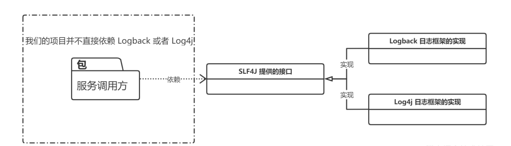

# 一、SPI 机制详解

面向对象设计鼓励模块间基于接口而非具体实现编程，以降低模块间的耦合，遵循依赖倒置原则，并支持开闭原则（对扩展开放，对修改封闭）。然而，直接依赖具体实现会导致在替换实现时需要修改代码，违背了开闭原则。为了解决这个问题，SPI 应运而生，它提供了一种服务发现机制，允许在程序外部动态指定具体实现。这与控制反转（IoC）的思想相似，将组件装配的控制权移交给了程序之外。

SPI 机制也解决了 Java 类加载体系中双亲委派模型带来的限制。[双亲委派模型](https://javaguide.cn/java/jvm/classloader.html)虽然保证了核心库的安全性和一致性，但也限制了核心库或扩展库加载应用程序类路径上的类（通常由第三方实现）。SPI 允许核心或扩展库定义服务接口，第三方开发者提供并部署实现，SPI 服务加载机制则在运行时动态发现并加载这些实现。例如，JDBC 4.0 及之后版本利用 SPI 自动发现和加载数据库驱动，开发者只需将驱动 JAR 包放置在类路径下即可，无需使用`Class.forName()`显式加载驱动类。

## 1、SPI 介绍

### 1.1、何谓 SPI?

SPI 即 **S**ervice **P**rovider **I**nterface ，字面意思就是：“服务提供者的接口”，我的理解是：专门提供给服务提供者或者扩展框架功能的开发者去使用的一个接口。

SPI 是一种 **扩展机制**，常用于框架/库中，让第三方实现自定义的功能，并在运行时由框架自动加载。

SPI 将服务接口和具体的服务实现分离开来，将服务调用方和服务实现者解耦，能够提升程序的扩展性、可维护性。修改或者替换服务实现并不需要修改调用方。

很多框架都使用了 Java 的 SPI 机制，比如：Spring 框架、数据库加载驱动、日志接口、以及 Dubbo 的扩展实现等等。

### 1.2、SPI 和 API 有什么区别？

说到 SPI 就不得不说一下 API（Application Programming Interface） 了，从广义上来说它们都属于接口，而且很容易混淆。下面先用一张图说明一下：


一般模块之间都是通过接口进行通讯，因此我们在服务调用方和服务实现方（也称服务提供者）之间引入一个“接口”。

- 当实现方提供了接口和实现，我们可以通过调用实现方的接口从而拥有实现方给我们提供的能力，这就是 **API**。这种情况下，接口和实现都是放在实现方的包中。调用方通过接口调用实现方的功能，而不需要关心具体的实现细节。
- 当接口存在于调用方这边时，这就是 **SPI** 。由接口调用方确定接口规则，然后由不同的厂商根据这个规则对这个接口进行实现，从而提供服务。

举个通俗易懂的例子：公司 H 是一家科技公司，新设计了一款芯片，然后现在需要量产了，而市面上有好几家芯片制造业公司，这个时候，只要 H 公司指定好了这芯片生产的标准（定义好了接口标准），那么这些合作的芯片公司（服务提供者）就按照标准交付自家特色的芯片（提供不同方案的实现，但是给出来的结果是一样的）。

## 2、实战演练

SLF4J （Simple Logging Facade for Java）是 Java 的一个日志门面（接口），其具体实现有几种，比如：Logback、Log4j、Log4j2 等等，而且还可以切换，在切换日志具体实现的时候我们是不需要更改项目代码的，只需要在 Maven 依赖里面修改一些 pom 依赖就好了。



这就是依赖 SPI 机制实现的，那我们接下来就实现一个简易版本的日志框架。

### 2.1、Service Provider Interface

新建一个 Java 项目 `service-provider-interface` 目录结构如下：（注意直接新建 Java 项目就好了，不用新建 Maven 项目，Maven 项目会涉及到一些编译配置，如果有私服的话，直接 deploy 会比较方便，但是没有的话，在过程中可能会遇到一些奇怪的问题。）

```java
│  service-provider-interface.iml
│
├─.idea
│  │  .gitignore
│  │  misc.xml
│  │  modules.xml
│  └─ workspace.xml
│
└─src
    └─com
        └─gc
            └─spi
                 Logger.java
                 LoggerService.java
                 Main.class
```

新建 `Logger` 接口，这个就是 SPI ， 服务提供者接口，后面的服务提供者就要针对这个接口进行实现。

```java
package com.gc.spi;

public interface Logger {
    void info(String msg);
    void debug(String msg);
}
```

接下来就是 `LoggerService` 类，这个主要是为服务使用者（调用方）提供特定功能的。这个类也是实现 Java SPI 机制的关键所在，如果存在疑惑的话可以先往后面继续看。

```java
package com.gc.spi;

import java.util.ArrayList;
import java.util.List;
import java.util.ServiceLoader;

public class LoggerService {
    private static final LoggerService SERVICE = new LoggerService();

    private final Logger logger;

    private final List<Logger> loggerList;

    private LoggerService() {
        ServiceLoader<Logger> loader = ServiceLoader.load(Logger.class);
        List<Logger> list = new ArrayList<>();
        for (Logger log : loader) {
            list.add(log);
        }
        // LoggerList 是所有 ServiceProvider
        loggerList = list;
        if (!list.isEmpty()) {
            // Logger 只取一个
            logger = list.get(0);
        } else {
            logger = null;
        }
    }

    public static LoggerService getService() {
        return SERVICE;
    }

    public void info(String msg) {
        if (logger == null) {
            System.out.println("info 中没有发现 Logger 服务提供者");
        } else {
            logger.info(msg);
        }
    }

    public void debug(String msg) {
        if (loggerList.isEmpty()) {
            System.out.println("debug 中没有发现 Logger 服务提供者");
        }
        loggerList.forEach(log -> log.debug(msg));
    }
}

```

新建 `Main` 类（服务使用者，调用方），启动程序查看结果。

```java
package com.gc.spi;

public class Main {
    public static void main(String[] args) {
        LoggerService service = LoggerService.getService();

        service.info("Hello SPI");
        service.debug("Hello SPI");
    }
}
```

程序结果：

> info 中没有发现 Logger 服务提供者
> debug 中没有发现 Logger 服务提供者

此时只是空有接口，并没有为 `Logger` 接口提供任何的实现，所以输出结果中没有按照预期打印相应的结果。

使用命令或者直接使用 IDEA 将整个程序直接打包成 jar 包。

### 2.2、Service Provider Interface

接下来新建一个项目用来实现 `Logger` 接口，并把 jar 包引入到新项目中。

新建 `Logback` 类，实现 jar 中的接口 `Logger`

```java
package com.gc.spi.self_spi;

import com.gc.spi.Logger;

public class Logback implements Logger {
    @Override
    public void info(String s) {
        System.out.println("Logback info 打印日志：" + s);
    }

    @Override
    public void debug(String s) {
        System.out.println("Logback debug 打印日志：" + s);
    }
}
```

实现 `Logger` 接口，在 `src` 目录下新建 `META-INF/services` 文件夹，然后新建文件 `com.gc.spi.Logger` （SPI 的全类名），文件里面的内容是：`com.gc.spi.self_spi.Logback` （Logback 的全类名，即 SPI 的实现类的包名 + 类名）。

**这是 JDK SPI 机制 ServiceLoader 约定好的标准。**

这里先大概解释一下：Java 中的 SPI 机制就是在每次类加载的时候会先去找到 class 相对目录下的 `META-INF` 文件夹下的 services 文件夹下的文件，将这个文件夹下面的所有文件先加载到内存中，然后根据这些文件的文件名和里面的文件内容找到相应接口的具体实现类，找到实现类后就可以通过反射去生成对应的对象，保存在一个 list 列表里面，所以可以通过迭代或者遍历的方式拿到对应的实例对象，生成不同的实现。

所以会提出一些规范要求：文件名一定要是接口的全类名，然后里面的内容一定要是实现类的全类名，实现类可以有多个，直接换行就好了，多个实现类的时候，会一个一个的迭代加载。

接下来同样将 `service-provider` 项目打包成 jar 包，这个 jar 包就是服务提供方的实现。通常我们导入 maven 的 pom 依赖就有点类似这种，只不过我们现在没有将这个 jar 包发布到 maven 公共仓库中，所以在需要使用的地方只能手动的添加到项目中。

**效果如下**

```java
package com.gc.spi.self_spi;

import com.gc.spi.LoggerService;

public class DemoTest {
    public static void main(String[] args) {
        LoggerService loggerService = LoggerService.getService();
        loggerService.info("你好");
        loggerService.debug("测试Java SPI 机制");

    }
}
```

运行结果如下：

> Logback info 打印日志：你好
> Logback debug 打印日志：测试 Java SPI 机制

说明导入 jar 包中的实现类生效了。

如果我们不导入具体的实现类的 jar 包，那么此时程序运行的结果就会是：

> info 中没有发现 Logger 服务提供者
> debug 中没有发现 Logger 服务提供者

通过使用 SPI 机制，可以看出服务（`LoggerService`）和 服务提供者两者之间的耦合度非常低，如果说我们想要换一种实现，那么其实只需要修改 `service-provider` 项目中针对 `Logger` 接口的具体实现就可以了，只需要换一个 jar 包即可，也可以有在一个项目里面有多个实现，这不就是 SLF4J 原理吗？

如果某一天需求变更了，此时需要将日志输出到消息队列，或者做一些别的操作，这个时候完全不需要更改 Logback 的实现，只需要新增一个服务实现（service-provider）可以通过在本项目里面新增实现也可以从外部引入新的服务实现 jar 包。我们可以在服务(LoggerService)中选择一个具体的 服务实现(service-provider) 来完成我们需要的操作。

## 3、ServiceLoader
