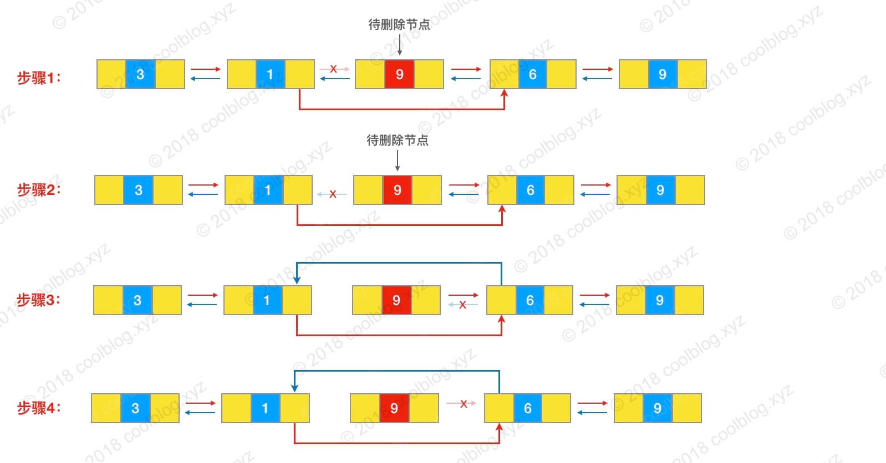
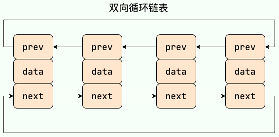
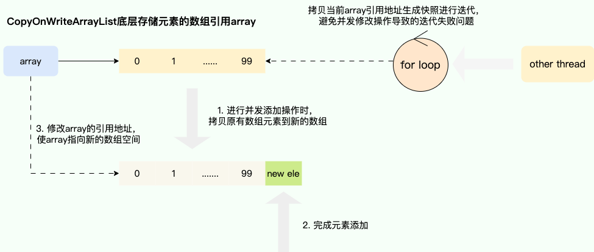

# 一、集合概述

## 1、Java集合概览

Java 集合，也叫作容器，主要是由两大接口派生而来：一个是 `Collection`接口，主要用于存放单一元素；另一个是 `Map` 接口，主要用于存放键值对。对于`Collection` 接口，下面又有三个主要的子接口：`List`、`Set` 、 `Queue`。

Java 集合框架如下图所示：


注：图中只列举了主要的继承派生关系，并没有列举所有关系。例如省略了`AbstractList`, `NavigableSet`等抽象类以及其他的一些辅助类，如想深入了解，可自行查看源码。

## 2、说说 List, Set, Queue, Map 四者的区别？

* `List`(对付顺序的好帮手): 存储的元素是有序的、可重复的。
* `Set`(注重独一无二的性质): 存储的元素不可重复的。
* `Queue`(实现排队功能的叫号机): 按特定的排队规则来确定先后顺序，存储的元素是有序的、可重复的。
* `Map`(用 key 来搜索的专家): 使用键值对（key-value）存储，类似于数学上的函数 y=f(x)，"x" 代表 key，"y" 代表 value，key 是无序的、不可重复的，value 是无序的、可重复的，每个键最多映射到一个值。

## 3、集合框架底层数据结构总结

### 3.1、 `Collection` 接口下面的集合

#### 3.1.1、List

- `ArrayList`：`Object[]` 数组。详细可以查看：[ArrayList 源码分析](./★源码分析/01ArrayList源码分析.md)。

- `Vector`：`Object[]` 数组。

- `LinkedList`：双向链表(JDK1.6 之前为循环链表，JDK1.7 取消了循环)。详细可以查看：[LinkedList 源码分析]()。

#### 3.1.2、Set

* `HashSet`(无序，唯一): 基于 `HashMap` 实现的，底层采用 `HashMap` 来保存元素。
* `LinkedHashSet`: `LinkedHashSet` 是 `HashSet` 的子类，并且其内部是通过 `LinkedHashMap` 来实现的。
* `TreeSet`(有序【自动排序】唯一): 红黑树(自平衡的排序二叉树)。

| 容器类型        | 是否有序（保持插入顺序） | 是否自动排序 |
| --------------- | ------------------------ | ------------ |
| `ArrayList`     | ✅ 是                     | ❌ 否         |
| `LinkedList`    | ✅ 是                     | ❌ 否         |
| `HashSet`       | ❌ 否                     | ❌ 否         |
| `LinkedHashSet` | ✅ 是                     | ❌ 否         |
| `TreeSet`       | ❌（按排序顺序）          | ✅ 是         |

#### 3.1.3、Queue

- `PriorityQueue`: `Object[]` 数组来实现小顶堆。详细可以查看：[PriorityQueue 源码分析]()。

- `DelayQueue`:`PriorityQueue`。详细可以查看：[DelayQueue 源码分析]()。

- `ArrayDeque`: 可扩容动态双向数组。

### 3.2、 `Map` 接口下面的集合

#### 3.2.1、Map

- `HashMap`：JDK1.8 之前 `HashMap` 由数组+链表组成的，数组是 `HashMap` 的主体，链表则是主要为了解决哈希冲突而存在的（“拉链法”解决冲突）。JDK1.8 以后在解决哈希冲突时有了较大的变化，当链表长度大于阈值（默认为 8）（将链表转换成红黑树前会判断，如果当前数组的长度小于 64，那么会选择先进行数组扩容，而不是转换为红黑树）时，将链表转化为红黑树，以减少搜索时间。详细可以查看：[HashMap 源码分析]()。

- `LinkedHashMap`：`LinkedHashMap` 继承自 `HashMap`，所以它的底层仍然是基于拉链式散列结构即由数组和链表或红黑树组成。另外，`LinkedHashMap` 在上面结构的基础上，增加了一条双向链表，使得上面的结构可以保持键值对的插入顺序。同时通过对链表进行相应的操作，实现了访问顺序相关逻辑。详细可以查看：[LinkedHashMap 源码分析]()

- `Hashtable`：数组+链表组成的，数组是 `Hashtable` 的主体，链表则是主要为了解决哈希冲突而存在的。

- `TreeMap`：红黑树（自平衡的排序二叉树）。

## 4、如何选用集合?

主要根据集合的特点来选择合适的集合。比如：

* 只需要存放元素值时，就选择实现`Collection` 接口的集合

	- 需要保证元素唯一时选择实现 `Set` 接口的集合，比如 `TreeSet` 或 `HashSet`；

	- 不需要保证元素唯一就选择实现 `List` 接口的集合，比如 `ArrayList` 或 `LinkedList`；

	
	然后再根据实现这些接口的集合的特点来选用。
	
* 需要根据键值获取到元素值时就选用 `Map` 接口下的集合

	- 需要排序时选择 `TreeMap`；
	- 不需要排序时就选择 `HashMap`；
	- 需要保证线程安全就选用 `ConcurrentHashMap`；

## 5、为什么要使用集合？

当我们需要存储一组类型相同的数据时，数组是最常用且最基本的容器之一。但是，使用数组存储对象存在一些不足之处，因为在实际开发中，存储的数据类型多种多样且数量不确定。这时，Java 集合就派上用场了。与数组相比，Java 集合提供了更灵活、更有效的方法来存储多个数据对象。

Java 集合框架中的各种集合类和接口可以存储不同类型和数量的对象，同时还具有多样化的操作方式。相较于数组，Java 集合的优势在于它们的大小可变、支持泛型、具有内建算法等。

总的来说，Java 集合提高了数据的存储和处理灵活性，可以更好地适应现代软件开发中多样化的数据需求，并支持高质量的代码编写。

# 二、List

## 1、ArrayList 和 Array（数组）的区别？

`ArrayList` 内部基于动态数组实现，比 `Array`（静态数组） 使用起来更加灵活：

* `ArrayList` 会根据实际存储的元素动态地扩容或缩容，而 `Array` 被创建之后就不能改变它的长度了。
* `ArrayList` 允许你使用泛型来确保类型安全，`Array` 则不可以。
* `ArrayList` 中只能存储对象。对于基本类型数据，需要使用其对应的包装类（如 Integer、Double 等）。`Array` 可以直接存储基本类型数据，也可以存储对象。
* `ArrayList` 支持插入、删除、遍历等常见操作，并且提供了丰富的 API 操作方法，比如 `add()`、`remove()`等。`Array` 只是一个固定长度的数组，只能按照下标访问其中的元素，不具备动态添加、删除元素的能力。
* `ArrayList` 创建时不需要指定大小，而`Array`创建时必须指定大小。

下面是二者使用的简单对比：

- `Array`：

	```java
	 // 初始化一个 String 类型的数组
	 String[] stringArr = new String[]{"hello", "world", "!"};
	 // 修改数组元素的值
	 stringArr[0] = "goodbye";
	 System.out.println(Arrays.toString(stringArr));// [goodbye, world, !]
	 // 删除数组中的元素，需要手动移动后面的元素
	 for (int i = 0; i < stringArr.length - 1; i++) {
	     stringArr[i] = stringArr[i + 1];
	 }
	 stringArr[stringArr.length - 1] = null;
	 System.out.println(Arrays.toString(stringArr));// [world, !, null]
	```

- `ArrayList` ：

	```java
	// 初始化一个 String 类型的 ArrayList
	 ArrayList<String> stringList = new ArrayList<>(Arrays.asList("hello", "world", "!"));
	// 添加元素到 ArrayList 中
	 stringList.add("goodbye");
	 System.out.println(stringList);// [hello, world, !, goodbye]
	 // 修改 ArrayList 中的元素
	 stringList.set(0, "hi");
	 System.out.println(stringList);// [hi, world, !, goodbye]
	 // 删除 ArrayList 中的元素
	 stringList.remove(0);
	 System.out.println(stringList); // [world, !, goodbye]
	```

## 2、ArrayList 和 Vector 的区别?（了解即可）

* `ArrayList` 是 `List` 的主要实现类，底层使用 `Object[]`存储，适用于频繁的查找工作，线程不安全 。
* `Vector` 是 `List` 的古老实现类，底层使用`Object[]` 存储，线程安全。

## 3、Vector 和 Stack 的区别?（了解即可）

* `Vector` 和 `Stack` 两者都是线程安全的，都是使用 `synchronized` 关键字进行同步处理。
* `Stack` 继承自 `Vector`，是一个后进先出的栈，而 `Vector` 是一个列表。

随着 Java 并发编程的发展，`Vector` 和 `Stack` 已经被淘汰，推荐使用并发集合类（例如 `ConcurrentHashMap`、`CopyOnWriteArrayList` 等）或者手动实现线程安全的方法来提供安全的多线程操作支持。

## 4、ArrayList 可以添加 null 值吗？

`ArrayList` 中可以存储任何类型的对象，包括 `null` 值。不过，不建议向`ArrayList` 中添加 `null` 值， `null` 值无意义，会让代码难以维护比如忘记做判空处理就会导致空指针异常。

示例代码：

```java
ArrayList<String> listOfStrings = new ArrayList<>();
listOfStrings.add(null);
listOfStrings.add("java");
System.out.println(listOfStrings);
```

输出：

```java
[null, java]
```

## 5、ArrayList 插入和删除元素的时间复杂度？

- 对于插入：
	- 头部插入：由于需要将所有元素都依次向后移动一个位置，因此时间复杂度是 O(n)。
	- 尾部插入：
		- 当 `ArrayList` 的容量未达到极限时，往列表末尾插入元素的时间复杂度是 O(1)，因为它只需要在数组末尾添加一个元素即可；
		- 当容量已达到极限并且需要扩容时，则需要执行一次 O(n) 的操作将原数组复制到新的更大的数组中，然后再执行 O(1) 的操作添加元素。
	- 指定位置插入：需要将目标位置之后的所有元素都向后移动一个位置，然后再把新元素放入指定位置。这个过程需要移动平均 n/2 个元素，因此时间复杂度为 O(n)。

- 对于删除：
	- 头部删除：由于需要将所有元素依次向前移动一个位置，因此时间复杂度是 O(n)。
	- 尾部删除：当删除的元素位于列表末尾时，时间复杂度为 O(1)。
	- 指定位置删除：需要将目标元素之后的所有元素向前移动一个位置以填补被删除的空白位置，因此需要移动平均 n/2 个元素，时间复杂度为 O(n)。

这里简单列举一个例子：

```java
// ArrayList的底层数组大小为10，此时存储了7个元素
+---+---+---+---+---+---+---+---+---+---+
| 1 | 2 | 3 | 4 | 5 | 6 | 7 |   |   |   |
+---+---+---+---+---+---+---+---+---+---+
  0   1   2   3   4   5   6   7   8   9
// 在索引为1的位置插入一个元素8，该元素后面的所有元素都要向右移动一位
+---+---+---+---+---+---+---+---+---+---+
| 1 | 8 | 2 | 3 | 4 | 5 | 6 | 7 |   |   |
+---+---+---+---+---+---+---+---+---+---+
  0   1   2   3   4   5   6   7   8   9
// 删除索引为1的位置的元素，该元素后面的所有元素都要向左移动一位
+---+---+---+---+---+---+---+---+---+---+
| 1 | 2 | 3 | 4 | 5 | 6 | 7 |   |   |   |
+---+---+---+---+---+---+---+---+---+---+
  0   1   2   3   4   5   6   7   8   9
```

## 6、LinkedList 插入和删除元素的时间复杂度？

* 头部插入/删除：只需要修改头结点的指针即可完成插入/删除操作，因此时间复杂度为 O(1)。
* 尾部插入/删除：只需要修改尾结点的指针即可完成插入/删除操作，因此时间复杂度为 O(1)。
* 指定位置插入/删除：需要先移动到指定位置，再修改指定节点的指针完成插入/删除，不过由于有头尾指针，可以从较近的指针出发，因此需要遍历平均 n/4 个元素，时间复杂度为 O(n)。

这里简单列举一个例子：假如我们要删除节点 9 的话，需要先遍历链表找到该节点。然后，再执行相应节点指针指向的更改，具体的源码可以参考：[LinkedList 源码分析]() 。



## 7、LinkedList 为什么不能实现 RandomAccess 接口？

`RandomAccess` 是一个标记接口，用来表明实现该接口的类支持随机访问（即可以通过索引快速访问元素）。由于 `LinkedList` 底层数据结构是链表，内存地址不连续，只能通过指针来定位，不支持随机快速访问，所以不能实现 `RandomAccess` 接口。

## 8、ArrayList 与 LinkedList 区别?

- **是否保证线程安全：** 

	`ArrayList` 和 `LinkedList` 都是不同步的，也就是不保证线程安全；

- **底层数据结构**：

	 `ArrayList` 底层使用的是 **`Object` 数组**；`LinkedList` 底层使用的是 **双向链表** 数据结构（JDK1.6 之前为循环链表，JDK1.7 取消了循环。注意双向链表和双向循环链表的区别，下面有介绍到。）

- **插入和删除是否受元素位置的影响：**

	* `ArrayList` 采用数组存储，所以插入和删除元素的时间复杂度受元素位置的影响。 比如：执行`add(E e)`方法的时候， `ArrayList` 会默认在将指定的元素追加到此列表的末尾，这种情况时间复杂度就是 O(1)。但是如果要在指定位置 i 插入和删除元素的话（`add(int index, E element)`），时间复杂度就为 O(n)。因为在进行上述操作的时候集合中第 i 和第 i 个元素之后的(n-i)个元素都要执行向后位/向前移一位的操作。
	* `LinkedList` 采用链表存储，所以在头尾插入或者删除元素不受元素位置的影响（`add(E e)`、`addFirst(E e)`、`addLast(E e)`、`removeFirst()`、 `removeLast()`），时间复杂度为 O(1)，如果是要在指定位置 `i` 插入和删除元素的话（`add(int index, E element)`，`remove(Object o)`,`remove(int index)`）， 时间复杂度为 O(n) ，因为需要先移动到指定位置再插入和删除。

- **是否支持快速随机访问：** `LinkedList` 不支持高效的随机元素访问，而 `ArrayList`（实现了 `RandomAccess` 接口） 支持。快速随机访问就是通过元素的序号快速获取元素对象(对应于`get(int index)`方法)。

	**内存空间占用：** `ArrayList` 的空间浪费主要体现在在 list 列表的结尾会预留一定的容量空间，而 LinkedList 的空间花费则体现在它的每一个元素都需要消耗比 ArrayList 更多的空间（因为要存放直接后继和直接前驱以及数据）。

在项目中一般是不会使用到 `LinkedList` 的，需要用到 `LinkedList` 的场景几乎都可以使用 `ArrayList` 来代替，并且，性能通常会更好！就连 `LinkedList` 的作者约书亚 · 布洛克（Josh Bloch）自己都说从来不会使用 `LinkedList` 。


另外，不要下意识地认为 `LinkedList` 作为链表就最适合元素增删的场景。在上面也说了，`LinkedList` 仅仅在头尾插入或者删除元素的时候时间复杂度近似 O(1)，其他情况增删元素的平均时间复杂度都是 O(n) 。

### 补充内容: 双向链表和双向循环链表

- **双向链表：** 包含两个指针，一个 prev 指向前一个节点，一个 next 指向后一个节点。

	

- **双向循环链表：** 最后一个节点的 next 指向 head，而 head 的 prev 指向最后一个节点，构成一个环。

	

### 补充内容:RandomAccess 接口

```java
public interface RandomAccess {
}
```

查看源码我们发现实际上 `RandomAccess` 接口中什么都没有定义。所以，在我看来 `RandomAccess` 接口不过是一个标识罢了。标识什么？ 标识实现这个接口的类具有随机访问功能。

在 `binarySearch()` 方法（ `java.util.Collections` 类 提供的静态方法），它要判断传入的 list 是否 `RandomAccess` 的实例，如果是，调用`indexedBinarySearch()`方法，如果不是，那么调用`iteratorBinarySearch()`方法

```java
    public static <T>
    int binarySearch(List<? extends Comparable<? super T>> list, T key) {
        if (list instanceof RandomAccess || list.size()<BINARYSEARCH_THRESHOLD)
            return Collections.indexedBinarySearch(list, key);
        else
            return Collections.iteratorBinarySearch(list, key);
    }
```

`ArrayList` 实现了 `RandomAccess` 接口， 而 `LinkedList` 没有实现。为什么呢？我觉得还是和底层数据结构有关！`ArrayList` 底层是数组，而 `LinkedList` 底层是链表。数组天然支持随机访问，时间复杂度为 O(1)，所以称为快速随机访问。链表需要遍历到特定位置才能访问特定位置的元素，时间复杂度为 O(n)，所以不支持快速随机访问。`ArrayList` 实现了 `RandomAccess` 接口，就表明了他具有快速随机访问功能。 `RandomAccess` 接口只是标识，并不是说 `ArrayList` 实现 `RandomAccess` 接口才具有快速随机访问功能的！

## 9、ArrayList 的扩容机制

详见这篇文章: [ArrayList 扩容机制分析](./★源码分析/01ArrayList源码分析.md)。

## 10、集合中的 fail-fast 和 fail-safe 是什么

- 关于`fail-fast`，引用`medium`中一篇文章关于`fail-fast`和`fail-safe`的说法：

  > 快速失败的思想即针对可能发生的异常进行提前表明故障并停止运行，通过尽早的发现和停止错误，降低故障系统级联的风险。

  在`java.util`包下的大部分集合是不支持线程安全的，为了能够提前发现并发操作导致线程安全风险，提出通过维护一个`modCount`记录修改的次数，迭代期间通过比对预期修改次数`expectedModCount`和`modCount`是否一致来判断是否存在并发操作，从而实现快速失败，由此保证在避免在异常时执行非必要的复杂代码。

  对应的我们给出下面这样一段在示例，我们首先插入`100`个操作元素，一个线程迭代元素，一个线程删除元素，最终输出结果如愿抛出`ConcurrentModificationException`：

  ```java
  // 如果使用线程安全的 CopyOnWriteArrayList ，可以避免 ConcurrentModificationException
  List<Integer> list = new ArrayList<>();
  CountDownLatch countDownLatch = new CountDownLatch(2);
  
  // 添加元素
  for (int i = 0; i < 100; i++) {
      list.add(i);
  }
  
  Thread t1 = new Thread(() -> {
      // 迭代元素 (注意：Integer 是不可变的，这里的 i++ 不会修改 list 中的值)
      for (Integer i : list) {
          try {
              Thread.sleep(1); // 增加延迟，方便 t2 干扰
              i++; // 这行代码实际上没有修改list中的元素
          } catch (Exception e) {
              throw new RuntimeException(e);
          }
  
      }
      countDownLatch.countDown();
  });
  
  Thread t2 = new Thread(() -> {
      System.out.println("删除元素1");
      list.remove(Integer.valueOf(1)); // 使用 Integer.valueOf(1) 删除指定值的对象
      countDownLatch.countDown();
  });
  
  t1.start();
  t2.start();
  countDownLatch.await();
  ```

  在初始化时插入了`100`个元素，此时对应的修改`modCount`次数为`100`，随后线程 2 在线程 1 迭代期间进行元素删除操作，此时对应的`modCount`就变为`101`。
   线程 1 在随后`foreach`第 2 轮循环发现`modCount` 为`101`，与预期的`expectedModCount(值为100因为初始化插入了元素100个)`不等，判定为并发操作异常，于是便快速失败，抛出`ConcurrentModificationException`。

  ✅ `modCount` 的本质和用途:

  | 特性     | 描述                                                         |
  | -------- | ------------------------------------------------------------ |
  | 定义位置 | `modCount` 是 `ArrayList`、`HashMap`、`HashSet` 等 **非线程安全集合类**中的字段 |
  | 作用     | 用来记录“结构性修改”的次数（如：`add`、`remove`）            |
  | 主要用途 | **支持 fail-fast 机制**，即：在迭代期间如果发现 `modCount` 被修改，就抛出 `ConcurrentModificationException`，快速失败 |
  | 检查位置 | `Iterator` 中的 `next()` 和 `remove()` 方法中检查 `expectedModCount != modCount` |

  ❌ `CopyOnWriteArrayList` 没有 `modCount`:

  | 特性                   | 描述                                                         |
  | ---------------------- | ------------------------------------------------------------ |
  | 是否线程安全           | ✅ 是。通过“写时复制”（copy on write）机制实现线程安全        |
  | 是否有 `modCount` 字段 | ❌ 没有。它不继承 `AbstractList`，而是直接继承 `Object`       |
  | 迭代行为               | 所有迭代器基于**当前数组的快照**，不受后续修改影响           |
  | 是否 fail-fast         | ❌ 不是 fail-fast，因为快照不会感知并发修改，也就没有报错的基础 |

  

  对此也给出`for`循环底层迭代器获取下一个元素时的`next`方法，可以看到其内部的`checkForComodification`具有针对修改次数比对的逻辑：

  ```java
   public E next() {
   			//检查是否存在并发修改
              checkForComodification();
              //......
              //返回下一个元素
              return (E) elementData[lastRet = i];
          }
  
  final void checkForComodification() {
  		//当前循环遍历次数和预期修改次数不一致时，就会抛出ConcurrentModificationException
              if (modCount != expectedModCount)
                  throw new ConcurrentModificationException();
          }
  ```

- 对于`fail-safe`也就是安全失败，它旨在即使面对意外情况也能恢复并继续运行，这使得它特别适用于不确定或不稳定的环境：

	> 故障安全系统采用的是另一种方法，其目的是在出现意外情况时仍能恢复和继续运行。因此，它们特别适用于不确定或不稳定的环境。

	该思想常运用于并发容器，最经典的实现就是`CopyOnWriteArrayList`的实现，通过写时复制的思想，保证在进行修改操作时复制出一份快照，基于这份快照完成添加或者删除操作后，将`CopyOnWriteArrayList`底层的数组引用指向这个新的数组空间，由此避免迭代时被并发修改所干扰从而导致并发操作安全问题，当然这种做法也存缺点（即进行遍历操作时无法获得实时结果）：

	
	
	对应也给出`CopyOnWriteArrayList`实现`fail-safe`的核心代码，可以看到它的实现就是通过`getArray`获取数组引用然后通过`Arrays.copyOf`得到一个数组的快照，基于这个快照完成添加操作后，修改底层`array`变量指向的引用地址由此完成写时复制：
	
	```java
	public boolean add(E e) {
	        final ReentrantLock lock = this.lock;
	        lock.lock();
	        try {
	        	  //获取原有数组
	            Object[] elements = getArray();
	            int len = elements.length;
	            //基于原有数组复制出一份内存快照
	            Object[] newElements = Arrays.copyOf(elements, len + 1);
	            //进行添加操作
	            newElements[len] = e;
	            //array指向新的数组
	            setArray(newElements);
	            return true;
	        } finally {
	            lock.unlock();
	        }
	    }
	```
	
# 三、Set

## 1、Comparable 和 Comparator 的区别

`Comparable` 接口和 `Comparator` 接口都是 Java 中用于排序的接口，它们在实现类对象之间比较大小、排序等方面发挥了重要作用：

* `Comparable` 接口实际上是出自`java.lang`包，它有一个 `compareTo(Object obj)`方法用来排序
* `Comparator`接口实际上是出自 `java.util`包，它有一个`compare(Object obj1, Object obj2)`方法用来排序

一般需要对一个集合使用自定义排序时，就要重写`compareTo()`方法或`compare()`方法，当我们需要对某一个集合实现两种排序方式，比如一个 `song` 对象中的歌名和歌手名分别采用一种排序方法的话，我们可以重写`compareTo()`方法和使用自制的`Comparator`方法或者以两个 `Comparator` 来实现歌名排序和歌星名排序，第二种代表我们只能使用两个参数版的 `Collections.sort()`.

### 1.1、Comparator 定制排序

```java
ArrayList<Integer> arrayList = new ArrayList<Integer>();
arrayList.add(-1);
arrayList.add(3);
arrayList.add(3);
arrayList.add(-5);
arrayList.add(7);
arrayList.add(4);
arrayList.add(-9);
arrayList.add(-7);
System.out.println("原始数组:");
System.out.println(arrayList);
// void reverse(List list)：反转
Collections.reverse(arrayList);
System.out.println("Collections.reverse(arrayList):");
System.out.println(arrayList);

// void sort(List list),按自然排序的升序排序
Collections.sort(arrayList);
System.out.println("Collections.sort(arrayList):");
System.out.println(arrayList);
// 定制排序的用法
Collections.sort(arrayList, new Comparator<Integer>() {
    @Override
    public int compare(Integer o1, Integer o2) {
        return o2.compareTo(o1);
    }
});
System.out.println("定制排序后：");
System.out.println(arrayList);
```

- Output:

	```java
	原始数组:
	[-1, 3, 3, -5, 7, 4, -9, -7]
	Collections.reverse(arrayList):
	[-7, -9, 4, 7, -5, 3, 3, -1]
	Collections.sort(arrayList):
	[-9, -7, -5, -1, 3, 3, 4, 7]
	定制排序后：
	[7, 4, 3, 3, -1, -5, -7, -9]
	```

### 1.2、 Comparable 定制排序

```java
// person对象没有实现Comparable接口，所以必须实现，这样才不会出错，才可以使treemap中的数据按顺序排列
// 前面一个例子的String类已经默认实现了Comparable接口，详细可以查看String类的API文档，另外其他
// 像Integer类等都已经实现了Comparable接口，所以不需要另外实现了
public  class Person implements Comparable<Person> {
    private String name;
    private int age;

    public Person(String name, int age) {
        super();
        this.name = name;
        this.age = age;
    }

    public String getName() {
        return name;
    }

    public void setName(String name) {
        this.name = name;
    }

    public int getAge() {
        return age;
    }

    public void setAge(int age) {
        this.age = age;
    }

    /**
     * T重写compareTo方法实现按年龄来升序排序
     */
    @Override
    public int compareTo(Person o) {
        if (this.age > o.getAge()) {
            return 1;
        }
        if (this.age < o.getAge()) {
            return -1;
        }
        return 0;
    }
}
```

```java
    public static void main(String[] args) {
        TreeMap<Person, String> pdata = new TreeMap<Person, String>();
        // 每执行一次 put(...)，TreeMap 都会：
        // ① 调用 Person 的 compareTo 方法；
        // ② 判断新插入的键 Person 对象在树中应该插在哪个位置；
        // ③ 从而确保 TreeMap 内部的结构始终是有序的。
        pdata.put(new Person("张三", 30), "zhangsan");
        pdata.put(new Person("李四", 20), "lisi");
        pdata.put(new Person("王五", 10), "wangwu");
        pdata.put(new Person("小红", 5), "xiaohong");
        // 得到key的值的同时得到key所对应的值
        Set<Person> keys = pdata.keySet();
        for (Person key : keys) {
            System.out.println(key.getAge() + "-" + key.getName());

        }
    }
```

- Output：

	```java
	5-小红
	10-王五
	20-李四
	30-张三
	```

### 1.3、Comparable 转 Comparator 排序

```java
import java.util.*;

public class PersonComparatorDemo {
    public static void main(String[] args) {
        // 使用 Comparator 定义排序规则
        Comparator<Person> personComparator = new Comparator<Person>() {
            @Override
            public int compare(Person p1, Person p2) {
                // 先按年龄排序
                int ageCompare = Integer.compare(p1.getAge(), p2.getAge());
                if (ageCompare != 0) {
                    return ageCompare;
                }
                // 如果年龄相同，按名字升序排序
                return p1.getName().compareTo(p2.getName());
            }
        };

        // 用自定义 Comparator 创建 TreeMap
        TreeMap<Person, String> pdata = new TreeMap<>(personComparator);

        // 添加数据
        pdata.put(new Person("张三", 30), "zhangsan");
        pdata.put(new Person("李四", 20), "lisi");
        pdata.put(new Person("王五", 10), "wangwu");
        pdata.put(new Person("小红", 5), "xiaohong");
        pdata.put(new Person("小明", 30), "xiaoming");  // 年龄相同测试
        pdata.put(new Person("阿花", 5), "ahua");        // 年龄相同测试

        // 输出结果
        for (Person key : pdata.keySet()) {
            System.out.println(key.getAge() + " - " + key.getName() + " = " + pdata.get(key));
        }
    }
}

// Person 类不实现 Comparable
class Person {
    private String name;
    private int age;

    public Person(String name, int age) {
        super();
        this.name = name;
        this.age = age;
    }

    public String getName() { return name; }

    public int getAge() { return age; }
}

```

- 输出结果

	```java
	5 - 小红 = xiaohong
	5 - 阿花 = ahua
	10 - 王五 = wangwu
	20 - 李四 = lisi
	30 - 小明 = xiaoming
	30 - 张三 = zhangsan
	```

### 1.4 总结

| 特性         | `Comparable<T>` 接口                            | `Comparator<T>` 接口（或类）             |
| ------------ | ----------------------------------------------- | ---------------------------------------- |
| 位置         | 实体类中实现                                    | 单独定义，或用匿名类 / Lambda            |
| 方法         | `int compareTo(T o)`                            | `int compare(T o1, T o2)`                |
| 修改类       | 需要修改原始类                                  | 不需要修改类，外部定义                   |
| 适用场景     | 类有**固定的自然顺序**                          | 类可能有**多种排序方式**                 |
| 使用方式     | 实体类实现接口并重写 `compareTo` 方法           | 创建 `Comparator` 对象传给排序方法或容器 |
| 示例容器支持 | `TreeMap` / `TreeSet` / `Collections.sort()` 等 | 同上（通过构造函数或传参方式）           |
| Java 8+ 推荐 | 不变                                            | 可用 `Comparator.comparing(...)` 更方便  |

- **✅ `Comparable` 详解**

	✔ 使用条件：

	* 你可以**修改实体类代码**。
	* 这个类有一个**常规或默认的排序规则**（比如：年龄、ID、时间戳等）。

	✔ 实现方式：

	```java
	public class Person implements Comparable<Person> {
	    private int age;
	    private String name;
	
	    @Override
	    public int compareTo(Person o) {
	        return Integer.compare(this.age, o.age);  // 按年龄升序
	    }
	}
	```

	✔ 使用方式：

	```java
	List<Person> list = new ArrayList<>();
	Collections.sort(list);  // 自动调用 compareTo()
	```

- **✅ `Comparator` 详解**

	✔ 使用条件：

	* 你**不方便或不能修改实体类**（比如类来自外部库）。
	* 你需要**多个排序规则**，比如：
		* 按年龄
		* 按姓名
		* 按多个字段综合比较

	✔ 实现方式：

	```java
	Comparator<Person> ageComparator = new Comparator<Person>() {
	    @Override
	    public int compare(Person p1, Person p2) {
	        return Integer.compare(p1.getAge(), p2.getAge());
	    }
	};
	```

	或 Java 8+ 推荐写法：

	```java
	Comparator<Person> byName = Comparator.comparing(Person::getName);
	```

	✔ 使用方式：

	```java
	Collections.sort(list, ageComparator);
	```

	在 TreeMap 或 TreeSet 中使用：

	```java
	TreeMap<Person, String> map = new TreeMap<>(ageComparator);
	```

- **✅ 典型使用场景对比**

	| 场景                                                     | 推荐方式                             |
	| -------------------------------------------------------- | ------------------------------------ |
	| 一个实体类有唯一排序规则（如学生按学号）                 | `Comparable`                         |
	| 需要对实体类使用多种排序方式（如员工按姓名、年龄、薪资） | `Comparator`                         |
	| 实体类是第三方类，不可修改                               | `Comparator`                         |
	| 用于 `TreeMap`、`TreeSet` 结构时按特定规则排序           | 两者均可，建议用 `Comparator` 更灵活 |

## 2、无序性和不可重复性的含义是什么

- 无序性不等于随机性 ，无序性是指存储的数据在底层数组中并非按照数组索引的顺序添加 ，而是根据数据的 **哈希值** 决定的。
- 不可重复性是指添加的元素按照 `equals()` 判断时 ，返回 false，需要同时重写 `equals()` 方法和 `hashCode()` 方法。

### 2.1、不同 Set 的实现比较

| 实现类          | 有序性       | 是否允许重复 | 说明                                                       |
| --------------- | ------------ | ------------ | ---------------------------------------------------------- |
| `HashSet`       | ❌ 无序       | ✅ 不允许     | 元素根据哈希值存储，性能高但无顺序保证。                   |
| `LinkedHashSet` | ✅ 有插入顺序 | ✅ 不允许     | 元素按插入顺序保存。                                       |
| `TreeSet`       | ✅ 有排序顺序 | ✅ 不允许     | 元素按自然顺序或自定义 `Comparator` 排序，需要元素可比较。 |

## 3、比较 HashSet、LinkedHashSet 和 TreeSet 三者的异同

- `HashSet`、`LinkedHashSet` 和 `TreeSet` 都是 `Set` 接口的实现类，都能保证元素唯一，并且都不是线程安全的。
- `HashSet`、`LinkedHashSet` 和 `TreeSet` 的主要区别在于底层数据结构不同。`HashSet` 的底层数据结构是哈希表（基于 `HashMap` 实现）。`LinkedHashSet` 的底层数据结构是链表和哈希表，元素的插入和取出顺序满足 FIFO。`TreeSet` 底层数据结构是红黑树，元素是有序的，排序的方式有自然排序和定制排序。
- 底层数据结构不同又导致这三者的应用场景不同。`HashSet` 用于不需要保证元素插入和取出顺序的场景，`LinkedHashSet` 用于保证元素的插入和取出顺序满足 FIFO 的场景，`TreeSet` 用于支持对元素自定义排序规则的场景。

| 特性 / 类名        | `HashSet`                          | `LinkedHashSet`                    | `TreeSet`                              |
| ------------------ | ---------------------------------- | ---------------------------------- | -------------------------------------- |
| 所属包             | `java.util`                        | `java.util`                        | `java.util`                            |
| 实现接口           | `Set`, `Cloneable`, `Serializable` | `Set`, `Cloneable`, `Serializable` | `NavigableSet`, `SortedSet`, `Set`, 等 |
| 底层数据结构       | 哈希表（`HashMap`）                | 哈希表 + 双向链表                  | 红黑树（自平衡二叉搜索树）             |
| 是否保证顺序       | ❌ 无序                             | ✅ 按插入顺序（FIFO）               | ✅ 按自然顺序或自定义排序               |
| 是否允许重复元素   | ❌ 不允许                           | ❌ 不允许                           | ❌ 不允许                               |
| 是否允许 null 元素 | ✅ 允许一个 null                    | ✅ 允许一个 null                    | ❌ 默认不允许 null（排序需可比）        |
| 是否线程安全       | ❌ 否（需外部同步）                 | ❌ 否（需外部同步）                 | ❌ 否（需外部同步）                     |
| 排序方式           | 无序                               | 插入顺序                           | 自然排序 / 自定义 `Comparator`         |
| 查询效率           | ✅ 高（O(1)）                       | ✅ 高（O(1)）                       | ❌ 较低（O(log n)）                     |
| 适用场景           | 快速查重，无序集合                 | 需要记录元素插入顺序的去重集合     | 需要排序、范围查询、有序输出的集合     |

