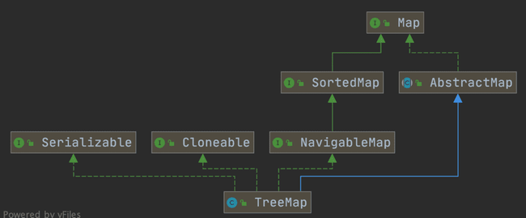

# 一、Map（重要）

## 1、HashMap 和 Hashtable 的区别

- **线程是否安全：** 

	- `HashMap` 是非线程安全的；
	- `Hashtable` 是线程安全的，因为 `Hashtable` 内部的方法基本都经过`synchronized` 修饰。（如果要保证线程安全的话就使用 `ConcurrentHashMap` ）；

- **效率：** 

	- 因为线程安全的问题，`HashMap` 要比 `Hashtable` 效率高一点。
	- ⚠另外，`Hashtable` 基本**被淘汰**，不要在代码中使用它；

- **对 Null key 和 Null value 的支持：**
	-  `HashMap` 可以存储 null 的 key 和 value，但 null 作为键只能有一个，null 作为值可以有多个；
	- `Hashtable`  不允许有 null 键和 null 值，否则会抛出 `NullPointerException`。
	
- **初始容量大小和每次扩充容量大小的不同：** 
	- ① `HashMap` 默认的初始化大小为 16。之后每次扩充，容量变为原来的 2 倍；`Hashtable` 默认的初始大小为 11，之后每次扩充，容量变为原来的 2n+1。
	- ② 创建时如果给定了容量初始值，那么 `Hashtable` 会直接使用给定的大小，而 `HashMap` 会将其扩充为 2 的幂次方大小（`HashMap` 中的`tableSizeFor()`方法保证，下面给出了源代码）。也就是说 `HashMap` 总是使用 2 的幂作为哈希表的大小,后面会介绍到为什么是 2 的幂次方。
	
- **底层数据结构：** 

	- JDK1.8 以后的 `HashMap` 在解决哈希冲突时有了较大的变化，当链表长度大于阈值（默认为 8）时，将链表转化为红黑树（将链表转换成红黑树前会判断，如果当前数组的长度小于 64，那么会选择先进行数组扩容，而不是转换为红黑树），以减少搜索时间（后文中我会结合源码对这一过程进行分析）。

	- `Hashtable` 没有这样的机制。

- **哈希函数的实现**：

	- `HashMap` 对哈希值进行了高位和低位的混合扰动处理，以减少冲突；
	-  `Hashtable` 直接使用键的 `hashCode()` 值。

**`HashMap` 中带有初始容量的构造函数：**

```java
    public HashMap(int initialCapacity, float loadFactor) {
        if (initialCapacity < 0)
            throw new IllegalArgumentException("Illegal initial capacity: " +
                                               initialCapacity);
        if (initialCapacity > MAXIMUM_CAPACITY)
            initialCapacity = MAXIMUM_CAPACITY;
        if (loadFactor <= 0 || Float.isNaN(loadFactor))
            throw new IllegalArgumentException("Illegal load factor: " +
                                               loadFactor);
        this.loadFactor = loadFactor;
        this.threshold = tableSizeFor(initialCapacity);
    }
     public HashMap(int initialCapacity) {
        this(initialCapacity, DEFAULT_LOAD_FACTOR);
    }
```

下面这个方法保证了 `HashMap` 总是使用 2 的幂作为哈希表的大小。

```java
/**
 * Returns a power of two size for the given target capacity.
 */
static final int tableSizeFor(int cap) {
    int n = cap - 1;
    // 之后每一步都是为了把最低的那个 1 扩散成全 1
    n |= n >>> 1;
    n |= n >>> 2;
    n |= n >>> 4;
    n |= n >>> 8;
    n |= n >>> 16;
    return (n < 0) ? 1 : (n >= MAXIMUM_CAPACITY) ? MAXIMUM_CAPACITY : n + 1;
}
```

## 2、HashMap 和 HashSet 区别

如果你看过 `HashSet` 源码的话就应该知道：`HashSet` 底层就是基于 `HashMap` 实现的。（`HashSet` 的源码非常非常少，因为除了 `clone()`、`writeObject()`、`readObject()`是 `HashSet` 自己不得不实现之外，其他方法都是直接调用 `HashMap` 中的方法。

|              |               `HashMap`                |                          `HashSet`                           |
| ------------ | :------------------------------------: | :----------------------------------------------------------: |
| 实现接口     |               `Map` 接口               |                          `Set` 接口                          |
| 存储内容     |               存储键值对               |                          仅存储对象                          |
| 添加元素方法 |     调用 `put()`向 map 中添加元素      |             调用 `add()`方法向 `Set` 中添加元素              |
| hash值计算   | `HashMap` 使用键（Key）计算 `hashcode` | `HashSet` 使用成员对象来计算 `hashcode` 值，对于两个对象来说 `hashcode` 可能相同，所以`equals()`方法用来判断对象的相等性 |

## 3、HashMap 和 TreeMap 区别

`TreeMap` 和`HashMap` 都继承自`AbstractMap` ，但是需要注意的是`TreeMap`它还实现了`NavigableMap`接口和`SortedMap` 接口。



实现 `NavigableMap` 接口让 `TreeMap` 有了对集合内元素的搜索的能力。

`NavigableMap` 接口提供了丰富的方法来探索和操作键值对：

1. **定向搜索**: `ceilingEntry()`, `floorEntry()`, `higherEntry()`和 `lowerEntry()` 等方法可以用于定位大于等于、小于等于、严格大于、严格小于给定键的最接近的键值对。

	> | 方法                  | 含义                          |
	> | --------------------- | ----------------------------- |
	> | `ceilingEntry(K key)` | 返回**键 ≥ key** 的最小 entry |
	> | `floorEntry(K key)`   | 返回**键 ≤ key** 的最大 entry |
	> | `higherEntry(K key)`  | 返回**键 > key** 的最小 entry |
	> | `lowerEntry(K key)`   | 返回**键 < key** 的最大 entry |
	>
	> ```java
	> NavigableMap<Integer, String> map = new TreeMap<>();
	> map.put(10, "A");
	> map.put(20, "B");
	> map.put(30, "C");
	> 
	> System.out.println(map.ceilingEntry(15)); // => 20=B
	> System.out.println(map.floorEntry(25));   // => 20=B
	> System.out.println(map.higherEntry(20));  // => 30=C
	> System.out.println(map.lowerEntry(10));   // => null
	> 
	> ```
	>
	> 

2. **子集操作**: `subMap()`, `headMap()`和 `tailMap()` 方法可以高效地创建原集合的子集视图，而无需复制整个集合。

	> | 方法                                                         | 含义                      |
	> | ------------------------------------------------------------ | ------------------------- |
	> | `subMap(K from, boolean fromInclusive, K to, boolean toInclusive)` | 返回指定范围子视图        |
	> | `headMap(K toKey, boolean inclusive)`                        | 返回 ≤ `toKey` 的键视图   |
	> | `tailMap(K fromKey, boolean inclusive)`                      | 返回 ≥ `fromKey` 的键视图 |
	>
	> ```java
	> NavigableMap<Integer, String> map = new TreeMap<>();
	> map.put(10, "A");
	> map.put(20, "B");
	> map.put(30, "C");
	> map.put(40, "D");
	> 
	> System.out.println(map.subMap(15, true, 35, true)); // => {20=B, 30=C}
	> System.out.println(map.headMap(30, false));      // => {10=A, 20=B}
	> System.out.println(map.tailMap(20, true));       // => {20=B, 30=C, 40=D}
	> 
	> ```
	>
	> 

3. **逆序视图**:`descendingMap()` 方法返回一个逆序的 `NavigableMap` 视图，使得可以反向迭代整个 `TreeMap`。

	> | 方法                 | 含义                            |
	> | -------------------- | ------------------------------- |
	> | `descendingMap()`    | 返回一个键逆序的视图            |
	> | `descendingKeySet()` | 返回一个键逆序的 `NavigableSet` |
	>
	> 
	>
	> ```java
	> NavigableMap<Integer, String> map = new TreeMap<>();
	> map.put(1, "A");
	> map.put(2, "B");
	> map.put(3, "C");
	> 
	> NavigableMap<Integer, String> descMap = map.descendingMap();
	> NavigableSet<Integer> descKeySet = map.descendingKeySet();
	> System.out.println(map);         // => {1=A, 2=B, 3=C}
	> System.out.println(descMap);      // => {3=C, 2=B, 1=A}
	> System.out.println(descKeySet);    // => [3, 2, 1]
	> 
	> 
	> // 修改原数组的 value
	> // ⚠ descendingMap()/descendingKeySet()  只是视图，修改原 map 会影响该视图，反之亦然。
	> map.replace(2,"BB");
	> map.remove(3);
	> System.out.println(map);         // => {1=A, 2=BB, 3=C}
	> System.out.println(descMap);      // => {3=C, 2=BB, 1=A}
	> System.out.println(descKeySet);    // => [2, 1]
	> 
	> 
	> // 修改视图
	> descMap.replace(2,"BBB");
	> System.out.println(map);       // => {1=A, 2=BBB}
	> System.out.println(descMap);    // => {2=BBB, 1=A}
	> 
	> ```
	>
	> **注：**⚠ `descendingMap()`  /  `descendingKeySet()` 只是视图，修改原 map 会影响该视图，反之亦然。

4. **边界操作**: `firstEntry()`, `lastEntry()`, `pollFirstEntry()`和 `pollLastEntry()` 等方法可以方便地访问和移除元素。

	> | 方法               | 含义                   |
	> | ------------------ | ---------------------- |
	> | `firstEntry()`     | 返回最小键的 entry     |
	> | `lastEntry()`      | 返回最大键的 entry     |
	> | `pollFirstEntry()` | 返回并移除最小键 entry |
	> | `pollLastEntry()`  | 返回并移除最大键 entry |
	>
	> 
	>
	> ```java
	> NavigableMap<Integer, String> map = new TreeMap<>();
	> map.put(10, "A");
	> map.put(20, "B");
	> map.put(30, "C");
	> 
	> System.out.println(map.firstEntry());     // => 10=A
	> System.out.println(map.lastEntry());      // => 30=C
	> 
	> map.pollFirstEntry();          // 删除 10=A
	> map.pollLastEntry();           // 删除 30=C
	> System.out.println(map);        // => {20=B}
	> 
	> ```
	>
	> 

这些方法都是基于红黑树数据结构的属性实现的，红黑树保持平衡状态，从而保证了搜索操作的时间复杂度为 O(log n)，这让 `TreeMap` 成为了处理有序集合搜索问题的强大工具。

实现`SortedMap`接口让 `TreeMap` 有了对集合中的元素根据键排序的能力。默认是按 key 的升序排序，不过也可以指定排序的比较器。示例代码如下：

```java
public class Person {
    private Integer age;

    public Person(Integer age) {
        this.age = age;
    }

    public Integer getAge() {
        return age;
    }


    public static void main(String[] args) {
        TreeMap<Person, String> treeMap = new TreeMap<>(new Comparator<Person>() {
            @Override
            public int compare(Person person1, Person person2) {
                int num = person1.getAge() - person2.getAge();
                return Integer.compare(num, 0);
            }
        });
        treeMap.put(new Person(3), "person1");
        treeMap.put(new Person(18), "person2");
        treeMap.put(new Person(35), "person3");
        treeMap.put(new Person(16), "person4");
        treeMap.entrySet().stream().forEach(personStringEntry -> {
            System.out.println(personStringEntry.getValue());
        });
    }
}
```

输出:

```
person1
person4
person2
person3
```

可以看出，`TreeMap` 中的元素已经是按照 `Person` 的 age 字段的升序来排列了。

上面，通过传入匿名内部类的方式实现的，也可以将代码替换成 Lambda 表达式实现的方式：

```java
TreeMap<Person, String> treeMap = new TreeMap<>((person1, person2) -> {
  int num = person1.getAge() - person2.getAge();
  return Integer.compare(num, 0);
});
```

**综上，相比于`HashMap`来说， `TreeMap` 主要多了对集合中的元素根据键排序的能力以及对集合内元素的搜索的能力。**

## 4、HashSet 如何检查重复?

以下内容摘《Head first java》第二版：

> 当你把对象加入`HashSet`时，`HashSet` 会先计算对象的`hashcode`值来判断对象加入的位置，同时也会与其他加入的对象的 `hashcode` 值作比较，如果没有相符的 `hashcode`，`HashSet` 会假设对象没有重复出现。但是如果发现有相同 `hashcode` 值的对象，这时会调用`equals()`方法来检查 `hashcode` 相等的对象是否真的相同。如果两者相同，`HashSet` 就不会让加入操作成功。

在 JDK1.8 中，`HashSet`的`add()`方法只是简单的调用了`HashMap`的`put()`方法，并且判断了一下返回值以确保是否有重复元素。直接看一下`HashSet`中的源码：

```java
// Returns: true if this set did not already contain the specified element
// 返回值：当 set 中没有包含 add 的元素时返回真
public boolean add(E e) {
        return map.put(e, PRESENT)==null;
}
```

而在`HashMap`的`putVal()`方法中也能看到如下说明：

```java
// Returns : previous value, or null if none
// 返回值：如果插入位置没有元素返回null，否则返回上一个元素
final V putVal(int hash, K key, V value, boolean onlyIfAbsent,
                   boolean evict) {
...
}
```

也就是说，在 JDK1.8 中，实际上无论`HashSet`中是否已经存在了某元素，`HashSet`都会直接插入，只是会在`add()`方法的返回值处告诉我们插入前是否存在相同元素。

## 5、HashMap 的底层实现
### 5.1、JDK 1.8 之前

JDK1.8 之前 `HashMap` 底层是 **数组和链表** 结合在一起使用也就是 **链表散列**。HashMap 通过 key 的 `hashcode` 经过扰动函数处理过后得到 hash 值，然后通过 `(n - 1) & hash` 判断当前元素存放的位置（这里的 n 指的是数组的长度），如果当前位置存在元素的话，就判断该元素与要存入的元素的 hash 值以及 key 是否相同，如果相同的话，直接覆盖，不相同就通过 **“拉链法”** 解决冲突。

`HashMap` 中的扰动函数（`hash` 方法）是用来优化哈希值的分布。通过对原始的 `hashCode()` 进行额外处理，扰动函数可以减小由于糟糕的 `hashCode()` 实现导致的碰撞，从而提高数据的分布均匀性。

**JDK1.7 的 HashMap 的 hash 方法源码：**

```java
static int hash(int h) {
    // This function ensures that hashCodes that differ only by
    // constant multiples at each bit position have a bounded
    // number of collisions (approximately 8 at default load factor).

    h ^= (h >>> 20) ^ (h >>> 12);
    return h ^ (h >>> 7) ^ (h >>> 4);
}
```

**JDK 1.8 HashMap 的 hash 方法源码:**

JDK 1.8 的 hash 方法 相比于 JDK 1.7 hash 方法更加简化，但是原理不变。

```java
    static final int hash(Object key) {
      int h;
      // key.hashCode()：返回散列值也就是hashcode
      // ^：按位异或
      // >>>:无符号右移，忽略符号位，空位都以0补齐
      return (key == null) ? 0 : (h = key.hashCode()) ^ (h >>> 16);
  }
```

相比于 JDK1.8 的 hash 方法 ，JDK 1.7 的 hash 方法的性能会稍差一点点，因为毕竟扰动了 4 次。

所谓 **“拉链法”** 就是：将链表和数组相结合。也就是说创建一个链表数组，数组中每一格就是一个链表。若遇到哈希冲突，则将冲突的值加到链表中即可。


### 5.2、JDK 1.8 及之后

