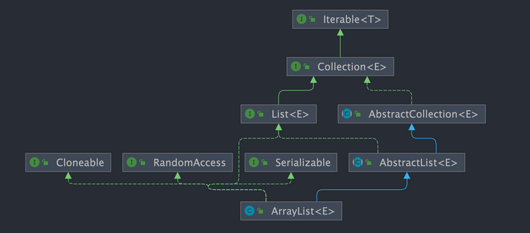

# 一、ArrayList 简介

`ArrayList` 的底层是数组队列，相当于动态数组。与 Java 中的数组相比，它的容量能动态增长。在添加大量元素前，应用程序可以使用`ensureCapacity`操作来增加 `ArrayList` 实例的容量。这可以减少递增式再分配的数量。

`ArrayList` 继承于 `AbstractList` ，实现了 `List`, `RandomAccess`, `Cloneable`, `java.io.Serializable` 这些接口。

```java
public class ArrayList<E> extends AbstractList<E>
        implements List<E>, RandomAccess, Cloneable, java.io.Serializable{

}
```

- `List` : 表明它是一个列表，支持添加、删除、查找等操作，并且可以通过下标进行访问。

- `RandomAccess` ：这是一个标志接口，表明实现这个接口的 `List` 集合是支持 **快速随机访问** 的。在 `ArrayList` 中，我们即可以通过元素的序号快速获取元素对象，这就是快速随机访问。

- `Cloneable` ：表明它具有拷贝能力，可以进行深拷贝或浅拷贝操作。

- `Serializable` : 表明它可以进行序列化操作，也就是可以将对象转换为字节流进行持久化存储或网络传输，非常方便。



## 1.1、ArrayList 和 Vector 的区别?（了解即可）

- `ArrayList` 是 `List` 的主要实现类，底层使用 `Object[]`存储，适用于频繁的查找工作，线程不安全 。

- `Vector` 是 `List` 的古老实现类，底层使用`Object[]` 存储，线程安全。

## 1.2、ArrayList 可以添加 null 值吗？

可以存储任何类型的对象，包括 `null` 值。

不过，不建议向`ArrayList` 中添加 `null` 值， `null` 值无意义，会让代码难以维护比如忘记做判空处理就会导致空指针异常。

示例代码：

```java
ArrayList<String> listOfStrings = new ArrayList<>();
listOfStrings.add(null);
listOfStrings.add("java");
System.out.println(listOfStrings);
```

输出：

```java
[null, java]
```

## 1.3、Arraylist 与 LinkedList 区别?

**是否保证线程安全：** `ArrayList` 和 `LinkedList` 都是**不同步**的，也就是不保证线程安全；

**底层数据结构：** 

- `ArrayList` 底层使用的是 **`Object` 数组**；
- `LinkedList` 底层使用的是 **双向链表** 数据结构（JDK1.6 之前为循环链表，JDK1.7 取消了循环。注意双向链表和双向循环链表的区别，下面有介绍到！）

**插入和删除是否受元素位置的影响：**

* `ArrayList` 采用数组存储，所以插入和删除元素的时间复杂度受元素位置的影响。 比如：执行`add(E e)`方法的时候， `ArrayList` 会默认在将指定的元素追加到此列表的末尾，这种情况时间复杂度就是 O(1)。但是如果要在指定位置 i 插入和删除元素的话（`add(int index, E element)`），时间复杂度就为 O(n)。因为在进行上述操作的时候集合中第 i 和第 i 个元素之后的(n-i)个元素都要执行向后位/向前移一位的操作。
* `LinkedList` 采用链表存储，所以在头尾插入或者删除元素不受元素位置的影响（`add(E e)`、`addFirst(E e)`、`addLast(E e)`、`removeFirst()`、 `removeLast()`），时间复杂度为 O(1)，如果是要在指定位置 `i` 插入和删除元素的话（`add(int index, E element)`，`remove(Object o)`,`remove(int index)`）， 时间复杂度为 O(n) ，因为需要先移动到指定位置再插入和删除。

* **是否支持快速随机访问：** `LinkedList` 不支持高效的随机元素访问，而 `ArrayList`（实现了 `RandomAccess` 接口） 支持。快速随机访问就是通过元素的序号快速获取元素对象(对应于`get(int index)`方法)。
* **内存空间占用：** `ArrayList` 的空间浪费主要体现在在 list 列表的结尾会预留一定的容量空间，而 LinkedList 的空间花费则体现在它的每一个元素都需要消耗比 ArrayList 更多的空间（因为要存放直接后继和直接前驱以及数据）。

## 1.4、ArrayList 核心源码解读

这里以 JDK1.8 为例，分析一下 `ArrayList` 的底层源码。

### 1、类定义

```java
public class ArrayList<E> extends AbstractList<E>
        implements List<E>, RandomAccess, Cloneable, java.io.Serializable {
    
    private static final long serialVersionUID = 8683452581122892189L;
```


### 2、默认初始容量大小

```java
	/**
     * 默认初始容量大小
     */
    private static final int DEFAULT_CAPACITY = 10;
```


### 3、空数组

```java
	/**
     * 空数组（用于空实例）。
     */
    private static final Object[] EMPTY_ELEMENTDATA = {};
```


### 4、共享空数组

```java
//用于默认大小空实例的共享空数组实例。
//我们把它从EMPTY_ELEMENTDATA数组中区分出来，以知道在添加第一个元素时容量需要增加多少。
private static final Object[] DEFAULTCAPACITY_EMPTY_ELEMENTDATA = {};
```


### 5、存ArrayList数据的数组

```java
	/**
     * 保存ArrayList数据的数组
     */
    transient Object[] elementData; // non-private to simplify nested class access
```


### 6、ArrayList 实际所包含的元素个数——size

```java
	/**
     * ArrayList 实际所包含的元素个数
     */
    private int size;
```


### 7、构造函数 —— 带初始容量

```java
	/**
     * 带初始容量参数的构造函数（用户可以在创建ArrayList对象时自己指定集合的初始大小）
     */
    public ArrayList(int initialCapacity) {
        if (initialCapacity > 0) {
            //如果传入的参数大于0，创建initialCapacity大小的数组
            this.elementData = new Object[initialCapacity];
        } else if (initialCapacity == 0) {
            //如果传入的参数等于0，创建空数组
            this.elementData = EMPTY_ELEMENTDATA;
        } else {
            //其他情况，抛出异常
            throw new IllegalArgumentException("Illegal Capacity: " +
                    initialCapacity);
        }
    }
```


### 8、构造函数 —— 无参

```java
	/**
     * 默认无参构造函数
     * DEFAULTCAPACITY_EMPTY_ELEMENTDATA 为0.初始化为10，也就是说初始其实是空数组 当添加第一个元素的时候数组容量才变成10
     */
    public ArrayList() {
        this.elementData = DEFAULTCAPACITY_EMPTY_ELEMENTDATA;
    }
```


### 9、构造函数 —— 指定集合

```java
	/**
     * 构造一个包含指定集合的元素的列表，按照它们由集合的迭代器返回的顺序。
     */
    public ArrayList(Collection<? extends E> c) {
        //将指定集合转换为数组
        elementData = c.toArray();
        //如果elementData数组的长度不为0
        if ((size = elementData.length) != 0) {
            // 如果elementData不是Object类型数据（c.toArray可能返回的不是Object类型的数组所以加上下面的语句用于判断）
            if (elementData.getClass() != Object[].class)
                //将原来不是Object类型的elementData数组的内容，赋值给新的Object类型的elementData数组
                elementData = Arrays.copyOf(elementData, size, Object[].class);
        } else {
            // 其他情况，用空数组代替
            this.elementData = EMPTY_ELEMENTDATA;
        }
    }
```


### 10、最小化ArrayList实例的容量

`trimToSize()` 方法是 `ArrayList` 提供的一个 **容量优化方法**，它的作用是把底层数组 `elementData` 的容量收缩到刚好和当前元素个数 `size` 相同，来节省内存空间。

```java
public void trimToSize() {
    modCount++;
    if (size < elementData.length) {
        elementData = (size == 0)
                ? EMPTY_ELEMENTDATA
                : Arrays.copyOf(elementData, size);
    }
}
```

> ① `modCount++`
>
> ```java
> modCount++;
> ```
>
> * `modCount` 是 `ArrayList` 从 `AbstractList` 继承来的字段，用于记录结构性修改次数。
> * 当集合结构发生变化（比如改变容量、添加、删除元素等），`modCount` 会加 1。
> * 这个变量主要用于快速失败（fail-fast）机制，比如在遍历时如果有其他线程修改，会抛出 `ConcurrentModificationException`。
>
> ------
>
> ② 判断是否需要收缩
>
> ```java
> if (size < elementData.length) {
> ```
>
> * 判断当前实际元素个数 `size` 是否小于数组容量。
> * 如果相等，说明数组已经刚好合适，无需操作。
>
> ------
>
> ③ 收缩数组
> ```java
> elementData = (size == 0)
>     ? EMPTY_ELEMENTDATA
>     : Arrays.copyOf(elementData, size);
> ```
>
> **两种情况：**
>
> ✅ 情况 1：当前没有任何元素（`size == 0`）
>
> ```java
> elementData = EMPTY_ELEMENTDATA;
> ```
>
> * 直接将底层数组指向一个共享的空数组 `EMPTY_ELEMENTDATA`，这样可以避免占用内存。
>
> ✅ 情况 2：当前有元素（`size > 0`）
>
> ```java
> elementData = Arrays.copyOf(elementData, size);
> ```
>
> * 调用 `Arrays.copyOf()`，将原来的数组复制一份，长度只保留到 `size`，丢弃后面多余的容量。
>
> 
>
> **💭 为什么需要 `trimToSize()`？**
>
> `ArrayList` 默认会预留容量（比如扩容时会按 1.5 倍左右增长），在大量元素删除后，底层数组依然保持原来的容量，浪费内存。如果后面不再添加元素，就可以调用 `trimToSize()` 来节省空间。


### 11、扩容机制

确保底层数组容量至少能容纳 `minCapacity` 个元素。如果不够，就会扩容。

```java
public void ensureCapacity(int minCapacity) {
    int minExpand = (elementData != DEFAULTCAPACITY_EMPTY_ELEMENTDATA)
            ? 0
            : DEFAULT_CAPACITY;

    if (minCapacity > minExpand) {
        // 开始扩容
        ensureExplicitCapacity(minCapacity);
    }
}
```

> ① 定义 `minExpand`
>
> ```java
> int minExpand = (elementData != DEFAULTCAPACITY_EMPTY_ELEMENTDATA)
>         ? 0
>         : DEFAULT_CAPACITY;
> ```
>
> 🔎 这里的逻辑含义：
>
> * `elementData != DEFAULTCAPACITY_EMPTY_ELEMENTDATA`
> 	* 如果当前底层数组不是默认空数组（也就是说已经有过容量分配或者非空初始化过），则 `minExpand = 0`，表示可以按实际需要的最小容量来扩容。
> * 否则（还处于默认空数组状态），`minExpand = DEFAULT_CAPACITY`（即 10）。因为 ArrayList 默认首次分配时，容量最小为 10。
>
> ✅ 总结：
>
> | 情况           | minExpand 的值 |
> | -------------- | -------------- |
> | 不是默认空数组 | 0              |
> | 是默认空数组   | 10             |

> ② 判断是否需要扩容
>
> ```java
> if (minCapacity > minExpand) {
>     ensureExplicitCapacity(minCapacity);
> }
> ```
>
> 这里检查传入的 `minCapacity` 是否大于 `minExpand`。
>
> * 如果大于，表示需要扩容，就调用 `ensureExplicitCapacity(minCapacity)`.
> * 如果不大于，则不做任何操作（容量足够）。

> ③ 调用 `ensureExplicitCapacity`
>
> ```java
> private void ensureExplicitCapacity(int minCapacity) {
>     modCount++;
> 
>     // overflow-conscious code
>     if (minCapacity - elementData.length > 0)
>         grow(minCapacity);
> }
> ```
>
> **解释：**
>
> * `modCount++`：记录结构性修改（用于 fail-fast）。
> * 判断 `minCapacity`：调用`calculateCapcity(elementData, minCapacity)` 计算：  `minCapacity - elementData.length > 0`
> 	* 如果成立，表示 `minCapacity` 超过当前底层数组容量，必须扩容，进入 `grow(minCapacity)` 方法。

> ④ `grow()` 方法（核心）
>
> ```java
> private void grow(int minCapacity) {
>     int oldCapacity = elementData.length;
>     int newCapacity = oldCapacity + (oldCapacity >> 1); // 1.5倍扩容
> 
>     if (newCapacity - minCapacity < 0)
>         newCapacity = minCapacity;
> 
>     if (newCapacity - MAX_ARRAY_SIZE > 0)
>         newCapacity = hugeCapacity(minCapacity);
> 
>     elementData = Arrays.copyOf(elementData, newCapacity);
> }
> ```
>
> **核心逻辑：**
>
> * 默认扩容为原容量的 1.5 倍：`oldCapacity + (oldCapacity >> 1)`
> * 如果 1.5 倍还不够，就直接使用 `minCapacity`。
> * 如果超过 `MAX_ARRAY_SIZE`（大约是 `Integer.MAX_VALUE - 8`），做安全处理。

> **🟡 为什么需要 `minExpand`？**
>
> 因为当 `ArrayList` 刚被创建时，如果你没有添加元素，它内部的数组实际上是一个空的共享空数组（`DEFAULTCAPACITY_EMPTY_ELEMENTDATA`），**为了节省内存，不会立即分配 10 个空间**。
>
> 只有在首次添加元素或调用 `ensureCapacity()` 且 `minCapacity > 10` 时，才会正式分配数组并初始化容量。


### 12、计算所需容量

用于在确定需要新容量时，计算应该分配的实际容量，它主要在「首次分配底层数组」时使用，保证默认情况下容量不会太小（默认至少 10）。

```java
private static int calculateCapacity(Object[] elementData, int minCapacity) {
    if (elementData == DEFAULTCAPACITY_EMPTY_ELEMENTDATA) {
        return Math.max(DEFAULT_CAPACITY, minCapacity);
    }
    return minCapacity;
}
```


### 13、确保内部容量达到指定最小容量

当我们向 `ArrayList` 添加元素（比如 `add()`）时，都会先调用 `ensureCapacityInternal()`，以确保底层数组足够大。

```java
private void ensureCapacityInternal(int minCapacity) {
    ensureExplicitCapacity(calculateCapacity(elementData, minCapacity));
}
```

> ✅ 参数 `minCapacity`
>
> * 表示：**当前操作需要的最小容量**（比如当前 size + 1）

```java
private static int calculateCapacity(Object[] elementData, int minCapacity) {
    if (elementData == DEFAULTCAPACITY_EMPTY_ELEMENTDATA) {
        return Math.max(DEFAULT_CAPACITY, minCapacity);
    }
    return minCapacity;
}
```

> ✅  含义总结：
>
> * 如果数组还没初始化（`elementData` 是默认空数组），则返回 `max(10, minCapacity)`，保证初次容量至少为 10。
> * 如果数组已经初始化，直接返回 `minCapacity`。
>
> 👉 **此处主要解决初始容量问题**


### 14、判断是否需要扩容

```java
private void ensureExplicitCapacity(int minCapacity) {
    modCount++;
    if (minCapacity - elementData.length > 0)
        grow(minCapacity);
}
```

>  ✅ 修改 `modCount`
>
> * `modCount++`：结构性修改计数（用于 fail-fast，比如遍历时检测并发修改）。
>
> ✅ 判断是否需要扩容
>
> ```java
> if (minCapacity - elementData.length > 0)
>     grow(minCapacity);
> ```
>
> 含义：
>
> * 如果 `minCapacity > elementData.length`，就需要扩容。
> * 否则容量足够，不需要操作。


### 15、判断最大容量

当需要的最小容量（`minCapacity`）特别大时（超过 `MAX_ARRAY_SIZE`），由这个方法来判断到底用 **`MAX_ARRAY_SIZE`** 还是 **`Integer.MAX_VALUE`**。


```java
private static int hugeCapacity(int minCapacity) {
    if (minCapacity < 0) // overflow
        throw new OutOfMemoryError();
    return (minCapacity > MAX_ARRAY_SIZE) ?
            Integer.MAX_VALUE :
            MAX_ARRAY_SIZE;
}
```

> 🟢 参数含义
>
> * `minCapacity`：调用时希望得到的最小容量。
> 	 这个值在 `grow()` 方法里传进来，用来最终确定需要分配的数组大小。
>
> ------
>
> ⚙️ 详细逻辑拆解
>
> ① 判断 `minCapacity < 0`
>
> ```java
> if (minCapacity < 0) // overflow
>     throw new OutOfMemoryError();
> ```
>
> **为什么会小于 0？**
>
> 因为 `minCapacity` 是 `int` 类型，如果你请求一个特别大的容量（比如超过 2^31-1），**会发生整数溢出，变成负数**。
>
> ✔️ 一旦小于 0，说明请求容量非法，直接抛出 `OutOfMemoryError`。
>
> ------
>
> ② 判断是否超过 `MAX_ARRAY_SIZE`
>
> ```java
> return (minCapacity > MAX_ARRAY_SIZE) ?
>         Integer.MAX_VALUE :
>         MAX_ARRAY_SIZE;
> ```
>
> * `MAX_ARRAY_SIZE`（= Integer.MAX_VALUE - 8），前面已讲过，用来留给 JVM 数组头信息空间，比较安全。
>
> ------
>
> 两种情况
>
> #### ✅ 情况 1：`minCapacity > MAX_ARRAY_SIZE`
>
> 说明需要的容量比我们认为的安全最大容量还要大（比如极端场景，手动设置容量为 3 亿、5 亿甚至更多）。
>
> 此时，返回 `Integer.MAX_VALUE`（即 2,147,483,647），这是 int 能表达的最大正整数，也就是 JVM 里能尝试申请的绝对上限。
>
> ------
>
> #### ✅ 情况 2：`minCapacity ≤ MAX_ARRAY_SIZE`
>
> 此时，返回 `MAX_ARRAY_SIZE`（= Integer.MAX_VALUE - 8），按安全限制来做。
>
> ------
>
> 🔥 ⚠️ 为什么有 `hugeCapacity()`？
>
> 在正常扩容流程中，默认是「1.5 倍」扩容（`oldCapacity + oldCapacity >> 1`），但在极端情况下，1.5 倍后还是不够用，或者用户一次性请求了一个非常大的数组（比如 `list.ensureCapacity(2_000_000_000)`），这时候就需要 `hugeCapacity()`。


### 16、扩容核心机制 grow()

```java
	/**
     * ArrayList扩容的核心方法。
     */
    private void grow(int minCapacity) {
        // oldCapacity为旧容量，newCapacity为新容量
        int oldCapacity = elementData.length;

        int newCapacity = oldCapacity + (oldCapacity >> 1);
        //然后检查新容量是否大于最小需要容量，若还是小于最小需要容量，那么就把最小需要容量当作数组的新容量，
        if (newCapacity - minCapacity < 0)
            newCapacity = minCapacity;
        //再检查新容量是否超出了ArrayList所定义的最大容量，
        //若超出了，则调用hugeCapacity()来比较minCapacity和 MAX_ARRAY_SIZE，
        //如果minCapacity大于MAX_ARRAY_SIZE，则新容量则为Integer.MAX_VALUE，否则，新容量大小则为 MAX_ARRAY_SIZE。
        if (newCapacity - MAX_ARRAY_SIZE > 0)
            newCapacity = hugeCapacity(minCapacity);
        // minCapacity is usually close to size, so this is a win:
        elementData = Arrays.copyOf(elementData, newCapacity);
    }
```

> **核心逻辑：**
>
> * 默认扩容为原容量的 1.5 倍：`oldCapacity + (oldCapacity >> 1)`【运算的速度远远快于整除运算】
> * 如果 1.5 倍还不够，就直接使用 `minCapacity`。
> * 如果超过 `MAX_ARRAY_SIZE`（大约是 `Integer.MAX_VALUE - 8`），做安全处理。
>
> ArrayList 会先「尽量自动增长」，不够再「直接满足最小需求」，再不够就「退到绝对最大值」；每一步都为防止溢出和 OOM 做了保护。

### 🌟 总结：一条完整扩容链路

```scss
ensureCapacityInternal(minCapacity)
    └── calculateCapacity(calculateCapacity(elementData, minCapacity))
            └── 返回实际需要容量（考虑默认初始容量 10）
    └── ensureExplicitCapacity(minCapacity')
            └── modCount++
            └── 如果 minCapacity > 当前容量
                    └── grow(minCapacity)
                            └── 1.5 倍扩容 or minCapacity or hugeCapacity()
                            └── 拷贝新数组
```

#### 💬 一个示例理解

```java
ArrayList<Integer> list = new ArrayList<>();
list.add(1);
```

流程：

* 初始数组为空（DEFAULTCAPACITY_EMPTY_ELEMENTDATA）。
* `minCapacity = size + 1 = 1`
* `calculateCapacity()` 返回 `max(10, 1) = 10`
* `ensureExplicitCapacity(10)`，初始分配容量 10（默认容量），完成。


### 17、最大数组大小

```java
/**
     * 要分配的最大数组大小
     */
    private static final int MAX_ARRAY_SIZE = Integer.MAX_VALUE - 8;
```

> 🌟 JVM 对数组对象的内存布局
>
> 在 JVM 中，数组对象不仅仅只存放数组元素，它还包括一些「对象头信息」，例如：
>
> * 对象的标记头（Mark Word）
> * 类型指针（Klass Pointer）
> * 数组长度字段
>
> 这些开销都会占用一定的内存，而不是算在数组元素里面。所以，即使你理论上想要 `Integer.MAX_VALUE` 长度的数组，**其实无法分配**，因为还要为这些头信息留出空间。
>
> 
>
> 🌟 为什么是「-8」？
>
> 这个 8 是一个 **经验值**，用于保守保证 JVM 在绝大多数实现里都能正常分配这个长度的数组，防止因为数组元数据导致 `OutOfMemoryError` 或者 `NegativeArraySizeException`。


### 18、返回实际元素数量——size

返回当前 `ArrayList` 中**实际存储元素的数量**。

```java
public int size() {
    return size;
}
```


### 19、判断是否为空

用来判断当前 `ArrayList` 是否为空（即没有任何元素）。

```java
public boolean isEmpty() {
    return size == 0;
}
```


### 20、判断是否包含某个元素

判断当前列表是否包含某个对象（元素）

```java
public boolean contains(Object o) {
    // indexOf() 方法：返回元素第一次出现的索引；找不到时返回 -1
    return indexOf(o) >= 0;
}
```


### 21、返回列表中指定元素首次出现索引

找到指定元素（可以是任意类型的对象，**包括** `null`）**第一次出现** 的索引位置；如果找不到，返回 `-1`。

```java
public int indexOf(Object o) {
    if (o == null) {
        for (int i = 0; i < size; i++)
            if (elementData[i] == null)
                return i;
    } else {
        for (int i = 0; i < size; i++)
            if (o.equals(elementData[i]))
                return i;
    }
    return -1;
}

```

> ⚖️ 为什么要特殊处理 null？
>
> 因为如果 `o` 是 `null`，不能写 `o.equals(...)`，否则`null.equals()`会抛出 `NullPointerException`。


### 22、返回列表中指定元素最后一次出现的索引

查找指定元素 **最后一次出现** 的索引；如果找不到，返回 `-1`。

```java
public int lastIndexOf(Object o) {
    if (o == null) {
        for (int i = size - 1; i >= 0; i--)
            if (elementData[i] == null)
                return i;
    } else {
        for (int i = size - 1; i >= 0; i--)
            if (o.equals(elementData[i]))
                return i;
    }
    return -1;
}
```


### 23、浅拷贝 ArrayList 实例

返回当前 `ArrayList` 的一个「浅拷贝」副本对象。

```java
public Object clone() {
    try {
        ArrayList<?> v = (ArrayList<?>) super.clone();
        v.elementData = Arrays.copyOf(elementData, size);
        v.modCount = 0;
        return v;
    } catch (CloneNotSupportedException e) {
        throw new InternalError(e);
    }
}
```

> ⚖️ 回顾什么叫浅拷贝？
>
> * 浅拷贝只是 **拷贝对象本身的结构**（例如数组、字段等），但**不复制其中存储的每个元素的内容**。
>
> * 如果元素本身是对象，两个列表里的元素会指向同一个对象（共享）。
>
> 	
>
> 🟢 详细步骤拆解
>
> ✅ 第一步：`super.clone()`
>
> ```java
> ArrayList<?> v = (ArrayList<?>) super.clone();
> ```
>
> - `super.clone()` 是 `Object` 类的原生方法，做 **浅表字段拷贝**。
>
> - 返回的是一个新对象，字段值（引用）复制过来。
>
> - 但是此时 `elementData` 只是**引用同一个底层数组**，并没有复制数组内容。
>
> ✅ 第二步：复制底层数组
>
> ```java
> v.elementData = Arrays.copyOf(elementData, size);
> ```
>
> - `Arrays.copyOf()` 会创建一个 **新的数组对象**，把当前 `elementData` 的前 `size` 个元素复制过去。
>
> - ⚠这一步非常重要，它让新 `ArrayList` 对象有自己的数组，和原来的数组分开，不会影响彼此。
>
> - ❗️ 但是：数组中每个元素本身的引用是共享的（浅拷贝）。
>
> ✅ 第三步：重置 modCount
>
> ```java
> v.modCount = 0;
> ```
>
> - `modCount` 是用于快速失败（fail-fast）的修改次数计数器，复制后重新设置为 0，防止错误干扰。
>
> ✅ 第四步：返回克隆对象
>
> ```java
> return v;
> ```
>
> ✅ 异常处理
>
> ```java
> catch (CloneNotSupportedException e) {
>     throw new InternalError(e);
> }
> ```
>
> - `ArrayList` 实现了 `Cloneable` 接口，所以正常不会抛这个异常；这里只是为了编译需要，防御性写法。


### 24、转数组 —— toArray()

把 ArrayList 中所有元素「复制」到一个新的数组中，并返回这个数组（`Object[]` 类型）。

```java
public Object[] toArray() {
    return Arrays.copyOf(elementData, size);
}
```

> ✅ 返回值是「**浅拷贝**」
>
> * 对象引用是拷贝的，但**不复制每个对象本身**（和 clone 里的浅拷贝一样）。
> * 如果数组里的元素是可变对象，修改元素内容会影响原来的对象。
>
> 
>
> 🟠 为什么返回  `Object[]` ？
>
> 因为 `ArrayList` 底层用 `Object[]` 存储，返回 `Object[]` 是最通用做法。


### 25、转指定类型数组 —— toArray(T[] a)

把 `ArrayList` 中的元素复制到用户传入的数组 `a` 中，并返回这个数组（或者新建一个新数组返回）。

```java
@SuppressWarnings("unchecked")
public <T> T[] toArray(T[] a) {
    if (a.length < size)
        // 新建一个运行时类型的数组（跟 a 相同类型），把 elementData 的元素复制过去
        return (T[]) Arrays.copyOf(elementData, size, a.getClass());
    // 否则，直接把 elementData 的元素复制到传入的数组 a 里
    System.arraycopy(elementData, 0, a, 0, size);
    if (a.length > size)
        a[size] = null;
    return a;
}
```

> **🟢 每一步详细解释**
>
> ❓ 为什么要 suppress warnings？
>
> ```java
> @SuppressWarnings("unchecked")
> ```
>
> 因为 `(T[]) Arrays.copyOf(...)` 这一步涉及到泛型数组的强制转换，会触发 "unchecked" 编译器警告，所以要 suppress。
>
> ✅ 泛型参数
>
> ```java
> public <T> T[] toArray(T[] a)
> ```
>
> - 这里 `<T>` 表示数组元素的类型（比如 `String[]`、`Person[]` 等）。
>
> - 返回值是一个 T 类型的数组，类型安全，避免了 Object[] 强制转换的问题。
>
> ✅ 条件判断
>
> ```java
> if (a.length < size)
> ```
>
> - 如果用户传入的数组 `a` 长度不够，放不下所有元素，就需要新建一个足够大的新数组。
>
> - 新数组的类型和 `a` 的类型保持一致（运行时类型！）。
>
> ✅ 新建数组并复制（最关键）
>
> ```java
> return (T[]) Arrays.copyOf(elementData, size, a.getClass());
> ```
>
> - 用 `Arrays.copyOf(...)` 创建一个 **新数组**，长度刚好等于 `size`。
>
> - 第三个参数 `a.getClass()` 会告诉 Java 新数组的运行时类型，保证返回的数组类型和 `a` 一样。
>
> - 返回的新数组中只包含前 `size` 个有效元素。
>
> ✅ 用户传入的数组足够大
>
> ```java
> System.arraycopy(elementData, 0, a, 0, size);
> ```
>
> - 直接把底层数组 `elementData` 的前 `size` 个元素，复制到传入数组 `a` 前面。
>
> - 不需要新建数组，减少内存分配，性能更好。
>
> ✅ 剩余位置补 null（只在空位第一位补null）
>
> ```java
> if (a.length > size)
>     a[size] = null;
> ```
>
> - 如果用户传入的数组比 `size` 还大，说明后面还有多余槽位，按 Java 规范需要在第一个多余位置放一个 null，表示结束。
>
> - 这样调用者在遍历数组时，可以准确判断到哪里停止。
>
> ✅ 返回
>
> ```java
> return a;
> ```
>
> * 如果走的是 "足够大" 这条路，就直接返回用户传入的数组 `a`（已经被填充好）。
> * 如果走的是 "新建" 路，就在前面 `return` 时已经返回了。
>
> 
>
> **🟢  举个完整例子**
>
> 🌟 场景一：数组刚好足够
>
> ```java
> ArrayList<String> list = new ArrayList<>();
> list.add("A");
> list.add("B");
> 
> String[] arr = new String[2];
> String[] result = list.toArray(arr);
> 
> System.out.println(Arrays.toString(result)); // [A, B]
> System.out.println(arr == result); // true ✅
> ```
>
> 
>
> 🌟 场景二：数组比 size 大
>
> ```java
> String[] arr = new String[5];
> String[] result = list.toArray(arr);
> 
> System.out.println(Arrays.toString(result)); // [A, B, null, null, null]
> System.out.println(arr == result); // true ✅
> ```
>
> 
>
> 🌟 场景三：数组太小
>
> ```java
> String[] arr = new String[1];
> String[] result = list.toArray(arr);
> 
> System.out.println(Arrays.toString(result)); // [A, B]
> System.out.println(arr == result); // false ✅ （返回新数组）
> ```
>
> 


### 26、取出指定位置的元素

从底层数组 `elementData` 中取出索引为 `index` 的元素，并将其转换成泛型 `E` 类型后返回。

```java
@SuppressWarnings("unchecked")
E elementData(int index) {
    return (E) elementData[index];
}
```

> **🟢 每一步拆解**
>
> ✅ 抑制编译器警告
>
> ```java
> @SuppressWarnings("unchecked")
> ```
>
> - 强制类型转换时，编译器会发出 unchecked（不安全）警告。
>
> - 加这个注解告诉编译器「我知道这里会强转，没问题，请不要警告」。
>
> ✅ 返回值类型
>
> ```java
> E
> ```
>
> - `ArrayList` 定义时使用的泛型类型。例如，如果是 `ArrayList<String>`，那么 `E` 就是 `String`。
>
> ✅ 底层数组访问
>
> ```java
> elementData[index]
> ```
>
> - `elementData` 是一个 `Object[]` 类型的数组，用来存储真正的元素。
>
> - 为什么是 `Object[]`？
> 	 因为 Java 的泛型采用「类型擦除」，在运行时，所有泛型信息都被擦除，实际就是 `Object[]`。
>
> ✅ 强制类型转换
>
> ```java
> (E) elementData[index];
> ```
>
> - 因为 `elementData` 是 `Object[]`，返回时需要强转回泛型 `E`。
>
> - 例如，在 `ArrayList<String>` 中，这里相当于 `(String) elementData[index]`。
>
> 
>
> **🟠 为什么不会报错？**
>
> 当写 `ArrayList<String>` 时，编译器已经保证只有 `String` 类型能被放进 `elementData`，否则会报编译错误。
>  所以虽然底层是 `Object[]`，但你拿出来再强转是安全的，除非你用原始类型（raw type）或者非法操作才会出错。


### 27、返回指定位置元素

根据索引返回指定位置的元素，类型为泛型 `E`。

```java
public E get(int index) {
    rangeCheck(index);
    return elementData(index);
}
```

> 🟢 每一步详细解释
>
> ✅ `rangeCheck(index)`
>
> ```java
> rangeCheck(index);
> ```
>
> - 用于检查索引是否越界，保证安全性，防止访问数组越界，避免运行时错误。
>
> - 如果 `index` 不合法，会抛出 `IndexOutOfBoundsException`。
>
> ✅ `elementData(index)`
>
> ```java
> return elementData(index);
> ```
>
> - 内部调用 **私有方法** `elementData(int index)` 取出指定位置元素；
>
> - 这个方法本质就是从底层的 `elementData[]` 数组中取出元素，并用 `(E)` 强制转换回泛型类型；
>
> ✅ 返回值类型
>
> ```java
> public E get(int index)
> ```


### 28、检查索引是否越界

检查 index 是否越界（范围不包含size），如果越界则抛出异常；否则不做任何事，正常返回。

```java
private void rangeCheck(int index) {
    if (index >= size)
        throw new IndexOutOfBoundsException(outOfBoundsMsg(index));
}
```

> - 检查条件：`index >= size`
>
> - 因为有效索引是 `0 ~ size - 1`
>
> - 注意这里并不检查负数，因为调用者一般不会传负数，如果传负数，后续会触发异常。
>
> 
>
> ❓ 为什么只检查上界？
>
> 因为 Java 的数组访问如果给负数会自动抛出 `ArrayIndexOutOfBoundsException`，不过这里在 ArrayList 中，如果有人传负数，其实也会触发异常（在 `elementData[index]` 时），并且后面 `outOfBoundsMsg(index)` 也会包含负数提示。
>
> 在这里主要是先自己主动抛出 `IndexOutOfBoundsException`，让异常信息更清晰、统一。


### 29、修改指定位置元素

将列表中指定位置的元素替换为新元素，并返回原来的元素。

```java
public E set(int index, E element) {
    // 对索引进行界限检查，防止越界
    rangeCheck(index);

    E oldValue = elementData(index);
    elementData[index] = element;
    // 返回原来在这个位置的元素
    return oldValue;
}
```


### 30、添加元素

向列表末尾添加一个新元素，自动扩容（如果需要），并返回 `true`。

```java
public boolean add(E e) {
    ensureCapacityInternal(size + 1);  // Increments modCount!!
    elementData[size++] = e;
    return true;
}
```

> ⚠`modCount` 在 `ensureExplicitCapacity()` 中执行


### 31、指定位置插入新元素

在列表中指定位置插入一个元素，原来的元素向后移动一位。

```java
public void add(int index, E element) {
    rangeCheckForAdd(index);

    ensureCapacityInternal(size + 1);  // Increments modCount!!

    System.arraycopy(elementData, index, elementData, index + 1, size - index);

    elementData[index] = element;
    size++;
}
```

> **🟢 每一步详细解释**
>
> ✅ 索引检查
>
> ```java
> rangeCheckForAdd(index);
> ```
>
> - 用于检查插入位置是否合法。
>
> - 和 `get()` 的 `rangeCheck()` 不一样， `rangeCheckForAdd()` 允许在 `size` 位置插入（即末尾相当于 append）。
>
> - 索引合法范围是：`0 <= index <= size`。
>
> ✅ 扩容检查
>
> ```java
> ensureCapacityInternal(size + 1);
> ```
>
> ✅ ⚡元素整体后移
>
> ```java
> System.arraycopy(elementData, index, elementData, index + 1, size - index);
> ```
>
> 这是核心逻辑！用 `System.arraycopy()` 把从 `index` 开始的所有元素，整体向后移动一位，给新元素腾位置。
>
> **参数解释**
>
> ```java
> System.arraycopy(src, srcPos, dest, destPos, length);
> ```
>
> - **src**：原数组（这里就是 `elementData`）
>
> - **srcPos**：要复制的起始位置
>
> - **dest**：目标数组（这里也是 `elementData`，相当于「自己复制自己」）
>
> - **destPos**：目标位置的起始位置
>
> - **length**：复制多少个元素
>
> 从 `index` 开始，复制 `size - index` 个元素，复制到 `index + 1` 开始，把后面的元素都往后移动一位。
>
> ⚠当 **目标区域在源区域后面** 且 **存在重叠** 时，`System.arraycopy()` 会自动从后往前复制，保证先把后面的值移好，不会被覆盖。
>
> ✅  插入新元素
>
> ```java
> elementData[index] = element;
> ```
>
> ✅ 更新 size
>
> ```java
> size++;
> ```


### 32、检查插入元素的索引是否越界

用于 **插入** 操作（add(index, element)）时检查 index 是否在合法范围内。

```java
private void rangeCheckForAdd(int index) {
    if (index > size || index < 0)
        throw new IndexOutOfBoundsException(outOfBoundsMsg(index));
}
```

> **具体合法范围**
>
> * index 最小值：`0`
> * index 最大值：`size`
>
> 
>
> ⚖️ 对比普通 `rangeCheck`
>
> | 方法               | 用途                             | 合法范围      |
> | ------------------ | -------------------------------- | ------------- |
> | `rangeCheck`       | 用于访问/修改元素（如 get, set） | `[0, size-1]` |
> | `rangeCheckForAdd` | 用于插入新元素                   | `[0, size]`   |


### 33、删除指定位置元素

删除指定位置上的元素，后面的元素会向前移动一位，**容量不变**，返回被删除的元素。

```java
public E remove(int index) {
    rangeCheck(index);

    modCount++;
    E oldValue = elementData(index);

    int numMoved = size - index - 1;
    if (numMoved > 0)
        System.arraycopy(elementData, index + 1, elementData, index,
                numMoved);
    elementData[--size] = null; // clear to let GC do its work

    return oldValue;
}
```

> **🟢 每一步详细解释**
>
> ✅ 1️⃣ 索引检查
>
> ```java
> rangeCheck(index);
> ```
>
> - 确保 `index` 合法：`0 <= index < size`
>
> - 如果越界，抛出 `IndexOutOfBoundsException`
>
> ✅ 2️⃣ 修改计数器
>
> ```java
> modCount++;
> ```
>
> - 记录结构修改次数
>
> - 用于快速失败（fail-fast）机制，比如迭代器过程中检测到并发修改会报错
>
> ✅ 3️⃣ 保存旧值
>
> ```java
> E oldValue = elementData(index);
> ```
>
> 把要删除的元素先保存起来，方便后面返回。
>
> ✅ 4️⃣ 计算需要移动的元素个数
>
> ```java
> int numMoved = size - index - 1;
> ```
>
> 表示「删除位置后面需要向前移动的元素数量」
>
> ✅ 5️⃣ 执行向前移动
>
> ```java
> if (numMoved > 0)
>     System.arraycopy(elementData, index + 1, elementData, index, numMoved);
> ```
>
> - 如果删除的是末尾元素，`numMoved` 就是 0，不需要移动
>
> - 否则，把 `index+1` 开始的所有元素向前移动一位，覆盖掉被删除元素
>
> ✅ 6️⃣ 清空最后一个位置
>
> ```java
> elementData[--size] = null; // clear to let GC do its work
> ```
>
> - 先执行 `--size`，size 减 1（删除后长度更新）
>
> - 把最后一个（之前重复留在最后的）元素置为 `null`
>
> - 方便垃圾回收（GC），否则引用会一直保留
>
> ✅ 7️⃣ 返回旧值
>
> ```java
> return oldValue;
> ```


### 34、删除指定元素值

删除列表中第一个与指定对象相等的元素（只删第一个），如果删除成功返回 `true`，否则返回 `false`。

```java
public boolean remove(Object o) {
    if (o == null) {
        for (int index = 0; index < size; index++)
            if (elementData[index] == null) {
                fastRemove(index);
                return true;
            }
    } else {
        for (int index = 0; index < size; index++)
            if (o.equals(elementData[index])) {
                fastRemove(index);
                return true;
            }
    }
    return false;
}
```

> ✅ 1️⃣ 判断被删除元素是否为 null
>
> ```java
> if (o == null) {
>     ...
> } else {
>     ...
> }
> ```
>
> - `ArrayList` 支持存储 null，所以需要特别判断。
>
> - 如果 `o` 是 null，用 `== null` 判断。
>
> - 如果 `o` 不是 null，用 `equals()` 判断。
>
> ✅ 2️⃣ 遍历找第一个相等元素
>
> - 如果 `o == null`
>
> 	```java
> 	for (int index = 0; index < size; index++)
> 	    if (elementData[index] == null) {
> 	        fastRemove(index);
> 	        return true;
> 	    }
> 	```
>
> 	- 遍历整个列表，找第一个 `null` 元素。
>
> 	- 找到后，调用 `fastRemove(index)` 删除，并立即返回 `true`。
>
> - 如果 `o != null`
>
> 	```java
> 	for (int index = 0; index < size; index++)
> 	    if (o.equals(elementData[index])) {
> 	        fastRemove(index);
> 	        return true;
> 	    }
> 	```
>
> 	- 遍历找第一个 `equals()` 相等的元素。
>
> 	- 找到后，调用 `fastRemove(index)` 删除，并立即返回 `true`。
>
> ✅ 3️⃣ 没有找到
>
> ```java
> return false;
> ```
>
> 遍历结束都没找到，说明没有这个元素，返回 `false`。

### 35、快速删除指定位置的元素【私有方法】

在指定索引处快速移除元素，后面元素整体向前移动一位，不返回被删除的值。

```java
private void fastRemove(int index) {
    modCount++;
    int numMoved = size - index - 1;
    if (numMoved > 0)
        System.arraycopy(elementData, index + 1, elementData, index,
                numMoved);
    elementData[--size] = null; // 在移除元素后，将该位置设为 null，方便 GC
}
```

> **🟢 每一步详细解释**
>
> ✅ 1️⃣ 修改结构性修改计数器
>
> ```java
> modCount++;
> ```
>
> ✅ 2️⃣ 计算要移动的元素数量
>
> ```java
> int numMoved = size - index - 1;
> ```
>
> 删除后需要把后面元素往前移
>
> ✅ 3️⃣ 元素向前移动
>
> ```java
> if (numMoved > 0)
>     System.arraycopy(elementData, index + 1, elementData, index, numMoved);
> ```
>
> - 把 `index + 1` 开始的元素，向前覆盖到 `index` 位置
>
> - 相当于「把后面的元素往前挪一格」
>
> ✅ 4️⃣ 清理尾元素
>
> ```java
> elementData[--size] = null;
> ```
>
> * `--size`：先减小 size（因为已经少了一个元素）
> * `elementData[size] = null`：清空最后一个多余元素，防止对象引用被遗留在数组中（帮助 GC 回收）
>
> 
>
> ❓ **为什么「快」？**
>
> - 不需要返回被删除元素（相比 `remove(int index)`，它需要先保存 oldValue）
>
> - 直接把后面的元素一次移动完成，不多余操作
>
> - 避免多层封装，直接修改数组，性能高


### 36、删除所有元素

清空列表中的所有元素，列表长度变为 0，**数组容量不变**。

```java
public void clear() {
    modCount++;

    // 把数组中所有的元素设为 null
    for (int i = 0; i < size; i++)
        elementData[i] = null;

    size = 0;
}
```

> **🟢 每一步详细解释**
>
> ✅ 1️⃣ 修改结构性修改计数器
>
> ```java
> modCount++;
> ```
>
> ✅ 2️⃣ 清空数组中的对象引用
>
> ```java
> for (int i = 0; i < size; i++)
>     elementData[i] = null;
> ```
>
> - 将 `elementData` 数组中前 `size` 个元素全部置为 `null`
>
> - 这样做的原因：
> 	- 解除对对象的引用，帮助垃圾回收（GC）
> 	- 如果不清空，数组中还保留原来的引用，即使逻辑上删除，内存不会被及时释放
>
> ✅ 3️⃣ 重置 size
>
> ```java
> size = 0;
> ```
>
> - 将列表的实际元素数量设置为 0
>
> - 下次调用 `add()` 会从索引 0 开始写入
>
> 
>
> ⚠ 注意：**容量不变**
>
> - `clear()` 不会修改数组容量（`elementData.length` 不变）
>
> - 只清理内容，不收缩底层数组
>
> 
>
> **⚖️ 如果需要收缩？**
>
> 可以手动调用：`list.trimToSize()`，它会把容量缩小到当前 `size`，即 0。


### 37、添加所有集合中的元素

将传入集合 `c` 中的所有元素批量添加到当前 `ArrayList` 的末尾，**按顺序**插入。

```java
public boolean addAll(Collection<? extends E> c) {
    Object[] a = c.toArray();
    int numNew = a.length;
    ensureCapacityInternal(size + numNew);  // Increments modCount
    System.arraycopy(a, 0, elementData, size, numNew);
    size += numNew;
    return numNew != 0;
}
```

> **🟢 每一步详细解释**
>
> ✅ 1️⃣ 把集合转换成数组
>
> ```java
> Object[] a = c.toArray();
> ```
>
> - 调用 `Collection` 的 `toArray()` 方法
>
> - 把集合 `c` 的所有元素复制到一个新的数组 `a`
>
> - 数组 `a` 中存放的就是将要批量添加的元素
>
> ✅ 2️⃣ 计算新元素的个数
>
> ```java
> int numNew = a.length;
> ```
>
> 新数组的长度就是需要添加的元素数量
>
> ✅ 3️⃣ 确保容量足够
>
> ```java
> ensureCapacityInternal(size + numNew);  // Increments modCount
> ```
>
> - 确保当前内部数组 `elementData` 能容纳「原有元素数量 + 新元素数量」
>
> - 如果不够，就扩容（通常会按照 1.5 倍策略扩）
>
> - 内部会自动增加 `modCount`
>
> ✅ 4️⃣ 批量复制新元素
>
> ```java
> System.arraycopy(a, 0, elementData, size, numNew);
> ```
>
> - 把新数组 `a` 从索引 0 开始，复制到当前 `elementData` 的 `size` 位置开始
>
> - 实现「批量追加」效果
>
> - `System.arraycopy()` 内部是 native 方法，性能非常高
>
> ✅ 5️⃣ 更新 size
>
> ```java
> size += numNew;
> ```
>
> ✅ 6️⃣ 返回是否有元素添加
>
> ```java
> return numNew != 0;
> ```


### 38、从指定位置添加集合中的元素

在指定索引 `index` 处插入一个集合 `c` 的所有元素，原有元素自动往后移，顺序保持一致。

```java
public boolean addAll(int index, Collection<? extends E> c) {
    rangeCheckForAdd(index);

    Object[] a = c.toArray();
    int numNew = a.length;
    ensureCapacityInternal(size + numNew);  // Increments modCount

    int numMoved = size - index;
    if (numMoved > 0)
        System.arraycopy(elementData, index, elementData, index + numNew,
                numMoved);

    System.arraycopy(a, 0, elementData, index, numNew);
    size += numNew;
    return numNew != 0;
}
```

> **🟢 每一步详细解释**
>
> ✅ 1️⃣ 索引检查
>
> ```java
> rangeCheckForAdd(index);
> ```
>
> - 确认索引合法：`0 <= index <= size`
>
> - 可以在末尾插入（index = size）
>
> ✅ 2️⃣ 转换集合为数组
>
> ```java
> Object[] a = c.toArray();
> int numNew = a.length;
> ```
>
> - 将集合 `c` 转换成数组 `a`
>
> - 获取新元素的数量 `numNew`
>
> ✅ 3️⃣ 确保容量足够
>
> ```java
> ensureCapacityInternal(size + numNew);
> ```
>
> ✅ 4️⃣ 计算需要移动的元素数
>
> ```java
> int numMoved = size - index;
> ```
>
> ✅ 5️⃣ 移动原有元素
>
> ```java
> if (numMoved > 0)
>     System.arraycopy(elementData, index, elementData, index + numNew, numMoved);
> ```
>
> ✅ 6️⃣ 复制新元素
>
> ```java
> System.arraycopy(a, 0, elementData, index, numNew);
> ```
>
> ✅ 7️⃣ 更新 size
>
> ```java
> size += numNew;
> ```
>
> ✅ 8️⃣ 返回值
>
> ```java
> return numNew != 0;
> ```


### 39、删除指定范围内的元素

删除从索引 `fromIndex`（**含**）到 `toIndex`（**不含**）的所有元素，后续元素前移，更新 size，清理冗余元素引用，支持 GC。

```java
protected void removeRange(int fromIndex, int toIndex) {
    modCount++;
    int numMoved = size - toIndex;
    System.arraycopy(elementData, toIndex, elementData, fromIndex, numMoved);

    // clear to let GC do its work
    int newSize = size - (toIndex - fromIndex);
    for (int i = newSize; i < size; i++) {
        elementData[i] = null;
    }
    size = newSize;
}
```

> **🟢 每一步详细解释**
>
> ✅ 1️⃣ 修改结构性修改计数器
>
> ```java
> modCount++;
> ```
>
> ✅ 2️⃣ 计算需要移动的元素数量
>
> ```java
> int numMoved = size - toIndex;
> ```
>
> * 表示从 `toIndex` 开始到末尾的元素数量
> * 这些元素要向前移动到 `fromIndex` 位置
>
> ✅ 3️⃣ 元素前移
>
> ```java
> System.arraycopy(elementData, toIndex, elementData, fromIndex, numMoved);
> ```
>
> - 把 `toIndex` 开始的所有元素整体向前挪到 `fromIndex` 开始的位置
>
> - 等效于「覆盖要删除的区间」
>
> ✅ 4️⃣ 计算新 size
>
> ```java
> int newSize = size - (toIndex - fromIndex);
> ```
>
> ✅ 5️⃣ 清理尾部多余引用
>
> ```java
> for (int i = newSize; i < size; i++) {
>     elementData[i] = null;
> }
> ```
>
> - 之前删除后，数组后面会遗留旧的元素引用
>
> - 将它们置为 null，防止内存泄露，方便 GC 回收
>
> ✅ 6️⃣ 更新 size
>
> ```java
> size = newSize;
> ```


### 40、删除指定集合中存在的元素

从当前 `ArrayList` 中移除所有在集合 `c` 中存在的元素。返回值表示是否实际删除了任何元素。

```java
public boolean removeAll(Collection<?> c) {
    Objects.requireNonNull(c);	// 如果集合 c 是 null，抛出 NullPointerException
    return batchRemove(c, false);
}
```


### 41、仅保留指定集合中存在的元素

只保留当前 `ArrayList` 中也包含在集合 `c` 里的元素，删除其他所有元素。

```java
public boolean retainAll(Collection<?> c) {
    Objects.requireNonNull(c);	// 如果集合 c 是 null，抛出 NullPointerException
    return batchRemove(c, true);
}
```


### 42、批量删除/保留元素

**💡 场景**

* 真正进行批量删除/保留元素的核心逻辑
* 可以处理整个列表，也可以处理一个子范围

```java
boolean batchRemove(Collection<?> c, boolean complement, final int from, final int end) {
    Objects.requireNonNull(c);
    final Object[] es = elementData;
    int r;
    // Optimize for initial run of survivors
    for (r = from;; r++) {
        if (r == end)
            return false;
        if (c.contains(es[r]) != complement)
            break;
    }
    int w = r++;
    try {
        for (Object e; r < end; r++)
            if (c.contains(e = es[r]) == complement)
                es[w++] = e;
    } catch (Throwable ex) {
        System.arraycopy(es, r, es, w, end - r);
        w += end - r;
        throw ex;
    } finally {
        modCount += end - w;
        shiftTailOverGap(es, w, end);
    }
    return true;
}

```

> **🟢 每一步详细解释**
>
> ✅ 1️⃣ 判空
>
> ```java
> Objects.requireNonNull(c);
> ```
>
> 集合 `c` 不允许为 null，否则抛出异常
>
> ✅ 2️⃣ 初始化引用
>
> ```java
> final Object[] es = elementData;
> ```
>
> 引用内部数组，方便写法
>
> ✅ 3️⃣ 找第一个需要保留的元素（优化前置）
>
> ```java
> for (r = from;; r++) {
>     if (r == end)
>         return false;
>     if (c.contains(es[r]) != complement)
>         break;
> }
> 
> ```
>
> > 🌟 判断逻辑
> >
> > ```java
> > if (c.contains(es[r]) != complement)
> > ```
> >
> > * 当 `complement = false`（removeAll）：
> > 	* 条件为 `c.contains(es[r]) != false` → `c.contains(es[r]) == true`，需要删除 → 不保留 → break
> > * 当 `complement = true`（retainAll）：
> > 	* 条件为 `c.contains(es[r]) != true` → `c.contains(es[r]) == false`，需要删除 → 不保留 → break
> >
> > 这里的作用：找到第一个要移动/保留的元素，提前结束前面连续不需要移动的情况，优化性能
> >
> > | complement | 方法      | 条件           | 当条件成立（true）时表示           |
> > | ---------- | --------- | -------------- | ---------------------------------- |
> > | true       | retainAll | !c.contains(e) | 当前元素不在 c，需要删除（不保留） |
> > | false      | removeAll | c.contains(e)  | 当前元素在 c，需要删除（不保留）   |
>
> ✅ 4️⃣ 初始化写指针
>
> ```java
> int w = r++;
> ```
>
> - `w` 表示下一个要写入的位置
>
> - 初始等于第一个保留元素的位置
>
> - `r++` 表示从下一个元素开始继续读
>
> ✅ 5️⃣ 主遍历循环（try 块）
>
> ```java
> try {
>     for (Object e; r < end; r++)
>         if (c.contains(e = es[r]) == complement)
>             es[w++] = e;
> }
> ```
>
> > #### 🌟 判断逻辑
> >
> > * 当需要保留时，将元素写到位置 `w`
> > * 写完 `w++`
> >
> > #### ⚡ 双指针法
> >
> > * `r` = 读指针，扫描所有元素
> > * `w` = 写指针，只写需要保留的
>
> ✅ 6️⃣ catch 块（异常兼容处理）
>
> ```java
> catch (Throwable ex) {
>     System.arraycopy(es, r, es, w, end - r);
>     w += end - r;
>     throw ex;
> }
> ```
>
> - 如果 `c.contains()` 方法在遍历中抛出异常（比如用户自定义集合 contains 抛异常）
>
> - 会将后面未遍历的元素整体复制回去，恢复列表的一致性
>
> - 确保异常抛出时，列表处于一个正确的状态
>
> ✅ 7️⃣ finally 块（最后清理）
>
> ```java
> finally {
>     modCount += end - w;
>     shiftTailOverGap(es, w, end);
> }
> ```
>
> **modCount 更新**
>
> * 修改统计，表示有多少元素被删除
>
> **调用 `shiftTailOverGap`**
>
> * 把后面尾巴元素向前移动
> * 清空末尾冗余引用，防止内存泄漏
>
> ✅ 8️⃣ 返回
>
> ```java
> return true;
> ```
>
> 删除或保留操作已完成，返回 true
>
> 


### 43、生成越界信息

用来生成「索引越界」时抛出异常的详细错误信息字符串。

```java
private String outOfBoundsMsg(int index) {
    return "Index: " + index + ", Size: " + size;
}

```

在 `ArrayList` 的很多方法中（比如 `get(int index)`、`set(int index, E element)`、`remove(int index)` 等），如果访问的 `index` 超过了当前合法范围，就会调用 `rangeCheck()`，而 `rangeCheck()` 又会调用这个方法来生成错误提示信息。


### 44、从指定位置返回双向迭代器

返回一个从指定位置 **index** 开始的 `ListIterator` 对象，用于双向遍历 `ArrayList`。

⚡ 与 `iterator()` 方法相比，`ListIterator` 功能更强大，支持向前、向后遍历，还支持添加、修改、删除等操作，支持`fail-fast`。

```java
public ListIterator<E> listIterator(int index) {
    if (index < 0 || index > size)
        throw new IndexOutOfBoundsException("Index: " + index);
    return new ListItr(index);
}
```

> **🟢 每一步详细解释**
>
> ✅ 1️⃣ 边界检查
>
> ```java
> if (index < 0 || index > size)
>     throw new IndexOutOfBoundsException("Index: " + index);
> ```
>
> - 确保 index 在合法范围内
>
> - 注意这里 **允许 `index == size`**，这是因为在迭代器的语义中，末尾也可以作为一个合法的「起点」
>
> ✅ 2️⃣ 返回 ListItr 对象
>
> ```java
> return new ListItr(index);
> ```
>
> - `ListItr` 是 `ArrayList` 内部定义的一个私有类，继承自 `Itr`（普通迭代器）
>
> - 它实现了 `ListIterator<E>` 接口，提供比普通迭代器更丰富的功能，包括：
> 	- `hasPrevious()`
> 	- `previous()`
> 	- `nextIndex()`
> 	- `previousIndex()`
> 	- `set(E e)`
> 	- `add(E e)`
>
> 
>
> **🌟 内部 ListItr 简介（核心思路）**
>
> ```java
> private class ListItr extends Itr implements ListIterator<E> {
>     ListItr(int index) {
>         cursor = index; // 设置起始位置
>     }
> 
>     public boolean hasPrevious() { ... }
>     public E previous() { ... }
>     public int nextIndex() { return cursor; }
>     public int previousIndex() { return cursor - 1; }
>     public void set(E e) { ... }
>     public void add(E e) { ... }
> }
> ```
>
> * `cursor` ：表示当前游标（当前迭代位置）
> * `index` 构造时就设置 cursor
> * 因此从 `index` 处开始遍历


### 45、返回从头开始的双向迭代器

返回一个 **从列表头部开始** 的 `ListIterator` 对象（支持 `fail-fast`），用来遍历 `ArrayList`。

```java
public ListIterator<E> listIterator() {
    return new ListItr(0);
}
```


### 46、返回单向迭代器

返回一个 **只能单向遍历** 的 `Iterator`（迭代器），用于遍历 `ArrayList` 中的元素，支持`fail-fast`。

```java
public Iterator<E> iterator() {
    return new Itr();
}
```

> **🔥 和 ListIterator 的区别**
>
> | 功能     | Iterator | ListIterator |
> | -------- | -------- | ------------ |
> | 单向遍历 | ✅        | ✅            |
> | 双向遍历 | ❌        | ✅            |
> | 添加元素 | ❌        | ✅            |
> | 设置元素 | ❌        | ✅            |
> | 查询索引 | ❌        | ✅            |


### 47、内部类—— `Itr`

`Itr` 是一个只支持向前遍历并删除的简单迭代器

```java
private class Itr implements Iterator<E> {
    int cursor;       // 下一个要返回的元素索引
    int lastRet = -1; // 上一次返回元素的索引，如果没有则为 -1
    int expectedModCount = modCount; // 快照，用于 fail-fast 检测

    public boolean hasNext() {
        return cursor != size;
    }

    @SuppressWarnings("unchecked")
    public E next() {
        checkForComodification();
        int i = cursor;
        if (i >= size)
            throw new NoSuchElementException();
        Object[] elementData = ArrayList.this.elementData;
        if (i >= elementData.length)
            throw new ConcurrentModificationException();
        cursor = i + 1;
        lastRet = i;
        return (E) elementData[lastRet];
    }

    public void remove() {
        if (lastRet < 0)
            throw new IllegalStateException();
        checkForComodification();

        try {
            ArrayList.this.remove(lastRet);
            cursor = lastRet; // 因为 remove 后，后面的元素左移了
            lastRet = -1;
            expectedModCount = modCount;
        } catch (IndexOutOfBoundsException ex) {
            throw new ConcurrentModificationException();
        }
    }

    final void checkForComodification() {
        if (modCount != expectedModCount)
            throw new ConcurrentModificationException();
    }
}

```

#### 🟢 类属性

✅ cursor

* 当前「游标」位置，表示**下一个要返回的元素索引**。
* 初始化为 0。

------

✅ lastRet

* 最近一次调用 `next()` 或 `previous()` 返回的元素索引。
* 没有返回过任何元素时为 -1。

------

✅ expectedModCount

* 初始化为 `modCount` 的快照。
* 用来检测**并发修改**（fail-fast 特性）：遍历时如果集合结构被外部修改（比如增删），会导致 `modCount != expectedModCount`，抛 `ConcurrentModificationException`。

#### 🟢 方法解析

✅ hasNext()

```java
return cursor != size;
```

判断当前游标是否还未到末尾。

✅ next()

```java
checkForComodification();
int i = cursor;
if (i >= size)
    throw new NoSuchElementException();
...
cursor = i + 1;
lastRet = i;
```

- 校验并发修改。

- 检查是否超出范围（没有下一个元素会抛出 `NoSuchElementException`）。

- 返回当前 cursor 对应的元素，并将 cursor 向后移动。

✅ remove()

* 如果 `lastRet < 0`，说明没有调用过 `next()` 或已经被移除，抛出 `IllegalStateException`；
* 调用 `ArrayList.this.remove(lastRet)` 实际移除元素；
* 更新 cursor 与 expectedModCount；
* ⚠仅支持删除最近返回元素

✅ checkForComodification()

* 确认 `modCount` 没被其他外部修改过。
* 如果被修改，抛 `ConcurrentModificationException`。


### 48、内部类—— `ListItr`

相比 Itr，ListItr 实现了 `ListIterator<E>` 接口，提供更多双向操作功能。

`ListItr` 是功能更全的双向迭代器，支持向前向后移动、添加、修改等高级操作，内部都带有 fail-fast 并发修改检测机制。

```java
private class ListItr extends Itr implements ListIterator<E> {
    ListItr(int index) {
        super();
        cursor = index;
    }

    public boolean hasPrevious() {
        return cursor != 0;
    }

    public int nextIndex() {
        return cursor;
    }

    public int previousIndex() {
        return cursor - 1;
    }

    @SuppressWarnings("unchecked")
    public E previous() {
        checkForComodification();
        int i = cursor - 1;
        if (i < 0)
            throw new NoSuchElementException();
        Object[] elementData = ArrayList.this.elementData;
        if (i >= elementData.length)
            throw new ConcurrentModificationException();
        cursor = i;
        lastRet = i;
        return (E) elementData[lastRet];
    }

    public void set(E e) {
        if (lastRet < 0)
            throw new IllegalStateException();
        checkForComodification();

        try {
            ArrayList.this.set(lastRet, e);
        } catch (IndexOutOfBoundsException ex) {
            throw new ConcurrentModificationException();
        }
    }

    public void add(E e) {
        checkForComodification();

        try {
            int i = cursor;
            ArrayList.this.add(i, e);
            cursor = i + 1;
            lastRet = -1;
            expectedModCount = modCount;
        } catch (IndexOutOfBoundsException ex) {
            throw new ConcurrentModificationException();
        }
    }
}
```

#### 🟢 新增的能力

✅ hasPrevious()

* 判断当前游标是否前面还有元素（即游标不在 0 时）。

✅ nextIndex() / previousIndex()

* 返回下一个元素的索引 / 上一个元素的索引。

✅ previous()

```java
int i = cursor - 1;
if (i < 0)
    throw new NoSuchElementException();
...
cursor = i;
lastRet = i;
```

* 返回游标左侧的元素，并把游标向左移动。
* 支持向后遍历。

✅ set(E e)

* 替换最近一次 `next()` 或 `previous()` 返回的元素值。
* 必须先调用过 `next()` 或 `previous()`。

✅ add(E e)

* 在游标当前指向的位置插入一个新元素。
* 插入后，cursor 会往后移，lastRet 置为 -1。

#### 🟢 构造函数

```java
ListItr(int index) {
    super();
    cursor = index;
}
```

- 支持传入 index，从任意索引开始遍历。

#### 🟢 总结 ListItr

| 功能     | 描述                                  |
| -------- | ------------------------------------- |
| 双向遍历 | 支持 `previous()` 向后移动            |
| set      | 替换最近返回元素                      |
| add      | 在当前 cursor 位置插入元素            |
| 定位索引 | 提供 `nextIndex()`、`previousIndex()` |

#### 💡 总体对比总结

| 特性     | `Itr`                    | `ListItr`                |
| -------- | ------------------------ | ------------------------ |
| 单向遍历 | ✅                        | ✅                        |
| 双向遍历 | ❌                        | ✅                        |
| 删除     | ✅（仅删除 lastRet 元素） | ✅（仅删除 lastRet 元素） |
| 修改元素 | ❌                        | ✅ (`set()`)              |
| 添加元素 | ❌                        | ✅ (`add()`)              |
| 支持索引 | ❌                        | ✅ (`nextIndex()` 等)     |


## 1.5、ArrayList 扩容机制分析

### 1️⃣ 先从 ArrayList 的构造函数说起

ArrayList 有三种方式来初始化，构造方法源码如下（JDK8）：

```java
/**
 * 默认初始容量大小
 */
private static final int DEFAULT_CAPACITY = 10;

private static final Object[] DEFAULTCAPACITY_EMPTY_ELEMENTDATA = {};

/**
 * 默认构造函数，使用初始容量10构造一个空列表(无参数构造)
 */
public ArrayList() {
    this.elementData = DEFAULTCAPACITY_EMPTY_ELEMENTDATA;
}

/**
 * 带初始容量参数的构造函数。（用户自己指定容量）
 */
public ArrayList(int initialCapacity) {
    if (initialCapacity > 0) {//初始容量大于0
        //创建initialCapacity大小的数组
        this.elementData = new Object[initialCapacity];
    } else if (initialCapacity == 0) {//初始容量等于0
        //创建空数组
        this.elementData = EMPTY_ELEMENTDATA;
    } else {//初始容量小于0，抛出异常
        throw new IllegalArgumentException("Illegal Capacity: " + initialCapacity);
    }
}


/**
 *构造包含指定collection元素的列表，这些元素利用该集合的迭代器按顺序返回
 *如果指定的集合为null，throws NullPointerException。
 */
public ArrayList(Collection<? extends E> c) {
    elementData = c.toArray();
    if ((size = elementData.length) != 0) {
        // c.toArray might (incorrectly) not return Object[] (see 6260652)
        if (elementData.getClass() != Object[].class)
            elementData = Arrays.copyOf(elementData, size, Object[].class);
    } else {
        // replace with empty array.
        this.elementData = EMPTY_ELEMENTDATA;
    }
}
```

**以无参数构造方法创建 `ArrayList` 时，实际上初始化赋值的是一个空数组。当真正对数组进行添加元素操作时，才真正分配容量。即向数组中添加第一个元素时，数组容量扩为 10。** 下面分析 `ArrayList` 扩容时会讲到这一点内容！

> 补充：JDK6 new 无参构造的 `ArrayList` 对象时，直接创建了长度是 10 的 `Object[]` 数组 `elementData` 。

### 2️⃣ 一步一步分析 ArrayList 扩容机制

