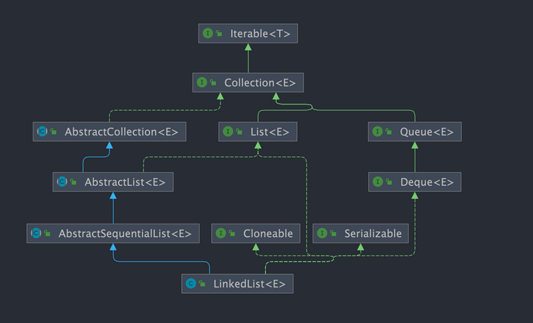

# 一、LinkedList 简介

`LinkedList` 是一个基于双向链表实现的集合类，经常被拿来和 `ArrayList` 做比较。关于 `LinkedList` 和`ArrayList`的详细对比，我们 [Java 集合常见面试题总结(上)](../01Java集合总结（上）.md) 有详细介绍到。


不过，我们在项目中一般是不会使用到 `LinkedList` 的，需要用到 `LinkedList` 的场景几乎都可以使用 `ArrayList` 来代替，并且，性能通常会更好！就连 `LinkedList` 的作者约书亚 · 布洛克（Josh Bloch）自己都说从来不会使用 `LinkedList` 。


另外，不要下意识地认为 `LinkedList` 作为链表就最适合元素增删的场景。上面也说了，`LinkedList` 仅仅在头尾插入或者删除元素的时候时间复杂度近似 O(1)，其他情况增删元素的平均时间复杂度都是 O(n) 。

## 1、LinkedList 插入和删除元素的时间复杂度？

- 头部插入/删除：只需要修改头结点的指针即可完成插入/删除操作，因此时间复杂度为 `O(1)`。

- 尾部插入/删除：只需要修改尾结点的指针即可完成插入/删除操作，因此时间复杂度为 `O(1)`。

- 指定位置插入/删除：需要先移动到指定位置，再修改指定节点的指针完成插入/删除，不过由于有头尾指针，可以从较近的指针出发，因此需要遍历平均 n/4 个元素，时间复杂度为 `O(n)`。

## 2、LinkedList 为什么不能实现 RandomAccess 接口？

`RandomAccess` 是一个标记接口，用来表明实现该接口的类支持随机访问（即可以通过索引快速访问元素）。由于 `LinkedList` 底层数据结构是链表，内存地址不连续，只能通过指针来定位，不支持随机快速访问，所以不能实现 `RandomAccess` 接口。

# 二、LinkedList 源码分析

这里以 JDK1.8 为例，分析一下 `LinkedList` 的底层核心源码。

`LinkedList` 的类定义如下：

```java
public class LinkedList<E>
    extends AbstractSequentialList<E>
    implements List<E>, Deque<E>, Cloneable, java.io.Serializable
{
  //...
}
```

`LinkedList` 继承了 `AbstractSequentialList` ，而 `AbstractSequentialList` 又继承于 `AbstractList` 。

阅读过 `ArrayList` 的源码我们就知道，`ArrayList` 同样继承了 `AbstractList` ， 所以 `LinkedList` 会有大部分方法和 `ArrayList` 相似。

`LinkedList` 实现了以下接口：

* `List` : 表明它是一个列表，支持添加、删除、查找等操作，并且可以通过下标进行访问。
* `Deque` ：继承自 `Queue` 接口，具有双端队列的特性，支持从两端插入和删除元素，方便实现栈和队列等数据结构。需要注意，`Deque` 的发音为 "deck" [dɛk]，这个大部分人都会读错。
* `Cloneable` ：表明它具有拷贝能力，可以进行深拷贝或浅拷贝操作。
* `Serializable` : 表明它可以进行序列化操作，也就是可以将对象转换为字节流进行持久化存储或网络传输，非常方便。



`LinkedList` 中的元素是通过 `Node` 定义的：

```java
private static class Node<E> {
    E item;// 节点值
    Node<E> next; // 指向的下一个节点（后继节点）
    Node<E> prev; // 指向的前一个节点（前驱结点）

    // 初始化参数顺序分别是：前驱结点、本身节点值、后继节点
    Node(Node<E> prev, E element, Node<E> next) {
        this.item = element;
        this.next = next;
        this.prev = prev;
    }
}
```

## 1、初始化

`LinkedList` 中有一个无参构造函数和一个有参构造函数。

```java
// 创建一个空的链表对象
public LinkedList() {
}

// 接收一个集合类型作为参数，会创建一个与传入集合相同元素的链表对象
public LinkedList(Collection<? extends E> c) {
    this();
    addAll(c);
}
```

## 2、插入元素

`LinkedList` 除了实现了 `List` 接口相关方法，还实现了 `Deque` 接口的很多方法，所以我们有很多种方式插入元素。

我们这里以 `List` 接口中相关的插入方法为例进行源码讲解，对应的是`add()` 方法。

`add()` 方法有两个版本：

* `add(E e)`：用于在 `LinkedList` 的尾部插入元素，即将新元素作为链表的最后一个元素，时间复杂度为 O(1)。
* `add(int index, E element)`：用于在指定位置插入元素。这种插入方式需要先移动到指定位置，再修改指定节点的指针完成插入/删除，因此需要移动平均 n/4 个元素，时间复杂度为 O(n)。

```java
// 在链表尾部插入元素
public boolean add(E e) {
    linkLast(e);
    return true;
}

// 在链表指定位置插入元素
public void add(int index, E element) {
    // 下标越界检查
    checkPositionIndex(index);

    // 判断 index 是不是链表尾部位置
    if (index == size)
        // 如果是就直接调用 linkLast 方法将元素节点插入链表尾部即可
        linkLast(element);
    else
        // 如果不是则调用 linkBefore 方法将其插入指定元素之前
        linkBefore(element, node(index));
}

// 将元素节点插入到链表尾部
void linkLast(E e) {
    // 将最后一个元素赋值（引用传递）给节点 l
    final Node<E> l = last;
    // 创建节点，并指定节点前驱为链表尾节点 last，后继引用为空
    final Node<E> newNode = new Node<>(l, e, null);
    // 将 last 引用指向新节点
    last = newNode;
    // 判断尾节点是否为空
    // 如果 l 是null 意味着这是第一次添加元素
    if (l == null)
        // 如果是第一次添加，将first赋值为新节点，此时链表只有一个元素
        first = newNode;
    else
        // 如果不是第一次添加，将新节点赋值给l（添加前的最后一个元素）的next
        l.next = newNode;
    size++;
    modCount++;
}

// 在指定元素之前插入元素
void linkBefore(E e, Node<E> succ) {
    // assert succ != null;断言 succ不为 null
    // 定义一个节点元素保存 succ 的 prev 引用，也就是它的前一节点信息
    final Node<E> pred = succ.prev;
    // 初始化节点，并指明前驱和后继节点
    final Node<E> newNode = new Node<>(pred, e, succ);
    // 将 succ 节点前驱引用 prev 指向新节点
    succ.prev = newNode;
    // 判断前驱节点是否为空，为空表示 succ 是第一个节点
    if (pred == null)
        // 新节点成为第一个节点
        first = newNode;
    else
        // succ 节点前驱的后继引用指向新节点
        pred.next = newNode;
    size++;
    modCount++;
}
```

