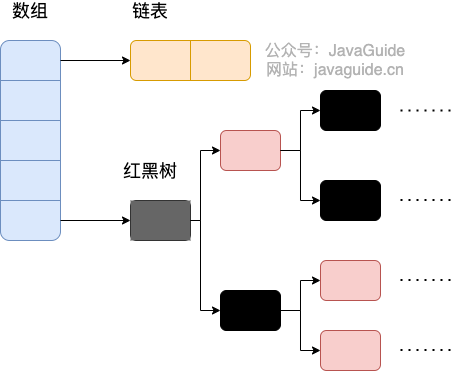
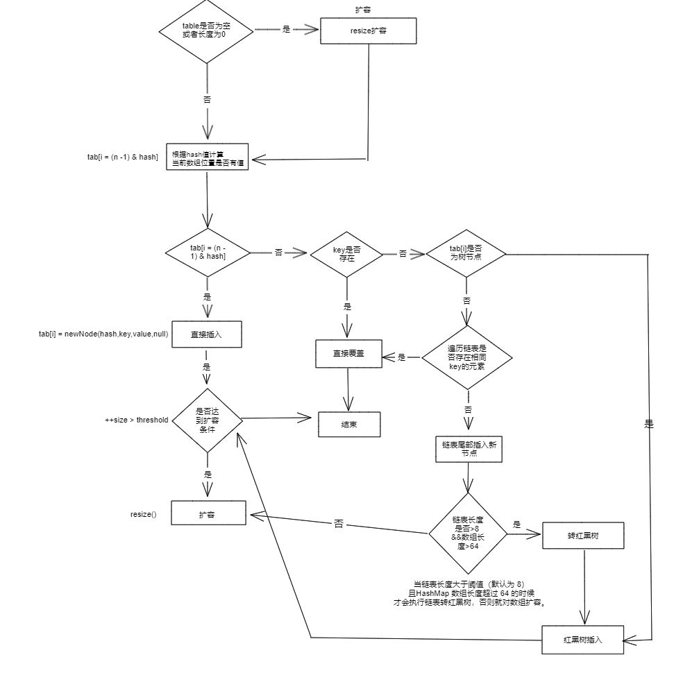

# 一、HashMap 简介

HashMap 主要用来存放键值对，它基于哈希表的 Map 接口实现，是常用的 Java 集合之一，是**非线程安全**的。

`HashMap` 可以存储 null 的 key 和 value，但 null 作为键只能有一个，null 作为值可以有多个

JDK1.8 之前 HashMap 由 数组+链表 组成的，数组是 HashMap 的主体，链表则是主要为了解决哈希冲突而存在的（“拉链法”解决冲突）。

 JDK1.8 以后的 `HashMap` 在解决哈希冲突时有了较大的变化，当链表长度大于等于阈值（默认为 8）（将链表转换成红黑树前会判断，如果当前数组的长度小于 64，那么会选择先进行数组扩容，而不是转换为红黑树）时，将链表转化为红黑树，以减少搜索时间。

`HashMap` 默认的初始化大小为 16。之后每次扩充，容量变为原来的 2 倍。并且， `HashMap` 总是使用 2 的幂作为哈希表的大小。

# 二、底层数据结构分析

## 1、JDK1.8 之前

JDK1.8 之前 HashMap 底层是 **数组和链表** 结合在一起使用也就是 **链表散列**。

HashMap 通过 key 的 hashCode 经过扰动函数处理过后得到 hash 值，然后通过 `(n - 1) & hash` 判断当前元素存放的位置（这里的 n 指的是数组的长度），如果当前位置存在元素的话，就判断该元素与要存入的元素的 hash 值以及 key 是否相同，如果相同的话，直接覆盖，不相同就通过拉链法解决冲突。

所谓扰动函数指的就是 HashMap 的 hash 方法。使用 hash 方法也就是扰动函数是为了防止一些实现比较差的 hashCode() 方法 换句话说使用扰动函数之后可以**减少碰撞**。

**JDK 1.8 HashMap 的 hash 方法源码：**

JDK 1.8 的 hash 方法 相比于 JDK 1.7 hash 方法更加简化，但是原理不变。

```java
    static final int hash(Object key) {
      int h;
      // key.hashCode()：返回散列值也就是hashcode
      // ^：按位异或
      // >>>:无符号右移，忽略符号位，空位都以0补齐
      return (key == null) ? 0 : (h = key.hashCode()) ^ (h >>> 16);
  }
```

对比一下 JDK1.7 的 HashMap 的 hash 方法源码。

```java
static int hash(int h) {
    // This function ensures that hashCodes that differ only by
    // constant multiples at each bit position have a bounded
    // number of collisions (approximately 8 at default load factor).

    h ^= (h >>> 20) ^ (h >>> 12);
    return h ^ (h >>> 7) ^ (h >>> 4);
}
```

相比于 JDK1.8 的 hash 方法 ，JDK 1.7 的 hash 方法的性能会稍差一点点，因为毕竟扰动了 4 次。

所谓 **“拉链法”** 就是：将链表和数组相结合。也就是说创建一个链表数组，数组中每一格就是一个链表。若遇到哈希冲突，则将冲突的值加到链表中即可。


## 2、JDK1.8 之后

相比于之前的版本，JDK1.8 以后在解决哈希冲突时有了较大的变化。

当链表长度大于阈值（默认为 8）时，会首先调用 `treeifyBin()`方法。这个方法会根据 HashMap 数组长度，来决定是否将链表转换为红黑树。只有当数组长度大于或者等于 64 的情况下，才会执行转换红黑树操作，以减少搜索时间。否则，就是只是执行 `resize()` 方法对数组扩容，重点关注 `treeifyBin()`方法即可！



### 2.1、同一个桶中的 `key` 、`key.hashCode()` 、`hash(key)` 、数组下标 之间的关系

在 HashMap 中：

* 同一个桶（bucket）中的节点，它们的**数组下标一定相同**。

* 这些节点的 **key 一定不同**。

* 它们的 `key.hashCode()` 值：

	* **可能相同**（例如 `"FB"` 和 `"Ea"`）
	* **也可能不同**（比如 `"Hello"` 和 `"World"`）

* 每个 key 会通过 `hash()` 方法做**扰动处理**：`hash = h ^ (h >>> 16)`，得到最终用于定位的 hash。

* 即便 `hashCode()` 或 `hash()` 一样，**最终是否进入同一个桶**，还取决于当前数组长度 `n`：

	```java
	index = (n - 1) & hash;
	```

	> 就算 hash 一样，如果数组长度不同，这就是为什么扩容后，原来在同一个桶中的元素，可能会被重新分布到不同的位置（rehash 过程）。

* 只有最终计算出的 `index` 相同的 key 才会被放入**同一个桶**中。


### 2.2、何时调用 `treeifyBin()`？

在 `HashMap` 中插入元素时，如果某个桶（bucket）中的**链表长度 >= 8**（这个值由常量 `TREEIFY_THRESHOLD = 8` 决定），会尝试调用 `treeifyBin()`：

```java
if (binCount >= TREEIFY_THRESHOLD - 1) // -1 是因为插入前计数
    treeifyBin(tab, hash);
```

但并不是链表长度达到 8 就一定转换为红黑树，还要满足以下条件：

**❗ 转树的前提：数组容量必须 ≥ 64**

这是为了避免在小容量时频繁进行树形转换。

```java
static final int MIN_TREEIFY_CAPACITY = 64;
```

**如果当前数组容量 < 64，则不会转树，而是优先进行数组扩容（resize）**。

### 2.3、`treeifyBin()` 如何转树？

当满足条件时，`treeifyBin()` 方法将执行以下步骤：

1. **定位桶位（bucket）**

	通过 hash 计算索引，获取到对应数组位置上的链表头节点。

2. **遍历链表，构造红黑树节点**

	使用 `TreeNode`（继承自 `Node`）来替代原先的 `Node`，将链表中的每个元素封装为 `TreeNode` 节点，并插入红黑树中。

	```java
	TreeNode<K,V> hd = null, tl = null;
	for (Node<K,V> e = first; e != null; e = e.next) {
	    TreeNode<K,V> p = new TreeNode<>(...);
	    if ((p.prev = tl) == null)
	        hd = p;
	    else
	        tl.next = p;
	    tl = p;
	}
	```

	然后通过 `treeify` 方法将这个链表形式的 `TreeNode` 转换为红黑树结构。

3. **替换原桶**

	原数组中该位置原先存的是链表头，现在会被替换为红黑树的根节点（`TreeNode` 类型）。

### 2.4、如果后续冲突继续增加呢？

新增元素仍会通过红黑树进行插入操作，维护红黑树的结构。

### 2.5、反向：红黑树何时退回链表？

在删除元素时，如果红黑树节点数 < 6（常量 `UNTREEIFY_THRESHOLD`），则会将该桶的红黑树退化为链表。

### 2.6、重要源码

#### 2.6.1、**类的属性：**

```java
public class HashMap<K,V> extends AbstractMap<K,V> implements Map<K,V>, Cloneable, Serializable {
    // 序列号
    private static final long serialVersionUID = 362498820763181265L;
    // 默认的初始容量是16
    static final int DEFAULT_INITIAL_CAPACITY = 1 << 4;
    // 最大容量
    static final int MAXIMUM_CAPACITY = 1 << 30;
    // 默认的负载因子
    static final float DEFAULT_LOAD_FACTOR = 0.75f;
    // 当桶(bucket)上的结点数大于等于这个值时会转成红黑树
    static final int TREEIFY_THRESHOLD = 8;
    // 当桶(bucket)上的结点数小于等于这个值时树转链表
    static final int UNTREEIFY_THRESHOLD = 6;
    // 桶中结构转化为红黑树对应的table的最小容量
    static final int MIN_TREEIFY_CAPACITY = 64;
    // 存储元素的数组，总是2的幂次倍
    transient Node<k,v>[] table;
    // 一个包含了映射中所有键值对的集合视图
    transient Set<map.entry<k,v>> entrySet;
    // 存放元素的个数，注意这个不等于数组的长度。
    transient int size;
    // 每次扩容和更改map结构的计数器
    transient int modCount;
    // 阈值(容量*负载因子) 当实际大小超过阈值时，会进行扩容
    int threshold;
    // 负载因子
    final float loadFactor;
}
```

- **loadFactor 负载因子**

	loadFactor 负载因子是控制数组存放数据的疏密程度：

	- loadFactor 越大，越趋近于 1，数组中存放的数据(entry)也就越多，也就越密，也就是会让链表的长度增加；
	- loadFactor 越小，也就是趋近于 0，数组中存放的数据(entry)也就越少，也就越稀疏。

	**loadFactor 太大导致查找元素效率低，太小导致数组的利用率低，存放的数据会很分散。loadFactor 的默认值为 0.75f 是官方给出的一个比较好的临界值**。

	给定的默认容量为 16，负载因子为 0.75。Map 在使用过程中不断的往里面存放数据，当数量超过了 16 * 0.75 = 12 就需要将当前 16 的容量进行扩容，而**扩容**这个过程涉及到 rehash、复制数据等操作，所以**非常消耗性能**。

- **threshold**

	**`threshold = capacity * loadFactor`**，**当 `Size>threshold`**的时候，那么就要考虑对数组的扩增了，也就是说，这个的意思就是 **衡量数组是否需要扩增的一个标准**。

#### 2.6.2、**`Node` 节点类源码:**

```java
// 继承自 Map.Entry<K,V>
static class Node<K,V> implements Map.Entry<K,V> {
       final int hash;// 哈希值，存放元素到hashmap中时用来与其他元素hash值比较
       final K key;//键
       V value;//值
       // 指向下一个节点
       Node<K,V> next;
       Node(int hash, K key, V value, Node<K,V> next) {
            this.hash = hash;
            this.key = key;
            this.value = value;
            this.next = next;
        }
        public final K getKey()        { return key; }
        public final V getValue()      { return value; }
        public final String toString() { return key + "=" + value; }
        // 重写hashCode()方法
        public final int hashCode() {
            return Objects.hashCode(key) ^ Objects.hashCode(value);
        }

        public final V setValue(V newValue) {
            V oldValue = value;
            value = newValue;
            return oldValue;
        }
        // 重写 equals() 方法
        public final boolean equals(Object o) {
            if (o == this)
                return true;
            if (o instanceof Map.Entry) {
                Map.Entry<?,?> e = (Map.Entry<?,?>)o;
                if (Objects.equals(key, e.getKey()) &&
                    Objects.equals(value, e.getValue()))
                    return true;
            }
            return false;
        }
}
```

#### 2.6.3、`TreeNode` 树节点类源码:

```java
static final class TreeNode<K,V> extends LinkedHashMap.Entry<K,V> {
        TreeNode<K,V> parent;  // 父
        TreeNode<K,V> left;    // 左
        TreeNode<K,V> right;   // 右
        TreeNode<K,V> prev;    // needed to unlink next upon deletion
        boolean red;           // 判断颜色
        TreeNode(int hash, K key, V val, Node<K,V> next) {
            super(hash, key, val, next);
        }
        // 返回根节点
        final TreeNode<K,V> root() {
            for (TreeNode<K,V> r = this, p;;) {
                if ((p = r.parent) == null)
                    return r;
                r = p;
       }
```

# 三、HashMap 源码分析

## 3.1、构造方法

HashMap 中有四个构造方法，它们分别如下：

```java
    // 默认构造函数。
    public HashMap() {
        this.loadFactor = DEFAULT_LOAD_FACTOR; // all   other fields defaulted
     }

     // 包含另一个“Map”的构造函数
     public HashMap(Map<? extends K, ? extends V> m) {
         this.loadFactor = DEFAULT_LOAD_FACTOR;
         putMapEntries(m, false);//下面会分析到这个方法
     }

     // 指定“容量大小”的构造函数
     public HashMap(int initialCapacity) {
         this(initialCapacity, DEFAULT_LOAD_FACTOR);
     }

     // 指定“容量大小”和“负载因子”的构造函数
     public HashMap(int initialCapacity, float loadFactor) {
         if (initialCapacity < 0)
             throw new IllegalArgumentException("Illegal initial capacity: " + initialCapacity);
         if (initialCapacity > MAXIMUM_CAPACITY)
             initialCapacity = MAXIMUM_CAPACITY;
         if (loadFactor <= 0 || Float.isNaN(loadFactor))
             throw new IllegalArgumentException("Illegal load factor: " + loadFactor);
         this.loadFactor = loadFactor;
         // 初始容量暂时存放到 threshold ，在resize中再赋值给 newCap 进行table初始化
         this.threshold = tableSizeFor(initialCapacity);
     }
```

上述四个构造方法中，都初始化了负载因子 loadFactor，由于 HashMap 中没有 capacity 这样的字段，即使指定了初始化容量 initialCapacity ，也只是通过 tableSizeFor 将其扩容到与 initialCapacity 最接近的 2 的幂次方大小，然后暂时赋值给 threshold ，后续通过 resize 方法将 threshold 赋值给 newCap 进行 table 的初始化。

**`putMapEntries` 方法：**

```java
final void putMapEntries(Map<? extends K, ? extends V> m, boolean evict) {
    int s = m.size();
    if (s > 0) {
        // 判断table是否已经初始化
        if (table == null) { // pre-size
            /*
             * 未初始化，s为m的实际元素个数，ft=s/loadFactor => s=ft*loadFactor, 跟我们前面提到的
             * 阈值=容量*负载因子 是不是很像，是的，ft指的是要添加s个元素所需的最小的容量
             */
            float ft = ((float)s / loadFactor) + 1.0F;
            int t = ((ft < (float)MAXIMUM_CAPACITY) ?
                    (int)ft : MAXIMUM_CAPACITY);
            /*
             * 根据构造函数可知，table未初始化，threshold实际上是存放的初始化容量，如果添加s个元素所
             * 需的最小容量大于初始化容量，则将最小容量扩容为最接近的2的幂次方大小作为初始化。
             * 注意这里不是初始化阈值
             */
            if (t > threshold)
                threshold = tableSizeFor(t);
        }
        // 已初始化，并且m元素个数大于阈值，进行扩容处理
        else if (s > threshold)
            resize();
        // 将m中的所有元素添加至HashMap中，如果table未初始化，putVal中会调用resize初始化或扩容
        for (Map.Entry<? extends K, ? extends V> e : m.entrySet()) {
            K key = e.getKey();
            V value = e.getValue();
            putVal(hash(key), key, value, false, evict);
        }
    }
}
```

**`tableSizeFor()` 方法：**

```java
static final int tableSizeFor(int cap) {
        int n = -1 >>> Integer.numberOfLeadingZeros(cap - 1);
        return (n < 0) ? 1 : (n >= MAXIMUM_CAPACITY) ? MAXIMUM_CAPACITY : n + 1;
    }
```

## 3.2、Put 方法

HashMap 只提供了 put 用于添加元素，putVal 方法只是给 put 方法调用的一个方法，并没有提供给用户使用。

**对 putVal 方法添加元素的分析如下：**

1. 如果定位到的数组位置没有元素，就直接插入；
2. 如果定位到的数组位置有元素就和要插入的 key 比较
	- 如果 key 相同就直接覆盖；
	- 如果 key 不相同，就判断 p 是否是一个树节点
		- 如果是树节点，就调用`e = ((TreeNode<K,V>)p).putTreeVal(this, tab, hash, key, value)`将元素添加进入；
		- 如果不是树节点，就遍历链表插入(插入的是链表尾部)。



```java
public V put(K key, V value) {
    return putVal(hash(key), key, value, false, true);
}
```

📌 `putVal()` 各参数含义如下：

| 参数名         | 类型      | 含义                                                         |
| -------------- | --------- | ------------------------------------------------------------ |
| `hash`         | `int`     | key 经过扰动处理后的 hash 值（不是原始 hashCode）            |
| `key`          | `K`       | 要插入的键                                                   |
| `value`        | `V`       | 要插入的值                                                   |
| `onlyIfAbsent` | `boolean` | 是否仅在 key 不存在时才插入（`true` 表示不覆盖原有值）       |
| `evict`        | `boolean` | 是否是因为淘汰（eviction）而插入新值，**主要用于 LinkedHashMap**，在 HashMap 中基本无效 |

> 4️⃣ `boolean onlyIfAbsent`
>
> * 如果为 `true`，表示「**仅当 key 不存在时才写入**」，否则保留旧值。
> * 这个参数在你手动调用 `put()` 时默认是 `false`；
> * 而一些场景（如 `putIfAbsent`）会传入 `true`。
>
> 5️⃣ `boolean evict`
>
> * 这个参数是为了 `LinkedHashMap` 准备的（用于判断是否因为 LRU 淘汰元素时进行插入）。
> * 在 `HashMap` 本身中这个参数并不会影响逻辑，属于预留参数。

```java
final V putVal(int hash, K key, V value, boolean onlyIfAbsent,
                   boolean evict) {
    Node<K,V>[] tab; Node<K,V> p; int n, i;
    // table未初始化或者长度为0，进行扩容
    if ((tab = table) == null || (n = tab.length) == 0)
        n = (tab = resize()).length;
    // (n - 1) & hash 确定元素存放在哪个桶中，桶为空，新生成结点放入桶中(此时，这个结点是放在数组中)
    if ((p = tab[i = (n - 1) & hash]) == null)
        tab[i] = newNode(hash, key, value, null);
    // 桶中已经存在元素（处理hash冲突）
    else {
        Node<K,V> e; K k;
        //快速判断第一个节点table[i]的key是否与插入的key一样，若相同就直接使用插入的值p替换掉旧的值e。
        if (p.hash == hash &&
            ((k = p.key) == key || (key != null && key.equals(k))))
                e = p;
        // 判断插入的是否是红黑树节点
        else if (p instanceof TreeNode)
            // 放入树中
            e = ((TreeNode<K,V>)p).putTreeVal(this, tab, hash, key, value);
        // 不是红黑树节点则说明为链表结点
        else {
            // 在链表最末插入结点
            for (int binCount = 0; ; ++binCount) {
                // 到达链表的尾部
                if ((e = p.next) == null) {
                    // 在尾部插入新结点
                    p.next = newNode(hash, key, value, null);
                    // 结点数量达到阈值(默认为 8 )，执行 treeifyBin 方法
                    // 这个方法会根据 HashMap 数组来决定是否转换为红黑树。
                    // 只有当数组长度大于或者等于 64 的情况下，才会执行转换红黑树操作，以减少搜索时间。否则，就是只是对数组扩容。
                    if (binCount >= TREEIFY_THRESHOLD - 1) // -1 for 1st
                        treeifyBin(tab, hash);
                    // 跳出循环
                    break;
                }
                // 判断链表中结点的key值与插入的元素的key值是否相等
                if (e.hash == hash &&
                    ((k = e.key) == key || (key != null && key.equals(k))))
                    // 相等，跳出循环
                    break;
                // 用于遍历桶中的链表，与前面的e = p.next组合，可以遍历链表
                p = e;
            }
        }
        // 表示在桶中找到key值、hash值与插入元素相等的结点
        if (e != null) {
            // 记录e的value
            V oldValue = e.value;
            // onlyIfAbsent为false或者旧值为null
            if (!onlyIfAbsent || oldValue == null)
                //用新值替换旧值
                e.value = value;
            // 访问后回调
            afterNodeAccess(e);
            // 返回旧值
            return oldValue;
        }
    }
    // 结构性修改
    ++modCount;
    // 实际大小大于阈值则扩容
    if (++size > threshold)
        resize();
    // 插入后回调
    afterNodeInsertion(evict);
    return null;
}
```

**我们再来对比一下 JDK1.7 put 方法的代码**

**对于 put 方法的分析如下：**

* ① 如果定位到的数组位置没有元素 就直接插入。
* ② 如果定位到的数组位置有元素，遍历以这个元素为头结点的链表，依次和插入的 key 比较，如果 key 相同就直接覆盖，不同就采用头插法插入元素。

```java
public V put(K key, V value)
    if (table == EMPTY_TABLE) {
    inflateTable(threshold);
}
    if (key == null)
        return putForNullKey(value);
    int hash = hash(key);
    int i = indexFor(hash, table.length);
    for (Entry<K,V> e = table[i]; e != null; e = e.next) { // 先遍历
        Object k;
        if (e.hash == hash && ((k = e.key) == key || key.equals(k))) {
            V oldValue = e.value;
            e.value = value;
            e.recordAccess(this);
            return oldValue;
        }
    }

    modCount++;
    addEntry(hash, key, value, i);  // 再插入
    return null;
}
```

## 3.3、get 方法

```java
public V get(Object key) {
    Node<K,V> e;
    return (e = getNode(hash(key), key)) == null ? null : e.value;
}

final Node<K,V> getNode(int hash, Object key) {
    Node<K,V>[] tab; Node<K,V> first, e; int n; K k;
    if ((tab = table) != null && (n = tab.length) > 0 &&
        (first = tab[(n - 1) & hash]) != null) {
        // 数组元素相等
        if (first.hash == hash && // always check first node
            ((k = first.key) == key || (key != null && key.equals(k))))
            return first;
        // 桶中不止一个节点
        if ((e = first.next) != null) {
            // 在树中get
            if (first instanceof TreeNode)
                return ((TreeNode<K,V>)first).getTreeNode(hash, key);
            // 在链表中get
            do {
                if (e.hash == hash &&
                    ((k = e.key) == key || (key != null && key.equals(k))))
                    return e;
            } while ((e = e.next) != null);
        }
    }
    return null;
}
```

## 3.4、resize 方法

进行扩容，会伴随着一次重新 hash 分配，并且会遍历 hash 表中所有的元素，是非常耗时的。在编写程序中，要尽量避免 resize。resize 方法实际上是将 table 初始化和 table 扩容 进行了整合，底层的行为都是给 table 赋值一个新的数组。

```java
final Node<K,V>[] resize() {
    Node<K,V>[] oldTab = table;
    int oldCap = (oldTab == null) ? 0 : oldTab.length;
    int oldThr = threshold;
    int newCap, newThr = 0;
    if (oldCap > 0) {
        // 超过最大值就不再扩充了，就只好随你碰撞去吧
        if (oldCap >= MAXIMUM_CAPACITY) {
            threshold = Integer.MAX_VALUE;
            return oldTab;
        }
        // 没超过最大值，就扩充为原来的2倍
        else if ((newCap = oldCap << 1) < MAXIMUM_CAPACITY && oldCap >= DEFAULT_INITIAL_CAPACITY)
            newThr = oldThr << 1; // double threshold
    }
    else if (oldThr > 0) // initial capacity was placed in threshold
        // 创建对象时初始化容量大小放在threshold中，此时只需要将其作为新的数组容量
        newCap = oldThr;
    else {
        // signifies using defaults 无参构造函数创建的对象在这里计算容量和阈值
        newCap = DEFAULT_INITIAL_CAPACITY;
        newThr = (int)(DEFAULT_LOAD_FACTOR * DEFAULT_INITIAL_CAPACITY);
    }
    if (newThr == 0) {
        // 创建时指定了初始化容量或者负载因子，在这里进行阈值初始化，
    	// 或者扩容前的旧容量小于16，在这里计算新的resize上限
        float ft = (float)newCap * loadFactor;
        newThr = (newCap < MAXIMUM_CAPACITY && ft < (float)MAXIMUM_CAPACITY ? (int)ft : Integer.MAX_VALUE);
    }
    threshold = newThr;
    @SuppressWarnings({"rawtypes","unchecked"})
        Node<K,V>[] newTab = (Node<K,V>[])new Node[newCap];
    table = newTab;
    if (oldTab != null) {
        // 把每个bucket都移动到新的buckets中
        for (int j = 0; j < oldCap; ++j) {
            Node<K,V> e;
            if ((e = oldTab[j]) != null) {
                oldTab[j] = null;
                if (e.next == null)
                    // 只有一个节点，直接计算元素新的位置即可
                    newTab[e.hash & (newCap - 1)] = e;
                else if (e instanceof TreeNode)
                    // 将红黑树拆分成2棵子树，如果子树节点数小于等于 UNTREEIFY_THRESHOLD（默认为 6），则将子树转换为链表。
                    // 如果子树节点数大于 UNTREEIFY_THRESHOLD，则保持子树的树结构。
                    ((TreeNode<K,V>)e).split(this, newTab, j, oldCap);
                else {
                    Node<K,V> loHead = null, loTail = null;
                    Node<K,V> hiHead = null, hiTail = null;
                    Node<K,V> next;
                    do {
                        next = e.next;
                        // 原索引
                        if ((e.hash & oldCap) == 0) {
                            if (loTail == null)
                                loHead = e;
                            else
                                loTail.next = e;
                            loTail = e;
                        }
                        // 原索引+oldCap
                        else {
                            if (hiTail == null)
                                hiHead = e;
                            else
                                hiTail.next = e;
                            hiTail = e;
                        }
                    } while ((e = next) != null);
                    // 原索引放到bucket里
                    if (loTail != null) {
                        loTail.next = null;
                        newTab[j] = loHead;
                    }
                    // 原索引+oldCap放到bucket里
                    if (hiTail != null) {
                        hiTail.next = null;
                        newTab[j + oldCap] = hiHead;
                    }
                }
            }
        }
    }
    return newTab;
}
```

# 四、HashMap 常用方法测试

```java
package map;

import java.util.Collection;
import java.util.HashMap;
import java.util.Set;

public class HashMapDemo {

    public static void main(String[] args) {
        HashMap<String, String> map = new HashMap<String, String>();
        // 键不能重复，值可以重复
        map.put("san", "张三");
        map.put("si", "李四");
        map.put("wu", "王五");
        map.put("wang", "老王");
        map.put("wang", "老王2");// 老王被覆盖
        map.put("lao", "老王");
        System.out.println("-------直接输出hashmap:-------");
        System.out.println(map);
        /**
         * 遍历HashMap
         */
        // 1.获取Map中的所有键
        System.out.println("-------foreach获取Map中所有的键:------");
        Set<String> keys = map.keySet();
        for (String key : keys) {
            System.out.print(key+"  ");
        }
        System.out.println();//换行
        // 2.获取Map中所有值
        System.out.println("-------foreach获取Map中所有的值:------");
        Collection<String> values = map.values();
        for (String value : values) {
            System.out.print(value+"  ");
        }
        System.out.println();//换行
        // 3.得到key的值的同时得到key所对应的值
        System.out.println("-------得到key的值的同时得到key所对应的值:-------");
        Set<String> keys2 = map.keySet();
        for (String key : keys2) {
            System.out.print(key + "：" + map.get(key)+"   ");

        }
        /**
         * 如果既要遍历key又要value，那么建议这种方式，因为如果先获取keySet然后再执行map.get(key)，map内部会执行两次遍历。
         * 一次是在获取keySet的时候，一次是在遍历所有key的时候。
         */
        // 当我调用put(key,value)方法的时候，首先会把key和value封装到
        // Entry这个静态内部类对象中，把Entry对象再添加到数组中，所以我们想获取
        // map中的所有键值对，我们只要获取数组中的所有Entry对象，接下来
        // 调用Entry对象中的getKey()和getValue()方法就能获取键值对了
        Set<java.util.Map.Entry<String, String>> entrys = map.entrySet();
        for (java.util.Map.Entry<String, String> entry : entrys) {
            System.out.println(entry.getKey() + "--" + entry.getValue());
        }

        /**
         * HashMap其他常用方法
         */
        System.out.println("after map.size()："+map.size());
        System.out.println("after map.isEmpty()："+map.isEmpty());
        System.out.println(map.remove("san"));
        System.out.println("after map.remove()："+map);
        System.out.println("after map.get(si)："+map.get("si"));
        System.out.println("after map.containsKey(si)："+map.containsKey("si"));
        System.out.println("after containsValue(李四)："+map.containsValue("李四"));
        System.out.println(map.replace("si", "李四2"));
        System.out.println("after map.replace(si, 李四2):"+map);
    }

}
```

输出结果：

```java
-------直接输出hashmap:-------
{san=张三, wang=老王2, si=李四, lao=老王, wu=王五}

-------foreach获取Map中所有的键:------
san  wang  si  lao  wu  
    
-------foreach获取Map中所有的值:------
张三  老王2  李四  老王  王五  
    
-------得到key的值的同时得到key所对应的值:-------
san：张三   wang：老王2   si：李四   lao：老王   wu：王五   san--张三
wang--老王2
si--李四
lao--老王
wu--王五
after map.size()：5
after map.isEmpty()：false
张三
after map.remove()：{wang=老王2, si=李四, lao=老王, wu=王五}
after map.get(si)：李四
after map.containsKey(si)：true
after containsValue(李四)：true
李四
after map.replace(si, 李四2):{wang=老王2, si=李四2, lao=老王, wu=王五}
```

