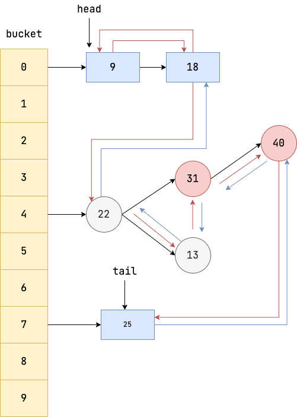
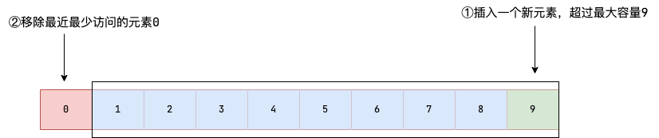
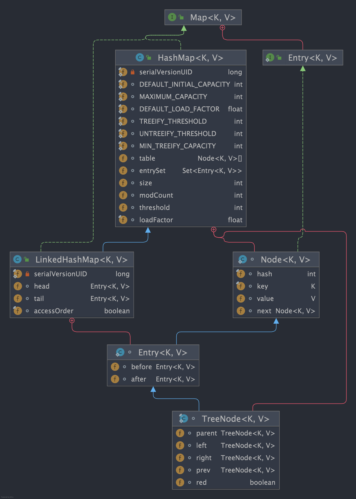
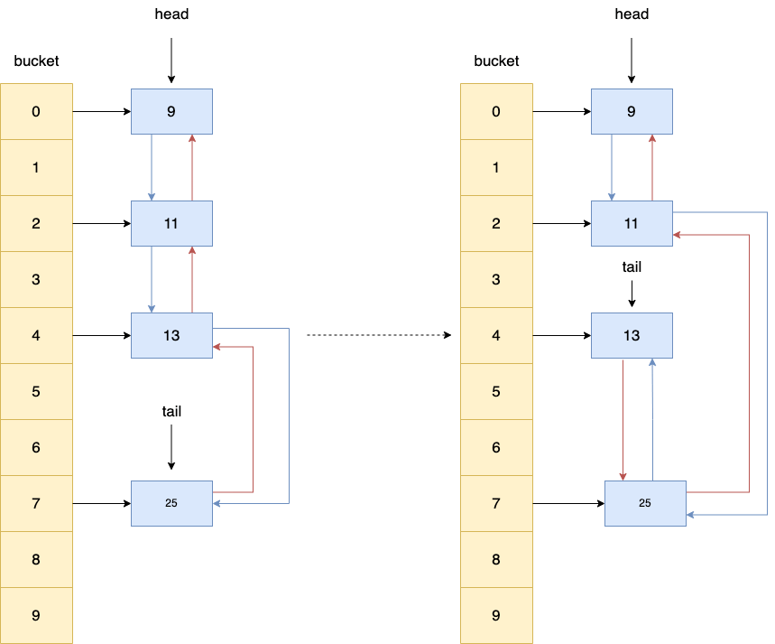
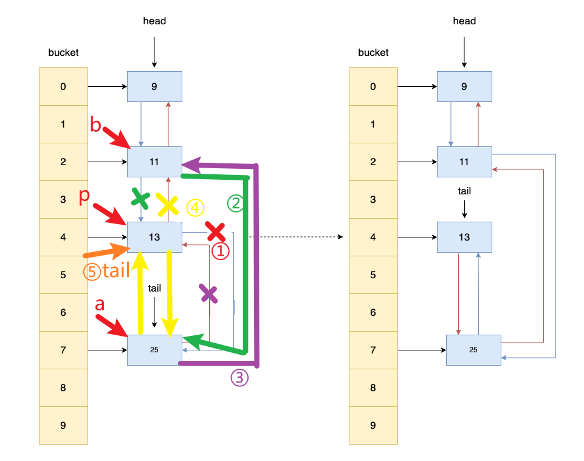

# 一、LinkedHashMap 简介

`LinkedHashMap` 是 Java 提供的一个集合类，它继承自 `HashMap`，并在 `HashMap` 基础上维护一条双向链表，使得具备如下特性:

1. 支持遍历时会按照插入顺序有序进行迭代。
2. 支持按照元素访问顺序排序,适用于封装 LRU 缓存工具。
3. 因为内部使用双向链表维护各个节点，所以遍历时的效率和元素个数成正比，相较于和容量成正比的 HashMap 来说，迭代效率会高很多。

`LinkedHashMap` 逻辑结构如下图所示，它是在 `HashMap` 基础上在各个节点之间维护一条双向链表，使得原本散列在不同 bucket 上的节点、链表、红黑树有序关联起来。



# 二、LinkedHashMap 使用示例
## 1、插入顺序遍历

如下所示，按照顺序往 `LinkedHashMap` 添加元素然后进行遍历。

```java
HashMap < String, String > map = new LinkedHashMap < > ();
map.put("a", "2");
map.put("g", "3");
map.put("r", "1");
map.put("e", "23");

for (Map.Entry < String, String > entry: map.entrySet()) {
    System.out.println(entry.getKey() + ":" + entry.getValue());
}
```

输出：

```java
a:2
g:3
r:1
e:23
```

可以看出，`LinkedHashMap` 的迭代顺序是和插入顺序一致的,这一点是 `HashMap` 所不具备的。

## 2、访问顺序遍历

`LinkedHashMap` 定义了排序模式 `accessOrder`(boolean 类型，默认为 false)

- 访问顺序则为 true；

- 插入顺序则为 false。

	> ```java
	> public LinkedHashMap() {
	>         super();
	>         accessOrder = false;
	>     }
	> ```
	>
	> 

为了实现访问顺序遍历，可以使用传入 `accessOrder` 属性的 `LinkedHashMap` 构造方法，并将 `accessOrder` 设置为 true，表示其具备访问有序性。

```java
LinkedHashMap<Integer, String> map = new LinkedHashMap<>(16, 0.75f, true);
map.put(1, "one");
map.put(2, "two");
map.put(3, "three");
map.put(4, "four");
map.put(5, "five");
//访问元素2,该元素会被移动至链表末端
map.get(2);
//访问元素3,该元素会被移动至链表末端
map.get(3);
for (Map.Entry<Integer, String> entry : map.entrySet()) {
    System.out.println(entry.getKey() + " : " + entry.getValue());
}
```

输出：

```java
1 : one
4 : four
5 : five
2 : two
3 : three
```

可以看出，`LinkedHashMap` 的迭代顺序是和访问顺序一致的。

## 3、LRU 缓存

从上一个我们可以了解到通过 `LinkedHashMap` 我们可以封装一个简易版的 LRU（**L**east **R**ecently **U**sed，最近最少使用） 缓存，确保当存放的元素超过容器容量时，将最近最少访问的元素移除。



具体实现思路如下：

* 继承 `LinkedHashMap`;
* 构造方法中指定 `accessOrder` 为 true ，这样在访问元素时就会把该元素移动到链表尾部，链表首元素就是最近最少被访问的元素；
* 重写`removeEldestEntry` 方法，该方法会返回一个 boolean 值，告知 `LinkedHashMap` 是否需要移除链表首元素（缓存容量有限）。

```java
public class LRUCache<K, V> extends LinkedHashMap<K, V> {
    private final int capacity;

    public LRUCache(int capacity) {
        super(capacity, 0.75f, true);
        this.capacity = capacity;
    }

    /**
     * 判断size超过容量时返回true，告知LinkedHashMap移除最老的缓存项(即链表的第一个元素)
     */
    @Override
    protected boolean removeEldestEntry(Map.Entry<K, V> eldest) {
        return size() > capacity;
    }
}
```

测试代码如下，初始化缓存容量为 3，然后按照次序先后添加 4 个元素。

```java
LRUCache<Integer, String> cache = new LRUCache<>(3);
cache.put(1, "one");
cache.put(2, "two");
cache.put(3, "three");
cache.put(4, "four");
cache.put(5, "five");
for (int i = 1; i <= 5; i++) {
    System.out.println(cache.get(i));
}
```

输出：

```java
null
null
three
four
five
```

从输出结果来看，由于缓存容量为 3 ，因此，添加第 4 个元素时，第 1 个元素会被删除。添加第 5 个元素时，第 2 个元素会被删除。

程序的调用链如下：

```java
// LRUCacheTest.put(K, V) 调用的是继承自 HashMap 的 put 方法
⬇
HashMap.put(K key, V value)

→ 调用 HashMap.putVal(int hash, K key, V value, boolean onlyIfAbsent, boolean evict)
    ⬇
    1. 判断是否需要 resize
    2. 在表中查找 key，如果没有，则插入新节点
        → 创建节点：LinkedHashMap.newNode()
        ⬇
        LinkedHashMap.newNode(...) {
            // 创建一个 LinkedHashMap.Entry（继承自 HashMap.Node）
            LinkedHashMap.Entry<K,V> p = new LinkedHashMap.Entry<>(...);
            // 将其加入双向链表的尾部（tail）
            linkNodeLast(p); ← 维护访问顺序或插入顺序
            return p;
        }
    3. 插入完成后调用：
        afterNodeInsertion(evict); ← 这里是关键！
        ⬇
        实际调用的是 LinkedHashMap.afterNodeInsertion(boolean evict)
            {
                if (evict && head != null && removeEldestEntry(head)) {
                    removeNode(hash(head.key), head.key, null, false, true);
                }
            }
            ⬇
            → removeEldestEntry() 被调用！
                return size() > capacity;

```

# 三、LinkedHashMap 源码解析
## 1、Node 的设计

在正式讨论 `LinkedHashMap` 前，先来聊聊 `LinkedHashMap` 节点 `Entry` 的设计，我们都知道 `HashMap` 的 bucket 上的因为冲突转为链表的`Node`节点，会在符合以下两个条件时会将链表转为红黑树:

1. 链表上的节点个数达到树化的阈值 8，即`TREEIFY_THRESHOLD`。
2. bucket 的容量达到最小的树化容量即`MIN_TREEIFY_CAPACITY`

而 `LinkedHashMap` 是在 `HashMap` 的基础上为 bucket 上的每一个节点建立一条双向链表，这就使得转为红黑树的树节点也需要具备双向链表节点的特性，即每一个树节点都需要拥有两个引用，存储前驱节点和后继节点的地址，所以对于树节点类 `TreeNode` 的设计就是一个比较棘手的问题。

对此我们不妨来看看两者之间节点类的类图，可以看到:

1. `LinkedHashMap` 的节点内部类 `Entry` 基于 `HashMap` 的基础上，增加 `before` 和 `after` 指针使节点具备双向链表的特性。
2. `HashMap` 的树节点 `TreeNode` 继承了具备双向链表特性的 `LinkedHashMap` 的 `Entry`。



很多读者此时就会有这样一个疑问，

- 为什么 `HashMap` 的树节点 `TreeNode` 要通过 `LinkedHashMap` 获取双向链表的特性呢？
- 为什么不直接在 `Node` 上实现前驱和后继指针呢？

先来回答第一个问题，我们都知道 `LinkedHashMap` 是在 `HashMap` 基础上对节点增加双向指针实现双向链表的特性，所以 `LinkedHashMap` 内部链表转红黑树时，对应的节点会转为树节点 `TreeNode`，为了保证使用 `LinkedHashMap` 时树节点具备双向链表的特性，所以树节点 `TreeNode` 需要继承 `LinkedHashMap` 的 `Entry`。

再来说说第二个问题，我们直接在 `HashMap` 的节点 `Node` 上直接实现前驱和后继指针，然后 `TreeNode` 直接继承 `Node` 获取双向链表的特性为什么不行呢？其实这样做也是可以的。只不过这种做法会使得使用 `HashMap` 时存储键值对的节点类 `Node` 多了两个没有必要的引用，占用没必要的内存空间。

所以，为了保证 `HashMap` 底层的节点类 `Node` 没有多余的引用，又要保证 `LinkedHashMap` 的节点类 `Entry` 拥有存储链表的引用，设计者就让 `LinkedHashMap` 的节点 `Entry` 去继承 Node 并增加存储前驱后继节点的引用 `before`、`after`，让需要用到链表特性的节点去实现需要的逻辑。然后树节点 `TreeNode` 再通过继承 `Entry` 获取 `before`、`after` 两个指针。

 `LinkedHashMap` 的节点 `Entry` ：

```java
static class Entry<K,V> extends HashMap.Node<K,V> {
        Entry<K,V> before, after;
        Entry(int hash, K key, V value, Node<K,V> next) {
            super(hash, key, value, next);
        }
    }
```

但是这样做，不也使得使用 `HashMap` 时的 `TreeNode` 多了两个没有必要的引用吗?这不也是一种空间的浪费吗？

对于这个问题,引用作者的一段注释，作者们认为在良好的 `hashCode` 算法时，`HashMap` 转红黑树的概率不大。就算转为红黑树变为树节点，也可能会因为移除或者扩容将 `TreeNode` 变为 `Node`，所以 `TreeNode` 的使用概率不算很大，对于这一点资源空间的浪费是可以接受的。

```bash
Because TreeNodes are about twice the size of regular nodes, we
use them only when bins contain enough nodes to warrant use
(see TREEIFY_THRESHOLD). And when they become too small (due to
removal or resizing) they are converted back to plain bins.  In
usages with well-distributed user hashCodes, tree bins are
rarely used.  Ideally, under random hashCodes, the frequency of
nodes in bins follows a Poisson distribution
```

## 2、构造方法

`LinkedHashMap` 构造方法有 4 个实现也比较简单，直接调用父类即 `HashMap` 的构造方法完成初始化。

```java
public LinkedHashMap() {
    super();
    accessOrder = false;
}

public LinkedHashMap(int initialCapacity) {
    super(initialCapacity);
    accessOrder = false;
}

public LinkedHashMap(int initialCapacity, float loadFactor) {
    super(initialCapacity, loadFactor);
    accessOrder = false;
}

public LinkedHashMap(int initialCapacity,
    float loadFactor,
    boolean accessOrder) {
    super(initialCapacity, loadFactor);
    this.accessOrder = accessOrder;
}
```

上面也提到了，默认情况下 `accessOrder` 为 false，如果要让 `LinkedHashMap` 实现键值对按照访问顺序排序（即将最近未访问的元素排在链表首部、最近访问的元素移动到链表尾部），需要调用第 4 个构造方法将 `accessOrder` 设置为 true。

## 3、get 方法

`get` 方法是 `LinkedHashMap` 增删改查操作中唯一一个重写的方法， `accessOrder` 为 true 的情况下， 它会在元素查询完成之后，将当前访问的元素移到链表的末尾。

```java
public V get(Object key) {
     Node < K, V > e;
     //获取key的键值对,若为空直接返回
     if ((e = getNode(hash(key), key)) == null)
         return null;
     //若accessOrder为true，则调用afterNodeAccess将当前元素移到链表末尾
     if (accessOrder)
         afterNodeAccess(e);
     //返回键值对的值
     return e.value;
 }
```

从源码可以看出，`get` 的执行步骤非常简单:

1. 调用父类即 `HashMap` 的 `getNode` 获取键值对，若为空则直接返回。
2. 判断 `accessOrder` 是否为 true，若为 true 则说明需要保证 `LinkedHashMap` 的链表访问有序性，执行步骤 3。
3. 调用 `LinkedHashMap` 重写的 `afterNodeAccess` 将当前元素添加到链表末尾。

关键点在于 `afterNodeAccess` 方法的实现，这个方法负责将元素移动到链表末尾。

```java
void afterNodeAccess(Node < K, V > e) { // move node to last
    LinkedHashMap.Entry < K, V > last;
    //如果accessOrder 且当前节点不为链表尾节点
    if (accessOrder && (last = tail) != e) {

        //获取当前节点、以及前驱节点和后继节点
        LinkedHashMap.Entry < K, V > p =
            (LinkedHashMap.Entry < K, V > ) e, b = p.before, a = p.after;

        //将当前节点的后继节点指针指向空，使其和后继节点断开联系
        p.after = null;

        //如果前驱节点为空，则说明当前节点是链表的首节点，故将后继节点设置为首节点
        if (b == null)
            head = a;
        else
            //如果前驱节点不为空，则让前驱节点指向后继节点
            b.after = a;

        //如果后继节点不为空，则让后继节点指向前驱节点
        if (a != null)
            a.before = b;
        else
            //如果后继节点为空，则说明当前节点在链表最末尾，直接让last 指向前驱节点,这个 else其实 没有意义，因为最开头if已经确保了p不是尾结点了，自然after不会是null
            last = b;

        //如果last为空，则说明当前链表只有一个节点p，则将head指向p
        if (last == null)
            head = p;
        else {
            //反之让p的前驱指针指向尾节点，再让尾节点的前驱指针指向p
            p.before = last;
            last.after = p;
        }
        //tail指向p，自此将节点p移动到链表末尾
        tail = p;

        ++modCount;
    }
}
```

从源码可以看出， `afterNodeAccess` 方法完成了下面这些操作:

1. 如果 `accessOrder` 为 true 且链表尾部不为当前节点 p，我们则需要将当前节点移到链表尾部。
2. 获取当前节点 p、以及它的前驱节点 b 和后继节点 a。
3. 将当前节点 p 的后继指针设置为 null，使其和后继节点 p 断开联系。
4. 尝试将前驱节点指向后继节点，若前驱节点为空，则说明当前节点 p 就是链表首节点，故直接将后继节点 a 设置为首节点，随后我们再将 p 追加到 a 的末尾。
5. 再尝试让后继节点 a 指向前驱节点 b。
6. 上述操作让前驱节点和后继节点完成关联，并将当前节点 p 独立出来，这一步则是将当前节点 p 追加到链表末端，如果链表末端为空，则说明当前链表只有一个节点 p，所以直接让 head 指向 p 即可。
7. 上述操作已经将 p 成功到达链表末端，最后我们将 tail 指针即指向链表末端的指针指向 p 即可。

可以结合这张图理解，展示了 key 为 13 的元素被移动到了链表尾部。



过程示意图如下：



## 4、remove 方法后置操作——afterNodeRemoval

`LinkedHashMap` 并没有对 `remove` 方法进行重写，而是直接继承 `HashMap` 的 `remove` 方法，为了保证键值对移除后双向链表中的节点也会同步被移除，`LinkedHashMap` 重写了 `HashMap` 的空实现方法 `afterNodeRemoval`。

```java
final Node<K,V> removeNode(int hash, Object key, Object value,
                               boolean matchValue, boolean movable) {
        //略
            if (node != null && (!matchValue || (v = node.value) == value ||
                                 (value != null && value.equals(v)))) {
                if (node instanceof TreeNode)
                    ((TreeNode<K,V>)node).removeTreeNode(this, tab, movable);
                else if (node == p)
                    tab[index] = node.next;
                else
                    p.next = node.next;
                ++modCount;
                --size;
                //HashMap的removeNode完成元素移除后会调用afterNodeRemoval进行移除后置操作
                afterNodeRemoval(node);
                return node;
            }
        }
        return null;
    }
//空实现
void afterNodeRemoval(Node<K,V> p) { }
```

