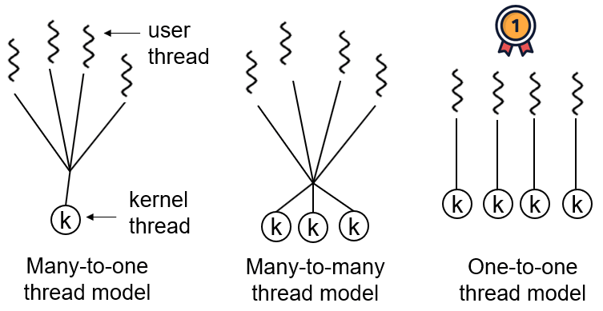
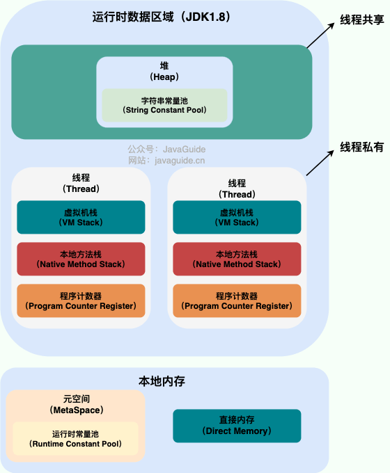
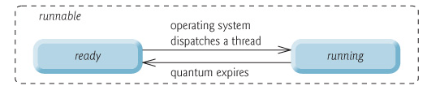
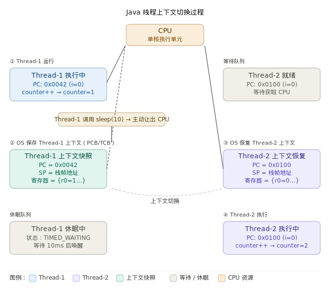

# 一、线程

## 1、⭐️什么是线程和进程?

### 1.1、何为进程?

进程是程序的一次执行过程，是系统运行程序的基本单位，因此进程是动态的。系统运行一个程序即是一个进程从创建，运行到消亡的过程。

在 Java 中，当我们启动 main 函数时其实就是启动了一个 JVM 的进程，而 main 函数所在的线程就是这个进程中的一个线程，也称主线程。

在 Windows 中通过查看任务管理器的方式，我们就可以清楚看到 Windows 当前运行的进程（`.exe` 文件的运行）。

### 1.2、何为线程?

线程与进程相似，但线程是一个比进程更小的执行单位。一个进程在其执行的过程中可以产生多个线程。与进程不同的是，同类的多个线程共享进程的**堆**和**方法区**资源，但每个线程有自己的**程序计数器**、**虚拟机栈**和**本地方法栈**，所以系统在产生一个线程，或是在各个线程之间做切换工作时，负担要比进程小得多，也正因为如此，线程也被称为轻量级进程。

> 注意：
>
> - 同类的多个线程：通过同一个Thread子类创建的多个实例，或者执行相同Runnable/Callable任务的多个线程
>
>   ```java
>   /**
>    * Java线程内存模型详解
>    * 
>    * 1. 同类的多个线程：
>    *    - 通过同一个Thread子类创建的多个实例
>    *    - 或者执行相同Runnable/Callable任务的多个线程
>    *    - 例如：new MyThread(), new MyThread() 或者 Thread t1=new Thread(r), Thread t2=new Thread(r)
>    * 
>    * 2. 共享资源（堆和方法区）：
>    *    堆（Heap）：存放对象实例、数组等，所有线程共享
>    *    方法区（Method Area）：存放类信息、常量、静态变量、JIT编译后的代码等
>    * 
>    * 3. 线程私有资源：
>    *    程序计数器（PC Register）：记录当前线程执行的字节码指令位置
>    *    虚拟机栈（VM Stack）：存储局部变量表、操作数栈、动态链接等
>    *    本地方法栈（Native Method Stack）：为本地方法服务
>    */
>     
>   public class ThreadMemoryModelDemo {
>       // 方法区资源：类的静态变量
>       private static int staticCounter = 5;
>         
>       // 堆资源：实例变量（对象的一部分）
>       private String objectName;
>         
>       public ThreadMemoryModelDemo(String name) {
>           this.objectName = name;
>       }
>         
>       // 方法区资源：方法字节码
>       public void sharedMethod() {
>           // 以下变量存储在线程私有的虚拟机栈中
>           int localVar = 10;           // 局部变量
>           String localRef = "test";    // 局部引用
>             
>           // 访问共享的堆资源
>           System.out.println(this.objectName);
>             
>           // 访问共享的方法区资源
>           System.out.println("Static counter: " + staticCounter);
>       }
>         
>       // 演示多线程共享资源
>       public static void demonstrateSharedResource() {
>           ThreadMemoryModelDemo demo1 = new ThreadMemoryModelDemo("Thread-1");
>           ThreadMemoryModelDemo demo2 = new ThreadMemoryModelDemo("Thread-2");
>             
>           // 创建多个线程执行相同任务
>           Runnable task = () -> {
>               // 每个线程有自己的程序计数器，记录执行位置
>               // 每个线程有自己的虚拟机栈，localVar存储在这里
>                 
>               // 但访问相同的共享资源
>               demo1.sharedMethod();  // 访问堆中的对象
>               System.out.println("Static value accessed by thread: " + staticCounter); // 方法区资源
>           };
>             
>           Thread t1 = new Thread(task, "Thread-1");
>           Thread t2 = new Thread(task, "Thread-2");
>             
>           t1.start();
>           t2.start();
>       }
>         
>       public static void main(String[] args) {
>           System.out.println("=== Java线程内存模型说明 ===\n");
>             
>           System.out.println("1. 同类的多个线程：");
>           System.out.println("   - 通过相同方式创建的多个线程实例");
>           System.out.println("   - 例如：多个Thread实例执行相同任务\n");
>             
>           System.out.println("2. 共享资源：");
>           System.out.println("   - 堆（Heap）：存储所有对象实例，所有线程共享");
>           System.out.println("   - 方法区（Method Area）：存储类元数据、静态变量、常量池等\n");
>             
>           System.out.println("3. 线程私有资源：");
>           System.out.println("   - 程序计数器：记录线程执行位置，线程切换时保持状态");
>           System.out.println("   - 虚拟机栈：存储方法调用的局部变量和操作栈");
>           System.out.println("   - 本地方法栈：支持native方法执行\n");
>             
>           demonstrateSharedResource();
>       }
>   }
>   ```
>
>   

Java 程序天生就是多线程程序，我们可以通过 JMX 来看看一个普通的 Java 程序有哪些线程，代码如下。

```java
public class MultiThread {
	public static void main(String[] args) {
		// 获取 Java 线程管理 MXBean
	ThreadMXBean threadMXBean = ManagementFactory.getThreadMXBean();
		// 不需要获取同步的 monitor 和 synchronizer 信息，仅获取线程和线程堆栈信息
		ThreadInfo[] threadInfos = threadMXBean.dumpAllThreads(false, false);
		// 遍历线程信息，仅打印线程 ID 和线程名称信息
		for (ThreadInfo threadInfo : threadInfos) {
			System.out.println("[" + threadInfo.getThreadId() + "] " + threadInfo.getThreadName());
		}
	}
}
```

上述程序输出如下（输出内容可能不同，不用太纠结下面每个线程的作用，只用知道 main 线程执行 main 方法即可）：

```java
[5] Attach Listener //添加事件
[4] Signal Dispatcher // 分发处理给 JVM 信号的线程
[3] Finalizer //调用对象 finalize 方法的线程
[2] Reference Handler //清除 reference 线程
[1] main //main 线程,程序入口
```

从上面的输出内容可以看出：**一个 Java 程序的运行是 main 线程和多个其他线程同时运行**。


## 2、Java 线程和操作系统的线程有啥区别？

JDK 1.2 之前，Java 线程是基于绿色线程（Green Threads）实现的，这是一种用户级线程（用户线程），也就是说 JVM 自己模拟了多线程的运行，而不依赖于操作系统。由于绿色线程和原生线程比起来在使用时有一些限制（比如绿色线程不能直接使用操作系统提供的功能如异步 I/O、只能在一个内核线程上运行，无法利用多核），在 JDK 1.2 及以后，Java 线程改为基于原生线程（Native Threads）实现，也就是说 JVM 直接使用操作系统原生的内核级线程（内核线程）来实现 Java 线程，由操作系统内核进行线程的调度和管理。

我们上面提到了用户线程和内核线程，考虑到很多读者不太了解二者的区别，这里简单介绍一下：

- 用户线程：由用户空间程序管理和调度的线程，运行在用户空间（专门给应用程序使用）。
- 内核线程：由操作系统内核管理和调度的线程，运行在内核空间（只有内核程序可以访问）。

顺便简单总结一下用户线程和内核线程的区别和特点：

- 用户线程创建和切换成本低，但不可以利用多核。
- 内核态线程，创建和切换成本高，可以利用多核。

一句话概括 Java 线程和操作系统线程的关系：**现在的 Java 线程的本质其实就是操作系统的线程**。

线程模型是用户线程和内核线程之间的关联方式，常见的线程模型有这三种：

1. 一对一（一个用户线程对应一个内核线程）
2. 多对一（多个用户线程映射到一个内核线程）
3. 多对多（多个用户线程映射到多个内核线程）



在 Windows 和 Linux 等主流操作系统中，Java 线程采用的是一对一的线程模型，也就是一个 Java 线程对应一个系统内核线程。Solaris 系统是一个特例（Solaris 系统本身就支持多对多的线程模型），HotSpot VM 在 Solaris 上支持多对多和一对一。具体可以参考 R 大的回答：[JVM中线程模型是用户级的吗](./References\JVM中线程模型是用户级的吗\JVM中的线程模型是用户级的么？ - 知乎.mhtml)

## 3、⭐️请简要描述线程与进程的关系,区别及优缺点？

下图是 Java 内存区域，通过下图我们从 JVM 的角度来说一下线程和进程之间的关系。



从上图可以看出：一个进程中可以有多个线程，多个线程共享进程的**堆**和**方法区 (JDK1.8 之后的元空间)** 资源，但是每个线程有自己的 **程序计数器**、**虚拟机栈 和 ** **本地方法栈**。

⭐️**总结：** 

- 线程是进程划分成的更小的运行单位。
- 线程和进程最大的不同在于基本上各进程是独立的，而各线程则**不一定**，因为同一进程中的线程极有可能会相互影响。
- 线程执行开销小，但不利于资源的管理和保护；而进程正相反。

下面是该知识点的扩展内容！

下面来思考这样一个问题：为什么**程序计数器**、**虚拟机栈**和**本地方法栈**是线程私有的呢？为什么堆和方法区是线程共享的呢？

### 3.1、程序计数器为什么是私有的?

私有的程序计数器主要有下面两个作用：

1. 字节码解释器通过改变程序计数器来依次读取指令，从而实现代码的流程控制，如：顺序执行、选择、循环、异常处理。
2. 在多线程的情况下，程序计数器用于记录当前线程执行的位置，从而当线程被切换回来的时候能够知道该线程上次运行到哪儿了。

需要注意的是，如果执行的是 `native` 方法，那么程序计数器记录的是 `undefined`地址，只有执行的是 Java 代码时，程序计数器记录的才是下一条指令的地址，而执行其它语言代码时，程序计数器无法记录执行位置。

> 当执行native方法时，程序计数器记录`undefined`，因为：
>
> - native方法不在JVM的字节码执行体系中；
> - 执行的是本地机器代码；
> - JVM无法跟踪本地代码的执行位置；

所以，程序计数器私有主要是为了**线程切换后能恢复到正确的执行位置**，如果JVM只有一个全局程序计数器，所有线程共用，那么线程切换会导致**执行流交叉污染**，程序行为完全不可预测，甚至崩溃。

### 3.2、虚拟机栈和本地方法栈为什么是私有的?

- **虚拟机栈：** 每个 Java 方法在执行之前，会创建一个栈帧用于存储局部变量表、操作数栈、常量池引用等信息。从方法调用直至执行完成的过程，就对应着一个栈帧在 Java 虚拟机栈中入栈和出栈的过程。
- **本地方法栈：** 和虚拟机栈所发挥的作用非常相似，区别是：**虚拟机栈为虚拟机执行 Java 方法 （也就是字节码）服务，而本地方法栈则为虚拟机使用到的 Native 方法服务。** 在 HotSpot 虚拟机中和 Java 虚拟机栈合二为一。

所以，为了**保证线程中的局部变量不被别的线程访问到**，虚拟机栈和本地方法栈是线程私有的。

### 3.3、一句话简单了解堆和方法区

堆和方法区是 **所有线程共享** 的资源，其中堆是进程中最大的一块内存，主要用于存放新创建的对象 (几乎所有对象都在这里分配内存)，方法区主要用于存放已被加载的类信息、常量、静态变量、即时编译器编译后的代码等数据。

## 4、如何创建线程？

一般来说，创建线程有很多种方式，例如继承`Thread`类、实现`Runnable`接口、实现`Callable`接口、使用线程池、使用`CompletableFuture`类等等。

> 1. 继承 `Thread` 类：
>
>    ```java
>    class MyThread extends Thread {
>        @Override
>        public void run() {
>            System.out.println("线程执行：" + Thread.currentThread().getName());
>        }
>    }
>
>    public class ThreadExample {
>        public static void main(String[] args) {
>            MyThread thread = new MyThread();
>            thread.start(); // 启动线程
>        }
>    }
>    ```
>
> 2. 实现 `Runnable` 接口：
>
>    这种方式更加灵活，因为Java支持单继承多实现：
>
>    ```java
>    class MyRunnable implements Runnable {
>        @Override
>        public void run() {
>            System.out.println("Runnable线程执行：" + Thread.currentThread().getName());
>        }
>    }
>
>    public class RunnableExample {
>        public static void main(String[] args) {
>            MyRunnable runnable = new MyRunnable();
>            Thread thread = new Thread(runnable);
>            thread.start();
>        }
>    }
>    ```
>
> 3. 实现 `Callable` 接口
>
>    这种方式可以返回结果，并抛出异常：
>
>    ```java
>    import java.util.concurrent.Callable;
>    import java.util.concurrent.FutureTask;
>    
>    class MyCallable implements Callable<String> {
>        private final String taskName;
>    
>        public MyCallable(String taskName) {
>            this.taskName = taskName;
>        }
>    
>        @Override
>        public String call() throws Exception {
>            System.out.println(taskName + " - 开始执行，线程：" + Thread.currentThread().getName());
>            Thread.sleep(2000); // 模拟耗时操作
>            System.out.println(taskName + " - 执行完成，线程：" + Thread.currentThread().getName());
>            return "任务结果：" + taskName + "，执行线程：" + Thread.currentThread().getName();
>        }
>    }
>    
>    public class CallableExample {
>        public static void main(String[] args) throws Exception {
>            System.out.println("主线程：" + Thread.currentThread().getName());
>    
>            // 创建Callable实例
>            MyCallable callable1 = new MyCallable("任务1");
>            MyCallable callable2 = new MyCallable("任务2");
>    
>            // 将Callable包装到FutureTask中
>            FutureTask<String> futureTask1 = new FutureTask<>(callable1);
>            FutureTask<String> futureTask2 = new FutureTask<>(callable2);
>    
>            System.out.println("FutureTask创建完成，此时call()方法还未执行");
>    
>            // 创建线程并启动
>            Thread thread1 = new Thread(futureTask1, "工作线程1");
>            Thread thread2 = new Thread(futureTask2, "工作线程2");
>    
>            System.out.println("开始启动线程...");
>            long startTime = System.currentTimeMillis();
>    
>            thread1.start(); // 此时线程开始，但call()方法的执行取决于FutureTask的run()方法调用
>            thread2.start();
>    
>            System.out.println("线程已启动，但此时call()方法仍在等待FutureTask.run()被调用");
>            System.out.println("现在开始获取结果...");
>    
>            // 获取结果 - 这里会阻塞直到call()方法执行完成
>            String result1 = futureTask1.get();
>            String result2 = futureTask2.get();
>    
>            long endTime = System.currentTimeMillis();
>    
>            System.out.println("结果1：" + result1);
>            System.out.println("结果2：" + result2);
>            System.out.println("总耗时：" + (endTime - startTime) + "ms");
>    
>            // 演示异常情况
>            System.out.println("\n--- 测试异常处理 ---");
>            Callable<String> errorCallable = () -> {
>                System.out.println("错误任务开始执行");
>                Thread.sleep(500);
>                throw new RuntimeException("模拟异常");
>            };
>    
>            FutureTask<String> errorTask = new FutureTask<>(errorCallable);
>            Thread errorThread = new Thread(errorTask);
>            errorThread.start();
>    
>            try {
>                String errorResult = errorTask.get(); // 异常在这里抛出
>            } catch (Exception e) {
>                System.out.println("捕获到任务执行异常：" + e.getCause().getMessage());
>            }
>        }
>    }
>    ```
>
>    > ❓ **疑问解答：**
>    >
>    > - **为什么用 `Callable` 创建线程需要先放入 `FutureTask` ？**
>    >   
>    >   - `Thread`类的构造函数只接受`Runnable`接口，而`Callable`是另一个接口
>    >   - `FutureTask`实现了`Runnable`接口，同时又接受`Callable`作为参数
>    >   - `FutureTask`起到桥梁作用，将`Callable`包装成`Runnable`，使其能被`Thread`执行
>    >   
>    > - **为什么thread.start()时不能获取返回值和触发异常，需要futureTask.get()才获取并触发异常？**
>    >   
>    >   - `thread.start()`只是启动线程，此时任务可能还在排队等待执行
>    >   - `get()`方法会阻塞直到任务完成，并返回结果或抛出执行过程中发生的异常
>    >   - 这种设计允许异步执行：启动线程后可以做其他事情，需要结果时再调用`get()`
>    >   
>    > - **call()方法是在thread.start()时执行，还是futureTask.get()时执行？**
>    >   - `call()`方法实际上是在`FutureTask.run()`被调用时执行的
>    >   - 而`FutureTask.run()`是在工作线程中被调用的，所以当线程调度执行FutureTask的run方法时，call()才会执行
>    >   - 在上面的代码中，`thread.start()`后，call()方法会在工作线程中执行，如果`call()`还没执行完，`get()`会阻塞等待，如果`call()`已经执行完成，`get()`立即返回结果
>    >   
>    > - `Runnable` 与 `Callable` 接口的区别
>    >
>    >   - 核心区别
>    >
>    >     | 对比点   | Runnable          | Callable            |
>    >     | -------- | ----------------- | ------------------- |
>    >     | 返回值   | ❌ 无              | ✅ 有（泛型）        |
>    >     | 抛出异常 | ❌ 不能直接抛      | ✅ 可以抛异常        |
>    >     | 使用方式 | Thread / Executor | Executor + Future   |
>    >     | 引入版本 | Java 1.0          | Java 1.5（并发包）  |
>    >     | 适合场景 | 简单任务          | 有结果/需要异步计算 |
>    >
>    >   - `Runnable`：最基础的线程任务
>    >
>    >     📌 特点
>    >
>    >     - 只有一个方法：`run()`
>    >     - 没有返回值
>    >     - 不能抛 checked 异常（只能 try-catch）
>    >
>    >   - `Callable`：带返回值的任务
>    >
>    >      📌 特点
>    >
>    >     - 方法：`call()`
>    >
>    >     - 有返回值（泛型）
>    >
>    >     - 可以抛异常
>    >
>    >     - 通常配合 `Future` 使用，用来获取异步执行结果
>    >
>    >       > 👉 `future.get()`：会**阻塞等待结果返回**
>    >
>    >       
>
> 4. 使用线程池
>
>    现代 Java应用推荐使用**线程池**来管理线程：
>
>    ```java
>    import java.util.concurrent.ExecutorService;
>    import java.util.concurrent.Executors;
>
>    public class ThreadPoolExample {
>        public static void main(String[] args) {
>            ExecutorService executor = Executors.newFixedThreadPool(3);
>
>            for (int i = 0; i < 5; i++) {
>                final int taskId = i;
>                executor.submit(() -> {
>                    System.out.println("任务 " + taskId + " 执行，线程：" + 
>                                     Thread.currentThread().getName());
>                    try {
>                        Thread.sleep(1000);
>                    } catch (InterruptedException e) {
>                        Thread.currentThread().interrupt();
>                    }
>                });
>            }
>
>            executor.shutdown(); // 关闭线程池
>        }
>    }
>    ```
>
> 5. 使用 CompletableFuture：
>
>    Java 8引入的异步编程工具：
>
>    ```java
>    import java.util.concurrent.CompletableFuture;
>
>    public class CompletableFutureExample {
>        public static void main(String[] args) {
>            CompletableFuture<String> future = CompletableFuture.supplyAsync(() -> {
>                try {
>                    Thread.sleep(2000);
>                    return "异步任务完成";
>                } catch (InterruptedException e) {
>                    Thread.currentThread().interrupt();
>                    return "中断";
>                }
>            });
>
>            future.thenAccept(System.out::println);
>
>            // 主线程等待
>            try {
>                Thread.sleep(3000);
>            } catch (InterruptedException e) {
>                Thread.currentThread().interrupt();
>            }
>        }
>    }
>    ```
>
> 6. 使用匿名内部类和Lambda表达式
>
>    现代Java中常用的方式：
>
>    ```java
>    public class LambdaThreadExample {
>        public static void main(String[] args) {
>            // 使用Lambda表达式
>            Thread lambdaThread = new Thread(() -> {
>                System.out.println("Lambda线程执行");
>            });
>            lambdaThread.start();
>    
>            // 使用匿名内部类
>            Thread anonymousThread = new Thread(new Runnable() {
>                @Override
>                public void run() {
>                    System.out.println("匿名内部类线程执行");
>                }
>            });
>            anonymousThread.start();
>        }
>    }
>    ```
>
> 🔎总结：虽然它们的底层实现都依赖于`new Thread().start()`，每种方式都有其适用场景：
>
> - **继承Thread**: 简单直接，但限制了类的继承
> - **实现Runnable**: 更灵活，推荐使用
> - **实现Callable**: 需要返回值时使用
> - **线程池**: 生产环境推荐，更好的资源管理
> - **CompletableFuture**: 异步编程，链式调用
>
> ⚠️注意：创建线程时，重写任务方法（例如 run() ）和 最后启动任务的方法（ start() ）并不相同
>
> - **`run()`方法可以被多次调用**，因为它本质上是一个普通的类方法，能被正常调用
>
> - **每次调用`run()`都在当前线程中同步执行**，不会创建新线程
>
> - **多次调用`run()`是顺序执行的**，不提供并发能力
>
> - **`start()`方法只能调用一次**，因为一个线程对象只能对应一个操作系统线程
>
>   ```java
>   class CountingThread extends Thread {
>       private static int executionCount = 0;
>   
>       @Override
>       public void run() {
>           executionCount++;
>           System.out.println("第" + executionCount + "次执行run()方法，线程：" + 
>                             Thread.currentThread().getName() + "，时间：" + 
>                             System.currentTimeMillis());
>   
>           try {
>               Thread.sleep(1000); // 模拟耗时操作
>           } catch (InterruptedException e) {
>               System.out.println("线程被中断");
>           }
>   
>           System.out.println("第" + executionCount + "次run()方法执行完毕");
>       }
>   }
>   
>   public class RunMethodMultipleCalls {
>       public static void main(String[] args) throws InterruptedException {
>           CountingThread thread = new CountingThread();
>   
>           System.out.println("=== 主线程中多次调用run()方法 ===");
>           System.out.println("主线程：" + Thread.currentThread().getName());
>   
>           // 第一次调用run() - 在主线程中执行
>           System.out.println("\n第一次调用run()：");
>           long start1 = System.currentTimeMillis();
>           thread.run();
>           long end1 = System.currentTimeMillis();
>           System.out.println("第一次run()执行耗时：" + (end1 - start1) + "ms");
>   
>           // 第二次调用run() - 仍在主线程中执行
>           System.out.println("\n第二次调用run()：");
>           long start2 = System.currentTimeMillis();
>           thread.run();
>           long end2 = System.currentTimeMillis();
>           System.out.println("第二次run()执行耗时：" + (end2 - start2) + "ms");
>   
>           // 第三次调用run() - 仍在主线程中执行
>           System.out.println("\n第三次调用run()：");
>           long start3 = System.currentTimeMillis();
>           thread.run();
>           long end3 = System.currentTimeMillis();
>           System.out.println("第三次run()执行耗时：" + (end3 - start3) + "ms");
>   
>           System.out.println("\n=== 对比：使用start()方法启动线程 ===");
>   
>           // 创建新线程对象用于start()测试
>           CountingThread threadForStart = new CountingThread();
>           System.out.println("\n调用start()方法：");
>           long start4 = System.currentTimeMillis();
>           threadForStart.start(); // 启动新线程
>           // 注意：这里不会等待线程完成，立即继续执行
>           System.out.println("start()调用后立即继续主线程，时间差：" + 
>                             (System.currentTimeMillis() - start4) + "ms");
>   
>           // 等待线程完成
>           threadForStart.join();
>   
>           System.out.println("\n=== 总结 ===");
>           System.out.println("1. run()方法可以被多次调用（就像普通方法）");
>           System.out.println("2. 每次调用run()都在当前线程中同步执行");
>           System.out.println("3. start()只能调用一次，且会创建新线程");
>           System.out.println("4. 直接调用run()无法实现多线程并发");
>   
>           // 展示线程状态变化
>           System.out.println("\n=== 线程状态演示 ===");
>           Thread stateDemo = new Thread(() -> {
>               System.out.println("线程正在运行");
>           });
>   
>           System.out.println("新建线程状态：" + stateDemo.getState());
>           stateDemo.start();
>           System.out.println("启动后线程状态：" + stateDemo.getState());
>           stateDemo.join();
>           System.out.println("完成后线程状态：" + stateDemo.getState());
>       }
>   }
>   ```
>
> 

不过，这些方式其实并没有真正创建出线程。准确点来说，这些都属于是在 Java 代码中使用多线程的方法。

严格来说，Java 就只有一种方式可以创建线程，那就是通过`new Thread().start()`创建。不管是哪种方式，最终还是依赖于`new Thread().start()`

### 4.1 ⭐️说说线程的生命周期和状态?

Java 线程在运行的生命周期中的指定时刻只可能处于下面 6 种不同状态的其中一个状态：

- NEW: 初始状态，线程被创建出来但没有被调用 `start()` 。
- RUNNABLE: 运行状态，线程被调用了 `start()`等待运行的状态。
- BLOCKED：阻塞状态，需要等待锁释放。
- WAITING：等待状态，表示该线程需要等待其他线程做出一些特定动作（通知或中断）。
- TIME_WAITING：超时等待状态，可以在指定的时间后自行返回而不是像 WAITING 那样一直等待。
- TERMINATED：终止状态，表示该线程已经运行完毕。

线程在生命周期中并不是固定处于某一个状态而是随着代码的执行在不同状态之间切换。

Java 线程状态变迁图(图源：[挑错 |《Java 并发编程的艺术》中关于线程状态的三处错误](./References\挑错 _《Java 并发编程的艺术》中关于线程状态的三处错误.mhtml))：


由上图可以看出：线程创建之后它将处于 **NEW（新建）** 状态，调用 `start()` 方法后开始运行，线程这时候处于 **READY（可运行）** 状态。可运行状态的线程获得了 CPU 时间片（timeslice）后就处于 **RUNNING（运行）** 状态。

> 在操作系统层面，线程有 READY 和 RUNNING 状态；而在 JVM 层面，只能看到 RUNNABLE 状态（图源：[HowToDoInJava](https://howtodoinJava.com/)：[Java Thread Life Cycle and Thread States](https://howtodoinJava.com/Java/multi-threading/Java-thread-life-cycle-and-thread-states/)），所以 Java 系统一般将这两个状态统称为 **RUNNABLE（运行中）** 状态 。
>
> **为什么 JVM 没有区分这两种状态呢？** （摘自：[Java 线程运行怎么有第六种状态？ - Dawell 的回答](./References\java线程运行怎么有第六种状态？ - 知乎.mhtml) ） 现在的时分（time-sharing）多任务（multi-task）操作系统架构通常都是用所谓的“时间分片（time quantum or time slice）”方式进行抢占式（preemptive）轮转调度（round-robin 式）。这个时间分片通常是很小的，一个线程一次最多只能在 CPU 上运行比如 10-20ms 的时间（此时处于 running 状态），也即大概只有 0.01 秒这一量级，时间片用后就要被切换下来放入调度队列的末尾等待再次调度。（也即回到 ready 状态）。线程切换的如此之快，区分这两种状态就没什么意义了。



- 当线程执行 `wait()`方法之后，线程进入 **WAITING（等待）** 状态。进入等待状态的线程需要依靠其他线程的通知才能够返回到运行状态。
- **TIMED_WAITING(超时等待)** 状态相当于在等待状态的基础上增加了超时限制，比如通过 `sleep（long millis）`方法或 `wait（long millis）`方法可以将线程置于 TIMED_WAITING 状态。当超时时间结束后，线程将会返回到 RUNNABLE 状态。
- 当线程进入 `synchronized` 方法/块或者调用 `wait` 后（被 `notify`）重新进入 `synchronized` 方法/块，但是锁被其它线程占有，这个时候线程就会进入 **BLOCKED（阻塞）** 状态。
- 线程在执行完了 `run()`方法之后将会进入到 **TERMINATED（终止）** 状态。

### 4.2. 什么是线程上下文切换?

线程在执行过程中会有自己的运行条件和状态（也称上下文），比如上文所说到过的程序计数器，栈信息等。当出现如下情况的时候，线程会从占用 CPU 状态中退出。

- 主动让出 CPU，比如调用了 `sleep()`, `wait()` 等。
- 时间片用完，因为操作系统要防止一个线程或者进程长时间占用 CPU 导致其他线程或者进程饿死。
- 调用了阻塞类型的系统中断，比如请求 IO，线程被阻塞。
- 被终止或结束运行

这其中前三种都会发生线程切换，线程切换意味着需要保存当前线程的上下文，留待线程下次占用 CPU 的时候恢复现场。并加载下一个将要占用 CPU 的线程上下文。这就是所谓的 **上下文切换**。

上下文切换是现代操作系统的基本功能，因其每次需要保存信息恢复信息，这将会占用 CPU，内存等系统资源进行处理，也就意味着效率会有一定损耗，如果频繁切换就会造成整体效率低下。

> 案例
>
> ```java
> public class ContextSwitchDemo {
>     private static int counter = 0;
> 
>     public static void main(String[] args) throws InterruptedException {
>         Thread t1 = new Thread(() -> {
>             for (int i = 0; i < 3; i++) {
>                 System.out.println(Thread.currentThread().getName() + " 执行，counter=" + counter++);
>                 try {
>                     Thread.sleep(10); // 主动让出 CPU，触发上下文切换
>                 } catch (InterruptedException e) { e.printStackTrace(); }
>             }
>         }, "Thread-1");
> 
>         Thread t2 = new Thread(() -> {
>             for (int i = 0; i < 3; i++) {
>                 System.out.println(Thread.currentThread().getName() + " 执行，counter=" + counter++);
>                 try {
>                     Thread.sleep(10); // 同样触发上下文切换
>                 } catch (InterruptedException e) { e.printStackTrace(); }
>             }
>         }, "Thread-2");
> 
>         t1.start();
>         t2.start();
>         t1.join();
>         t2.join();
>     }
> }
> ```
>
> 
>
> 结合上面的图示，我们把整个过程拆成四个阶段来讲：
>
> **① Thread-1 占用 CPU 执行**
>
> Thread-1 启动后，操作系统将它调度上 CPU。此时 CPU 内部持有 Thread-1 的运行状态：程序计数器（PC）指向正在执行的字节码地址（如 `0x0042`），栈指针（SP）指向 Thread-1 自己的 Java 栈帧，寄存器中保存着 `i=0`、`counter` 当前值等中间数据。Thread-2 此时在就绪队列里等候。
>
> **② sleep() 触发主动让出 CPU**
>
> 当 Thread-1 执行到 `Thread.sleep(10)` 时，这是一个阻塞系统调用。JVM 将其转换为操作系统的 `nanosleep`/`WaitForSingleObjectEx` 等系统调用，告诉内核："我要睡 10ms，先把 CPU 让给别人"。此时内核介入，做一件关键事情——**把 Thread-1 当前的 CPU 上下文完整地保存到它的线程控制块（TCB）中**：
>
> ```
> Thread-1 TCB（快照）：
>   PC  = 0x0042        ← 下次从这里继续
>   SP  = 0x7ffab3c0    ← 栈帧地址
>   r0  = 1             ← counter 的中间值
>   状态 = TIMED_WAITING
> ```
>
> **③ 加载 Thread-2 的上下文**
>
> 内核从 Thread-2 的 TCB 中读取它上次被切走时保存的快照，把这些值写回 CPU 寄存器。Thread-2 的 PC 指向它自己的代码位置（`0x0100`），SP 指向它自己的栈帧，寄存器恢复成 Thread-2 视角的值。这一步完成后，CPU 就"以为"自己一直在运行 Thread-2，对切换毫无感知。
>
> **④ Thread-2 执行，Thread-1 休眠等待唤醒**
>
> Thread-2 继续跑自己的 `counter++` 逻辑。10ms 后，内核的定时器触发，将 Thread-1 的状态改回 `RUNNABLE`，重新放入就绪队列，等待下一轮调度再次上 CPU，并从保存的 PC 地址处接续执行。
>
> **这个过程带来的一个经典问题**
>
> 注意上面代码中的 `counter++`。这行代码在字节码层面是三步：`读取 → 加 1 → 写回`。如果 Thread-1 完成"读取"后被切走，Thread-2 也读到了同一个旧值并写回，Thread-1 恢复后再写回，就会丢失一次累加——这就是**竞态条件**，根源正是上下文切换发生在非原子操作的中途。解决办法是用 `AtomicInteger` 或 `synchronized` 保证原子性。


### 4.3. Thread#sleep() 方法和 Object#wait() 方法对比

**共同点**：两者都可以暂停线程的执行。

**区别**：

- **`sleep()` 方法没有释放锁，而 `wait()` 方法释放了锁** 。
- `wait()` 通常被用于线程间交互/通信，`sleep()`通常被用于暂停执行。
- `wait()` 方法被调用后，线程不会自动苏醒，需要别的线程调用同一个对象上的 `notify()`或者 `notifyAll()` 方法。`sleep()`方法执行完成后，线程会自动苏醒，或者也可以使用 `wait(long timeout)` 超时后线程会自动苏醒。
- `sleep()` 是 `Thread` 类的静态本地方法，`wait()` 则是 `Object` 类的本地方法。为什么这样设计呢？下一个问题就会聊到。

> ✅ 案例一：sleep() 不释放锁
>
> ```java
> public class SleepDemo {
> 
>     private static final Object lock = new Object();
> 
>     public static void main(String[] args) {
> 
>         Thread t1 = new Thread(() -> {
>             synchronized (lock) {
>                 System.out.println("T1 获取锁，开始执行");
>                 try {
>                     Thread.sleep(3000); // 不释放锁
>                 } catch (InterruptedException e) {
>                     e.printStackTrace();
>                 }
>                 System.out.println("T1 结束");
>             }
>         });
> 
>         Thread t2 = new Thread(() -> {
>             synchronized (lock) {
>                 System.out.println("T2 获取锁，开始执行");
>             }
>         });
> 
>         t1.start();
> 
>         try {
>             Thread.sleep(100); // 确保 t1 先执行
>         } catch (InterruptedException e) {
>             e.printStackTrace();
>         }
> 
>         t2.start();
>     }
> }
> ```
>
> 🔍 运行结果（关键点）
>
> ```java
> T1 获取锁，开始执行
> （等待3秒）
> T1 结束
> T2 获取锁，开始执行
> ```
>
> 📌 说明
>
> - `T1 sleep()` 时 **一直占着锁**
> - `T2` 必须等 `T1` 执行完才能拿到锁
>
> 
>
> ✅ 案例二：wait() 释放锁 + 线程通信
>
> ```java
> public class WaitDemo {
> 
>     private static final Object lock = new Object();
> 
>     public static void main(String[] args) {
> 
>         Thread t1 = new Thread(() -> {
>             synchronized (lock) {
>                 System.out.println("T1 获取锁，进入等待");
> 
>                 try {
>                     lock.wait(); // 释放锁，并进入等待
>                 } catch (InterruptedException e) {
>                     e.printStackTrace();
>                 }
> 
>                 System.out.println("T1 被唤醒，继续执行");
>             }
>         });
> 
>         Thread t2 = new Thread(() -> {
>             synchronized (lock) {
>                 System.out.println("T2 获取锁，准备唤醒 T1");
> 
>                 lock.notify(); // 唤醒等待线程
> 
>                 System.out.println("T2 执行完毕");
>             }
>         });
> 
>         t1.start();
> 
>         try {
>             Thread.sleep(100); // 确保 t1 先 wait
>         } catch (InterruptedException e) {
>             e.printStackTrace();
>         }
> 
>         t2.start();
>     }
> }
> ```
>
> 🔍 运行结果（关键点）
>
> ```java
> T1 获取锁，进入等待
> T2 获取锁，准备唤醒 T1
> T2 执行完毕
> T1 被唤醒，继续执行
> ```
>
> 📌 说明
>
> `T1 wait()` 后：
>
> - **释放锁**
> - 进入 WAITING 状态
>
> `T2` 能立刻拿到锁
>
> `notify()` 后，`T1`**不会马上执行**，而是：
>
> - 等 `T2` 释放锁后再继续
>
> 🎯 核心对比总结（结合代码理解）
>
> | 对比点   | sleep()  | wait()                  |
> | -------- | -------- | ----------------------- |
> | 锁释放   | ❌ 不释放 | ✅ 释放                  |
> | 所属类   | Thread   | Object                  |
> | 使用位置 | 任意位置 | ⚠必须在 synchronized 内 |
> | 唤醒方式 | 自动恢复 | notify / notifyAll      |
> | 典型用途 | 延时     | 线程通信                |
>
> 🧠 面试加分理解（非常重要）
>
> 👉 为什么 wait 必须在 synchronized 中？
>
> 因为：
>
> - `wait()` 操作的是 **对象锁**
> - 调用时必须：
>   1. 已经持有该锁
>   2. 才能释放它
>
> 否则会报错：
>
> ```java
> IllegalMonitorStateException
> ```
>
> 


### 4.4. 为什么 wait() 方法不定义在 Thread 中？

`wait()` 是让获得对象锁的线程实现等待，会自动释放当前线程占有的对象锁。每个对象（`Object`）都拥有对象锁，既然要释放当前线程占有的对象锁并让其进入 WAITING 状态，自然是要操作对应的对象（`Object`）而非当前的线程（`Thread`）。

类似的问题：**为什么 `sleep()` 方法定义在 `Thread` 中？**

因为 `sleep()` 是让当前线程暂停执行，不涉及到对象类，也不需要获得对象锁。


### 4.5. 可以直接调用 Thread 类的 run 方法吗？

这是另一个非常经典的 Java 多线程面试问题，而且在面试中会经常被问到。很简单，但是很多人都会答不上来！

new 一个 `Thread`，线程进入了新建状态。调用 `start()`方法，会启动一个线程并使线程进入了就绪状态，当分配到时间片后就可以开始运行了。 `start()` 会执行线程的相应准备工作，然后自动执行 `run()` 方法的内容，这是真正的多线程工作。 但是，直接执行 `run()` 方法，会把 `run()` 方法当成一个普通方法在调用该方法的线程去执行，所以这并不是多线程工作。

**总结：调用 `start()` 方法方可启动线程并使线程进入就绪状态，直接执行 `run()` 方法的话不会以多线程的方式执行。**


# 二、多线程

## 1、并发与并行的区别

- **并发**：两个及两个以上的作业在同一 **时间段** 内执行。
- **并行**：两个及两个以上的作业在同一 **时刻** 执行。

最关键的点是：是否是 **同一时刻** 执行

## 2、同步和异步的区别

- **同步**：发出一个调用之后，在没有得到结果之前， 该调用就不可以返回，一直等待。
- **异步**：调用在发出之后，不用等待返回结果，该调用直接返回。

## 3、⭐️为什么要使用多线程?

先从总体上来说：

- **从计算机底层来说：** 线程可以比作是轻量级的进程，是程序执行的最小单位，线程间的切换和调度的成本远远小于进程。另外，多核 CPU 时代意味着多个线程可以同时运行，这减少了线程上下文切换的开销。
- **从当代互联网发展趋势来说：** 现在的系统动不动就要求百万级甚至千万级的并发量，而多线程并发编程正是开发高并发系统的基础，利用好多线程机制可以大大提高系统整体的并发能力以及性能。

再深入到计算机底层来探讨：

- **单核时代**：在单核时代多线程主要是为了提高单进程利用 CPU 和 IO 系统的效率。 假设只运行了一个 Java 进程的情况，当我们请求 IO 的时候，如果 Java 进程中只有一个线程，此线程被 IO 阻塞则整个进程被阻塞。CPU 和 IO 设备只有一个在运行，那么可以简单地说系统整体效率只有 50%。当使用多线程的时候，一个线程被 IO 阻塞，其他线程还可以继续使用 CPU。从而提高了 Java 进程利用系统资源的整体效率。
- **多核时代**: 多核时代多线程主要是为了提高进程利用多核 CPU 的能力。举个例子：假如我们要计算一个复杂的任务，我们只用一个线程的话，不论系统有几个 CPU 核心，都只会有一个 CPU 核心被利用到。而创建多个线程，这些线程可以被映射到底层多个 CPU 核心上执行，在任务中的多个线程没有资源竞争的情况下，任务执行的效率会有显著性的提高，约等于（单核时执行时间/CPU 核心数）。

## 4、⭐️单核 CPU 支持 Java 多线程吗？

单核 CPU 是支持 Java 多线程的。操作系统通过时间片轮转的方式，将 CPU 的时间分配给不同的线程。尽管单核 CPU 一次只能执行一个任务，但通过快速在多个线程之间切换，可以让用户感觉多个任务是同时进行的。

这里顺带提一下 Java 使用的线程调度方式。

操作系统主要通过两种线程调度方式来管理多线程的执行：

- **抢占式调度（Preemptive Scheduling）**：操作系统决定何时暂停当前正在运行的线程，并切换到另一个线程执行。这种切换通常是由系统时钟中断（时间片轮转）或其他高优先级事件（如 I/O 操作完成）触发的。这种方式存在上下文切换开销，但公平性和 CPU 资源利用率较好，不易阻塞。
- **协同式调度（Cooperative Scheduling）**：线程执行完毕后，主动通知系统切换到另一个线程。这种方式可以减少上下文切换带来的性能开销，但公平性较差，容易阻塞。

Java 使用的线程调度是抢占式的。也就是说，JVM 本身不负责线程的调度，而是将线程的调度委托给操作系统。操作系统通常会基于线程优先级和时间片来调度线程的执行，高优先级的线程通常获得 CPU 时间片的机会更多。

## 5、⭐️单核 CPU 上运行多个线程效率一定会高吗？

单核 CPU 同时运行多个线程的效率是否会高，取决于线程的类型和任务的性质。一般来说，有两种类型的线程：

1. **CPU 密集型**：CPU 密集型的线程主要进行计算和逻辑处理，需要占用大量的 CPU 资源。
2. **IO 密集型**：IO 密集型的线程主要进行输入输出操作，如读写文件、网络通信等，需要等待 IO 设备的响应，而不占用太多的 CPU 资源。

在单核 CPU 上，同一时刻只能有一个线程在运行，其他线程需要等待 CPU 的时间片分配。如果线程是 CPU 密集型的，那么多个线程同时运行会导致频繁的线程切换，增加了系统的开销，降低了效率。如果线程是 IO 密集型的，那么多个线程同时运行可以利用 CPU 在等待 IO 时的空闲时间，提高了效率。

因此，对于单核 CPU 来说，如果任务是 CPU 密集型的，那么开很多线程会影响效率；如果任务是 IO 密集型的，那么开很多线程会提高效率。当然，这里的“很多”也要适度，不能超过系统能够承受的上限。

> # 🧠 一、CPU密集型 vs IO密集型线程数上限
>
> ## ✅ 1. CPU密集型任务（重点）
>
> **推荐线程数：**
>
> ```
> 线程数 ≈ CPU核心数 + 1
> ```
>
> 👉 举例：
>
> - 4核CPU → 5个线程
> - 8核CPU → 9个线程
>
> 📌 为什么不能多？
>
> 因为：
>
> - 单核（或多核中的单个核心）**同一时刻只能执行一个线程**
> - 多开线程只会导致：
>   - 频繁线程切换（上下文切换）
>   - CPU时间被浪费
>
> 👉 结果：**线程越多反而越慢**
>
> 
>
> ## ✅ 2. IO密集型任务（重点）
>
> **推荐线程数公式：**
>
> ```
> 线程数 ≈ CPU核心数 × (1 + IO等待时间 / CPU计算时间)
> ```
>
> 👉 举例：
>
> 假设：
>
> - 8核CPU
> - IO等待时间 = 90ms
> - CPU计算时间 = 10ms
>
> ```
> 线程数 ≈ 8 × (1 + 90/10) = 8 × 10 = 80
> ```
>
> 👉 可以开很多线程，因为：
>
> - 大部分线程都在“等IO”
> - CPU是空闲的，可以利用起来
>
> 
>
> # ⚠️ 二、“系统上限”到底是什么？
>
> 这个“上限”其实由 **4个因素共同决定**
>
> ## 🔸 1. 内存限制（最核心）
>
> 每个线程都要占用内存：
>
> - Java线程栈：默认约 **1MB/线程**（可调）
>
> 👉 举例：
>
> ```
> 如果你有 2GB 可用内存：
> 
> 最多线程 ≈ 2000 个（理论）
> ```
>
> 但实际上：
>  👉 一般建议 **几百到一两千以内**
>
> 否则：
>
> - 会 OOM（OutOfMemoryError）
> - 或系统卡死
>
> ------
>
> ## 🔸 2. 操作系统线程限制
>
> 不同系统限制不同：
>
> - Linux：默认几千～几万个线程
> - Windows：通常几千左右
>
> 👉 可以用命令查看（Linux）：
>
> ```
> ulimit -u
> ```
>
> ------
>
> ## 🔸 3. CPU调度能力（上下文切换）
>
> 线程太多会导致：
>
> - CPU不停切换线程
> - 每次切换都会消耗时间
>
> 👉 当线程数远大于CPU核数时：
>
> ```
> 性能 = 下降
> ```
>
> ------
>
> ## 🔸 4. IO资源瓶颈
>
> 比如：
>
> - 数据库连接池（常见 10~100）
> - 磁盘IO
> - 网络带宽
>
> 👉 即使你开 1000 线程：
>
> - 但数据库只允许 50 连接
>    👉 其余线程都在“排队”

## 6、使用多线程可能带来什么问题?

并发编程的目的就是为了能提高程序的执行效率，进而提高程序的运行速度，但是并发编程并不总是能提高程序运行速度的，而且并发编程可能会遇到很多问题，比如：内存泄漏、死锁、线程不安全等等。

## 7、如何理解线程安全和不安全？

线程安全和不安全是在多线程环境下对于同一份数据的访问是否能够保证其正确性和一致性的描述。

- 线程安全指的是在多线程环境下，对于同一份数据，不管有多少个线程同时访问，都能保证这份数据的正确性和一致性。
- 线程不安全则表示在多线程环境下，对于同一份数据，多个线程同时访问时可能会导致数据混乱、错误或者丢失。


# 三、⭐️死锁
## 1、什么是线程死锁？

线程死锁描述的是这样一种情况：多个线程同时被阻塞，它们中的一个或者全部都在等待某个资源被释放。由于线程被无限期地阻塞，因此程序不可能正常终止。

如下图所示，线程 A 持有资源 2，线程 B 持有资源 1，他们同时都想申请对方的资源，所以这两个线程就会互相等待而进入死锁状态。


下面通过一个例子来说明线程死锁,代码模拟了上图的死锁的情况 (代码来源于《并发编程之美》)：

```java
public class DeadLockDemo {
    private static Object resource1 = new Object();//资源 1
    private static Object resource2 = new Object();//资源 2

    public static void main(String[] args) {
        new Thread(() -> {
            synchronized (resource1) {
                System.out.println(Thread.currentThread() + "get resource1");
                try {
                    Thread.sleep(1000);
                } catch (InterruptedException e) {
                    e.printStackTrace();
                }
                System.out.println(Thread.currentThread() + "waiting get resource2");
                synchronized (resource2) {
                    System.out.println(Thread.currentThread() + "get resource2");
                }
            }
        }, "线程 1").start();

        new Thread(() -> {
            synchronized (resource2) {
                System.out.println(Thread.currentThread() + "get resource2");
                try {
                    Thread.sleep(1000);
                } catch (InterruptedException e) {
                    e.printStackTrace();
                }
                System.out.println(Thread.currentThread() + "waiting get resource1");
                synchronized (resource1) {
                    System.out.println(Thread.currentThread() + "get resource1");
                }
            }
        }, "线程 2").start();
    }
}
```

Output

```java
Thread[线程 1,5,main]get resource1
Thread[线程 2,5,main]get resource2
Thread[线程 1,5,main]waiting get resource2
Thread[线程 2,5,main]waiting get resource1
```

线程 A 通过 `synchronized (resource1)` 获得 `resource1` 的监视器锁，然后通过 `Thread.sleep(1000);` 让线程 A 休眠 1s，为的是让线程 B 得到执行然后获取到 resource2 的监视器锁。线程 A 和线程 B 休眠结束了都开始企图请求获取对方的资源，然后这两个线程就会陷入互相等待的状态，这也就产生了死锁。

上面的例子符合产生死锁的四个必要条件：

1. **互斥条件**：该资源任意一个时刻只由一个线程占用。
2. **请求与保持条件**：一个线程因请求资源而阻塞时，对已获得的资源保持不放。
3. **不剥夺条件**：线程已获得的资源在未使用完之前不能被其他线程强行剥夺，只有自己使用完毕后才释放资源。
4. **循环等待条件**：若干线程之间形成一种头尾相接的循环等待资源关系。

