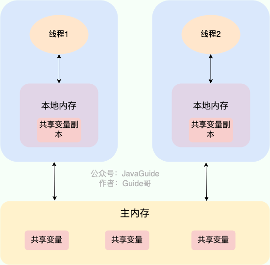
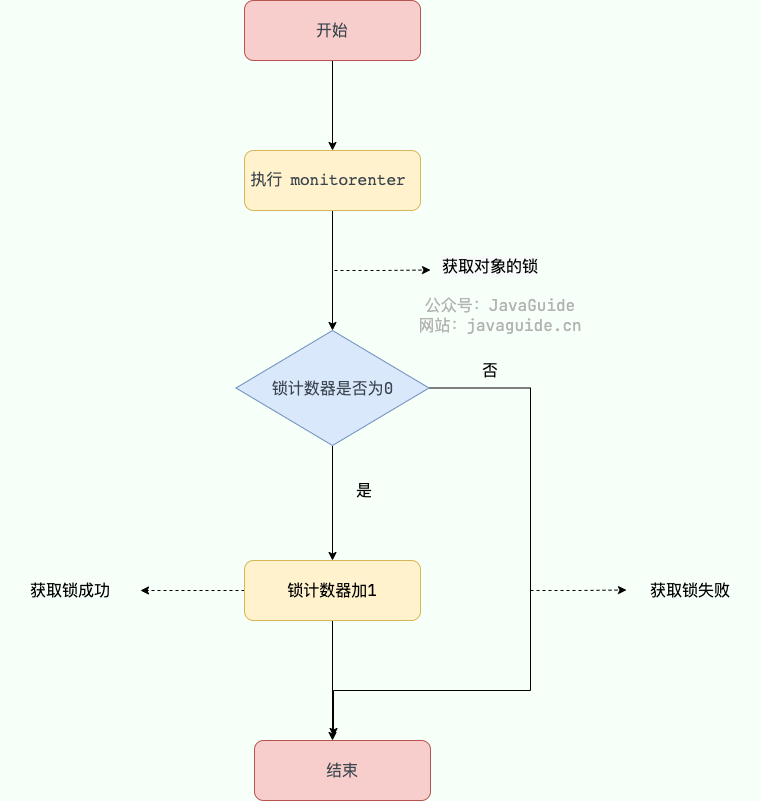
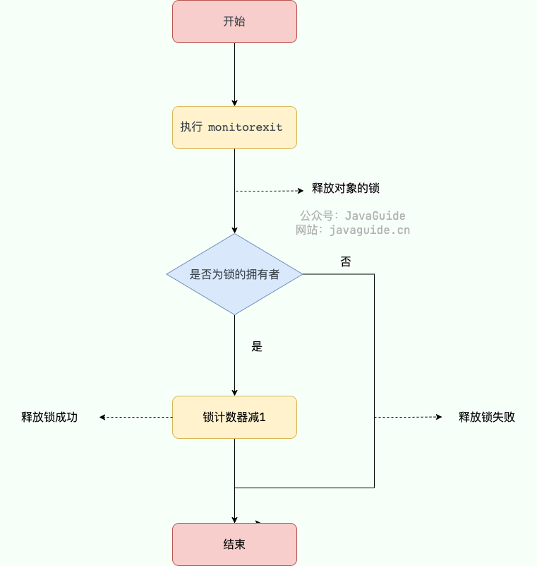
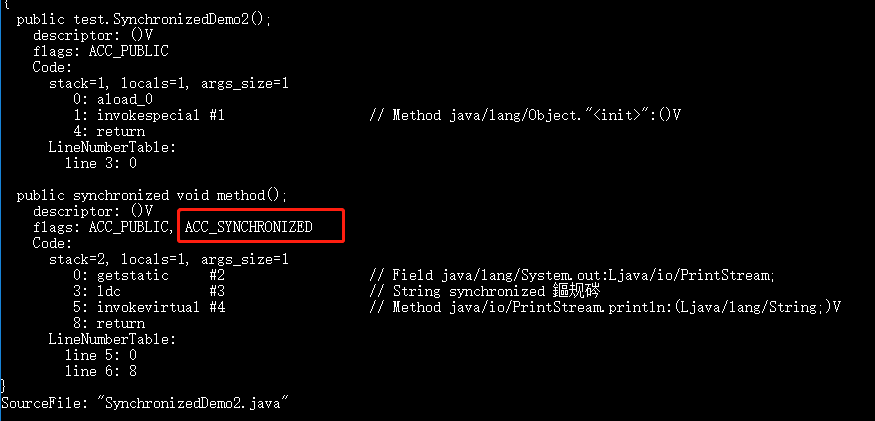
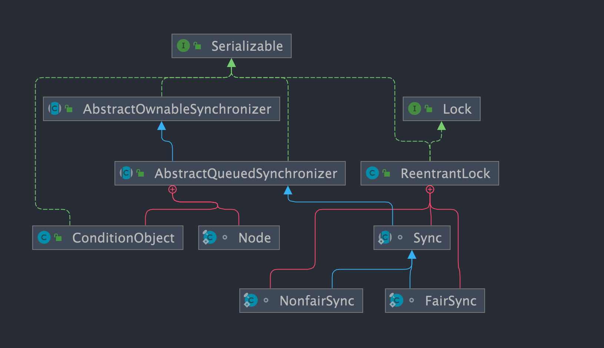
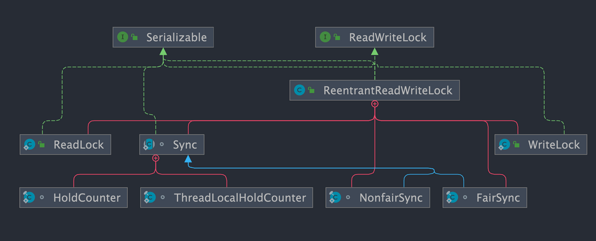

# 一、⭐️JMM(Java 内存模型)

JMM（Java 内存模型）相关的问题比较多，也比较重要，于是我单独抽了一篇文章来总结 JMM 相关的知识点和问题：[JMM（Java 内存模型）详解](./★重要知识点\03_JMM（Java内存模型）详解.md) 。


# 二、⭐️volatile 关键字
## 1、如何保证变量的可见性？

在 Java 中，`volatile` 关键字可以保证变量的可见性，如果我们将变量声明为 **`volatile`** ，这就指示 JVM，这个变量是共享且不稳定的，每次使用它都到主存中进行读取。



`volatile` 关键字其实并非是 Java 语言特有的，在 C 语言里也有，它最原始的意义就是禁用 CPU 缓存。如果我们将一个变量使用 `volatile` 修饰，这就指示 编译器，这个变量是共享且不稳定的，每次使用它都到主存中进行读取。

`volatile` 关键字能**保证**数据的 **可见性**，但**不能保证**数据的 **原子性**。`synchronized` 关键字两者都能保证。

> 这句话的核心在于：**“一个线程对共享变量的修改，其他线程能不能看到（可见性）” 和 “操作是不是一步完成不会被打断（原子性）” 是两回事。**
>
> ### 一、volatile：保证可见性，但不保证原子性
>
> #### ✅ 示例：计数器问题
>
> ```java
> class Counter {
>     volatile int count = 0;
> 
>     public void increment() {
>         count++;   // 非原子操作！
>     }
> }
> ```
>
> 假设有 10 个线程，每个线程执行 1000 次 `increment()`：
>
> ```java
> Counter counter = new Counter();
> 
> for (int i = 0; i < 10; i++) {
>     new Thread(() -> {
>         for (int j = 0; j < 1000; j++) {
>             counter.increment();
>         }
>     }).start();
> }
> ```
>
> ❗以为结果是：
>
> ```java
> 10000
> ```
>
> ❗实际可能是：
>
> ```java
> 8732 / 9210 / 9988（不确定）
> ```
>
> #### 🔍 为什么 volatile 不行？
>
> 因为：
>
> ```java
> count++;
> ```
>
> **实际上是 3 步操作：**
>
> 1. 读取 count
> 2. +1
> 3. 写回 count
>
> 👉 线程A和线程B可能这样执行：
>
> ```java
> 线程A读取 count = 0
> 线程B读取 count = 0
> 线程A写回 count = 1
> 线程B写回 count = 1
> ```
>
> 💥 **结果丢失了一次加法**
>
> #### ✅ volatile 能保证什么？
>
> - 每次读取都是**最新值（主内存）**
> - 不会用线程缓存的旧值
>
> 👉 但它**无法阻止多个线程同时修改**
>
> 
>
> ### 二、synchronized：同时保证可见性 + 原子性
>
> #### ✅ 改造上面的代码
>
> ```java
> class Counter {
>     int count = 0;
> 
>     public synchronized void increment() {
>         count++;
>     }
> }
> ```
>
> #### 🔒 synchronized 做了什么？
>
> ##### 1️⃣ 原子性保证
>
> 同一时间：
>
> 👉 **只能有一个线程进入 increment() 方法**
>
> ```
> 线程A执行完 → 线程B才能进
> ```
>
> ➡️ 不会出现“同时修改”的问题
>
> ------
>
> ##### 2️⃣ 可见性保证
>
> - 线程进入 synchronized 时：读取主内存最新值
>
> - 线程退出 synchronized 时：刷新到主内存
>
>   > 👉 **“synchronized中的变量都会读主内存”** 吗？
>   >
>   > - **进入 synchronized 时，会清空工作内存，从主内存重新读取 共享变量**
>   > - **退出 synchronized 时，会把修改刷新回主内存**
>   >
>   > 所以结果表现为：
>   >
>   > ✅ 能看到“最新值”（可见性）
>   > 但❗不是“每次读取变量都直接访问主内存”
>
> ➡️ 所有线程看到的都是最新结果

## 2、如何禁止指令重排序？

**在 Java 中，`volatile` 关键字除了可以保证变量的可见性，还有一个重要的作用就是防止 JVM 的指令重排序。** 如果我们将变量声明为 **`volatile`** ，在对这个变量进行读写操作的时候，会通过插入特定的 **内存屏障** 的方式来禁止指令重排序。

在 Java 中，`Unsafe` 类提供了三个开箱即用的内存屏障相关的方法，屏蔽了操作系统底层的差异：

```java
public native void loadFence();
public native void storeFence();
public native void fullFence();
```

理论上来说，通过这个三个方法也可以实现和`volatile`禁止重排序一样的效果，只是会麻烦一些。

### 2.1、4 种内存屏障类型

JMM（Java 内存模型）定义了 4 种内存屏障（Memory Barrier），用于控制特定条件下的指令重排序和内存可见性：

| 屏障类型       | 指令示例                     | 说明                                                         |
| -------------- | ---------------------------- | ------------------------------------------------------------ |
| **LoadLoad**   | `Load1; LoadLoad; Load2`     | 保证 `Load1` 的读取操作在 `Load2` 及其后续读取操作之前完成   |
| **StoreStore** | `Store1; StoreStore; Store2` | 保证 `Store1` 的写入操作对其他处理器可见（刷新到内存），先于 `Store2` 及其后续写入操作 |
| **LoadStore**  | `Load1; LoadStore; Store2`   | 保证 `Load1` 的读取操作在 `Store2` 及其后续写入操作刷新到内存之前完成 |
| **StoreLoad**  | `Store1; StoreLoad; Load2`   | 保证 `Store1` 的写入操作对其他处理器可见，先于 `Load2` 及其后续读取操作。`StoreLoad` 屏障的开销是四种屏障中最大的，它同时具有其他三种屏障的效果，因此也称为 **全能屏障（Full Barrier）** |

### 2.2、volatile 读写操作的内存屏障插入策略

JMM 针对编译器制定了 `volatile` 读写操作的内存屏障插入策略，以确保在任意处理器平台上都能获得正确的 volatile 内存语义：

**volatile 写 操作的内存屏障插入策略：**

在每个 volatile 写操作的 **前面** 插入一个 `StoreStore` 屏障，在 **后面** 插入一个 `StoreLoad` 屏障。

```
StoreStore 屏障
volatile 写操作
StoreLoad 屏障
```

- 前面的 `StoreStore` 屏障：保证在 volatile 写之前，其前面的所有普通写操作已经对任意处理器可见（刷新到主内存）。

- 后面的 `StoreLoad` 屏障：保证 volatile 写之后，其写入的值对后续的 volatile 读/写操作可见。这是开销最大的屏障，但也是最关键的——它避免了 volatile 写与后面可能有的 volatile 读/写操作发生重排序。

**volatile 读 操作的内存屏障插入策略：**

在每个 volatile 读操作的 **后面** 插入一个 `LoadLoad` 屏障和一个 `LoadStore` 屏障。

```
volatile 读操作
LoadLoad 屏障
LoadStore 屏障
```

- `LoadLoad` 屏障：保证 volatile 读之后的普通读操作不会被重排序到 volatile 读之前。
- `LoadStore` 屏障：保证 volatile 读之后的普通写操作不会被重排序到 volatile 读之前。

这样一来，volatile 写-读的组合就建立了一个类似于 **锁的释放-获取** 的语义：**volatile 写操作之前的所有操作结果，对于后续对该 volatile 变量的读操作之后的所有操作都是可见的。**

下面我以一个常见的面试题为例讲解一下 `volatile` 关键字禁止指令重排序的效果。

面试中面试官经常会说：“单例模式了解吗？来给我手写一下！给我解释一下双重检验锁方式实现单例模式的原理呗！

**双重校验（DCL）锁实现对象单例（线程安全）**：

```java
public class Singleton {

    private volatile static Singleton uniqueInstance;

    private Singleton() {
    }

    public static Singleton getUniqueInstance() {
       //先判断对象是否已经实例过，没有实例化过才进入加锁代码
        if (uniqueInstance == null) {
            //类对象加锁
            synchronized (Singleton.class) {
                if (uniqueInstance == null) {
                    uniqueInstance = new Singleton();
                }
            }
        }
        return uniqueInstance;
    }
}
```

`uniqueInstance` 采用 `volatile` 关键字修饰也是很有必要的， `uniqueInstance = new Singleton();` 这段代码其实是分为三步执行：

1. 为 `uniqueInstance` 分配内存空间
2. 初始化 `uniqueInstance`
3. 将 `uniqueInstance` 指向分配的内存地址

但是由于 JVM 具有指令重排的特性，执行顺序有可能变成 1->3->2。指令重排在单线程环境下不会出现问题，但是在多线程环境下会导致一个线程获得还没有初始化的实例。例如，线程 T1 执行了 1 和 3，此时 T2 调用 `getUniqueInstance`() 后发现 `uniqueInstance` 不为空，因此返回 `uniqueInstance`，但此时 `uniqueInstance` 还未被初始化。

**❗问题本质是：** 👉 **“对象引用已经对其他线程可见，但对象还没初始化完”**

> ## 对于多线程中创建对象的思考
>
> ### 一、结论
>
> 👉 **多线程“创建对象”本身不危险，危险的是“对象是否被共享（发布）”**
>
> ### 二、分两种情况看（这是核心）
>
> #### ✅ 情况1：多线程各自创建，各自使用（安全）
>
> ```java
> new Thread(() -> {
>     Singleton s = new Singleton();
>     // 只在当前线程用
> }).start();
> ```
>
> 👉 即使发生指令重排：
>
> ```
> 1. 分配内存
> 3. 引用指向内存
> 2. 初始化对象
> ```
>
> 📌 也没问题，因为：
>
> - 这个对象**没有被共享**
> - 没有其他线程能访问它
>
> ✔️ 所以不会出现“别人拿到半初始化对象”
>
> #### ❗情况2：创建后被其他线程访问（危险）
>
> ```java
> class Demo {
>     static Singleton instance;
> 
>     static void create() {
>         instance = new Singleton(); // ⚠️ 可能发生重排
>     }
> 
>     static void use() {
>         if (instance != null) {
>             instance.doSomething(); // 💥 可能出问题
>         }
>     }
> }
> ```
>
> ### 三、关键点总结（非常重要）
>
> 👉 **是否需要 volatile，不取决于“是不是多线程创建”**
>
> 👉 而取决于：
>
> ```
> 对象有没有被“发布（共享）”
> ```
>
> ### ⚠四、什么叫“发布”（面试高频点）
>
> 👉 一个对象被其他线程访问，就叫发布：
>
> ### 常见发布方式：
>
> - 赋值给 `static` 变量 ✅
> - 赋值给成员变量（被多个线程访问）✅
> - 放进集合（如 List / Map）✅
> - 作为方法返回值返回 ✅
>
> ### 五、什么时候必须考虑 volatile / synchronized？
>
> 👉 满足这三个条件：
>
> ```
> 1. 多线程环境
> 2. 延迟初始化（不是一次性初始化）
> 3. 对象被共享（发布）
> ```
>
> ✔️ 就必须考虑：
>
> - `volatile`
> - `synchronized`
> - 或其他安全发布方式
>
> ### 六、进阶
>
> 除了 `volatile` 和 `synchronized`，还有几种**天然安全发布方式**：
>
> - final 字段（有初始化安全性）
> - 静态初始化（类加载阶段）
> - 枚举单例
> - 线程安全容器（如 ConcurrentHashMap）

### 2.3、从内存屏障角度理解 DCL 必须使用 volatile

上面从指令重排序的角度解释了 DCL（**Double Check Lock** 双重检查锁定） 单例中 `uniqueInstance` 为什么需要 `volatile` 修饰。下面从内存屏障的角度进一步分析 `volatile` 是如何解决这个问题的。

`uniqueInstance = new Singleton();` 这行代码的三个步骤（分配内存、初始化对象、赋值引用）中，如果不加 `volatile`，步骤 2 和步骤 3 可能会被重排序为 1→3→2。加了 `volatile` 之后，由于 `uniqueInstance` 是 volatile 变量，对它的写操作（步骤 3：将引用赋值给 `uniqueInstance`）会按照前面介绍的 volatile 写的内存屏障插入策略来处理：

1. 在 volatile 写 **之前** 插入 `StoreStore` 屏障：保证步骤 1（分配内存）和步骤 2（初始化对象）的写操作在步骤 3（赋值引用）之前完成，**禁止了步骤 2 和步骤 3 的重排序**。
2. 在 volatile 写 **之后** 插入 `StoreLoad` 屏障：保证步骤 3 的写入结果对其他线程立即可见。

这样，当线程 T2 读取 `uniqueInstance` 时（volatile 读），如果发现 `uniqueInstance != null`，那么可以保证该对象一定已经被完全初始化了。

## 3、volatile 与 happens-before 的关系

JMM 中的 happens-before 原则是判断数据是否存在竞争、线程是否安全的重要依据。`volatile` 变量的读写操作与 happens-before 原则有着密切的关系。

> 关于 happens-before 原则的详细介绍，可以参考 [JMM（Java 内存模型）详解](https://javaguide.cn/java/concurrent/jmm.html) 这篇文章。

happens-before 原则中与 `volatile` 直接相关的是 **volatile 变量规则**：

> **对一个 volatile 变量的写操作 happens-before 于后续对该 volatile 变量的读操作。**

也就是说，如果线程 A 写入了一个 volatile 变量，线程 B 随后读取了同一个 volatile 变量，那么线程 A 在写入 volatile 变量之前所做的所有修改（包括对非 volatile 变量的修改），对线程 B 都是可见的。

这个规则配合 happens-before 的 **传递性规则**（如果 A happens-before B，B happens-before C，那么 A happens-before C），可以实现一种轻量级的线程间通信。下面通过一个示例来说明：

```java
public class VolatileHappensBeforeDemo {
    private int a = 0;
    private int b = 0;
    private volatile boolean flag = false;

    // 线程 A 执行
    public void writer() {
        a = 1;           // 操作1：普通写
        b = 2;           // 操作2：普通写
        flag = true;     // 操作3：volatile 写
    }

    // 线程 B 执行
    public void reader() {
        if (flag) {      // 操作4：volatile 读
            int x = a;   // 操作5：普通读，x 一定等于 1
            int y = b;   // 操作6：普通读，y 一定等于 2
            System.out.println("x=" + x + ", y=" + y);
        }
    }
}
```

上面代码中，happens-before 关系链如下：

1. 操作1、操作2 happens-before 操作3（**程序顺序规则**：同一线程中，前面的操作 happens-before 后面的操作）
2. 操作3 happens-before 操作4（**volatile 变量规则**：volatile 写 happens-before volatile 读）
3. 操作4 happens-before 操作5、操作6（**程序顺序规则**）

根据 **传递性**：操作1、操作2 happens-before 操作5、操作6。

因此，当线程 B 在操作4 读取到 `flag == true` 时，线程 A 在操作3 之前对 `a` 和 `b` 的修改对线程 B 一定是可见的。这里的关键在于：**volatile 变量的写-读操作，不仅保证了 volatile 变量本身的可见性，还通过 happens-before 的传递性"顺带"保证了其前后普通变量的可见性。**

这也解释了为什么在实际开发中，`volatile` 经常被用作 **状态标志位**（如上面例子中的 `flag`），它可以在不使用锁的情况下，安全地在线程间传递状态信息，同时保证相关数据的可见性。

## 4、volatile 可以保证原子性么？

**`volatile` 关键字能保证变量的可见性，但不能保证对变量的操作是原子性的。**

我们通过下面的代码即可证明：

```java
public class VolatileAtomicityDemo {
    public volatile static int inc = 0;

    public void increase() {
        inc++;
    }

    public static void main(String[] args) throws InterruptedException {
        ExecutorService threadPool = Executors.newFixedThreadPool(5);
        VolatileAtomicityDemo volatileAtomicityDemo = new VolatileAtomicityDemo();
        for (int i = 0; i < 5; i++) {
            threadPool.execute(() -> {
                for (int j = 0; j < 500; j++) {
                    volatileAtomicityDemo.increase();
                }
            });
        }
        // 等待1.5秒，保证上面程序执行完成
        Thread.sleep(1500);
        System.out.println(inc);
        threadPool.shutdown();
    }
}
```

正常情况下，运行上面的代码理应输出 `2500`。但你真正运行了上面的代码之后，你会发现每次输出结果都小于 `2500`。

为什么会出现这种情况呢？不是说好了，`volatile` 可以保证变量的可见性嘛！

也就是说，如果 `volatile` 能保证 `inc++` 操作的原子性的话。每个线程中对 `inc` 变量自增完之后，其他线程可以立即看到修改后的值。5 个线程分别进行了 500 次操作，那么最终 inc 的值应该是 5*500=2500。

很多人会误认为自增操作 `inc++` 是原子性的，实际上，`inc++` 其实是一个复合操作，包括三步：

1. 读取 inc 的值。
2. 对 inc 加 1。
3. 将 inc 的值写回内存。

`volatile` 是无法保证这三个操作是具有原子性的，有可能导致下面这种情况出现：

1. 线程 1 对 `inc` 进行读取操作之后，还未对其进行修改。线程 2 又读取了 `inc`的值并对其进行修改（+1），再将`inc` 的值写回内存。
2. 线程 2 操作完毕后，线程 1 对 `inc`的值进行修改（+1），再将`inc` 的值写回内存。

这也就导致两个线程分别对 `inc` 进行了一次自增操作后，`inc` 实际上只增加了 1。

其实，如果想要保证上面的代码运行正确也非常简单，利用 `synchronized`、`Lock`或者`AtomicInteger`都可以。

使用 `synchronized` 改进：

```java
public synchronized void increase() {
    inc++;
}
```

使用 `AtomicInteger` 改进：

```java
public AtomicInteger inc = new AtomicInteger();

public void increase() {
    inc.getAndIncrement();
}
```

使用 `ReentrantLock` 改进：

```java
Lock lock = new ReentrantLock();
public void increase() {
    lock.lock();
    try {
        inc++;
    } finally {
        lock.unlock();
    }
}
```


# ⭐️三、乐观锁和悲观锁

## 1、什么是悲观锁？

悲观锁总是假设最坏的情况，认为共享资源每次被访问的时候就会出现问题(比如共享数据被修改)，所以每次在获取资源操作的时候都会上锁，这样其他线程想拿到这个资源就会阻塞直到锁被上一个持有者释放。也就是说，**共享资源每次只给一个线程使用，其它线程阻塞，用完后再把资源转让给其它线程**。

像 Java 中`synchronized`和`ReentrantLock`等独占锁就是悲观锁思想的实现。

```java
public void performSynchronisedTask() {
    synchronized (this) {
        // 需要同步的操作
    }
}

private Lock lock = new ReentrantLock();
lock.lock();
try {
   // 需要同步的操作
} finally {
    lock.unlock();
}
```

高并发的场景下，激烈的锁竞争会造成线程阻塞，大量阻塞线程会导致系统的上下文切换，增加系统的性能开销。并且，悲观锁还可能会存在死锁问题，影响代码的正常运行。

> 👉 **频繁上下文切换，并不是因为“抢锁失败”本身**
>  👉 而是因为：线程在“阻塞 ↔ 就绪 ↔ 运行”之间反复切换
>
> ## 一、关键过程拆解（重点）
>
> 1️⃣ 锁释放
>
> ```java
> 线程A 释放锁
> ```
>
> 2️⃣ 操作系统 / JVM 唤醒等待线程
>
> ```
> 线程B、C、D 被唤醒 → 进入 RUNNABLE（就绪态）
> ```
>
> ⚠️ 注意：
>
> 👉 **不是只唤醒一个，而是可能唤醒多个（甚至全部）**
>
> 3️⃣ CPU 调度开始（重点来了）
>
> CPU 不知道谁能抢到锁，它只能：
>
> ```
> 调度 B → 运行
> 调度 C → 运行
> 调度 D → 运行
> ```
>
> 👉 **这一步就已经产生上下文切换了！**
>
> ## 二、为什么会频繁切换？（核心原因）
>
> ### 🔥 原因1：线程被唤醒后必须“试一下”
>
> 线程被唤醒后：
>
> - 不会直接知道自己拿不到锁
> - 必须**真正运行一下，尝试获取锁**
>
> ```
> B 被调度 → 尝试抢锁 → 失败 → 再阻塞
> ```
>
> 👉 这个过程是：
>
> ```
> 阻塞 → 就绪 → 运行 → 阻塞
> ```
>
> ⚠️ 每一步都可能触发上下文切换！
>
> ### 🔥 原因2：操作系统是“时间片轮转”
>
> CPU 调度不是只跑一个线程：
>
> ```
> B 运行一会儿 → 时间片用完 → 切到 C
> C 再运行 → 切到 D
> ```
>
> 👉 即使他们都抢不到锁，也会被调度执行
>
> ------
>
> ### 🔥 原因3：抢锁失败会再次进入阻塞
>
> ```
> B 抢锁失败 → park / 阻塞
> ```
>
> 👉 又发生一次状态切换：
>
> ```
> RUNNING → BLOCKED
> ```
>
> ## 四、完整链路（你要掌握这个）
>
> 一次“无效竞争”实际发生了什么：
>
> ```
> 1. B 被唤醒（BLOCKED → RUNNABLE）   ✅ 切换
> 2. CPU 调度 B（RUNNABLE → RUNNING）  ✅ 切换
> 3. B 抢锁失败（RUNNING → BLOCKED）   ✅ 切换
> ```
>
> 👉 一个线程失败一次，就可能产生 **2~3 次上下文切换**

## 2、什么是乐观锁？

乐观锁总是假设最好的情况，认为共享资源每次被访问的时候不会出现问题，线程可以不停地执行，无需加锁也无需等待，只是在提交修改的时候去验证对应的资源（也就是数据）是否被其它线程修改了（具体方法可以使用版本号机制或 CAS 算法）。

在 Java 中`java.util.concurrent.atomic`包下面的原子变量类（比如`AtomicInteger`、`LongAdder`）就是使用了乐观锁的一种实现方式 **CAS** 实现的。


```java
// LongAdder 在高并发场景下会比 AtomicInteger 和 AtomicLong 的性能更好
// 代价就是会消耗更多的内存空间（空间换时间）
LongAdder sum = new LongAdder();
sum.increment();
```

高并发的场景下，乐观锁相比悲观锁来说，不存在锁竞争造成线程阻塞，也不会有死锁的问题，在性能上往往会更胜一筹。但是，如果冲突频繁发生（写占比非常多的情况），会频繁失败和重试，这样同样会非常影响性能，导致 CPU 飙升。

不过，大量失败重试的问题也是可以解决的，像我们前面提到的 `LongAdder`以空间换时间的方式就解决了这个问题。

理论上来说：

- 悲观锁通常多用于写比较多的情况（多写场景，竞争激烈），这样可以避免频繁失败和重试影响性能，悲观锁的开销是固定的。不过，如果乐观锁解决了频繁失败和重试这个问题的话（比如`LongAdder`），也是可以考虑使用乐观锁的，要视实际情况而定。
- 乐观锁通常多用于写比较少的情况（多读场景，竞争较少），这样可以避免频繁加锁影响性能。不过，乐观锁主要针对的对象是单个共享变量（参考`java.util.concurrent.atomic`包下面的原子变量类）。

## 3、如何实现乐观锁

乐观锁一般会使用版本号机制或 CAS 算法实现，**CAS 算法**相对来说**更多**一些，这里需要格外注意。

### 3.1、版本号机制

一般是在数据表中加上一个数据版本号 `version` 字段，表示数据被修改的次数。**当数据被修改时，`version` 值会加一**。当线程 A 要更新数据值时，在读取数据的同时也会读取 `version` 值，在提交更新时，若刚才读取到的 version 值为当前数据库中的 `version` 值相等时才更新，否则重试更新操作，直到更新成功。

**举一个简单的例子**：假设数据库中帐户信息表中有一个 version 字段，当前值为 1 ；而当前帐户余额字段（ `balance` ）为 $100 。

1. 操作员 A 此时将其读出（ `version`=1 ），并从其帐户余额中扣除 $50（ $100-$50 ）。

2. 在操作员 A 操作的过程中，操作员 B 也读入此用户信息（ `version`=1 ），并从其帐户余额中扣除 $20 （ $100-$20 ）。

3. 操作员 A 完成了修改工作，将数据版本号（ `version`=1 ），连同帐户扣除后余额（ `balance`=$50 ），提交至数据库更新，此时由于提交数据版本等于数据库记录当前版本，数据被更新，数据库记录 `version` 更新为 2 。

   > ```sql
   > UPDATE table
   > SET balance = 50, version = version + 1
   > WHERE id = 1 AND version = 1;
   > ```
   >
   > 

4. 操作员 B 完成了操作，也将版本号（ `version`=1 ）试图向数据库提交数据（ `balance`=$80 ），但此时比对数据库记录版本时发现，操作员 B 提交的数据版本号为 1 ，数据库记录当前版本也为 2 ，不满足 “ 提交版本必须等于当前版本才能执行更新 “ 的乐观锁策略，因此，操作员 B 的提交被驳回。

   > ```sql
   > UPDATE table
   > SET balance = 80, version = version + 1
   > WHERE id = 1 AND version = 1;
   > ```
   >
   > 

这样就避免了操作员 B 用基于 `version`=1 的旧数据修改的结果覆盖操作员 A 的操作结果的可能。

### 3.2、CAS 算法

CAS 的全称是 **Compare And Swap（比较与交换）** ，用于实现乐观锁，被广泛应用于各大框架中。CAS 的思想很简单，就是用一个预期值和要更新的变量值进行比较，两值相等才会进行更新。

CAS 是一个原子操作，底层依赖于一条 CPU 的原子指令。

> **原子操作** 即最小不可拆分的操作，也就是说操作一旦开始，就不能被打断，直到操作完成。

CAS 涉及到三个操作数：

- **V**：要更新的变量值(Var)
- **E**：预期值(Expected)
- **N**：拟写入的新值(New)

当且仅当 V 的值等于 E 时，CAS 通过原子方式用新值 N 来更新 V 的值。如果不等，说明已经有其它线程更新了 V，则当前线程放弃更新。

**举一个简单的例子**：线程 A 要修改变量 i 的值为 6，i 原值为 1（V = 1，E=1，N=6，假设不存在 ABA 问题）。

1. i 与 1 进行比较，如果相等， 则说明没被其他线程修改，可以被设置为 6 。
2. i 与 1 进行比较，如果不相等，则说明被其他线程修改，当前线程放弃更新，CAS 操作失败。

当多个线程同时使用 CAS 操作一个变量时，只有一个会胜出，并成功更新，其余均会失败，但失败的线程并不会被挂起，仅是被告知失败，并且允许再次尝试，当然也允许失败的线程放弃操作。

Java 语言并没有直接实现 CAS，CAS 相关的实现是通过 C++ 内联汇编的形式实现的（JNI 调用）。因此， CAS 的具体实现和操作系统以及 CPU 都有关系。

`sun.misc`包下的`Unsafe`类提供了`compareAndSwapObject`、`compareAndSwapInt`、`compareAndSwapLong`方法来实现的对`Object`、`int`、`long`类型的 CAS 操作

```java
/**
  *  CAS
  * @param o         包含要修改field的对象
  * @param offset    对象中某field的偏移量
  * @param expected  期望值
  * @param update    更新值
  * @return          true | false
  */
public final native boolean compareAndSwapObject(Object o, long offset,  Object expected, Object update);

public final native boolean compareAndSwapInt(Object o, long offset, int expected,int update);

public final native boolean compareAndSwapLong(Object o, long offset, long expected, long update);
```

关于 `Unsafe` 类的详细介绍可以看之前总结的文档：[Java 魔法类 Unsafe 详解 ](../01_Java基础/★重要知识点/07_Java魔法类Unsafe.md)

## 4、Java 中 CAS 是如何实现的？

在 Java 中，实现 CAS（Compare-And-Swap, 比较并交换）操作的一个关键类是`Unsafe`。

`Unsafe`类位于`sun.misc`包下，是一个提供低级别、不安全操作的类。由于其强大的功能和潜在的危险性，它通常用于 JVM 内部或一些需要极高性能和底层访问的库中，而不推荐普通开发者在应用程序中使用。关于 `Unsafe`类的详细介绍，可以阅读这篇文章：📌[Java 魔法类 Unsafe 详解 ](../01_Java基础/★重要知识点/07_Java魔法类Unsafe.md)。

`sun.misc`包下的`Unsafe`类提供了`compareAndSwapObject`、`compareAndSwapInt`、`compareAndSwapLong`方法来实现的对`Object`、`int`、`long`类型的 CAS 操作：

```java
/**
 * 以原子方式更新对象字段的值。
 *
 * @param o        要操作的对象
 * @param offset   对象字段的内存偏移量
 * @param expected 期望的旧值
 * @param x        要设置的新值
 * @return 如果值被成功更新，则返回 true；否则返回 false
 */
boolean compareAndSwapObject(Object o, long offset, Object expected, Object x);

/**
 * 以原子方式更新 int 类型的对象字段的值。
 */
boolean compareAndSwapInt(Object o, long offset, int expected, int x);

/**
 * 以原子方式更新 long 类型的对象字段的值。
 */
boolean compareAndSwapLong(Object o, long offset, long expected, long x);
```

`Unsafe`类中的 CAS 方法是`native`方法。`native`关键字表明这些方法是用本地代码（通常是 C 或 C++）实现的，而不是用 Java 实现的。这些方法直接调用底层的硬件指令来实现原子操作。也就是说，Java 语言并没有直接用 Java 实现 CAS，而是通过 C++ 内联汇编的形式实现的（通过 JNI 调用）。因此，CAS 的具体实现与操作系统以及 CPU 密切相关。

`java.util.concurrent.atomic` 包提供了一些用于原子操作的类。这些类利用底层的原子指令，确保在多线程环境下的操作是线程安全的。


关于这些 Atomic 原子类的介绍和使用，可以阅读这篇文章：[Atomic 原子类总结](./★重要知识点/08_Atomic原子类总结.md)。`AtomicInteger`是 Java 的原子类之一，主要用于对 `int` 类型的变量进行原子操作，它利用`Unsafe`类提供的低级别原子操作方法实现无锁的线程安全性。

下面，我们通过解读`AtomicInteger`的核心源码（JDK1.8），来说明 Java 如何使用`Unsafe`类的方法来实现原子操作。

`AtomicInteger`核心源码如下：

```java
// 获取 Unsafe 实例
private static final Unsafe unsafe = Unsafe.getUnsafe();
private static final long valueOffset;

static {
    try {
        // 获取“value”字段在AtomicInteger类中的内存偏移量
        valueOffset = unsafe.objectFieldOffset
            (AtomicInteger.class.getDeclaredField("value"));
    } catch (Exception ex) { throw new Error(ex); }
}
// 确保“value”字段的可见性
private volatile int value;

// 如果当前值等于预期值，则原子地将值设置为newValue
// 使用 Unsafe#compareAndSwapInt 方法进行CAS操作
public final boolean compareAndSet(int expect, int update) {
    return unsafe.compareAndSwapInt(this, valueOffset, expect, update);
}

// 原子地将当前值加 delta 并返回旧值
public final int getAndAdd(int delta) {
    return unsafe.getAndAddInt(this, valueOffset, delta);
}

// 原子地将当前值加 1 并返回加之前的值（旧值）
// 使用 Unsafe#getAndAddInt 方法进行CAS操作。
public final int getAndIncrement() {
    return unsafe.getAndAddInt(this, valueOffset, 1);
}

// 原子地将当前值减 1 并返回减之前的值（旧值）
public final int getAndDecrement() {
    return unsafe.getAndAddInt(this, valueOffset, -1);
}
```

`Unsafe#getAndAddInt`源码：

```java
// 原子地获取并增加整数值
public final int getAndAddInt(Object o, long offset, int delta) {
    int v;
    do {
        // 以 volatile 方式获取对象 o 在内存偏移量 offset 处的整数值
        v = getIntVolatile(o, offset);
    } while (!compareAndSwapInt(o, offset, v, v + delta));
    // 返回旧值
    return v;
}
```

可以看到，`getAndAddInt` 使用了 `do-while` 循环：在`compareAndSwapInt`操作失败时，会不断重试直到成功。也就是说，`getAndAddInt`方法会通过 `compareAndSwapInt` 方法来尝试更新 `value` 的值，如果更新失败（当前值在此期间被其他线程修改），它会重新获取当前值并再次尝试更新，直到操作成功。

由于 CAS 操作可能会因为并发冲突而失败，因此通常会与`while`循环搭配使用，在失败后不断重试，直到操作成功。这就是 **自旋锁机制** 。

> **自旋锁（Spin Lock）**本质上是一种**忙等待的锁**：
> 👉 **线程拿不到锁时，不进入阻塞状态，而是在原地循环（自旋）不断尝试获取锁。**
>
> ## 一、先说人话版本
>
> 假设有一把锁：
>
> - ❌ 传统锁：拿不到 → **睡觉（阻塞）**
> - ✅ 自旋锁：拿不到 → **原地疯狂尝试（while循环）**
>
> ```
> while (锁没拿到) {
>     再试一次
> }
> ```
>
> 👉 这就是“自旋”
>
> ## 二、一个简单代码示例
>
> 用 CAS（比较并交换）实现一个自旋锁：
>
> ```
> import java.util.concurrent.atomic.AtomicReference;
> 
> public class SpinLock {
> 
>     private AtomicReference<Thread> owner = new AtomicReference<>();
> 
>     public void lock() {
>         Thread current = Thread.currentThread();
>         // 自旋
>         while (!owner.compareAndSet(null, current)) {
>             // 什么也不做，一直循环
>         }
>     }
> 
>     public void unlock() {
>         Thread current = Thread.currentThread();
>         owner.compareAndSet(current, null);
>     }
> }
> ```
>
> 👉 核心就是这一句：
>
> ```java
> while (!compareAndSet(...)) {}
> ```
>
> ## 三、为什么会有自旋锁？
>
> 因为“线程阻塞”其实很贵：
>
> ### ❌ 阻塞锁的成本
>
> - 线程挂起（操作系统介入）
> - 上下文切换（CPU切换线程）
> - 再唤醒
>
> 👉 这些操作很耗时间
>
> ------
>
> ### ✅ 自旋锁的思路
>
> 👉 如果锁**很快就会释放**：
>
> 那还不如：
>
> ```
> 我就在这等一会儿（自旋）
> ```
>
> 👉 可能几次循环就拿到了，反而更快
>
> ------
>
> ## 四、适用场景（重点）
>
> 自旋锁适合：
>
> ### ✔ 锁持有时间很短
>
> ```
> 比如：只改一个变量
> ```
>
> ### ✔ 并发冲突不激烈
>
> ```
> 不会很多线程一起抢
> ```
>
> ------
>
> ## 五、不适合的场景
>
> ### ❌ 锁时间很长
>
> ```
> 线程A拿锁 1秒
> 线程B自旋1秒 → CPU直接被打满
> ```
>
> ------
>
> ### ❌ 高并发
>
> ```
> 100个线程一起 while 死循环
> ```
>
> 👉 CPU直接爆炸
>
> ## 六、和 synchronized 的区别
>
> | 对比     | 自旋锁     | synchronized |
> | -------- | ---------- | ------------ |
> | 拿不到锁 | 一直循环   | 阻塞         |
> | CPU消耗  | 高         | 低           |
> | 响应速度 | 快（短锁） | 慢一点       |
> | 适用场景 | 短时间锁   | 长时间锁     |
>
> ## 七、JVM 其实已经帮你用了
>
> 你以为你没用自旋锁？其实你用了 👇
>
> 👉 在现代 JDK 中：
>
> ```
> synchronized
> ```
>
> 内部就有：
>
> - **自旋锁**
> - **自适应自旋**
> - **锁升级机制**
>
> 👉 JVM 会判断：
>
> ```
> 这个锁会不会很快释放？
> ```
>
> 如果是：
>
> 👉 先自旋一会儿，不行再阻塞
>
> ## 八、自旋锁 vs 乐观锁
>
> 这两个很容易混：
>
> | 对比     | 自旋锁                  | 乐观锁     |
> | -------- | ----------------------- | ---------- |
> | 类型     | ⚠ **悲观锁** 的一种实现 | 乐观锁     |
> | 是否加锁 | 是                      | 否         |
> | 冲突处理 | 一直尝试                | 失败重试   |
> | 场景     | 多线程内存操作          | 数据库更新 |
>
> ## ⚠九、关键区别
>
> | 对比         | CAS（Atomic） | 自旋锁     |
> | ------------ | ------------- | ---------- |
> | 是否加锁     | ❌ 不加锁      | ✅ 加锁     |
> | 是否独占资源 | ❌ 否          | ✅ 是       |
> | 失败后       | 重试操作      | 等待锁释放 |
> | 思想         | 乐观锁        | 悲观锁     |
>
> ## 十、一句话总结（面试可用）
>
> - CAS 是一种无锁的原子操作机制，体现的是乐观锁思想；
> - 而自旋锁虽然使用 CAS 实现，但本质是对资源加锁并独占访问，只是采用忙等待代替阻塞，因此属于悲观锁的一种实现方式。

## 5、CAS 算法存在哪些问题？

ABA 问题是 CAS 算法最常见的问题。

### 5.1、ABA 问题

如果一个变量 V 初次读取的时候是 A 值，并且在准备赋值的时候检查到它仍然是 A 值，那我们就能说明它的值没有被其他线程修改过了吗？很明显是不能的，因为在这段时间它的值可能被改为其他值，然后又改回 A，那 CAS 操作就会误认为它从来没有被修改过。这个问题被称为 CAS 操作的 **"ABA"问题。**

ABA 问题的解决思路是在变量前面追加上**版本号或者时间戳**。JDK 1.5 以后的 `AtomicStampedReference` 类就是用来解决 ABA 问题的，其中的 `compareAndSet()` 方法就是首先检查当前引用是否等于预期引用，并且当前标志是否等于预期标志，如果全部相等，则以原子方式将该引用和该标志的值设置为给定的更新值。

```java
/*
* compareAndSet(
    旧值, 新值,
    旧版本号, 新版本号
)
*/
public boolean compareAndSet(V   expectedReference,
                             V   newReference,
                             int expectedStamp,
                             int newStamp) {
    Pair<V> current = pair;
    return
        expectedReference == current.reference &&
        expectedStamp == current.stamp &&
        ((newReference == current.reference &&
          newStamp == current.stamp) ||
         casPair(current, Pair.of(newReference, newStamp)));
}

```

> 案例代码（简化版无锁栈）
>
> ```java
> import java.util.concurrent.atomic.AtomicStampedReference;
> 
> public class LockFreeStack {
> 
>     static class Node {
>         int value;
>         Node next;
> 
>         Node(int value) {
>             this.value = value;
>         }
>     }
> 
>     private AtomicStampedReference<Node> top =
>             new AtomicStampedReference<>(null, 0);
> 
>     // 入栈
>     public void push(int value) {
>         Node newNode = new Node(value);
>         int[] stampHolder = new int[1];
> 
>         while (true) {
>             Node oldTop = top.get(stampHolder);
>             int oldStamp = stampHolder[0];
> 
>             newNode.next = oldTop;
> 
>             // CAS：同时比较节点和版本号
>             if (top.compareAndSet(oldTop, newNode, oldStamp, oldStamp + 1)) {
>                 return;
>             }
>         }
>     }
> 
>     // 出栈
>     public Integer pop() {
>         int[] stampHolder = new int[1];
> 
>         while (true) {
>             Node oldTop = top.get(stampHolder);
>             int oldStamp = stampHolder[0];
> 
>             if (oldTop == null) {
>                 return null;
>             }
> 
>             Node newTop = oldTop.next;
> 
>             // CAS：同时检查“值 + 版本号”
>             if (top.compareAndSet(oldTop, newTop, oldStamp, oldStamp + 1)) {
>                 return oldTop.value;
>             }
>         }
>     }
> }
> ```
>
> 

### 5.2、循环时间长开销大

CAS 经常会用到自旋操作来进行重试，也就是不成功就一直循环执行直到成功。如果长时间不成功，会给 CPU 带来非常大的执行开销。

如果 JVM 能够支持处理器提供的`pause`指令，那么自旋操作的效率将有所提升。`pause`指令有两个重要作用：

1. **延迟流水线执行指令**：`pause`指令可以延迟指令的执行，从而减少 CPU 的资源消耗。具体的延迟时间取决于处理器的实现版本，在某些处理器上，延迟时间可能为零。
2. **避免内存顺序冲突**：在退出循环时，`pause`指令可以避免由于内存顺序冲突而导致的 CPU 流水线被清空，从而提高 CPU 的执行效率。

### 5.3、只能保证一个共享变量的原子操作

CAS 操作仅能对单个共享变量有效。当需要操作多个共享变量时，CAS 就显得无能为力。不过，从 JDK 1.5 开始，Java 提供了`AtomicReference`类，这使得我们能够保证引用对象之间的原子性。通过将多个变量封装在一个对象中，我们可以使用`AtomicReference`来执行 CAS 操作。

除了 `AtomicReference` 这种方式之外，还可以利用加锁来保证。

> ### 错误示范（两个独立原子变量，非原子）
>
> ```java
> // 看似安全，实则不然
> AtomicInteger balance = new AtomicInteger(1000);
> AtomicReference<String> lastTime = new AtomicReference<>("2024-01-01");
> 
> // 两次操作之间，其他线程可能插入 → 数据不一致
> balance.set(800);       // 第一步成功
> // ← 此时其他线程读到了 balance=800, lastTime还是旧的
> lastTime.set("2024-06-01"); // 第二步才完成
> ```
>
> ### 正确做法：封装成对象 + AtomicReference
>
> ```java
> import java.util.concurrent.atomic.AtomicReference;
> 
> public class AtomicReferenceDemo {
> 
>     // 封装多个变量为一个不可变对象
>     static class AccountState {
>         // 关键点1：字段全为 final，对象不可变，绝不修改旧对象
>         final int balance;
>         final String lastTime;
>         final String lastOp;
> 
>         AccountState(int balance, String lastTime, String lastOp) {
>             this.balance = balance;
>             this.lastTime = lastTime;
>             this.lastOp = lastOp;
>         }
> 
>         @Override
>         public String toString() {
>             return String.format("余额=%d, 时间=%s, 操作=%s", balance, lastTime, lastOp);
>         }
>     }
> 
>     // 用 AtomicReference 包裹整个状态对象
>     private final AtomicReference<AccountState> stateRef =
>             new AtomicReference<>(new AccountState(1000, "2024-01-01", "初始化"));
> 
>     // 扣款：同时更新余额、时间、操作类型（三个变量原子更新）
>     public boolean deduct(int amount, String time) {
>         while (true) {
>             AccountState oldState = stateRef.get();  // 读取当前整体状态
> 
>             if (oldState.balance < amount) {
>                 System.out.println("余额不足，扣款失败");
>                 return false;
>             }
> 
>             // 构造新状态对象（不可变，不修改旧对象）
>             AccountState newState = new AccountState(
>                     oldState.balance - amount,
>                     time,
>                     "扣款"
>             );
> 
>             // CAS：比较的是整个对象引用
>             // 若 stateRef 当前还是 oldState，就原子替换为 newState
>             if (stateRef.compareAndSet(oldState, newState)) {
>                 System.out.println("扣款成功：" + newState);
>                 return true;
>             }
>             // CAS失败说明其他线程已修改，重试
>             System.out.println("CAS冲突，重试...");
>         }
>     }
> 
>     // 存款
>     public void deposit(int amount, String time) {
>         while (true) {
>             AccountState oldState = stateRef.get();
> 
>             AccountState newState = new AccountState(
>                     oldState.balance + amount,
>                     time,
>                     "存款"
>             );
> 
>             if (stateRef.compareAndSet(oldState, newState)) {
>                 System.out.println("存款成功：" + newState);
>                 return;
>             }
>             System.out.println("CAS冲突，重试...");
>         }
>     }
> 
>     public static void main(String[] args) throws InterruptedException {
>         AtomicReferenceDemo account = new AtomicReferenceDemo();
> 
>         // 多线程同时操作
>         Thread t1 = new Thread(() -> account.deduct(200, "2024-06-01 10:00"));
>         Thread t2 = new Thread(() -> account.deposit(500, "2024-06-01 10:00"));
>         Thread t3 = new Thread(() -> account.deduct(300, "2024-06-01 10:01"));
> 
>         t1.start(); t2.start(); t3.start();
>         t1.join();  t2.join();  t3.join();
> 
>         System.out.println("最终状态：" + account.stateRef.get());
>     }
> }
> ```
>
> 

## 6、总结

| **对比维度**    | **乐观锁 (Optimistic Locking)**             | **悲观锁 (Pessimistic Locking)**             |
| --------------- | ------------------------------------------- | -------------------------------------------- |
| **核心假设**    | 假设冲突很少发生，提交时才验证。            | 假设冲突必然发生，读取时就加锁。             |
| **底层原理**    | **CAS (Compare And Swap)** 或版本号机制。   | **操作系统互斥锁**，涉及内核态切换。         |
| **阻塞情况**    | **非阻塞**。失败后由业务逻辑决定是否重试。  | **阻塞**。其他线程必须排队等待锁释放。       |
| **并发开销**    | **CPU 消耗**（高并发写时频繁自旋重试）。    | **上下文切换开销**（线程挂起与唤醒）。       |
| **死锁风险**    | **无死锁**（因为不涉及持有锁的等待）。      | **有死锁风险**（多个锁相互等待）。           |
| **数据库实现**  | `UPDATE ... SET version = version + 1`      | `SELECT ... FOR UPDATE`                      |
| **Java 代表类** | `AtomicInteger`、`LongAdder`、`StampedLock` | `synchronized`、`ReentrantLock`              |
| **适用场景**    | **多读少写**、并发冲突概率低的业务。        | **多写少读**、数据一致性要求极高的核心业务。 |

# 三、synchronized 关键字

## 1、synchronized 是什么？有什么用？

`synchronized` 是 Java 中的一个关键字，翻译成中文是同步的意思，主要解决的是多个线程之间访问资源的同步性，可以保证被它修饰的 **方法** 或者 **代码块** 在任意时刻只能有一个线程执行。

在 Java 早期版本中，`synchronized` 属于 **重量级锁**，效率低下。这是因为监视器锁（monitor）是依赖于底层的操作系统的 `Mutex Lock` 来实现的，Java 的线程是映射到操作系统的原生线程之上的。如果要挂起或者唤醒一个线程，都需要操作系统帮忙完成，而操作系统实现线程之间的切换时需要从用户态转换到内核态，这个状态之间的转换需要相对比较长的时间，时间成本相对较高。

不过，在 Java 6 之后， `synchronized` 引入了大量的优化如自旋锁、适应性自旋锁、锁消除、锁粗化、偏向锁、轻量级锁等技术来减少锁操作的开销，这些优化让 `synchronized` 锁的效率提升了很多。因此， `synchronized` 还是可以在实际项目中使用的，像 JDK 源码、很多开源框架都大量使用了 `synchronized` 。

关于偏向锁多补充一点：由于偏向锁增加了 JVM 的复杂性，同时也并没有为所有应用都带来性能提升。因此，在 JDK15 中，偏向锁被默认关闭（仍然可以使用 `-XX:+UseBiasedLocking` 启用偏向锁），在 JDK18 中，偏向锁已经被彻底废弃（无法通过命令行打开）。

## 2、如何使用 synchronized？

`synchronized` 关键字的使用方式主要有下面 3 种：

1. 修饰实例方法
2. 修饰静态方法
3. 修饰代码块

**1、修饰实例方法** （锁当前对象实例）

给当前对象实例加锁，进入同步代码前要获得 **当前对象实例的锁** 。

```java
synchronized void method() {
    //业务代码
}
```

>  **案例**
>
> ```java
> public class SyncDemo {
> 
>     public synchronized void instanceMethod() {
>         System.out.println(Thread.currentThread().getName() + " -> instanceMethod start");
>         try { Thread.sleep(2000); } catch (InterruptedException e) {}
>         System.out.println(Thread.currentThread().getName() + " -> instanceMethod end");
>     }
> 
>     public static void main(String[] args) {
>         SyncDemo obj1 = new SyncDemo();
>         SyncDemo obj2 = new SyncDemo();
> 
>         // 两个线程访问同一个对象 → 互斥
>         new Thread(obj1::instanceMethod, "T1").start();
>         new Thread(obj1::instanceMethod, "T2").start();
> 
>         // 两个线程访问不同对象 → 不互斥
>         new Thread(obj2::instanceMethod, "T3").start();
>     }
> }
> 
> // 运行结果
> T1 -> instanceMehtod start
> T2 -> instanceMehtod start
> T2 -> instanceMethod end
> T1 -> instanceMethod end
> T3 -> instanceMehtod start
> T3 -> instanceMethod end
> ```
>
> 👉 结论：
>
> - **同一个对象：互斥**
> - **不同对象：不互斥**

**2、修饰静态方法** （锁当前类）

给当前类加锁，会作用于类的所有对象实例 ，进入同步代码前要获得 **当前 class 的锁**。

这是因为静态成员不属于任何一个实例对象，归整个类所有，不依赖于类的特定实例，被类的所有实例共享。

```java
synchronized static void method() {
    //业务代码
}
```

静态 `synchronized` 方法和非静态 `synchronized` 方法之间的调用互斥么？不互斥！如果一个线程 A 调用一个实例对象的非静态 `synchronized` 方法，而线程 B 需要调用这个实例对象所属类的静态 `synchronized` 方法，是允许的，不会发生互斥现象，因为访问静态 `synchronized` 方法占用的锁是当前类的锁，而访问非静态 `synchronized` 方法占用的锁是当前实例对象锁。

> **案例1：静态方法之间互斥**
>
> ```java
> public class SyncDemo {
> 
>     public static synchronized void staticMethod() {
>         System.out.println(Thread.currentThread().getName() + " -> staticMethod start");
>         try { Thread.sleep(2000); } catch (InterruptedException e) {}
>         System.out.println(Thread.currentThread().getName() + " -> staticMethod end");
>     }
> 
>     public static void main(String[] args) {
>         SyncDemo obj1 = new SyncDemo();
>         SyncDemo obj2 = new SyncDemo();
> 
>         // 不同对象调用，但锁是同一个 Class
>         new Thread(() -> ClassSyncDemo.staticMehtod(), "T1").start();
>         new Thread(ClassSyncDemo::staticMehtod, "T2").start();
>         new Thread(ClassSyncDemo::staticMehtod, "T3").start();
>     }
> }
> 
> // 运行结果
> T1 -> staticMethod start
> T1 -> staticMethod end
> T3 -> staticMethod start
> T3 -> staticMethod end
> T2 -> staticMethod start
> T2 -> staticMethod end
> ```
>
> 👉 结论：
>
> - **无论多少实例，static synchronized 都是同一把锁（类锁）**
>
> 案例2：静态方法和非静态方法不互斥
>
> ```java
> public class SyncDemo {
> 
>     public synchronized void instanceMethod() {
>         System.out.println("instanceMethod");
>         try { Thread.sleep(2000); } catch (InterruptedException e) {}
>     }
> 
>     public static synchronized void staticMethod() {
>         System.out.println("staticMethod");
>         try { Thread.sleep(2000); } catch (InterruptedException e) {}
>     }
> 
>     public static void main(String[] args) {
>         SyncDemo obj = new SyncDemo();
> 
>         new Thread(obj::instanceMethod).start();
>         new Thread(SyncDemo::staticMethod).start();
>     }
> }
> ```
>
> 👉 现象：
>
> - 两个方法**同时执行**
> - 没有阻塞
>
> 👉 原因：
>
> - 一个锁的是 **obj**
> - 一个锁的是 **SyncDemo.class**

**3、修饰代码块** （锁指定对象/类）

对括号里指定的对象/类加锁：

- `synchronized(object)` 表示进入同步代码块前要获得 **给定对象的锁**。
- `synchronized(类.class)` 表示进入同步代码块前要获得 **给定 Class 的锁**

```java
synchronized(this) {
    //业务代码
}
```

> **案例**
>
> ✔ 锁当前对象（等价于实例方法）
>
> ```java
> public void method() {
>     synchronized (this) {
>         System.out.println(Thread.currentThread().getName() + " -> this lock");
>     }
> }
> ```
>
> ✔ 锁类（等价于 static synchronized）
>
> ```java
> public void method() {
>     synchronized (SyncDemo.class) {
>         System.out.println(Thread.currentThread().getName() + " -> class lock");
>     }
> }
> ```
>
> ✔ 锁自定义对象（推荐精细控制）
>
> ```java
> private final Object lock = new Object();
> 
> public void method() {
>     synchronized (lock) {
>         System.out.println(Thread.currentThread().getName() + " -> custom lock");
>     }
> }
> ```
>
> 

**总结：**

- `synchronized` 关键字加到 `static` 静态方法和 `synchronized(class)` 代码块上都是是给 Class 类上锁；

- `synchronized` 关键字加到实例方法上是给对象实例上锁；

- 尽量不要使用 `synchronized(String a)` 因为 JVM 中，字符串常量池具有缓存功能。

  > ```java
  > String lock = "abc";
  > 
  > synchronized (lock) {
  >     // ❌ 可能被其他地方共享
  > }
  > ```
  >
  > 👉 原因：
  >
  > - 字符串在 **字符串常量池**
  > - `"abc"` 可能全局唯一 → 被别的代码锁住

- ⚠常见问题

  - ⚠️ 1. 锁错对象（最常见 bug）

    ```java
    public void method() {
        synchronized (new Object()) {
            // ❌ 每次都是新对象 → 根本没锁住
        }
    }
    ```

    👉 等价于：没加锁

  - ⚠️ 2. 使用 String 作为锁

    ```java
    String lock = "abc";
    
    synchronized (lock) {
        // ❌ 可能被其他地方共享
    }
    ```

    👉 原因：

    - 字符串在 **字符串常量池**
    - `"abc"` 可能全局唯一 → 被别的代码锁住

  - ⚠️ 3. 锁粒度过大（性能问题）

    ```java
    public synchronized void bigMethod() {
        // 大量业务逻辑
    }
    ```

    👉 问题：

    - 所有线程排队 → 性能下降

    ✔ 优化：

    ```java
    public void method() {
        // 非关键代码
    
        synchronized (this) {
            // 只锁关键部分
        }
    
        // 非关键代码
    }
    ```

  - ⚠️ 4. 死锁问题

    ```java
    Object lock1 = new Object();
    Object lock2 = new Object();
    
    Thread t1 = new Thread(() -> {
        synchronized (lock1) {
            synchronized (lock2) {}
        }
    });
    
    Thread t2 = new Thread(() -> {
        synchronized (lock2) {
            synchronized (lock1) {}
        }
    });
    ```

    👉 可能：

    - T1 等 lock2
    - T2 等 lock1
    - → **死锁**

    ✔ 解决：

    - 固定加锁顺序

      ```java
      Object lock1 = new Object();
      Object lock2 = new Object();
      
      Thread t1 = new Thread(() -> {
          synchronized (lock1) {
              synchronized (lock2) {}
          }
      });
      
      Thread t2 = new Thread(() -> {
          synchronized (lock1) {
              synchronized (lock2) {}
          }
      });
      ```

  - ⚠️ 5. public 对象作为锁（危险）

    ```java
    public Object lock = new Object();
    ```

    👉 问题：

    - 外部代码可以拿到 lock 并加锁 → 影响你

    ✔ 正确：

    ```java
    private final Object lock = new Object();
    ```

  - ⚠️ 6. 在集合或缓存对象上加锁

    ```java
    synchronized (list) {
    ```

    👉 风险：

    - list 可能被替换
    - 或被其他地方共享.

  **开发建议**

  ### ✔ 优先级建议

  1. **优先用局部锁对象（最安全）**
  2. 避免直接锁 `this`
  3. 避免锁 `Class`
  4. 不用 String / 包装类

  ------

  ### ✔ 替代方案

  在复杂场景建议用：

  - `ReentrantLock`（更灵活）
  - `ReadWriteLock`
  - `StampedLock`

## 3、构造方法可以用 synchronized 修饰么？

构造方法不能使用 synchronized 关键字修饰。不过，可以在构造方法内部使用 synchronized 代码块。

另外，构造方法本身是线程安全的，但如果在构造方法中涉及到共享资源的操作，就需要采取适当的同步措施来保证整个构造过程的线程安全。

> ## 一、为什么构造方法不能加
>
> ```java
> public class Demo {
> 
>     // ❌ 编译错误
>     public synchronized Demo() {
> 
>     }
> }
> ```
>
> 👉 原因：
>
> - 构造方法创建对象时，还**没有“现成的对象锁”**
> - JVM 不允许在构造方法上直接加 `synchronized`
>
> ## 二、✔ 在构造方法中使用 synchronized（正确示例）
>
> ### 场景：多个线程创建对象，同时修改共享资源
>
> ```java
> public class Counter {
> 
>     private static int count = 0;
> 
>     public Counter() {
>         synchronized (Counter.class) {
>             count++;
>             System.out.println(Thread.currentThread().getName() + " -> count=" + count);
>         }
>     }
> 
>     public static void main(String[] args) {
>         for (int i = 0; i < 10; i++) {
>             new Thread(Counter::new).start();
>         }
>     }
> }
> ```
>
> 👉 说明：
>
> - `count` 是共享资源
> - 用 `Counter.class` 锁 → 保证线程安全
>
> ## 三、❌ 不加锁导致线程不安全
>
> ```java
> public class Counter {
> 
>     private static int count = 0;
> 
>     public Counter() {
>         count++; // ❌ 非线程安全
>     }
> 
>     public static void main(String[] args) throws Exception {
>         Thread[] threads = new Thread[1000];
> 
>         for (int i = 0; i < 1000; i++) {
>             threads[i] = new Thread(Counter::new);
>             threads[i].start();
>         }
> 
>         for (Thread t : threads) {
>             t.join();
>         }
> 
>         System.out.println("最终 count=" + count);
>     }
> }
> ```
>
> 👉 结果：
>
> - count 很可能 < 1000（出现竞态）
>
> ## 四、🚨 重点：构造方法“看似安全”但实际不安全（对象逃逸）
>
> ### ❌ 错误示例：this 在构造过程中被发布
>
> ```java
> public class EscapeDemo {
> 
>     private int value;
> 
>     public EscapeDemo() {
>         new Thread(() -> {
>             System.out.println("value = " + value);
>         }).start();
> 
>         value = 42;
>     }
> 
>     public static void main(String[] args) {
>         new EscapeDemo();
>     }
> }
> ```
>
> 👉 可能输出：
>
> ```
> value = 0   // ❗ 未初始化完成就被访问
> ```
>
> 👉 原因：
>
> - 线程启动时，构造还没执行完
> - `this` 已经“逃逸”出去
>
> ## 五、✔ 正确做法：避免 this 逃逸
>
> ```java
> public class SafeDemo {
> 
>     private int value;
> 
>     public SafeDemo() {
>         value = 42;
>     }
> 
>     public void start() {
>         new Thread(() -> {
>             System.out.println("value = " + value);
>         }).start();
>     }
> 
>     public static void main(String[] args) {
>         SafeDemo demo = new SafeDemo();
>         demo.start();
>     }
> }
> ```
>
> 👉 关键：
>
> - 构造函数只做初始化
> - 不启动线程、不发布 this
>
> ## 六、✔ 使用 synchronized 保护构造中的共享资源
>
> ```java
> public class ResourceHolder {
> 
>     private static final Object lock = new Object();
>     private static int shared = 0;
> 
>     public ResourceHolder() {
>         synchronized (lock) {
>             shared++;
>             System.out.println(Thread.currentThread().getName() + " -> shared=" + shared);
>         }
>     }
> }
> ```
>
> ## 七、⚠️ 进阶问题：构造函数 + final 字段的可见性
>
> ```java
> public class FinalDemo {
> 
>     private final int x;
> 
>     public FinalDemo() {
>         x = 10;
>     }
> 
>     public int getX() {
>         return x;
>     }
> }
> ```
>
> 👉 JVM 保证：
>
> - `final` 字段在构造完成后对其他线程**可见**
>
> 👉 前提：
>
> - **没有 this 逃逸**

## 4、⭐️synchronized 底层原理了解吗？

synchronized 关键字底层原理属于 JVM 层面的东西。

### 4.1、synchronized 同步语句块的情况

```java
public class SynchronizedDemo {
    public void method() {
        synchronized (this) {
            System.out.println("synchronized 代码块");
        }
    }
}
```

通过 JDK 自带的 `javap` 命令查看 `SynchronizedDemo` 类的相关字节码信息：首先切换到类的对应目录执行 `javac SynchronizedDemo.java` 命令生成编译后的 .class 文件，然后执行`javap -c -s -v -l SynchronizedDemo.class`。


从上面我们可以看出：**`synchronized` 同步语句块的实现使用的是 `monitorenter` 和 `monitorexit` 指令，其中 `monitorenter` 指令指向同步代码块的开始位置，`monitorexit` 指令则指明同步代码块的结束位置。**

上面的字节码中包含一个 `monitorenter` 指令以及两个 `monitorexit` 指令，这是为了保证锁在同步代码块代码正常执行以及出现异常的这两种情况下都能被正确释放。

当执行 `monitorenter` 指令时，线程试图获取锁，也就是获取 **对象监视器 `monitor`** 的持有权。

> 在 Java 虚拟机(HotSpot)中，Monitor 是基于 C++实现的，由[ObjectMonitor](https://github.com/openjdk-mirror/jdk7u-hotspot/blob/50bdefc3afe944ca74c3093e7448d6b889cd20d1/src/share/vm/runtime/objectMonitor.cpp)实现的。每个对象中都内置了一个 `ObjectMonitor`对象。
>
> 另外，`wait/notify`等方法也依赖于`monitor`对象，这就是为什么只有在同步的块或者方法中才能调用`wait/notify`等方法，否则会抛出`java.lang.IllegalMonitorStateException`的异常的原因。即：**只有持有某个对象的 monitor（锁）的线程，才允许对这个对象调用 `wait/notify`**

在执行`monitorenter`时，会尝试获取对象的锁，如果锁的计数器为 0 则表示锁可以被获取，获取后将锁计数器设为 1 也就是加 1。



对象锁的拥有者线程才可以执行 `monitorexit` 指令来释放锁。在执行 `monitorexit` 指令后，将锁计数器设为 0，表明锁被释放，其他线程可以尝试获取锁。



如果获取对象锁失败，那当前线程就要阻塞等待，直到锁被另外一个线程释放为止。

### 4.2、synchronized 修饰方法的情况

```java
public class SynchronizedDemo2 {
    public synchronized void method() {
        System.out.println("synchronized 方法");
    }
}
```



`synchronized` 修饰的方法并没有 `monitorenter` 指令和 `monitorexit` 指令，取而代之的是 `ACC_SYNCHRONIZED` 标识，该标识指明了该方法是一个同步方法。JVM 通过该 `ACC_SYNCHRONIZED` 访问标志来辨别一个方法是否声明为同步方法，从而执行相应的同步调用。

如果是实例方法，JVM 会尝试获取实例对象的锁。如果是静态方法，JVM 会尝试获取当前 class 的锁。

### 4.3、总结

- `synchronized` 同步 **语句块** 的实现使用的是 `monitorenter` 和 `monitorexit` 指令，其中 `monitorenter` 指令指向同步代码块的开始位置，`monitorexit` 指令则指明同步代码块的结束位置。

- `synchronized` 修饰的 **方法** 使用的是 `ACC_SYNCHRONIZED` 标识，该标识指明了该方法是一个同步方法，**没有** `monitorenter` 指令和 `monitorexit` 指令，

**不过，两者的本质都是对对象监视器 monitor 的获取。**

相关推荐：[Java 锁与线程的那些事 - 有赞技术团队](./References\Java锁与线程的那些事.mhtml) 。

🧗🏻 进阶一下：学有余力的小伙伴可以抽时间详细研究一下对象监视器 `monitor`。

## 5、JDK1.6 之后的 synchronized 底层做了哪些优化？锁升级原理了解吗？

在 Java 6 之后， `synchronized` 引入了大量的优化如自旋锁、适应性自旋锁、锁消除、锁粗化、偏向锁、轻量级锁等技术来减少锁操作的开销，这些优化让 `synchronized` 锁的效率提升了很多（JDK18 中，偏向锁已经被彻底废弃，前面已经提到过了）。

锁主要存在四种状态，依次是：无锁状态、偏向锁状态、轻量级锁状态、重量级锁状态，他们会随着竞争的激烈而逐渐升级。注意锁可以升级不可降级，这种策略是为了提高获得锁和释放锁的效率。

`synchronized` 锁升级是一个比较复杂的过程，面试也很少问到，如果你想要详细了解的话，可以看看这篇文章：[浅析 synchronized 锁升级的原理与实现](./References\浅析synchronized锁升级的原理与实现 - 小新成长之路 - 博客园.mhtml)。

## 6、synchronized 的偏向锁为什么被废弃了？

Open JDK 官方声明：[JEP 374: Deprecate and Disable Biased Locking](./References\JEP 374_ Deprecate and Disable Biased Locking.mhtml)

在 JDK15 中，偏向锁被默认关闭（仍然可以使用 `-XX:+UseBiasedLocking` 启用偏向锁），在 JDK18 中，偏向锁已经被彻底废弃（无法通过命令行打开）。

在官方声明中，主要原因有两个方面：

- **性能收益不明显：**

偏向锁是 HotSpot 虚拟机的一项优化技术，可以提升单线程对同步代码块的访问性能。

受益于偏向锁的应用程序通常使用了早期的 Java 集合 API，例如 HashTable、Vector，在这些集合类中通过 synchronized 来控制同步，这样在单线程频繁访问时，通过偏向锁会减少同步开销。

随着 JDK 的发展，出现了 ConcurrentHashMap 高性能的集合类，在集合类内部进行了许多性能优化，此时偏向锁带来的性能收益就不明显了。

偏向锁仅仅在 **单线程访问同步代码块（当锁不存在竞争（始终由同一线程使用））** 的场景中可以获得性能收益。

如果存在多线程竞争，就需要 **撤销偏向锁** ，这个操作的性能开销是比较昂贵的。偏向锁的撤销需要等待进入到全局安全点（safe point），该状态下所有线程都是暂停的，此时去检查线程状态并进行偏向锁的撤销。

- **JVM 内部代码维护成本太高：**

偏向锁将许多复杂代码引入到同步子系统，并且对其他的 HotSpot 组件也具有侵入性。这种复杂性为理解代码、系统重构带来了困难，因此， OpenJDK 官方希望禁用、废弃并删除偏向锁。

## 7、⭐️synchronized 和 volatile 有什么区别？

`synchronized` 关键字和 `volatile` 关键字是两个互补的存在，而不是对立的存在！

- `volatile` 关键字是线程同步的轻量级实现，所以 `volatile`性能肯定比`synchronized`关键字要好 。但是 `volatile` 关键字只能用于变量而 `synchronized` 关键字可以修饰方法以及代码块 。
- `volatile` 关键字能保证数据的可见性，但不能保证数据的原子性。`synchronized` 关键字两者都能保证。
- `volatile`关键字主要用于解决变量在多个线程之间的可见性，而 `synchronized` 关键字解决的是多个线程之间访问资源的同步性。

### 7.1、volatile 与 synchronized 的性能对比

上面提到 `volatile` 是线程同步的轻量级实现，性能比 `synchronized` 要好。下面从底层原理的角度分析为什么 `volatile` 性能更好，以及在什么情况下应该选择哪个。

周志明在《深入理解 Java 虚拟机》中指出：

> volatile 变量的读操作的性能消耗与普通变量几乎没有什么差别，但是**写操作则可能会慢**上一些，因为它需要在本地代码中插入许多内存屏障指令来保证处理器不发生乱序执行。不过即便如此，大多数场景下 volatile 的总开销仍然要比锁来得更低。

二者性能差异的根本原因在于底层实现机制不同：

| 对比维度         | `volatile`                                                   | `synchronized`                                               |
| ---------------- | ------------------------------------------------------------ | ------------------------------------------------------------ |
| **实现层面**     | 通过插入内存屏障指令实现，不涉及线程阻塞和上下文切换         | 依赖操作系统的互斥锁（Mutex Lock），涉及用户态与内核态的切换 |
| **读操作开销**   | 与普通变量几乎相同                                           | 需要获取 monitor 锁，即使无竞争也有一定开销（偏向锁/轻量级锁 CAS） |
| **写操作开销**   | 需要插入 `StoreStore` + `StoreLoad` 内存屏障，有一定开销但不会导致线程阻塞 | 需要获取和释放 monitor 锁，有竞争时会导致线程阻塞和上下文切换 |
| **竞争时的表现** | 不会导致线程阻塞，始终是非阻塞的                             | 线程竞争激烈时，会频繁发生阻塞和唤醒，上下文切换开销大       |
| **功能范围**     | 只能修饰变量，只保证可见性和有序性                           | 可以修饰方法和代码块，同时保证可见性、有序性和原子性         |

**选择建议：**

- 如果只需要保证变量的可见性（如状态标志位、DCL 单例中的实例引用），优先使用 `volatile`，因为它的开销更小。
- 如果需要保证复合操作的原子性（如 `i++`、先检查后执行等），则必须使用 `synchronized`、`Lock` 或原子类，`volatile` 无法胜任。

# 四、ReentrantLock
## 1、ReentrantLock 是什么？

`ReentrantLock` 实现了 `Lock` 接口，是一个可重入且独占式的锁，和 `synchronized` 关键字类似。不过，`ReentrantLock` 更灵活、更强大，增加了轮询、超时、中断、公平锁和非公平锁等高级功能。

```java
public class ReentrantLock implements Lock, java.io.Serializable {}
```

`ReentrantLock` 里面有一个内部类 `Sync`，`Sync` 继承 AQS（`AbstractQueuedSynchronizer`），添加锁和释放锁的大部分操作实际上都是在 `Sync` 中实现的。`Sync` 有公平锁 `FairSync` 和非公平锁 `NonfairSync` 两个子类。



`ReentrantLock` 默认使用 **非公平锁**，也可以通过构造器来显式的指定使用公平锁。

```java
// 传入一个 boolean 值，true 时为公平锁，false 时为非公平锁
public ReentrantLock(boolean fair) {
    sync = fair ? new FairSync() : new NonfairSync();
}
```

从上面的内容可以看出， `ReentrantLock` 的底层就是由 AQS 来实现的。关于 AQS 的相关内容推荐阅读 [AQS 详解](./★重要知识点\07_AQS详解.md) 这篇文章。

## 2、公平锁和非公平锁有什么区别？

**公平锁** : 锁被释放之后，先申请的线程先得到锁。性能较差一些，因为公平锁为了保证时间上的绝对顺序，上下文切换更频繁。

**非公平锁**：锁被释放之后，后申请的线程可能会先获取到锁，是随机或者按照其他优先级排序的。性能更好，但可能会导致某些线程**永远无法获取到锁**。

## 3、⭐️synchronized 和 ReentrantLock 有什么区别？

### 3.1、两者都是可重入锁

**可重入锁** 也叫递归锁，指的是线程可以再次获取自己的内部锁。比如一个线程获得了某个对象的锁，此时这个对象锁还没有释放，当其再次想要获取这个对象的锁的时候还是可以获取的，如果是不可重入锁的话，就会造成死锁。

JDK 提供的所有现成的 `Lock` 实现类，包括 `synchronized` 关键字锁都是可重入的。

在下面的代码中，`method1()` 和 `method2()`都被 `synchronized` 关键字修饰，`method1()`调用了`method2()`。

```java
public class SynchronizedDemo {
    public synchronized void method1() {
        System.out.println("方法1");
        method2();
    }

    public synchronized void method2() {
        System.out.println("方法2");
    }
}
```

由于 `synchronized`锁是可重入的，同一个线程在调用`method1()` 时可以直接获得当前对象的锁，执行 `method2()` 的时候可以再次获取这个对象的锁，不会产生死锁问题。假如`synchronized`是不可重入锁的话，由于该对象的锁已被当前线程所持有且无法释放，这就导致线程在执行 `method2()`时获取锁失败，会出现死锁问题。

### 3.2、synchronized 依赖于 JVM 而 ReentrantLock 依赖于 API

`synchronized` 是依赖于 JVM 实现的，前面我们也讲到了 虚拟机团队在 JDK1.6 为 `synchronized` 关键字进行了很多优化，但是这些优化都是在虚拟机层面实现的，并没有直接暴露给我们。

`ReentrantLock` 是 JDK 层面实现的（也就是 API 层面，需要 `lock()` 和 `unlock()` 方法配合 `try/finally` 语句块来完成），所以我们可以通过查看它的源代码，来看它是如何实现的。

### 3.3、ReentrantLock 比 synchronized 增加了一些高级功能（⭐️适合防止死锁）

相比`synchronized`，`ReentrantLock`增加了一些高级功能。主要来说主要有三点：

#### 3.3.1、**等待可中断**

 `ReentrantLock`提供了一种能够中断等待锁的线程的机制，通过 `lock.lockInterruptibly()` 来实现这个机制。也就是说当前线程 **在等待获取锁** 的过程中，如果其他线程中断当前线程「 `interrupt()` 」，当前线程就会抛出 `InterruptedException` 异常，可以捕捉该异常进行相应处理，但对于**获取到锁**的进程**不会**被中断。

> ## 一、示例
>
> ```java
> import java.util.concurrent.locks.ReentrantLock;
> 
> public class InterruptibleLockDemo {
> 
>  private static ReentrantLock lock = new ReentrantLock();
> 
>  public static void main(String[] args) throws InterruptedException {
> 
>      Thread t1 = new Thread(() -> {
>          try {
>              lock.lockInterruptibly();  // 可中断加锁
>              System.out.println("t1 获取到锁");
> 
>              // 模拟长时间占用锁（但 sleep 是一个可中断阻塞方法，收到interrupt，sleep 立刻抛 InterruptedException，和lockInterruptibly 没关系）
>              Thread.sleep(5000);
> 
>              System.out.println("t1 结束任务");
> 
>          } catch (InterruptedException e) {
>              System.out.println("t1 被中断");
>          } finally {
>              if (lock.isHeldByCurrentThread()) {
>                  lock.unlock();
>              }
>          }
>      });
> 
>      Thread t2 = new Thread(() -> {
>          try {
>              Thread.sleep(100); // 确保 t1 先拿到锁
> 
>              System.out.println("t2 尝试获取锁...");
>              lock.lockInterruptibly();  // 关键点！
> 
>              System.out.println("t2 获取到锁");
> 
>          } catch (InterruptedException e) {
>              System.out.println("t2 在等待锁时被中断！");
>          } finally {
>              if (lock.isHeldByCurrentThread()) {
>                  lock.unlock();
>              }
>          }
>      });
> 
>      t1.start();
>      t2.start();
> 
>      // 主线程等待一会儿
>      Thread.sleep(1000);
>      System.out.println("主线程中断 t2");
>      // 主线程 中断 t2 的等待
>      t2.interrupt();
>  }
> }
> ```
>
> ## 二、运行结果
>
> ```java
> t1 获取到锁
> t2 尝试获取锁...
> 主线程中断 t2
> t2 在等待锁时被中断！
> t1 结束任务
> ```
>
> ## 三、执行过程拆解
>
> ### 1️⃣ t1 先拿到锁
>
> ```java
> t1 → lock.lockInterruptibly() → 成功
> ```
>
> ### 2️⃣ t2 尝试获取锁
>
> ```java
> t2 → lock.lockInterruptibly()
> ```
>
> 👉 但锁被 t1 占用，所以：
>
> ➡️ t2 **进入等待队列（阻塞）**
>
> ### 3️⃣ 主线程中断 t2
>
> ```java
> t2.interrupt();
> ```
>
> 👉 此时关键来了：
>
> - t2 正在 **等待锁**
> - 使用的是 `lockInterruptibly()`
>
> ➡️ JVM 会做：
>
> ```java
> 检测到中断 → 立即停止等待 → 抛出 InterruptedException
> ```
>
> ### 4️⃣ t2 捕获异常并退出
>
> ```java
> catch (InterruptedException e) {
>     System.out.println("t2 在等待锁时被中断！");
> }
> ```
>
> 👉 不再继续等锁，线程“优雅退出”
>
> ## ✅ 四、如果换成 lock() 会怎样？
>
> 把这行：
>
> ```
> lock.lockInterruptibly();
> ```
>
> 改成：
>
> ```
> lock.lock();
> ```
>
> 结果会变成：
>
> ```java
> t1 获取到锁
> t2 尝试获取锁
> 主线程中断 t2
> t1 结束任务
> t2 获取到锁
> ```
>
> 👉 说明：
>
> - `lock()` **不会响应中断**
> -  👉 线程会“死等”直到拿到锁
>
> ## ✅ 五、示例代码2
>
> `lockInterruptibly()` 会让获取锁的线程在阻塞等待的过程中可以响应中断，即当前线程在获取锁的时候，发现锁被其他线程持有，就会阻塞等待。
>
> 在阻塞等待的过程中，如果其他线程中断当前线程 `interrupt()` ，就会抛出 `InterruptedException` 异常，可以捕获该异常，做一些处理操作。
>
> ```java
> public class MyRentrantlock {
>     Thread t = new Thread() {
>         @Override
>         public void run() {
>             ReentrantLock r = new ReentrantLock();
>             // 1.1、第一次尝试获取锁，可以获取成功
>             r.lock();
> 
>             // 1.2、此时锁的重入次数为 1
>             System.out.println("lock() : lock count :" + r.getHoldCount());
> 
>             // 2、中断当前线程，通过 Thread.currentThread().isInterrupted() 可以看到当前线程的中断状态为 true
>             interrupt();
>             System.out.println("Current thread is intrupted");
> 
>             // 3.1、尝试获取锁，可以成功获取
>             r.tryLock();
>             // 3.2、此时锁的重入次数为 2
>             System.out.println("tryLock() on intrupted thread lock count :" + r.getHoldCount());
>             try {
>                 // 4、打印线程的中断状态为 true，那么调用 lockInterruptibly() 方法就会抛出 InterruptedException 异常
>                 System.out.println("Current Thread isInterrupted:" + Thread.currentThread().isInterrupted());
>                 r.lockInterruptibly();
>                 System.out.println("lockInterruptibly() --Not executable statement" + r.getHoldCount());
>             } catch (InterruptedException e) {
>                 r.lock();
>                 System.out.println("Error");
>             } finally {
>                 r.unlock();
>             }
> 
>             // 5、打印锁的重入次数，可以发现 lockInterruptibly() 方法并没有成功获取到锁
>             System.out.println("lockInterruptibly() not able to Acqurie lock: lock count :" + r.getHoldCount());
> 
>             r.unlock();
>             System.out.println("lock count :" + r.getHoldCount());
>             r.unlock();
>             System.out.println("lock count :" + r.getHoldCount());
>         }
>     };
>     public static void main(String str[]) {
>         MyRentrantlock m = new MyRentrantlock();
>         m.t.start();
>     }
> }
> ```
>
> 输出：
>
> ```java
> lock() : lock count :1
> Current thread is intrupted
> tryLock() on intrupted thread lock count :2
> Current Thread isInterrupted:true
> Error
> lockInterruptibly() not able to Acqurie lock: lock count :2
> lock count :1
> lock count :0
> ```
>
> 
>
> 
>
> ## ✅ 六、为什么这个特性很重要？
>
> ### 1️⃣ 避免死锁/长时间阻塞
>
> 比如：
>
> - 线程卡在锁上
> - 外部决定“取消任务”
>
> 👉 可以直接：
>
> ```
> thread.interrupt();
> ```
>
> 让它退出等待
>
> ------
>
> ### 2️⃣ 实现“可取消任务”
>
> 常见场景：
>
> - 线程池任务取消
> - 超时控制
> - 用户主动终止操作

#### 3.3.2、**可实现公平锁**

 `ReentrantLock`可以指定是公平锁还是非公平锁。而`synchronized`只能是非公平锁。所谓的公平锁就是先等待的线程先获得锁。`ReentrantLock`默认情况是非公平的，可以通过 `ReentrantLock`类的`ReentrantLock(boolean fair)`构造方法来指定是否是公平的。

> ## ✔ 一、示例代码
>
> ```java
> import java.util.concurrent.locks.ReentrantLock;
> 
> public class FairLockDemo {
> 
>     // 改这里：true = 公平锁，false = 非公平锁
>     private static ReentrantLock lock = new ReentrantLock(true);
> 
>     public static void main(String[] args) {
> 
>         for (int i = 0; i < 5; i++) {
>             Thread t = new Thread(new Task(), "线程-" + i);
>             t.start();
>         }
>     }
> 
>     static class Task implements Runnable {
>         @Override
>         public void run() {
>             System.out.println(Thread.currentThread().getName() + " 尝试获取锁");
> 
>             lock.lock();
>             try {
>                 System.out.println(Thread.currentThread().getName() + " 获取到锁");
> 
>                 // 模拟执行时间
>                 try { Thread.sleep(500); } catch (InterruptedException ignored) {}
> 
>             } finally {
>                 lock.unlock();
>             }
>         }
>     }
> }
> ```
>
> ## 二、运行结果分析
>
> ### 🎯情况1：公平锁（`new ReentrantLock(true)`）
>
> ```java
> 线程-0 尝试获取锁
> 线程-1 尝试获取锁
> 线程-2 尝试获取锁
> 线程-3 尝试获取锁
> 线程-4 尝试获取锁
> 
> 线程-0 获取到锁
> 线程-1 获取到锁
> 线程-2 获取到锁
> 线程-3 获取到锁
> 线程-4 获取到锁
> ```
>
> 👉 特点：
>
> - 基本按**启动顺序执行**
> - 谁先排队谁先执行
> - **不会插队**
>
> ### 🎯 情况2：非公平锁（默认 new ReentrantLock(false)）
>
> ```java
> 线程-0 获取到锁
> 线程-3 获取到锁
> 线程-1 获取到锁
> 线程-4 获取到锁
> 线程-2 获取到锁
> ```
>
> 👉 特点：
>
> - 顺序**乱序**
>
> - 可能出现：
>
>   ```
>   后来的线程抢在前面
>   ```
>
> - **存在插队（抢占）**
>
> ## ✅ 三、为什么会这样？
>
> ### ✔ 公平锁机制
>
> ```
> 请求锁 → 进入队列 → 按顺序获取
> ```
>
> 👉 JVM 内部维护一个 FIFO 队列
>
> ------
>
> ### ✔ 非公平锁机制
>
> ```
> 新线程来了 → 先尝试抢锁（CAS）
> ```
>
> 👉 即使队列里有人，也可能直接抢到锁
>
> ## ✅ 四、为什么默认是“非公平锁”？
>
> 👉 因为性能更高
>
> 原因：
>
> 1. 减少线程切换
> 2. 减少唤醒开销
> 3. CPU 利用率更高
>
> 👉 官方结论：
>
> > **非公平锁吞吐量 > 公平锁**
>
> ## ⚠️ 五、什么时候用公平锁？
>
> 适合场景：
>
> - 任务必须按顺序执行
> - 避免线程“饿死”（某些线程一直拿不到锁）
>
> 例如：
>
> - 排队系统
> - 资源调度系统
>
> ## ❌ 六、什么时候不要用？
>
> 高并发场景：
>
> 👉 **优先用非公平锁**
>
> 否则：
>
> - 性能下降明显
> - 吞吐量降低

#### 3.3.3、**通知机制更强大**

`ReentrantLock` 通过绑定多个 `Condition` 对象，可以实现分组唤醒和选择性通知。这解决了 `synchronized` 只能随机唤醒或全部唤醒的效率问题，为复杂的线程协作场景提供了强大的支持。

> 用一个**非常典型的生产者-消费者升级版案例**来讲清楚👇
>
> ## ✅ 一、问题背景（为什么需要多个 Condition）
>
> 假设一个仓库：
>
> - 容量有限
> - 有两类线程：
>   - 🧵 生产者（Producer）
>   - 🧵 消费者（Consumer）
>
> ------
>
> ### ❌ 用 `synchronized` 的问题
>
> ```
> notify() → 随机唤醒（可能唤醒同类线程 ❌）
> notifyAll() → 全部唤醒（性能差 ❌）
> ```
>
> 👉 举个问题场景：
>
> ```
> 仓库满了 → 生产者 wait()
> 然后 notify() → 结果唤醒的还是生产者 😅
> ```
>
> ➡️ **无效唤醒（性能浪费）**
>
> ## ✅ 二、用 ReentrantLock + Condition（精准唤醒）
>
> 👉 思路：
>
> - 用 两个 Condition
>   - `notFull` → 唤醒生产者
>   - `notEmpty` → 唤醒消费者
>
> ## ✅ 三、完整案例代码
>
> ```java
> import java.util.LinkedList;
> import java.util.Queue;
> import java.util.concurrent.locks.Condition;
> import java.util.concurrent.locks.ReentrantLock;
> 
> public class ConditionDemo {
> 
>     private final Queue<Integer> queue = new LinkedList<>();	// 防止引用被其它线程修改
>     private final int capacity = 5;
> 
>     private final ReentrantLock lock = new ReentrantLock();
> 
>     // 两个条件队列（关键）
>     private final Condition notFull = lock.newCondition();	// 生产者线程等待队列
>     private final Condition notEmpty = lock.newCondition();	// 消费者线程等待队列
> 
>     // 生产
>     public void produce(int value) throws InterruptedException {
>         lock.lock();
>         try {
>             // ⭐️醒来不代表条件成立，必须重新检查
>             while (queue.size() == capacity) {
>                 System.out.println("队列满，生产者等待...");
>                 notFull.await();  // 生产者等待“队列不满”
>             }
> 
>             queue.offer(value);
>             System.out.println("生产：" + value);
> 
>             // 精准唤醒消费者
>             notEmpty.signal();
> 
>         } finally {
>             lock.unlock();
>         }
>     }
> 
>     // 消费
>     public int consume() throws InterruptedException {
>         lock.lock();
>         try {
>             // ⭐️醒来不代表条件成立，必须重新检查
>             while (queue.isEmpty()) {
>                 System.out.println("队列空，消费者等待...");
>                 notEmpty.await(); // 等待“队列不空”
>             }
> 
>             int value = queue.poll();
>             System.out.println("消费：" + value);
> 
>             // 精准唤醒生产者
>             notFull.signal();
> 
>             return value;
> 
>         } finally {
>             lock.unlock();
>         }
>     }
> 
>     public static void main(String[] args) {
> 
>         ConditionDemo demo = new ConditionDemo();
> 
>         // 生产者线程
>         new Thread(() -> {
>             int i = 0;
>             while (true) {
>                 try {
>                     demo.produce(i++);
>                     Thread.sleep(300);
>                 } catch (InterruptedException ignored) {}
>             }
>         }).start();
> 
>         // 消费者线程
>         new Thread(() -> {
>             while (true) {
>                 try {
>                     demo.consume();
>                     Thread.sleep(500);
>                 } catch (InterruptedException ignored) {}
>             }
>         }).start();
>     }
> }
> ```
>
> ## ✅ 四、核心机制解析
>
> ### 🎯 关键点1：多个 Condition（本质）
>
> ```
> Condition notFull = lock.newCondition();
> Condition notEmpty = lock.newCondition();
> ```
>
> 👉 相当于：
>
> ```
> 两个等待队列：
> - 生产者队列
> - 消费者队列
> ```
>
> ------
>
> ### 🎯 关键点2：分组等待
>
> ```
> notFull.await();   // 生产者只在这里等
> notEmpty.await();  // 消费者只在这里等
> ```
>
> 👉 不会混在一起
>
> ------
>
> ### 🎯 关键点3：精准唤醒
>
> ```
> notEmpty.signal(); // 只唤醒消费者
> notFull.signal();  // 只唤醒生产者
> ```
>
> 👉 不会出现：唤醒错人 ❌
>
> ## ✅ 五、业务逻辑解析
>
> ### ✅ 问题1：为什么有两个 while？
>
> 外层 while 控制业务循环，内层 while 用于并发控制。内层必须使用 while 而不是 if，是为了防止虚假唤醒以及被其他线程抢占资源后条件失效的问题。
>
> #### 🎯 两个 while 本质完全不同
>
> ##### ✅ 外层 while（业务循环）
>
> ```
> 一直生产 / 一直消费
> ```
>
> 👉 作用：
>
> - 控制线程生命周期
> - 不是并发控制
>
> ------
>
> ##### ✅ 内层 while（并发安全）
>
> ```
> 条件不满足 → 等待
> 被唤醒 → 再检查条件
> ```
>
> 👉 这是关键！！！
>
> ### ❗⭐️ 问题2： 为什么不能用 if，而必须用 while？
>
> 因为存在两个问题：
>
> ------
>
> #### 🚨 1️⃣ “虚假唤醒”（Spurious Wakeup）
>
> 线程可能**没有被 signal，也会醒来**
>
> 👉 JVM 规范允许
>
> ------
>
> #### 🚨 2️⃣ “条件已被别人抢走”
>
> 例如：
>
> ```
> 1. 消费者A await
> 2. 被 signal 唤醒
> 3. 还没执行
> 4. 消费者B 抢先消费了
> 5. A 醒来时 → 队列已经空了
> ```
>
> 👉 ⭐️核心思想：**<u>醒来不代表条件成立，必须重新检查</u>**
>
> ### ✅ 问题3：signal 后线程从哪里继续？
>
> #### 🎯 执行流程（非常关键）
>
> ##### 1️⃣ signal 只是“移动线程”
>
> ```
> Condition队列 → AQS同步队列
> ```
>
> 👉 线程还没真正运行！
>
> ------
>
> ##### 2️⃣ 被唤醒线程要重新竞争锁
>
> ```
> 谁先抢到锁 → 谁执行
> ```
>
> ------
>
> ##### 3️⃣ 拿到锁后，从哪里继续？
>
> 👉 从 await 返回的位置继续！
>
> ```
> notEmpty.await();  // ← 从这里返回
> ```
>
> ------
>
> ##### 4️⃣ 然后继续执行 while
>
> ```
> while (queue.isEmpty()) {
>     notEmpty.await();  // ← 返回后会重新判断
> }
> ```
>
> ## ✅ 六、lock 的真正作用（重点）
>
> ### 🎯 作用1：保证“检查 + 操作”原子性
>
> ```java
> lock.lock();
> try {
>     while (queue.isEmpty()) {
>         await();
>     }
>     queue.poll();
> } finally {
>     lock.unlock();
> }
> ```
>
> 👉 整个过程不会被打断
>
> ### 🎯 作用2：保证 await / signal 正确配合
>
> 👉 这是最关键的
>
> #### 为什么 await 必须在 lock 内？
>
> 因为它内部会：
>
> ```
> 1. 释放锁
> 2. 进入等待队列
> ```
>
> 👉 这两个操作是**原子完成的**
>
> #### 如果没有锁，会变成：
>
> ```
> 释放锁 ❌
> 进入等待 ❌
> ```
>
> 👉 中间可能被插入线程 → 导致信号丢失
>
> ### 🎯 作用3：保证 signal 不会“白发”
>
> ```
> lock.lock();
> try {
>     queue.offer(x);
>     notEmpty.signal();
> } finally {
>     lock.unlock();
> }
> ```
>
> 👉 因为：
>
> - signal 和状态修改在同一锁内
> - 不会出现“先 signal 后 await”的错位
>
> ## ⚖️ 七、对比 synchronized
>
> | 特性     | synchronized        | ReentrantLock + Condition |
> | -------- | ------------------- | ------------------------- |
> | 等待队列 | 只有一个            | 多个（可分组）            |
> | 唤醒方式 | notify（随机）      | signal（精准）            |
> | 全部唤醒 | notifyAll（开销大） | signalAll（可控）         |
> | 灵活性   | ❌ 低                | ✅ 高                      |
>
> ------
>
> ## 🔥 六、面试级总结
>
> ### 👉 为什么 Condition 更强？
>
> 可以这样答：
>
> > `Condition` 可以绑定多个等待队列，实现线程的分组管理。不同线程可以在不同的 Condition 上等待，并通过 `signal()` 精准唤醒指定类型的线程，避免了 `synchronized` 中 `notify()` 的随机唤醒和 `notifyAll()` 的性能浪费问题。
>
> ### 🔥 六、面试级回答（推荐背）
>
> > 在生产者消费者模型中，`lock.lock()` 的作用不仅是保证共享资源的线程安全，更重要的是保证 “**条件检查**、**状态修改 和 线程通信**”这三步操作的原子性。同时它确保了 `await()` 和 `signal()` 的正确配合，避免信号丢失问题。如果没有锁，可能会出现数据竞争以及线程永久阻塞等严重问题。

#### 3.3.4、**支持超时**

`ReentrantLock` 提供了 `tryLock(timeout)` 的方法，可以指定等待获取锁的最长等待时间，如果超过了等待时间，就会获取锁失败，不会一直等待。

此功能在以下几种场景中非常有用：

- **防止死锁：** 在复杂的锁场景中，`tryLock(timeout)` 可以通过允许线程在合理的时间内放弃并重试来帮助防止死锁。
- **提高响应速度：** 防止线程无限期阻塞。
- **处理时间敏感的操作：** 对于具有严格时间限制的操作，`tryLock(timeout)` 允许线程在无法及时获取锁时继续执行替代操作。

> ## ✅ 一、先看核心用法
>
> ```
> boolean success = lock.tryLock(2, TimeUnit.SECONDS);
> ```
>
> 👉 含义：
>
> #### 🎯 情况1：锁是空闲的
>
> ```
> t1：tryLock()
> → 第一次尝试成功
> → 立即返回 true
> → ❗ 不会等待2秒
> ```
>
> ------
>
> #### 🎯 情况2：锁被占用
>
> ```
> t1：tryLock()
> → 第一次尝试失败
> → 进入等待队列
> → 最多等2秒
>     ├─ 期间锁释放 → 抢到锁 → 返回 true
>     └─ 一直没抢到 → 超时 → 返回 false
> ```
>
> ## ✅ 二、案例1：直观演示“超时失败”
>
> ### ✔ 示例代码
>
> ```java
> import java.util.concurrent.TimeUnit;
> import java.util.concurrent.locks.ReentrantLock;
> 
> public class TryLockTimeoutDemo {
> 
>     private static ReentrantLock lock = new ReentrantLock();
> 
>     public static void main(String[] args) {
> 
>         Thread t1 = new Thread(() -> {
>             lock.lock();
>             try {
>                 System.out.println("t1 获取到锁，执行5秒");
>                 sleep(5000);
>             } finally {
>                 lock.unlock();
>             }
>         });
> 
>         Thread t2 = new Thread(() -> {
>             try {
>                 System.out.println("t2 尝试获取锁（最多等2秒）...");
> 
>                 boolean success = lock.tryLock(2, TimeUnit.SECONDS);
> 
>                 if (success) {
>                     try {
>                         System.out.println("t2 获取到锁");
>                     } finally {
>                         lock.unlock();
>                     }
>                 } else {
>                     System.out.println("t2 等待超时，放弃获取锁");
>                 }
> 
>             } catch (InterruptedException e) {
>                 System.out.println("t2 被中断");
>             }
>         });
> 
>         t1.start();
>         sleep(100); // 确保 t1 先拿锁
>         t2.start();
>     }
> 
>     static void sleep(long ms) {
>         try { Thread.sleep(ms); } catch (InterruptedException ignored) {}
>     }
> }
> ```
>
> ### ✔ 运行结果（典型）
>
> ```java
> t1 获取到锁，执行5秒
> t2 尝试获取锁（最多等2秒）...
> t2 等待超时，放弃获取锁
> ```
>
> ## ✅ 三、案例2：实际应用（避免死锁）
>
> 这个才是面试重点👇
>
> ```java
> import java.util.concurrent.TimeUnit;
> import java.util.concurrent.locks.ReentrantLock;
> 
> public class DeadlockAvoidWithTryLock {
> 
>     static ReentrantLock lockA = new ReentrantLock();
>     static ReentrantLock lockB = new ReentrantLock();
> 
>     public static void main(String[] args) {
> 
>         // 线程1：先A再B
>         new Thread(() -> {
>             while (true) {
>                 boolean gotA = false;
>                 boolean gotB = false;
> 
>                 try {
>                     gotA = lockA.tryLock(1, TimeUnit.SECONDS);
>                     if (gotA) {
>                         System.out.println("t1 拿到A");
> 
>                         sleep(100);
> 
>                         gotB = lockB.tryLock(1, TimeUnit.SECONDS);
>                         if (gotB) {
>                             System.out.println("t1 拿到B，执行成功");
>                             break;
>                         } else {
>                             System.out.println("t1 拿不到B，释放A重试");
>                         }
>                     }
>                 } catch (InterruptedException e) {
>                     return;
>                 } finally {
>                     if (gotB) lockB.unlock();
>                     if (gotA) lockA.unlock();
>                 }
> 
>                 sleep(100);
>             }
>         }, "t1").start();
> 
>         // 线程2：先B再A（顺序反了）
>         new Thread(() -> {
>             while (true) {
>                 boolean gotB = false;
>                 boolean gotA = false;
> 
>                 try {
>                     gotB = lockB.tryLock(1, TimeUnit.SECONDS);
>                     if (gotB) {
>                         System.out.println("t2 拿到B");
> 
>                         sleep(100);
> 
>                         gotA = lockA.tryLock(1, TimeUnit.SECONDS);
>                         if (gotA) {
>                             System.out.println("t2 拿到A，执行成功");
>                             break;
>                         } else {
>                             System.out.println("t2 拿不到A，释放B重试");
>                         }
>                     }
>                 } catch (InterruptedException e) {
>                     return;
>                 } finally {
>                     if (gotA) lockA.unlock();
>                     if (gotB) lockB.unlock();
>                 }
> 
>                 sleep(100);
>             }
>         }, "t2").start();
>     }
> 
>     static void sleep(long ms) {
>         try { Thread.sleep(ms); } catch (InterruptedException ignored) {}
>     }
> }
> ```
>
> ## 🧠 一、为什么这样就不会死锁？
>
> 死锁需要4个条件，其中最关键的是：
>
> ```
> 1️⃣ 持有锁（Hold）
> 2️⃣ 等待锁（Wait）
> 3️⃣ 不释放（No preemption）
> 4️⃣ 循环等待（Cycle）
> ```
>
> ------
>
> ### tryLock 破坏了哪一个？
>
> 👉 破坏了：
>
> ```
> ❌ 持有 + 无限等待
> ```
>
> 因为：
>
> ```java
> 拿不到 → 会释放已有锁
> ```
>
> ## ⚠️ 二、一个进阶点（面试加分）
>
> 这种方式可能出现：
>
> ```
> 活锁（Livelock）
> ```
>
> 👉 两个线程都很“礼貌”：
>
> ```
> 你拿 → 我放  
> 我拿 → 你放  
> ```
>
> ➡️ 一直让来让去
>
> ------
>
> 👉 解决方法：
>
> ```
> sleep(随机时间)
> ```


如果你想使用上述功能，那么选择 `ReentrantLock` 是一个不错的选择。


## 4、可中断锁和不可中断锁有什么区别？

它们的区别在于：**线程在<u>等待锁</u>的过程中被阻塞时，是否能够因为中断而提前放弃等待。**

- 不可中断锁：线程在等待锁期间即使收到中断信号，也不会退出阻塞状态，而是一直等待直到获得锁。中断状态会被保留，但不会影响锁的获取过程。 

  - `synchronized` 属于典型的不可中断锁。
  - ⚠`ReentrantLock#lock()` 也是不可中断的。

- 可中断锁：线程在等待锁的过程中如果收到中断信号，会立即停止等待并抛出 

  ```
  InterruptedException
  ```

  从而有机会进行取消或错误处理。 

  - `ReentrantLock#lockInterruptibly()` 实现了可中断锁。
  - `ReentrantLock#tryLock(long time, TimeUnit unit)` （带超时的尝试获取）也是可中断的。

# 五、ReentrantReadWriteLock

`ReentrantReadWriteLock` 在实际项目中使用的并不多，面试中也问的比较少，简单了解即可。JDK 1.8 引入了性能更好的读写锁 `StampedLock` 。

## 1、ReentrantReadWriteLock 是什么？

`ReentrantReadWriteLock` 实现了 `ReadWriteLock` ，是一个可重入的读写锁，既可以保证多个线程同时读的效率，同时又可以保证有写入操作时的线程安全。

```java
public class ReentrantReadWriteLock
        implements ReadWriteLock, java.io.Serializable{
}


public interface ReadWriteLock {
    Lock readLock();
    Lock writeLock();
}
```

- 一般锁进行并发控制的规则：读读互斥、读写互斥、写写互斥。
- 读写锁进行并发控制的规则：读读不互斥、读写互斥、写写互斥（只有读读不互斥）。

`ReentrantReadWriteLock` 其实是两把锁，一把是 `WriteLock` (写锁)，一把是 `ReadLock`（读锁） 。读锁是共享锁，写锁是独占锁。读锁可以被同时读，可以同时被多个线程持有，而写锁最多只能同时被一个线程持有。

和 `ReentrantLock` 一样，`ReentrantReadWriteLock` 底层也是基于 AQS 实现的。

`ReentrantReadWriteLock` 也支持公平锁和非公平锁，默认使用非公平锁，可以通过构造器来显式地指定。

```java
// 传入一个 boolean 值，true 时为公平锁，false 时为非公平锁
public ReentrantReadWriteLock(boolean fair) {
    sync = fair ? new FairSync() : new NonfairSync();
    readerLock = new ReadLock(this);
    writerLock = new WriteLock(this);
}
```

## 2、ReentrantReadWriteLock 适合什么场景？

由于 `ReentrantReadWriteLock` 既可以保证多个线程同时读的效率，同时又可以保证有写入操作时的线程安全。因此，在 **读多写少** 的情况下，使用 `ReentrantReadWriteLock` 能够明显提升系统性能。

## 3、共享锁和独占锁有什么区别？

- **共享锁**：一把锁可以被多个线程同时获得。
- **独占锁**：一把锁只能被一个线程获得。

## 4、线程持有读锁还能获取写锁吗？

- 在线程持有读锁的情况下，该线程不能取得写锁(因为获取写锁的时候，如果发现当前的读锁被占用，就马上获取失败，不管读锁是不是被当前线程持有)。
- 在线程持有写锁的情况下，该线程可以继续获取读锁（获取读锁时如果发现写锁被占用，只有写锁没有被当前线程占用的情况才会获取失败）。

读写锁的源码分析，推荐阅读 [聊聊 Java 的几把 JVM 级锁 - 阿里巴巴中间件](./References\聊聊 Java 的几把 JVM 级锁.mhtml) 这篇文章，写的很不错。

## 5、读锁为什么不能升级为写锁？

写锁可以降级为读锁，但是读锁却不能升级为写锁。这是因为读锁升级为写锁会引起线程的争夺，毕竟写锁属于是独占锁，这样的话，会影响性能。

另外，还可能会有死锁问题发生。举个例子：假设两个线程的读锁都想升级写锁，则需要对方都释放自己锁，而双方都不释放，就会产生死锁。

# 六、StampedLock

.png)

`StampedLock` 面试中问的比较少，不是很重要，简单了解即可。

## 1、StampedLock 是什么？

`StampedLock` 是 JDK 1.8 引入的性能更好的读写锁，**不可重入**，且不支持条件变量 `Condition`。

不同于一般的 `Lock` 类，`StampedLock` 并不是直接实现 `Lock`或 `ReadWriteLock`接口，而是基于 **CLH 锁** 独立实现的（AQS 也是基于这玩意）。

```java
public class StampedLock implements java.io.Serializable {
}
```

`StampedLock` 提供了三种模式的读写控制模式：读锁、写锁和乐观读。

- **写锁**：独占锁，一把锁只能被一个线程获得。当一个线程获取写锁后，其他请求读锁和写锁的线程必须等待。类似于 `ReentrantReadWriteLock` 的写锁，不过这里的写锁是不可重入的。
- **读锁** （悲观读）：共享锁，没有线程获取写锁的情况下，多个线程可以同时持有读锁。如果己经有线程持有写锁，则其他线程请求获取该读锁会被阻塞。类似于 `ReentrantReadWriteLock` 的读锁，不过这里的读锁是不可重入的。
- **乐观读**：允许多个线程获取乐观读以及读锁。同时允许一个写线程获取写锁。

另外，`StampedLock` 还支持这三种锁在一定条件下进行相互转换 。

```java
long tryConvertToWriteLock(long stamp){}
long tryConvertToReadLock(long stamp){}
long tryConvertToOptimisticRead(long stamp){}
```

`StampedLock` 在获取锁的时候会返回一个 long 型的数据戳，该数据戳用于稍后的锁释放参数，如果返回的数据戳为 0 则表示锁获取失败。当前线程持有了锁再次获取锁还是会返回一个新的数据戳，这也是`StampedLock`不可重入的原因。

```java
// 写锁
public long writeLock() {
    long s, next;  // bypass acquireWrite in fully unlocked case only
    return ((((s = state) & ABITS) == 0L &&
             U.compareAndSwapLong(this, STATE, s, next = s + WBIT)) ?
            next : acquireWrite(false, 0L));
}
// 读锁
public long readLock() {
    long s = state, next;  // bypass acquireRead on common uncontended case
    return ((whead == wtail && (s & ABITS) < RFULL &&
             U.compareAndSwapLong(this, STATE, s, next = s + RUNIT)) ?
            next : acquireRead(false, 0L));
}
// 乐观读
public long tryOptimisticRead() {
    long s;
    return (((s = state) & WBIT) == 0L) ? (s & SBITS) : 0L;
}
```

`StampedLock` 在获取锁的时候会返回一个 long 型的数据戳，该数据戳用于稍后的锁释放参数，如果返回的数据戳为 0 则表示锁获取失败。当前线程持有了锁再次获取锁还是会返回一个新的数据戳，这也是`StampedLock`不可重入的原因。

```java
// 写锁
public long writeLock() {
    long s, next;  // bypass acquireWrite in fully unlocked case only
    return ((((s = state) & ABITS) == 0L &&
             U.compareAndSwapLong(this, STATE, s, next = s + WBIT)) ?
            next : acquireWrite(false, 0L));
}
// 读锁
public long readLock() {
    long s = state, next;  // bypass acquireRead on common uncontended case
    return ((whead == wtail && (s & ABITS) < RFULL &&
             U.compareAndSwapLong(this, STATE, s, next = s + RUNIT)) ?
            next : acquireRead(false, 0L));
}
// 乐观读
public long tryOptimisticRead() {
    long s;
    return (((s = state) & WBIT) == 0L) ? (s & SBITS) : 0L;
}
```

## 2、StampedLock 的性能为什么更好？

相比于传统读写锁多出来的乐观读是`StampedLock`比 `ReadWriteLock` 性能更好的关键原因。`StampedLock` 的乐观读允许一个写线程获取写锁，所以不会导致所有写线程阻塞，也就是当读多写少的时候，写线程有机会获取写锁，减少了线程饥饿的问题，吞吐量大大提高。

## 3、StampedLock 适合什么场景？

和 `ReentrantReadWriteLock` 一样，`StampedLock` 同样适合读多写少的业务场景，可以作为 `ReentrantReadWriteLock`的替代品，性能更好。

不过，需要注意的是`StampedLock`不可重入，不支持条件变量 `Condition`，对中断操作支持也不友好（使用不当容易导致 CPU 飙升）。如果你需要用到 `ReentrantLock` 的一些高级性能，就不太建议使用 `StampedLock` 了。

另外，`StampedLock` 性能虽好，但使用起来相对比较麻烦，一旦使用不当，就会出现生产问题。强烈建议你在使用`StampedLock` 之前，看看 [StampedLock 官方文档中的案例](./References\StampedLock (Java Platform SE 8 ).mhtml)

## 4、StampedLock 的底层原理了解吗？

`StampedLock` 不是直接实现 `Lock`或 `ReadWriteLock`接口，而是基于 **CLH 锁** 实现的（AQS 也是基于这玩意），CLH 锁是对自旋锁的一种改良，是一种隐式的链表队列。`StampedLock` 通过 CLH 队列进行线程的管理，通过同步状态值 `state` 来表示锁的状态和类型。

`StampedLock` 的原理和 AQS 原理比较类似，这里就不详细介绍了，感兴趣的可以看看下面这两篇文章：

- [AQS 详解](https://javaguide.cn/java/concurrent/aqs.html)
- [StampedLock 底层原理分析](https://segmentfault.com/a/1190000015808032)

如果你只是准备面试的话，建议多花点精力搞懂 AQS 原理即可，`StampedLock` 底层原理在面试中遇到的概率非常小。

# 七、Atomic 原子类

Atomic 原子类部分的内容我单独写了一篇文章来总结：[Atomic 原子类总结](./★重要知识点\07_AQS详解.md) 。
