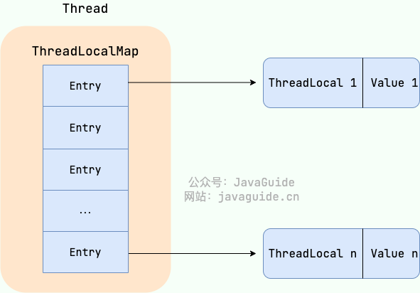
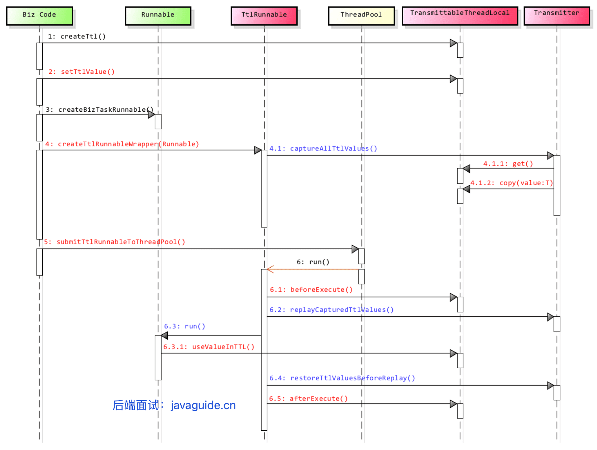
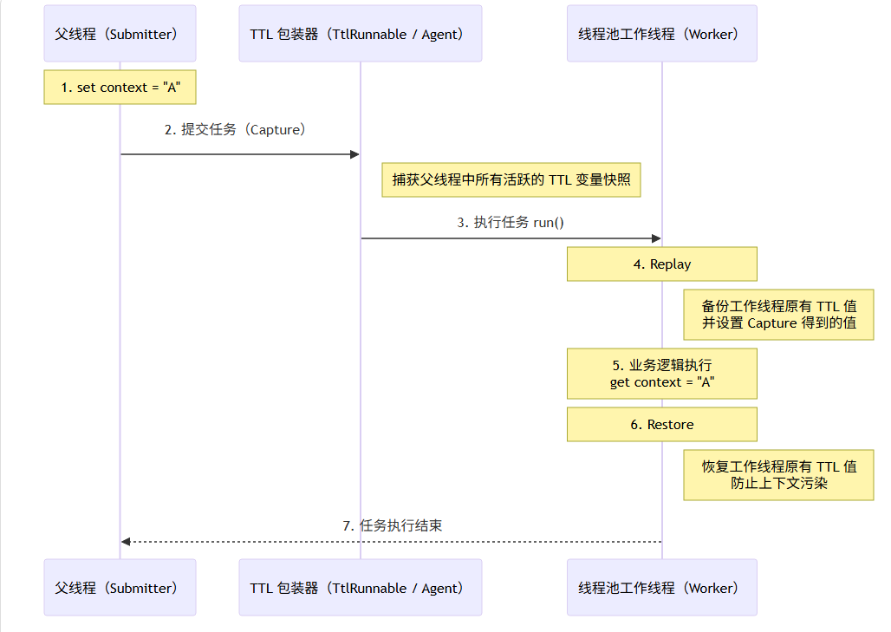
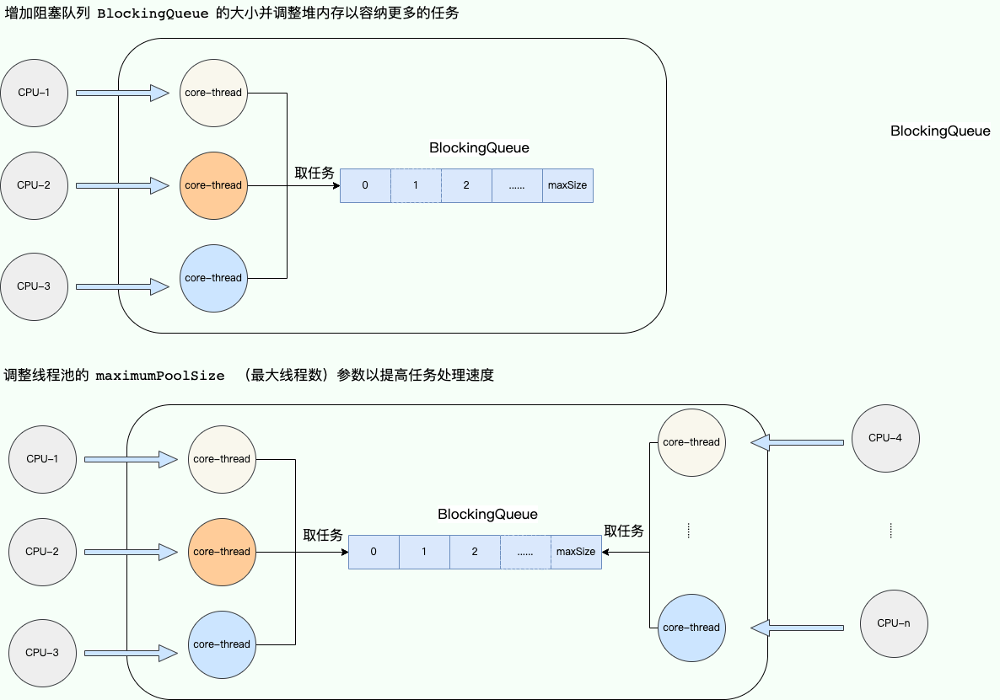
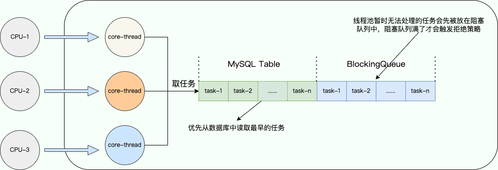

# 一、ThreadLocal

## 1、ThreadLocal 有什么用？

通常情况下，我们创建的变量可以被任何一个线程访问和修改。这在多线程环境中可能导致数据竞争和线程安全问题。那么，**如果想让每个线程都有自己的专属本地变量，该如何实现呢？**

JDK 中提供的 `ThreadLocal` 类正是为了解决这个问题。**`ThreadLocal` 类允许每个线程绑定自己的值**，可以将其形象地比喻为一个“存放数据的盒子”。每个线程都有自己独立的盒子，用于存储私有数据，确保不同线程之间的数据互不干扰。

当你创建一个 `ThreadLocal` 变量时，每个访问该变量的线程都会拥有一个独立的副本。这也是 `ThreadLocal` 名称的由来。线程可以通过 `get()` 方法获取自己线程的本地副本，或通过 `set()` 方法修改该副本的值，从而避免了线程安全问题。

举个简单的例子：假设有两个人去宝屋收集宝物。如果他们共用一个袋子，必然会产生争执；但如果每个人都有一个独立的袋子，就不会有这个问题。如果将这两个人比作线程，那么 `ThreadLocal` 就是用来避免这两个线程竞争同一个资源的方法。

```java
public class ThreadLocalExample {
    private static ThreadLocal<Integer> threadLocal = ThreadLocal.withInitial(() -> 0);

    public static void main(String[] args) {
        Runnable task = () -> {
            int value = threadLocal.get();
            value += 1;
            threadLocal.set(value);
            System.out.println(Thread.currentThread().getName() + " Value: " + threadLocal.get());
        };

        Thread thread1 = new Thread(task, "Thread-1");
        Thread thread2 = new Thread(task, "Thread-2");

        thread1.start(); // 输出: Thread-1 Value: 1
        thread2.start(); // 输出: Thread-2 Value: 1
    }
}
```

## 2、⭐️ThreadLocal 原理了解吗？

从 `Thread`类源代码入手。

```java
public class Thread implements Runnable {
    //......
    //与此线程有关的ThreadLocal值。由ThreadLocal类维护
    ThreadLocal.ThreadLocalMap threadLocals = null;

    //与此线程有关的InheritableThreadLocal值。由InheritableThreadLocal类维护
    ThreadLocal.ThreadLocalMap inheritableThreadLocals = null;
    //......
}
```

从上面`Thread`类 源代码可以看出`Thread` 类中有一个 `threadLocals` 和 一个 `inheritableThreadLocals` 变量，它们都是 `ThreadLocalMap` 类型的变量,我们可以把 `ThreadLocalMap` 理解为`ThreadLocal` 类实现的定制化的 `HashMap`。默认情况下这两个变量都是 null，只有当前线程调用 `ThreadLocal` 类的 `set`或`get`方法时才创建它们，实际上调用这两个方法的时候，我们调用的是`ThreadLocalMap`类对应的 `get()`、`set()`方法。

`ThreadLocal`类的 `get()`方法，

```java
public T get() {
        Thread t = Thread.currentThread();
        ThreadLocalMap map = getMap(t);
        if (map != null) {
            ThreadLocalMap.Entry e = map.getEntry(this);
            if (e != null) {
                @SuppressWarnings("unchecked")
                T result = (T)e.value;
                return result;
            }
        }
        return setInitialValue();
    }

private T setInitialValue() {
        T value = initialValue();
        Thread t = Thread.currentThread();
        ThreadLocalMap map = getMap(t);
        if (map != null) {
            map.set(this, value);
        } else {
            createMap(t, value);
        }
        if (this instanceof TerminatingThreadLocal) {
            TerminatingThreadLocal.register((TerminatingThreadLocal<?>) this);
        }
        return value;
    }


protected T initialValue() {
        return null;
    }
```


`ThreadLocal`类的 `set()`方法， **`ThreadLocal` 实例**本身作为 **key**，而你要存储的值作为 value。

```java
public void set(T value) {
    //获取当前请求的线程
    Thread t = Thread.currentThread();
    //取出 Thread 类内部的 threadLocals 变量(哈希表结构)
    ThreadLocalMap map = getMap(t);
    if (map != null)
        // 将需要存储的值放入到这个哈希表中，key为ThreadLocal实例本身
        map.set(this, value);
    else
        createMap(t, value);
}


ThreadLocalMap getMap(Thread t) {
    return t.threadLocals;
}
```

通过上面这些内容，我们足以通过猜测得出结论：**最终的变量是放在了当前线程的 `ThreadLocalMap` 中，并不是存在 `ThreadLocal` 上，`ThreadLocal` 可以理解为只是`ThreadLocalMap`的封装，传递了变量值。** `ThrealLocal` 类中可以通过`Thread.currentThread()`获取到当前线程对象后，直接通过`getMap(Thread t)`可以访问到该线程的`ThreadLocalMap`对象。

**每个`Thread`中都具备一个`ThreadLocalMap`，而`ThreadLocalMap`可以存储以`ThreadLocal`为 key ，Object 对象为 value 的键值对。**

```java
ThreadLocalMap(ThreadLocal<?> firstKey, Object firstValue) {
    //......
}
```

比如我们在同一个线程中声明了两个 `ThreadLocal` 对象的话， `Thread`内部都是使用仅有的那个`ThreadLocalMap` 存放数据的，`ThreadLocalMap`的 key 就是 `ThreadLocal`对象，value 就是 `ThreadLocal` 对象调用`set`方法设置的值。

👉 **ThreadLocal 的本质：**

> 通过 ThreadLocal 作为 key，在每个线程自己的 ThreadLocalMap 中存储 value，从而实现“同一个变量在不同线程中有不同副本”。

`ThreadLocal` 数据结构如下图所示：



`ThreadLocalMap`是`ThreadLocal`的静态内部类。


## 3、⭐️ThreadLocal 内存泄露问题是怎么导致的？

`ThreadLocal` 内存泄漏的根本原因在于其内部实现机制。

通过上面的内容我们已经知道：每个线程维护一个名为 `ThreadLocalMap` 的 map。 当你使用 `ThreadLocal` 存储值时，实际上是将值存储在当前线程的 `ThreadLocalMap` 中，其中 `ThreadLocal` 实例本身作为 key，而你要存储的值作为 value。

`ThreadLocal` 的 `set()` 方法源码如下：

```java
public void set(T value) {
    Thread t = Thread.currentThread(); // 获取当前线程
    ThreadLocalMap map = getMap(t);   // 获取当前线程的 ThreadLocalMap
    if (map != null) {
        map.set(this, value);         // 设置值
    } else {
        createMap(t, value);          // 创建新的 ThreadLocalMap
    }
}
```

`ThreadLocalMap` 的 `set()` 和 `createMap()` 方法中，并没有直接存储 `ThreadLocal` 对象本身，而是使用 `ThreadLocal` 的哈希值计算数组索引，最终存储于类型为`static class Entry extends WeakReference<ThreadLocal<?>>`的数组中。

```java
int i = key.threadLocalHashCode & (len-1);
```

`ThreadLocalMap` 的 `Entry` 定义如下：

```java
static class Entry extends WeakReference<ThreadLocal<?>> {
    Object value;

    Entry(ThreadLocal<?> k, Object v) {
        super(k);
        value = v;
    }
}
```

`ThreadLocalMap` 的 `key` 和 `value` 引用机制：

- **key 是弱引用**：`ThreadLocalMap` 中的 key 是 `ThreadLocal` 的弱引用 (`WeakReference<ThreadLocal<?>>`)。 这意味着，如果 `ThreadLocal` 实例不再被任何强引用指向，垃圾回收器会在下次 GC 时回收该实例，导致 `ThreadLocalMap` 中对应的 key 变为 `null`。
- **value 是强引用**：即使 `key` 被 GC 回收，`value` 仍然被 `ThreadLocalMap.Entry` 强引用存在，无法被 GC 回收。

当 `ThreadLocal` 实例失去强引用后，其对应的 value 仍然存在于 `ThreadLocalMap` 中，因为 `Entry` 对象强引用了它。如果线程持续存活（例如线程池中的线程），`ThreadLocalMap` 也会一直存在，❗ 导致 key 为 `null` 的 entry 无法被垃圾回收，即会造成内存泄漏。

也就是说，内存泄漏的发生需要同时满足两个条件：

1. `ThreadLocal` 实例不再被强引用；

   > 没有变量接住：
   >
   > 👉 ThreadLocal 很快被 GC

2. 线程持续存活，导致 `ThreadLocalMap` 长期存在。

   > 典型场景：
   >
   > - 线程池（ThreadPoolExecutor）
   > - Web 容器（Tomcat）

虽然 `ThreadLocalMap` 在 `get()`, `set()` 和 `remove()` 操作时会尝试清理 key 为 null 的 entry，但这种清理机制是被动的，并不完全可靠。

> ## 一、为什么 key 要用弱引用？
>
> 👉 目的只有一个：**防止 ThreadLocal 本身导致内存泄漏**
>
> 如果 key 也是强引用：
>
> ```
> Thread → ThreadLocalMap → Entry → ThreadLocal（强引用）
> ```
>
> 那就会形成：
>
> 👉 Thread 一直活着 → ThreadLocal 永远不能回收 ❌
>
> ------
>
> 改成弱引用后：
>
> ```
> ThreadLocal（无强引用） → 被 GC 回收
> ↓
> Entry.key = null
> ```
>
> ✅ ThreadLocal 可以被回收
>
> ## 二、问题就出在：value 是强引用
>
> 看这一条链：
>
> ```
> Thread
>   ↓
> ThreadLocalMap
>   ↓
> Entry
>   ↓
> value（强引用）
> ```
>
> 即使：
>
> ```
> Entry.key == null（ThreadLocal 已被 GC）
> ```
>
> 👉 但：
>
> ```
> value 仍然被 Entry 强引用！
> ```
>
> 所以：
>
> ❗ value **不会被回收**
>
> ## 三、什么时候会内存泄漏？
>
> ### ✅ 条件1：ThreadLocal 没有强引用
>
> ```
> new ThreadLocal<>().set("value");
> ```
>
> 没有变量接住：
>
> 👉 ThreadLocal 很快被 GC
>
> ------
>
> ### ✅ 条件2：线程长期存活（重点）
>
> 典型场景：
>
> - 线程池（ThreadPoolExecutor）
> - Web 容器（Tomcat）
>
> ```
> 线程不会结束 → ThreadLocalMap 一直存在
> ```
>
> ------
>
> ### ❗ 结果
>
> ```
> Entry.key = null
> Entry.value = "value"（还在！）
> ```
>
> 👉 垃圾回收不了 → 内存泄漏
>
> ## 四、正确使用姿势（避免泄漏）
>
> **如何避免内存泄漏的发生？**
>
> 1. 在使用完 `ThreadLocal` 后，务必调用 `remove()` 方法。 这是最安全和最推荐的做法。 `remove()` 方法会从 `ThreadLocalMap` 中显式地移除对应的 entry，彻底解决内存泄漏的风险。 即使将 `ThreadLocal` 定义为 `static final`，也强烈建议在每次使用后调用 `remove()`。
> 2. 在线程池等线程复用的场景下，使用 `try-finally` 块可以确保即使发生异常，`remove()` 方法也一定会被执行。
>
> ```
> try {
>     threadLocal.set(value);
> } finally {
>     threadLocal.remove(); // 必须
> }
> ```
>
> 👉 remove 会：
>
> - 删除 Entry
>
> - 释放 value
>
>   > 👉 **`ThreadLocal.remove()` 并不会清空当前线程的所有 Entry，只会删除“当前这个 ThreadLocal 对应的那一条”。**

## 4、为什么 ThreadLocal 不设计成 Map<Thread, Value>？

你可以这样答：

- 如果是全局 Map：
  - 需要加锁 ❌
  - 并发性能差 ❌
- 当前设计（Thread 持有 Map）：
  - 无锁 ✔
  - 线程隔离 ✔
  - 性能更好 ✔

## 5、为什么 Entry 的 key 要设计为弱引用？

这是一个经典的面试追问。很多同学知道 `ThreadLocalMap` 的 key 是弱引用，但不清楚**为什么要这样设计**，以及如果换成强引用会怎样。

我们先来看完整的引用链路。当一个线程使用 `ThreadLocal` 时，涉及以下引用关系：

```
强引用（栈/静态变量）──→ ThreadLocal 实例
                              ↑
Thread ──→ ThreadLocalMap ──→ Entry ─── key（WeakReference）──┘
                              │
                              └─── value（强引用）──→ 实际存储的对象
```

理解了这条引用链路，我们来对比两种设计方案：

**假设 key 使用强引用（实际没有采用）：**

当业务代码中的 `ThreadLocal` 引用被置为 `null`（例如方法执行结束、对象被回收），此时虽然业务代码已经不再需要这个 `ThreadLocal`，但由于 `ThreadLocalMap` 的 Entry 对 key 持有**强引用**，`ThreadLocal` 实例仍然无法被 GC 回收。只要线程不终止，这个 `ThreadLocal` 和它对应的 value 都会一直存在于内存中，造成 key 和 value **都无法回收**的内存泄漏。

**key 使用弱引用（实际采用的方案）：**

当业务代码中的 `ThreadLocal` 引用被置为 `null` 后，由于 Entry 的 key 是弱引用，`ThreadLocal` 实例在下次 GC 时会被回收，key 变为 `null`。此时虽然 value 仍然存在（强引用），但 `ThreadLocalMap` 在执行 `get()`、`set()`、`remove()` 等操作时，会主动探测并清理这些 key 为 `null` 的 "stale entry"（过期条目），从而释放 value 对象。

也就是说，**弱引用的设计是一种"兜底"防御机制**——即便开发者忘记调用 `remove()`，JVM 的 GC 配合 `ThreadLocalMap` 的自清理逻辑，仍然有机会回收泄漏的数据。而如果使用强引用，一旦忘记 `remove()`，就完全没有任何补救机会了。

> 需要注意的是，这种自清理机制是**被动触发**的（只在 `get`/`set`/`remove` 操作时顺便清理），并不能保证所有过期条目都被及时清理。因此，**弱引用只是降低了内存泄漏的风险，并没有彻底消除它**，手动调用 `remove()` 仍然是必须的。

## 6、为什么 key 可以是弱引用，而 value 不行？

**key（ThreadLocal）：**

👉 作用只是“定位 value”

- 没人用它 → 可以回收 ✔
- 回收后 → entry 变脏（key=null）

👉 可以接受

------

 **value（数据）：**

👉 是“真正业务数据”

- 如果被 GC 回收 ❌
- 就会导致：
  - 数据丢失
  - 逻辑错误

👉 **不能接受**

> ThreadLocalMap 中 key 使用弱引用是为了避免 ThreadLocal 对象本身无法回收，而 value 使用强引用是为了保证线程本地变量的可靠性。如果 value 也使用弱引用，会导致数据在 GC 后随时丢失，破坏 ThreadLocal 的基本语义，因此不能这样设计。

## 7、线程池场景下的特殊风险

上面提到内存泄漏的条件之一是"线程持续存活"。在使用 `new Thread()` 创建线程的场景下，线程执行完毕后会被销毁，其持有的 `ThreadLocalMap` 也会随之被 GC 回收，泄漏的影响相对有限。

但在**线程池**场景下，问题会被严重放大。线程池中的核心线程默认不会被销毁，它们会被反复复用来执行不同的任务。这意味着：

1. **内存泄漏持续累积**：每个任务如果使用了 `ThreadLocal` 却没有清理，其 value 就会一直残留在该线程的 `ThreadLocalMap` 中。随着任务不断提交和执行，泄漏的数据会越积越多，最终可能导致 OOM。
2. **数据污染（脏数据）**：上一个任务设置的 `ThreadLocal` 值，如果没有被清理，下一个被分配到同一线程的任务就能读取到这个残留值。这可能导致严重的业务逻辑错误，比如用户 A 的请求读取到了用户 B 的身份信息。

**美团技术团队的真实事故案例：**

美团技术团队在[《Java 线程池实现原理及其在美团业务中的实践》](./References\Java线程池实现原理及其在美团业务中的实践 - 美团技术团队.mhtml)一文中就记录了一次因 `ThreadLocal` 使用不当引发的线上事故：在一个依赖 `ThreadLocal` 传递用户上下文的 Web 应用中，由于使用了线程池处理请求，且没有在请求结束后清理 `ThreadLocal`，导致**后续请求复用了同一线程时，读取到了前一个请求遗留的用户信息**，造成了用户数据串号的严重问题。

## 8、阿里巴巴 Java 开发手册的强制规约

正因为线程池 + `ThreadLocal` 的组合如此容易踩坑，《阿里巴巴 Java 开发手册》在"并发处理"章节中对此做出了**强制**级别的要求：

> **【强制】** 必须回收自定义的 `ThreadLocal` 变量记录的当前线程的值，尤其在线程池场景下，线程经常会被复用，如果不清理自定义的 `ThreadLocal` 变量，可能会影响后续业务逻辑和造成内存泄露等问题。尽量在代理中使用 `try-finally` 块进行回收。

正确的使用模式如下：

```java
// 定义为 static final，避免重复创建 ThreadLocal 实例
private static final ThreadLocal<UserContext> userContextHolder = new ThreadLocal<>();

public void processRequest(HttpServletRequest request) {
    try {
        // 在 try 块中设置值
        UserContext context = buildUserContext(request);
        userContextHolder.set(context);

        // 执行业务逻辑
        doBusinessLogic();
    } finally {
        // 在 finally 块中必须清理，确保无论是否发生异常都会执行
        userContextHolder.remove();
    }
}
```

这里有三个关键要点：

1. **`ThreadLocal` 声明为 `static final`**：确保整个应用只有一个 `ThreadLocal` 实例，避免因重复创建导致旧实例失去强引用后 key 被回收，加剧内存泄漏。
2. **`try-finally` 保证 `remove()` 一定被执行**：即使业务逻辑抛出异常，`finally` 块也能确保 `ThreadLocal` 被清理。
3. **在使用完毕后立即清理，而不是在下次使用前设置**：在使用前 `set()` 虽然可以覆盖旧值解决脏数据问题，但无法解决上一次任务遗留 value 的内存占用问题。只有在用完后 `remove()`，才能同时避免内存泄漏和数据污染。

## 9、⭐️如何跨线程传递 ThreadLocal 的值？

**为什么 ThreadLocal 在异步场景下会失效？**

`ThreadLocal` 的值不在 `ThreadLocal` 对象中，而是存储在 `Thread` 里：

```java
Thread → ThreadLocalMap → Entry(ThreadLocal, value)
```

`ThreadLocal` 数据结构如下图所示：


异步执行往往意味着任务会从当前线程切换到另一个线程（例如线程池中的工作线程）执行。由于不同线程各自维护独立的 `ThreadLocalMap`，默认情况下 `ThreadLocal` 的上下文无法在异步执行中自动传递。

> ## 一、案例场景：用户上下文 + 异步任务
>
> ### 1、假设我们用 ThreadLocal 保存当前登录用户：
>
> ```java
> private static final ThreadLocal<String> USER_TL = new ThreadLocal<>();
> ```
>
> **✅ 同步情况下（没问题）**
>
> ```java
> public void handleRequest() {
>     USER_TL.set("userA");
> 
>     // 同线程执行
>     doBusiness();
> 
>     USER_TL.remove();
> }
> 
> private void doBusiness() {
>     System.out.println(USER_TL.get()); // userA ✅
> }
> ```
>
> 👉 因为始终在**同一个线程**，ThreadLocal 能正常工作
>
> ### 2、问题出现：引入异步
>
> ```java
> ExecutorService pool = Executors.newFixedThreadPool(1);
> 
> public void handleRequest() {
>     USER_TL.set("userA");
> 
>     pool.submit(() -> {
>         doBusiness();
>     });
> 
>     USER_TL.remove();
> }
> ```
>
> ❗结果
>
> ```java
> private void doBusiness() {
>     System.out.println(USER_TL.get());
> }
> ```
>
> 输出：
>
> ```java
> null ❌
> ```
>
> ### 3、为什么会这样？
>
> 因为执行流程变成：
>
> ```
> 主线程：
>   USER_TL.set("userA")
> 
> 线程池线程：
>   doBusiness() → USER_TL.get() = null
> ```
>
> ------
>
> 👉 本质原因：
>
> ```
> ThreadA.ThreadLocalMap ≠ ThreadB.ThreadLocalMap
> ```
>
> 每个线程都有自己独立的一份：
>
> ```java
> ThreadA:
>   USER_TL → userA
> 
> ThreadB:
>   （没有 USER_TL）→ null
> ```
>
> ### 4、更隐蔽的坑（很多线上问题）
>
> 如果线程池线程**之前用过 ThreadLocal 且没清理**：
>
> ```
> ThreadB:
>   USER_TL → userX（旧数据）
> ```
>
> ------
>
>  ❗结果可能是：
>
> ```
> 不是 null，而是 userX ❌（严重串号）
> ```
>
> 👉 这比 null 更危险！
>
> ### 5、如何解决
>
> #### ✅方案1：手动传递（最原始）
>
> ```java
> public void handleRequest() {
>     USER_TL.set("userA");
> 
>     String user = USER_TL.get();
> 
>     pool.submit(() -> {
>         USER_TL.set(user);
>         try {
>             doBusiness();
>         } finally {
>             USER_TL.remove();
>         }
>     });
> 
>     USER_TL.remove();
> }
> ```
>
> #### ✅方案2：使用 InheritableThreadLocal（⚠️ 有坑）
>
> ```java
> private static final InheritableThreadLocal<String> USER_TL = new InheritableThreadLocal<>();
> ```
>
> 👉 作用：
>
> - 子线程创建时，会拷贝父线程的值
>
> ------
>
> ❗但在线程池中：
>
> ```jav
> 线程是复用的，不是新建的 → 不生效 ❌
> ```
>
> **案例代码**
>
> ```java
> public class threadLocalContext {
>     
>     private static final InheritableThreadLocal<String> USER_TL_INHERI = new InheritableThreadLocal<>();
> 
>     private ExecutorService pool = Executors.newFixedThreadPool(1);
> 
>     public void handleRequestWithInheritable(){
>         USER_TL_INHERI.set("userName");
> 
>         pool.submit(() -> {
>             doBusinessWithInheritable();
>         });
> 		// 修改值
>         USER_TL_INHERI.set("user_B");
> 
>         pool.submit(() -> {
>             // 输出仍是 "userName"
>             doBusinessWithInheritable();
>         });
> 
>         pool.shutdown();
> 
>         USER_TL_INHERI.remove();
>     }
> 
>     private void doBusinessWithInheritable() {
>         System.out.println(USER_TL_INHERI.get());
>     }
> 
>     public static void main(String[] args) {
>         threadLocalContext threadLocalContext = new threadLocalContext();
>        
>         // 方案2：通过 InheritableThreadLocal 解决问题
>         threadLocalContext.handleRequestWithInheritable();
>     }
> }
> 
> ```
>
> 

**如何跨线程传递 ThreadLocal 的值？**

为了解决这个问题，业界有两套主流的解决方案，一套是 JDK 原生的，另一套是阿里巴巴开源的。

### 9.1、显式手动传参

> ```java
> public void handleRequest() {
>     USER_TL.set("userA");
> 
>     String user = USER_TL.get();
> 
>     pool.submit(() -> {
>         USER_TL.set(user);
>         try {
>             doBusiness();
>         } finally {
>             USER_TL.remove();
>         }
>     });
> 
>     USER_TL.remove();
> }
> ```
>
> 

### 9.2、`InheritableThreadLocal` 

JDK1.2 提供的一个类，继承自 `ThreadLocal` 。使用 `InheritableThreadLocal` 时，会在创建子线程时，令子线程继承父线程中的 `ThreadLocal` 值，但是无法支持线程池场景下的 `ThreadLocal` 值传递。

> ## 一、核心原理
>
> `InheritableThreadLocal` 的值传递**只发生在线程 *<u>创建</u>* 时**，后续不再同步，通过 `Thread` 构造函数中的 `inheritValues()` 复制父线程的值
>
> ```java
> // Thread.java 源码
> private Thread(ThreadGroup g, Runnable target, String name, ...) {
>     // ...
>     Thread parent = currentThread();
>     if (parent.inheritableThreadLocals != null) {
>         // 仅在 new Thread() 时复制一次，后续不再同步
>         this.inheritableThreadLocals =
>             ThreadLocal.createInheritedMap(parent.inheritableThreadLocals);
>     }
> }
> ```
>
> **线程池的线程是复用的**，线程在第一次创建后就不会再执行这个继承逻辑。
>
> 

### 9.3、`TransmittableThreadLocal` 

 `TransmittableThreadLocal` （简称 TTL） 是阿里巴巴开源的工具类，继承并加强了`InheritableThreadLocal`类，可以在线程池的场景下支持 `ThreadLocal` 值传递。项目地址：https://github.com/alibaba/transmittable-thread-local。

TTL 生效的两个条件，缺一不可：

- 条件1：TransmittableThreadLocal
- 条件2：TtlExecutors 包装线程池

> 案例代码：
>
> ```java
> public class TTLCorrectDemo {
>     private static final TransmittableThreadLocal<String> USER_TL =
>         new TransmittableThreadLocal<>();
> 
>     // 关键：必须用 TtlExecutors 包装
>     private ExecutorService pool = TtlExecutors.getTtlExecutorService(
>         Executors.newFixedThreadPool(1)
>     );
> 
>     public void handleRequest() throws Exception {
>         USER_TL.set("user-A");
>         Future<?> f1 = pool.submit(() -> System.out.println(USER_TL.get()));
> 
>         USER_TL.set("user-B");
>         Future<?> f2 = pool.submit(() -> System.out.println(USER_TL.get()));
> 
>         f1.get();  // user-A ✅
>         f2.get();  // user-B ✅
> 
>         pool.shutdown();
>         USER_TL.remove();
>     }
> }
> ```
>
> 

## 10、InheritableThreadLocal 原理

`InheritableThreadLocal` 实现了创建异步线程时，继承父线程 `ThreadLocal` 值的功能。该类是 JDK 团队提供的，通过改造 JDK 源码包中的 `Thread` 类来实现创建线程时，`ThreadLocal` 值的传递。

**`InheritableThreadLocal` 的值存储在哪里？**

在 `Thread` 类中添加了一个新的 `ThreadLocalMap` ，命名为 `inheritableThreadLocals` ，该变量用于存储需要跨线程传递的 `ThreadLocal` 值。如下：

```java
class Thread implements Runnable {
    ThreadLocal.ThreadLocalMap threadLocals = null;
    ThreadLocal.ThreadLocalMap inheritableThreadLocals = null;
}
```

**如何完成 `ThreadLocal` 值的传递？**

通过改造 `Thread` 类的构造方法来实现，在创建 `Thread` 线程时，拿到父线程的 `inheritableThreadLocals` 变量赋值给子线程即可。相关代码如下：

```java
// Thread 的构造方法会调用 init() 方法
private void init(/* ... */) {
	// 1、获取父线程
    Thread parent = currentThread();
    // 2、将父线程的 inheritableThreadLocals 赋值给子线程
    if (inheritThreadLocals && parent.inheritableThreadLocals != null)
        this.inheritableThreadLocals =
        	ThreadLocal.createInheritedMap(parent.inheritableThreadLocals);
}
```

**`InheritableThreadLocal` 的方案有什么问题？**

这个方案的缺陷在于它的**一次性**，也就是它只在线程创建时发生一次复制。然而，现在的开发中，我们会大量使用线程池，但线程池里的线程是被复用的。

想象一下，任务A在线程1中执行，把它的 `ThreadLocal` 值传给了线程池里的子线程2。任务A结束后，线程1去休息了。接着，任务B来了，它在线程3中执行，线程池又复用了刚才那个子线程2来执行任务B的一部分。此时，子线程2的`ThreadLocal`里还残留着任务A传给它的脏数据，而任务B（在线程3里）的上下文却完全没有传递过来。这就导致了数据污染和上下文丢失。

## 11、TransmittableThreadLocal 原理

JDK 默认没有支持线程池场景下 `ThreadLocal` 值传递的功能，因此阿里巴巴开源了一套工具 `TransmittableThreadLocal` 来实现该功能。

由于阿里巴巴无法改动 JDK 源码，TTL 巧妙地利用了**装饰器模式**对任务（`Runnable`/`Callable`）或线程池（`Executor`）进行增强，将上下文的传递时机从“线程创建时”延迟到了“任务提交与执行时”。

TTL 的核心逻辑可以概括为三个阶段（CRR）：

- **Capture（捕获）**：在提交任务（如调用 `execute`）的一瞬间，`TtlRunnable` 会调用 `TransmittableThreadLocal.Transmitter.capture()`。它通过内部维护的 `holder` 集合，抓取当前父线程中所有活跃的 TTL 变量并存入快照。
- **Replay（回放）**：在线程池的工作线程执行 `run()` 方法前，调用 `replay()`。它将快照中的值 `set` 到当前工作线程中，并备份该线程原有的旧值。
- **Restore（恢复）**：任务执行结束后，调用 `restore()`。它根据备份将工作线程恢复到执行前的状态，防止上下文污染或内存泄漏。

这张图是 TTL 官方提供的 CRR 整个过程的时序图：



不太好理解吧？可以看下我绘制的这张 CRR 时序图，更清晰直观一些：



也就是说，TTL 的本质是在任务提交时 Capture 上下文，在任务执行前 Replay 上下文，在任务结束后 Restore 线程状态，从而安全地支持线程池中的 `ThreadLocal` 传递。

TTL 提供了两种主要的接入方式，可根据侵入性要求和改造成本进行选择。

**1. 显式包装（手动接入）**

使用 `TtlRunnable.get(Runnable)` 或 `TtlCallable.get(Callable)` 对任务进行包装，使用 `TtlExecutors.getTtlExecutor(Executor)`、`getTtlExecutorService(...)` 对线程池进行包装。这种接入方式清晰可控，但需要业务代码配合，存在一定侵入性。

下面这段代码展示了 TTL 通过 CRR，在支持线程池复用和拒绝策略的前提下，安全地传递并隔离 `ThreadLocal` 上下文。

```java
public class TtlContextHolder {
    private static final Logger log = LoggerFactory.getLogger(TtlContextHolder.class);

    // 1. 使用 static final 确保 TTL 实例不被重复创建，防止内存泄漏
    // 重写 copy 方法（可选）：如果是引用类型，建议实现深拷贝
    private static final TransmittableThreadLocal<String> CONTEXT = new TransmittableThreadLocal<String>() {
        @Override
        public String copy(String parentValue) {
            // 默认是直接返回引用，如果是可变对象（如 Map），请在这里 new 新对象
            return parentValue;
        }
    };

    // 2. 线程池初始化：确保只被 TtlExecutors 包装一次
    private static final ExecutorService TTL_EXECUTOR_SERVICE;

    static {
        ExecutorService rawExecutor = new ThreadPoolExecutor(
                2, 4, 60L, TimeUnit.SECONDS,
                new LinkedBlockingQueue<>(1000), (Runnable r) -> new Thread(r, "ttl-worker-" + r.hashCode()),
                new ThreadPoolExecutor.CallerRunsPolicy() // 关键：TTL 完美支持此拒绝策略
        );
        // 包装原始线程池
        TTL_EXECUTOR_SERVICE = TtlExecutors.getTtlExecutorService(rawExecutor);
    }

    public static void main(String[] args) throws Exception {
        try {
            // 3. 在父线程中设置上下文
            CONTEXT.set("value-set-in-parent");
            log.info("父线程上下文: {}", CONTEXT.get());

            // 4. 使用 Lambda 简化任务提交
            TTL_EXECUTOR_SERVICE.submit(() -> {
                log.info("异步任务(Runnable)读取上下文: {}", CONTEXT.get());
                // 模拟业务逻辑
                // 注意：子线程修改是否影响父线程，取决于 copy() 是否做了深拷贝
                CONTEXT.set("value-modified-in-child");
            });

            Future<String> future = TTL_EXECUTOR_SERVICE.submit(() -> {
                log.info("异步任务(Callable)读取上下文: {}", CONTEXT.get());
                return "Success";
            });

            future.get();

            // 5. 验证父线程上下文是否被污染
            log.info("验证父线程上下文: {}", CONTEXT.get());

            // 6. 验证修改父线程的上下文，子线程是否能正确读到
            CONTEXT.set("value-set-in-parent-2");

            Future<String> future2 = TTL_EXECUTOR_SERVICE.submit(() -> {
                log.info("异步任务(Callable)读取上下文: {}", CONTEXT.get());
                return "Success";
            });

            future2.get();

            // 7. 验证父线程上下文是否被污染
            log.info("验证最终父线程上下文: {}", CONTEXT.get());

        } finally {
            // 8. 清理当前线程（父线程）的上下文，子线程的上下文由 TTL 的 Restore 机制自动恢复
            CONTEXT.remove();
        }
    }
}
```

输出：

```java
15:23:31.387 [main] INFO com.gc.multithreaddemo.demos.threadLocal.TtlContextHolder - 父线程上下文: value-set-in-parent
15:23:31.403 [ttl-worker-1849433705] INFO com.gc.multithreaddemo.demos.threadLocal.TtlContextHolder - 异步任务(Runnable)读取上下文: value-set-in-parent
15:23:31.405 [ttl-worker-687241927] INFO com.gc.multithreaddemo.demos.threadLocal.TtlContextHolder - 异步任务(Callable)读取上下文: value-set-in-parent
15:23:31.405 [main] INFO com.gc.multithreaddemo.demos.threadLocal.TtlContextHolder - 验证父线程上下文: value-set-in-parent
15:23:31.405 [ttl-worker-1849433705] INFO com.gc.multithreaddemo.demos.threadLocal.TtlContextHolder - 异步任务(Callable)读取上下文: value-set-in-parent-2
15:23:31.405 [main] INFO com.gc.multithreaddemo.demos.threadLocal.TtlContextHolder - 验证最终父线程上下文: value-set-in-parent-2
```

> **Callable 读到 parent 值的原因**：`captured2` 快照的是**主线程**的 TTL 值，子线程的修改在 restore 后已被抹除，且从未写回主线程。
>
> ------
>
> #### 父线程上下文为什么也不受污染
>
> TTL 的修改是完全隔离的：
>
> ```
> 父线程 TTL Map:          线程池线程 TTL Map:
> ┌──────────────────┐     ┌──────────────────────────────┐
> │ "value-set-in-   │     │ replay注入  → "value-set-in-  │
> │  parent"         │     │               parent"         │
> │                  │     │ 任务修改    → "value-modified- │
> │ 始终不变 ✅      │     │               in-child"       │
> └──────────────────┘     │ restore恢复 → 执行前的值      │
>                          └──────────────────────────────┘
>         ↑ 两张完全独立的 Map，子线程的 set() 永远不会写到父线程
> ```

引入 TTL 的 Maven 依赖：

```xm;
<dependency>
    <groupId>com.alibaba</groupId>
    <artifactId>transmittable-thread-local</artifactId>
    <version>2.14.2</version>
</dependency>
```

**2. 无侵入接入（Java Agent）**

通过 Java Agent 在类加载阶段对线程池相关类进行 字节码增强，自动织入 TTL 的上下文传递逻辑，实现业务代码零改造的上下文透传。这种方式业务代码无需感知 TTL 的存在，但实现复杂度相对较高。

TTL Agent 默认修饰了以下 JDK 执行器组件：

1. **标准线程池**：`java.util.concurrent.ThreadPoolExecutor` 和 `java.util.concurrent.ScheduledThreadPoolExecutor`。
2. **ForkJoin 体系**：`java.util.concurrent.ForkJoinTask`（从而透明支持了 `CompletableFuture` 和 Java 8 并行流 `Stream`）。
3. **遗留组件**：`java.util.TimerTask`（自 v2.7.0 起支持，v2.11.2 起默认开启）。

在 Java 启动参数中加入 `-javaagent` 配置：

```bash
# 基础配置
java -javaagent:path/to/transmittable-thread-local-2.x.y.jar \
     -cp classes \
     com.your.app.Main
```


## 12、应用场景

**压测流量标记**： 在压测场景中，使用 `ThreadLocal` 存储压测标记，用于区分压测流量和真实流量。如果标记丢失，可能导致压测流量被错误地当成线上流量处理。

**上下文传递**：在分布式系统中，传递链路追踪信息（如 Trace ID）或用户上下文信息。


## 13、总结

`ThreadLocal` 的值默认是无法跨线程传递的，因为它的值是存在**每个 `Thread` 对象自己**的 `ThreadLocalMap` 里的，父子线程是两个不同的对象。

为了解决这个问题，主要有两种方案：

1. **JDK的 InheritableThreadLocal**：它会在**创建子线程**的时候，把父线程的值**复制**一份给子线程。但它的问题是，在**线程池**场景下会失效。因为线程池会**复用**线程，这会导致线程拿到的可能是上一个任务传下来的**脏数据**。
2. **阿里的 TransmittableThreadLocal (TTL)**：这是我们项目里用的方案，它专门解决线程池的问题。它的原理是，在**提交任务**到线程池时，它会把父线程的 `ThreadLocal` 值**捕获**下来，和任务**绑定**在一起。等线程池里的某个线程要执行这个任务时，它再把捕获的值**设置**到这个线程上，任务执行完再**清理**掉。

简单说，**InheritableThreadLocal是跟线程绑定的，只在创建时有效；而TTL是跟任务绑定的，完美支持线程池。**

# 二、线程池
## 1、什么是线程池?

顾名思义，线程池就是管理一系列线程的资源池。当有任务要处理时，直接从线程池中获取线程来处理，处理完之后线程并不会立即被销毁，而是等待下一个任务。

## 2、⭐️为什么要用线程池？

池化技术想必大家已经屡见不鲜了，线程池、数据库连接池、HTTP 连接池等等都是对这个思想的应用。池化技术的思想主要是为了减少每次获取资源的消耗，提高对资源的利用率。

线程池提供了一种限制和管理资源（包括执行一个任务）的方式。 每个线程池还维护一些基本统计信息，例如已完成任务的数量。使用线程池主要带来以下几个好处：

1. **降低资源消耗**：线程池里的线程是可以重复利用的。一旦线程完成了某个任务，它不会立即销毁，而是回到池子里等待下一个任务。这就避免了频繁创建和销毁线程带来的开销。
2. **提高响应速度**：因为线程池里通常会维护一定数量的核心线程（或者说“常驻工人”），任务来了之后，可以直接交给这些已经存在的、空闲的线程去执行，省去了创建线程的时间，任务能够更快地得到处理。
3. **提高线程的可管理性**：线程池允许我们统一管理池中的线程。我们可以配置线程池的大小（核心线程数、最大线程数）、任务队列的类型和大小、拒绝策略等。这样就能控制并发线程的总量，防止资源耗尽，保证系统的稳定性。同时，线程池通常也提供了监控接口，方便我们了解线程池的运行状态（比如有多少活跃线程、多少任务在排队等），便于调优。

## 3、如何创建线程池？

在 Java 中，创建线程池主要有两种方式：

**方式一：通过 `ThreadPoolExecutor` 构造函数直接创建 (推荐)**

这是最推荐的方式，因为它允许开发者明确指定线程池的核心参数，对线程池的运行行为有更精细的控制，从而避免资源耗尽的风险。

**方式二：通过 `Executors` 工具类创建 (不推荐用于生产环境)**

`Executors`工具类提供的创建线程池的方法如下图所示：


可以看出，通过`Executors`工具类可以创建多种类型的线程池，包括：

- `FixedThreadPool`：固定线程数量的线程池。该线程池中的线程数量始终不变。当有一个新的任务提交时，线程池中若有空闲线程，则立即执行。若没有，则新的任务会被暂存在一个任务队列中，待有线程空闲时，便处理在任务队列中的任务。
- `SingleThreadExecutor`： 只有一个线程的线程池。若多余一个任务被提交到该线程池，任务会被保存在一个任务队列中，待线程空闲，按先入先出的顺序执行队列中的任务。
- `CachedThreadPool`： 可根据实际情况调整线程数量的线程池。线程池的线程数量不确定，但若有空闲线程可以复用，则会优先使用可复用的线程。若所有线程均在工作，又有新的任务提交，则会创建新的线程处理任务。所有线程在当前任务执行完毕后，将返回线程池进行复用。
- `ScheduledThreadPool`：给定的延迟后运行任务或者定期执行任务的线程池。

## 4、⭐️为什么不推荐使用内置线程池？

在《阿里巴巴 Java 开发手册》“并发处理”这一章节，明确指出线程资源必须通过线程池提供，不允许在应用中自行显式创建线程。

**为什么呢？**

> 使用线程池的好处是减少在创建和销毁线程上所消耗的时间以及系统资源开销，解决资源不足的问题。如果不使用线程池，有可能会造成系统创建大量同类线程而导致消耗完内存或者“过度切换”的问题。

另外，《阿里巴巴 Java 开发手册》中强制线程池不允许使用 `Executors` 去创建，而是通过 `ThreadPoolExecutor` 构造函数的方式，这样的处理方式让写的同学更加明确线程池的运行规则，规避资源耗尽的风险

`Executors` 返回线程池对象的弊端如下(后文会详细介绍到)：

- `FixedThreadPool` 和 `SingleThreadExecutor`：使用的是阻塞队列 `LinkedBlockingQueue`，任务队列最大长度为 `Integer.MAX_VALUE`，可以看作是无界的，可能堆积大量的请求，从而导致 OOM。
- `CachedThreadPool`：使用的是同步队列 `SynchronousQueue`, 允许创建的线程数量为 `Integer.MAX_VALUE` ，如果任务数量过多且执行速度较慢，可能会创建大量的线程，从而导致 OOM。
- `ScheduledThreadPool` 和 `SingleThreadScheduledExecutor`：使用的无界的延迟阻塞队列`DelayedWorkQueue`，任务队列最大长度为 `Integer.MAX_VALUE`，可能堆积大量的请求，从而导致 OOM。

```java
public static ExecutorService newFixedThreadPool(int nThreads) {
    // LinkedBlockingQueue 的默认长度为 Integer.MAX_VALUE，可以看作是无界的
    return new ThreadPoolExecutor(nThreads, nThreads,0L, TimeUnit.MILLISECONDS,new LinkedBlockingQueue<Runnable>());

}

public static ExecutorService newSingleThreadExecutor() {
    // LinkedBlockingQueue 的默认长度为 Integer.MAX_VALUE，可以看作是无界的
    return new FinalizableDelegatedExecutorService (new ThreadPoolExecutor(1, 1,0L, TimeUnit.MILLISECONDS,new LinkedBlockingQueue<Runnable>()));

}

// 同步队列 SynchronousQueue，没有容量，最大线程数是 Integer.MAX_VALUE`
public static ExecutorService newCachedThreadPool() {

    return new ThreadPoolExecutor(0, Integer.MAX_VALUE,60L, TimeUnit.SECONDS,new SynchronousQueue<Runnable>());

}

// DelayedWorkQueue（延迟阻塞队列）
public static ScheduledExecutorService newScheduledThreadPool(int corePoolSize) {
    return new ScheduledThreadPoolExecutor(corePoolSize);
}
public ScheduledThreadPoolExecutor(int corePoolSize) {
    super(corePoolSize, Integer.MAX_VALUE, 0, NANOSECONDS,
          new DelayedWorkQueue());
}
```

## 5、⭐️线程池常见参数有哪些？如何解释？

```java
    /**
     * 用给定的初始参数创建一个新的ThreadPoolExecutor。
     */
    public ThreadPoolExecutor(int corePoolSize,//线程池的核心线程数量
                              int maximumPoolSize,//线程池的最大线程数
                              long keepAliveTime,//当线程数大于核心线程数时，多余的空闲线程存活的最长时间
                              TimeUnit unit,//时间单位
                              BlockingQueue<Runnable> workQueue,//任务队列，用来储存等待执行任务的队列
                              ThreadFactory threadFactory,//线程工厂，用来创建线程，一般默认即可
                              RejectedExecutionHandler handler//拒绝策略，当提交的任务过多而不能及时处理时，我们可以定制策略来处理任务
                               ) {
        if (corePoolSize < 0 ||
            maximumPoolSize <= 0 ||
            maximumPoolSize < corePoolSize ||
            keepAliveTime < 0)
            throw new IllegalArgumentException();
        if (workQueue == null || threadFactory == null || handler == null)
            throw new NullPointerException();
        this.corePoolSize = corePoolSize;
        this.maximumPoolSize = maximumPoolSize;
        this.workQueue = workQueue;
        this.keepAliveTime = unit.toNanos(keepAliveTime);
        this.threadFactory = threadFactory;
        this.handler = handler;
    }
```

`ThreadPoolExecutor` 3 个最重要的参数：

- `corePoolSize` : 任务队列未达到队列容量时，最大可以同时运行的线程数量。
- `maximumPoolSize` : 任务队列中存放的任务达到队列容量的时候，当前可以同时运行的线程数量变为最大线程数。
- `workQueue`: 新任务来的时候会先判断当前运行的线程数量是否达到核心线程数，如果达到的话，新任务就会被存放在队列中。

`ThreadPoolExecutor`其他常见参数 :

- `keepAliveTime`:当线程池中的线程数量大于 `corePoolSize` ，即有非核心线程（线程池中核心线程以外的线程）时，这些非核心线程空闲后不会立即销毁，而是会等待，直到等待的时间超过了 `keepAliveTime`才会被回收销毁。
- `unit` : `keepAliveTime` 参数的时间单位。
- `threadFactory` :executor 创建新线程的时候会用到。
- `handler` :拒绝策略（后面会单独详细介绍一下）。

下面这张图可以加深你对线程池中各个参数的相互关系的理解（图片来源：《Java 性能调优实战》）：


## 6、线程池的核心线程会被回收吗？

`ThreadPoolExecutor` 默认不会回收核心线程，即使它们已经空闲了。这是为了减少创建线程的开销，因为核心线程通常是要长期保持活跃的。

但是，如果线程池是被用于周期性使用的场景，且频率不高（周期之间有明显的空闲时间），可以考虑将 `allowCoreThreadTimeOut(boolean value)` 方法的参数设置为 `true`，这样就会回收空闲（时间间隔由 `keepAliveTime` 指定）的核心线程了。

```java
public void allowCoreThreadTimeOut(boolean value) {
    // 核心线程的 keepAliveTime 必须大于 0 才能启用超时机制
    if (value && keepAliveTime <= 0) {
        throw new IllegalArgumentException("Core threads must have nonzero keep alive times");
    }
    // 设置 allowCoreThreadTimeOut 的值
    if (value != allowCoreThreadTimeOut) {
        allowCoreThreadTimeOut = value;
        // 如果启用了超时机制，清理所有空闲的线程，包括核心线程
        if (value) {
            interruptIdleWorkers();
        }
    }
}
```

> 使用案例
>
> ```java
> ThreadPoolExecutor executor = new ThreadPoolExecutor(
>         2,                  // corePoolSize
>         4,                  // maximumPoolSize
>         10,                 // keepAliveTime
>         TimeUnit.SECONDS,
>         new LinkedBlockingQueue<>(10)
> );
> 
> // 开启核心线程回收
> executor.allowCoreThreadTimeOut(true);
> ```
>
> 👉 控制**核心线程是否也参与空闲回收**
>
> - `false`（默认）：核心线程永远不回收
> - `true`：核心线程在**空闲时间超过 keepAliveTime 后也会被回收**
>
> 执行流程：
>
> 1. 提交任务 → 创建2个核心线程执行
> 2. 任务执行完 → 线程进入空闲状态
> 3. 5秒内没有新任务
> 4. 👉 **核心线程被销毁（线程数变为0）**
> 5. 再来新任务 → **重新创建线程**

**✅适用场景（重点）**

这个开关不是随便开的，适合这些情况：

- ✔ 场景1：低频任务（典型）
	- 定时任务（每隔几分钟执行）
	- 消息偶发处理
	- 后台批处理任务

👉 避免线程长期空闲占资源

------

- ✔ 场景2：资源敏感环境
	- 容器（Docker / K8s）
	- 内存受限应用

👉 减少线程占用（线程 ≈ 内存 + 调度成本）

**❌不建议开启的场景**

- 高并发 / 高频任务

> 比如：
>
> - Web 请求线程池
> - RPC 线程池

原因：

👉 线程频繁销毁 + 创建 → **性能抖动**

## 7、核心线程空闲时处于什么状态？

核心线程空闲时，其状态分为以下两种情况：

- **设置了核心线程的存活时间** ：核心线程在空闲时，会处于 `WAITING等待` 状态，等待获取任务。如果阻塞等待的时间超过了核心线程存活时间，则该线程会退出工作，将该线程从线程池的工作线程集合中移除，线程状态变为 `TERMINATED终止` 状态。
- **没有设置核心线程的存活时间** ：核心线程在空闲时，会一直处于 `WAITING等待` 状态，等待获取任务，核心线程会一直存活在线程池中。

当队列中有可用任务时，会唤醒被阻塞的线程，线程的状态会由 `WAITING` 状态变为 `RUNNABLE` 状态，之后去执行对应任务。

接下来通过相关源码，了解一下线程池内部是如何做的。

线程在线程池内部被抽象为了 `Worker` ，当 `Worker` 被启动之后，会不断去任务队列中获取任务。

在获取任务的时候，会根据 `timed` 值来决定从任务队列（ `BlockingQueue` ）获取任务的行为。

如果「设置了**核心线程**的存活时间」或者「线程池中的线程数量超过了**核心线程数**量」，则将 `timed` 标记为 `true` ，表明获取任务时需要使用 `poll()` 指定超时时间。

- `timed == true` ：使用 `poll(timeout, unit)` 来获取任务。使用 `poll(timeout, unit)` 方法获取任务超时的话，则当前线程会退出执行（ `TERMINATED` ），该线程从线程池中被移除。
- `timed == false` ：使用 `take()` 来获取任务。使用 `take()` 方法获取任务会让当前线程一直阻塞等待（`WAITING`）。

源码如下：

```java
// ThreadPoolExecutor
private Runnable getTask() {
    boolean timedOut = false;	// 获取任务是否超时
    for (;;) {
        // ...

        // 1、如果「设置了核心线程的存活时间」或者是「线程池中的线程数量超过了核心线程数量」，则 timed 为 true。
        boolean timed = allowCoreThreadTimeOut || wc > corePoolSize;
        // 2、扣减线程数量。
        // wc > maximuimPoolSize：线程池中的线程数量超过最大线程数量。其中 wc 为线程池中的线程数量。
        // timed && timeOut：timeOut 表示获取任务超时。
        // 分为两种情况：
        // （1）核心线程设置了存活时间 && 获取任务超时，则扣减线程数量；
        // （2）线程数量超过了核心线程数量 && 获取任务超时，则扣减线程数量。
        if ((wc > maximumPoolSize || (timed && timedOut))
            && (wc > 1 || workQueue.isEmpty())) {
            // 回收线程
            if (compareAndDecrementWorkerCount(c))
                return null;
            continue;
        }
        try {
            // 3、如果 timed 为 true，则使用 poll() 获取任务；否则，使用 take() 获取任务。
            Runnable r = timed ?
                workQueue.poll(keepAliveTime, TimeUnit.NANOSECONDS) :
                workQueue.take();
            // 4、获取任务之后返回。
            if (r != null)
                return r;
            timedOut = true;
        } catch (InterruptedException retry) {
            timedOut = false;
        }
    }
}
```

> ## 关键点1：回收线程的判断逻辑
>
> ```java
> 如果：
>   当前线程数 > 最大线程数（比如你调小了线程池）
>   或者 当前线程空闲超时
> 
> 并且：
>   当前线程数 > 1 或者 任务队列已经空了
> 
> 那么：
>   尝试减少一个线程
> ```
>
> ## 关键点2：为什么会出现 `wc > maximumPoolSize`？
>
> 场景：你在运行时修改线程池参数
>
> ```java
> executor.setMaximumPoolSize(5);
> ```
>
> 但此时线程池里可能已经有：`wc = 8` ，那就出现：
>
> ```java
> wc (8) > maximumPoolSize (5)
> ```
>
>  这就是源码要处理的情况，线程池不会立刻强杀线程（不安全）， 而是让“多余的线程”**在空闲时自然退出**，所以策略是：
>
> > 👉 **“温柔裁员”机制**
> >
> > - 不打断正在执行任务的线程
> > - 等线程空闲后再回收
>
> ## 关键点3：第二组条件
>
> ```java
> (wc > 1 || workQueue.isEmpty())
> ```
>
> 意思是：
>
> 👉 **避免线程池被清空得太激进**
>
> ------
>
> 两种情况允许回收：
>
> - ✔ 线程数 > 1
>
> 	👉 可以安全减少线程
>
> - ✔ 队列为空
>
> 	👉 说明真的没任务，可以放心回收

## 8、⭐️线程池的拒绝策略有哪些？

如果当前同时运行的线程数量达到最大线程数量，并且队列也已经被放满了任务时（线程和队列都没空），`ThreadPoolExecutor` 定义一些策略:

- `ThreadPoolExecutor.AbortPolicy`：抛出 `RejectedExecutionException`来拒绝新任务的处理。

  > 📌 场景案例：订单系统
  >
  > ```java
  > executor.execute(() -> createOrder());
  > ```
  >
  > 当系统已经满载，直接报错：`RejectedExecutionException`
  >
  > 💥 影响
  >
  > - 调用方必须处理异常
  > - 否则直接导致接口报错（HTTP 500）
  >
  > ✅ 适用场景
  >
  > 👉 **不能丢任务，也不能降级**
  >
  > 例如：
  >
  > - 支付
  > - 核心交易
  > - 数据一致性强依赖

- `ThreadPoolExecutor.CallerRunsPolicy`：调用执行者自己的线程运行任务，也就是直接在调用`execute`方法的线程中运行(`run`)被拒绝的任务，如果执行程序已关闭，则会丢弃该任务。因此这种策略会降低对于新任务提交速度，影响程序的整体性能。如果你的应用程序可以承受此延迟并且你要求任何一个任务请求都要被执行的话，你可以选择这个策略。

  > 📌 场景案例：日志系统
  >
  > ```java
  > executor.execute(() -> writeLog());
  > ```
  >
  > 线程池满了之后，当前线程（比如 main / Tomcat 线程）执行：`main线程开始写日志...`
  >
  > 💡 核心效果：**反压（Back Pressure）**
  >
  > 因为：👉 提交任务的线程被“拖慢了”
  >
  > 🔥 实际效果
  >
  > | 原来       | 现在       |
  > | ---------- | ---------- |
  > | 线程池处理 | 调用方处理 |
  > | 快速提交   | 被阻塞变慢 |
  >
  > ✅ 适用场景
  >
  > - 不允许丢任务
  > - 可以接受变慢
  >
  > 例如：
  >
  > - 日志系统
  > - 异步落库（但不能丢）
  >
  > ❗ 注意坑
  >
  > 如果你在 Web 服务中用：
  >
  > 👉 会拖慢请求线程（比如 Tomcat）

- `ThreadPoolExecutor.DiscardPolicy`：不处理新任务，直接丢弃掉。

  > 📌 场景案例：埋点统计
  >
  > ```java
  > executor.execute(() -> sendMetric());
  > ```
  >
  > 线程池满：👉 任务直接消失（无日志、无异常）
  >
  > 💥 风险
  >
  > 👉 **数据直接丢失且你不知道**
  >
  > ✅ 适用场景
  >
  > - 允许丢数据
  > - 非核心业务
  >
  > 例如：
  >
  > - 用户行为埋点
  > - 推荐系统曝光统计

- `ThreadPoolExecutor.DiscardOldestPolicy`：此策略将丢弃最早的未处理的任务请求。

  > 📌 场景案例：实时数据处理
  >
  > 队列中任务：
  >
  > ```
  > [任务A, 任务B]
  > ```
  >
  > 新任务 C 来了（线程池满）：
  >
  > 👉 执行：
  >
  > ```java
  > 丢弃 A
  > 队列变成 [任务B]
  > 加入 C → [任务B, 任务C]
  > ```
  >
  > 💡 本质
  >
  > 👉 **保新不保旧**
  >
  > ✅ 适用场景
  >
  > - 更关心“最新数据”
  >
  > 例如：
  >
  > - 实时监控
  > - UI刷新任务
  > - 股票行情推送
  >
  > ❗ 注意坑
  >
  > 👉 被丢弃的任务**完全不会执行**

### ⚖️ 四种策略对比总结

| 策略                | 是否丢任务 | 是否报错 | 特点     |
| ------------------- | ---------- | -------- | -------- |
| AbortPolicy         | ❌          | ✅        | 强制失败 |
| CallerRunsPolicy    | ❌          | ❌        | 降速执行 |
| DiscardPolicy       | ✅          | ❌        | 静默丢弃 |
| DiscardOldestPolicy | ✅（丢旧）  | ❌        | 保新任务 |

### 🧠 真实生产怎么选？

👉 一般建议：

| 场景      | 推荐策略            |
| --------- | ------------------- |
| 核心业务  | AbortPolicy         |
| 日志/异步 | CallerRunsPolicy    |
| 埋点/统计 | DiscardPolicy       |
| 实时系统  | DiscardOldestPolicy |

举个例子：Spring 通过 `ThreadPoolTaskExecutor` 或者我们直接通过 `ThreadPoolExecutor` 的构造函数创建线程池的时候，当我们不指定 `RejectedExecutionHandler` 拒绝策略来配置线程池的时候，默认使用的是 `AbortPolicy`。在这种拒绝策略下，如果队列满了，`ThreadPoolExecutor` 将抛出 `RejectedExecutionException` 异常来拒绝新来的任务 ，这代表你将丢失对这个任务的处理。如果不想丢弃任务的话，可以使用`CallerRunsPolicy`。`CallerRunsPolicy` 和其他的几个策略不同，它既不会抛弃任务，也不会抛出异常，而是将任务回退给调用者，使用调用者的线程来执行任务。

```java
public static class CallerRunsPolicy implements RejectedExecutionHandler {

        public CallerRunsPolicy() { }

        public void rejectedExecution(Runnable r, ThreadPoolExecutor e) {
            if (!e.isShutdown()) {
                // 直接主线程执行，而不是线程池中的线程执行
                r.run();
            }
        }
    }
```

### 🧪测试案例

```java
import java.util.concurrent.*;

public class ThreadPoolRejectDemo {

    public static void main(String[] args) throws InterruptedException {

        testPolicy("AbortPolicy", new ThreadPoolExecutor.AbortPolicy());
        testPolicy("CallerRunsPolicy", new ThreadPoolExecutor.CallerRunsPolicy());
        testPolicy("DiscardPolicy", new ThreadPoolExecutor.DiscardPolicy());
        testPolicy("DiscardOldestPolicy", new ThreadPoolExecutor.DiscardOldestPolicy());
    }

    private static void testPolicy(String name, RejectedExecutionHandler handler) throws InterruptedException {

        System.out.println("\n==============================");
        System.out.println("测试策略: " + name);
        System.out.println("==============================");

        ThreadPoolExecutor executor = new ThreadPoolExecutor(
                2,                      // core
                2,                      // max（故意设置一样，方便触发）
                10,
                TimeUnit.SECONDS,
                new ArrayBlockingQueue<>(2), // 队列容量2
                Executors.defaultThreadFactory(),
                handler
        );

        // 提交 6 个任务（一定会触发拒绝策略）
        for (int i = 1; i <= 6; i++) {
            final int taskId = i;

            try {
                executor.execute(() -> {
                    String threadName = Thread.currentThread().getName();
                    System.out.println("任务 " + taskId + " 执行线程: " + threadName);
                    try {
                        Thread.sleep(2000); // 模拟任务执行耗时
                    } catch (InterruptedException e) {
                        e.printStackTrace();
                    }
                });
                System.out.println("提交任务 " + taskId + " 成功");
            } catch (Exception e) {
                System.out.println("任务 " + taskId + " 被拒绝: " + e);
            }
        }

        executor.shutdown();
        executor.awaitTermination(10, TimeUnit.SECONDS);
    }
}
```

> ### 🔍一、典型输出（重点解读）
>
> #### 1️⃣ AbortPolicy（默认）
>
> ```java
> 提交任务 1 成功
> 提交任务 2 成功
> 提交任务 3 成功
> 提交任务 4 成功
> 任务 5 被拒绝: RejectedExecutionException
> 任务 6 被拒绝: RejectedExecutionException
> ```
>
> 👉 特点：
>
> - 超出的任务直接抛异常
> - **强制失败**
>
> #### 2️⃣ CallerRunsPolicy
>
> ```java
> 提交任务 1 成功
> 提交任务 2 成功
> 提交任务 3 成功
> 提交任务 4 成功
> 任务 5 执行线程: main
> 任务 6 执行线程: main
> ```
>
> 👉 特点：
>
> - 被拒绝的任务由 **主线程执行**
> - 明显看到：`main`
>
> #### 3️⃣ DiscardPolicy
>
> ```java
> 提交任务 1 成功
> 提交任务 2 成功
> 提交任务 3 成功
> 提交任务 4 成功
> 提交任务 5 成功
> 提交任务 6 成功
> ```
>
> 但会发现：👉 **任务5、6根本没执行（悄悄丢了）**
>
> #### 4️⃣ DiscardOldestPolicy
>
> ```java
> 提交任务 1 成功
> 提交任务 2 成功
> 提交任务 3 成功
> 提交任务 4 成功
> 提交任务 5 成功
> 提交任务 6 成功
> ```
>
> 但执行顺序可能变成：
>
> ```java
> 任务 3 执行
> 任务 4 执行
> 任务 5 执行
> 任务 6 执行
> ```
>
> 👉 说明：任务1、2 被“踢掉了”
>
> ### 🧠 二、为什么一定会触发拒绝？
>
> 配置是关键👇
>
> ```java
> core = 2
> max = 2
> queue = 2
> 总容量 = 4
> ```
>
> 但提交：
>
> ```java
> 6 个任务
> ```
>
> 👉 多出来的 2 个任务 → 必触发拒绝策略

### 🚀自定义拒绝策略（生产常用）

很多情况不会直接用默认策略，而是**自定义**：

```
class MyRejectHandler implements RejectedExecutionHandler {

    @Override
    public void rejectedExecution(Runnable r, ThreadPoolExecutor executor) {
        System.out.println("❗任务被拒绝，记录日志 + 告警");

        // 可以做：
        // 1. 记录日志
        // 2. 写入数据库
        // 3. 发送报警（钉钉/邮件）
        // 4. 降级处理
    }
}
```

使用：

```
new ThreadPoolExecutor(
        2, 2, 10, TimeUnit.SECONDS,
        new ArrayBlockingQueue<>(2),
        new MyRejectHandler()
);
```

### 🧠 一句话总结

👉 **拒绝策略不是“异常情况”，而是线程池“过载保护机制”的核心设计。**

## 9、如果不允许丢弃任务，应该选择哪个拒绝策略？

根据上面对线程池拒绝策略的介绍，相信大家很容易能够得出答案是：`CallerRunsPolicy` 。

这里我们再来结合`CallerRunsPolicy` 的源码来看看：

```java
public static class CallerRunsPolicy implements RejectedExecutionHandler {

        public CallerRunsPolicy() { }


        public void rejectedExecution(Runnable r, ThreadPoolExecutor e) {
            //只要当前程序没有关闭，就用执行execute方法的线程执行该任务
            if (!e.isShutdown()) {

                r.run();
            }
        }
    }
```

从源码可以看出，只要当前程序不关闭，就会使用执行`execute`方法的线程执行该任务。

> ### 🧠 一、两个参数分别是什么？
>
> #### 1️⃣ Runnable r —— 被拒绝的任务
>
> 👉 就是你调用 `execute()` 提交的那个任务
>
> 举个例子：
>
> ```java
> executor.execute(() -> {
>  System.out.println("执行任务");
> });
> ```
>
> 当线程池满了，这个 lambda：
>
> ```java
> () -> {
>  System.out.println("执行任务");
> }
> ```
>
> 👉 就会被封装成一个 `Runnable`，传进：
>
> ```java
> rejectedExecution(Runnable r, ThreadPoolExecutor e)
> ```
>
> 也就是说：
>
> ```java
> r = 这个没被线程池接收的任务
> ```
>
> #### 2️⃣ ThreadPoolExecutor e —— 当前线程池实例
>
> 👉 就是“拒绝你的那个线程池”
>
> 可以通过它获取很多信息：
>
> ```java
> e.getPoolSize();        // 当前线程数
> e.getQueue().size();   // 队列长度
> e.isShutdown();        // 是否关闭
> ```
>
> ### 🧠 二、为什么需要这两个参数？
>
> 👉 因为拒绝策略本质是一个“兜底处理逻辑”
>
> 你可以根据：
>
> - **任务本身（r）**
> - **线程池状态（e）**
>
> 做不同处理
>
> ### 🔥 三、结合源码这段逻辑理解
>
> ```java
> if (!e.isShutdown()) {
>     r.run();
> }
> ```
>
> 意思是：
>
> 👉 只要线程池还没关闭
>
> 👉 就用“当前调用线程”执行这个任务
>
> ### 🧵 四、关键点：谁在执行 r.run()？
>
> 👉 **调用 `execute()` 的那个线程**
>
> ### 举个非常关键的例子：
>
> ```
> public static void main(String[] args) {
>     executor.execute(() -> {
>         System.out.println(Thread.currentThread().getName());
>     });
> }
> ```
>
> 如果触发 `CallerRunsPolicy`：
>
> 👉 输出很可能是：
>
> ```
> main
> ```
>
> ------
>
> 如果是在 Web 项目里：
>
> 👉 可能是：
>
> ```java
> http-nio-8080-exec-1
> ```
>
> ### ⚠️ 五、为什么要传入线程池对象 e？
>
> 这是为了支持**更高级的自定义策略**
>
> ------
>
> #### ✅ 示例：根据线程池状态做不同处理
>
> ```
> class SmartRejectHandler implements RejectedExecutionHandler {
> 
>     @Override
>     public void rejectedExecution(Runnable r, ThreadPoolExecutor e) {
> 
>         if (e.getQueue().size() > 100) {
>             System.out.println("队列爆了，丢任务");
>             return;
>         }
> 
>         System.out.println("降级执行");
>         r.run();
>     }
> }
> ```
>
> ------
>
> #### ✅ 示例：记录监控信息
>
> ```java
> @Override
> public void rejectedExecution(Runnable r, ThreadPoolExecutor e) {
>     System.out.println("线程池状态：");
>     System.out.println("当前线程数：" + e.getPoolSize());
>     System.out.println("队列大小：" + e.getQueue().size());
> }
> ```
>
> ### 🎯 六、一句话总结
>
> 👉
>
> - `r`：被拒绝的任务（你提交但没被执行的）
> - `e`：当前线程池（用来判断系统状态）
>
> ### 🚀 七、面试加分回答
>
> 如果面试官问你这个问题，你可以这样答：
>
> > rejectedExecution 方法有两个参数：Runnable r 表示被拒绝的任务，ThreadPoolExecutor e 表示当前线程池实例。通过这两个参数可以在拒绝策略中根据任务内容和线程池当前状态做不同处理，比如降级执行、记录日志或者丢弃任务。

## 10、CallerRunsPolicy 拒绝策略有什么风险？如何解决？

我们上面也提到了：如果想要保证任何一个任务请求都要被执行的话，那选择 `CallerRunsPolicy` 拒绝策略更合适一些。

不过，如果走到`CallerRunsPolicy`的任务是个非常耗时的任务，且处理提交任务的线程是主线程，可能会导致主线程阻塞，影响程序的正常运行。

这里简单举一个例子，该线程池限定了最大线程数为 2，阻塞队列大小为 1(这意味着第 4 个任务就会走到拒绝策略)，`ThreadUtil`为 Hutool 提供的工具类：

```java
public class ThreadPoolTest {

    private static final Logger log = LoggerFactory.getLogger(ThreadPoolTest.class);

    public static void main(String[] args) {
        // 创建一个线程池，核心线程数为1，最大线程数为2
        // 当线程数大于核心线程数时，多余的空闲线程存活的最长时间为60秒，
        // 任务队列为容量为1的ArrayBlockingQueue，饱和策略为CallerRunsPolicy。
        ThreadPoolExecutor threadPoolExecutor = new ThreadPoolExecutor(1,
                2,
                60,
                TimeUnit.SECONDS,
                new ArrayBlockingQueue<>(1),
                new ThreadPoolExecutor.CallerRunsPolicy());

        // 提交第一个任务，由核心线程执行
        threadPoolExecutor.execute(() -> {
            log.info("核心线程执行第一个任务");
            ThreadUtil.sleep(1, TimeUnit.MINUTES);
        });

        // 提交第二个任务，由于核心线程被占用，任务将进入队列等待
        threadPoolExecutor.execute(() -> {
            log.info("非核心线程处理入队的第二个任务");
            ThreadUtil.sleep(1, TimeUnit.MINUTES);
        });

        // 提交第三个任务，由于核心线程被占用且队列已满，创建非核心线程处理
        threadPoolExecutor.execute(() -> {
            log.info("非核心线程处理第三个任务");
            ThreadUtil.sleep(1, TimeUnit.MINUTES);
        });

        // 提交第四个任务，由于核心线程和非核心线程都被占用，队列也满了，根据CallerRunsPolicy策略，任务将由提交任务的线程（即主线程）来执行
        threadPoolExecutor.execute(() -> {
            log.info("主线程处理第四个任务");
            ThreadUtil.sleep(2, TimeUnit.MINUTES);
        });

        // 提交第五个任务，主线程被第四个任务卡住，该任务必须等到主线程执行完才能提交
        threadPoolExecutor.execute(() -> {
            log.info("核心线程执行第五个任务");
        });

        // 关闭线程池
        threadPoolExecutor.shutdown();
    }
}
```

输出：

```bash
18:19:48.203 INFO  [pool-1-thread-1] c.j.concurrent.ThreadPoolTest - 核心线程执行第一个任务
18:19:48.203 INFO  [pool-1-thread-2] c.j.concurrent.ThreadPoolTest - 非核心线程处理第三个任务
18:19:48.203 INFO  [main] c.j.concurrent.ThreadPoolTest - 主线程处理第四个任务
18:20:48.212 INFO  [pool-1-thread-2] c.j.concurrent.ThreadPoolTest - 非核心线程处理入队的第二个任务
18:21:48.219 INFO  [pool-1-thread-2] c.j.concurrent.ThreadPoolTest - 核心线程执行第五个任务
```

从输出结果可以看出，因为`CallerRunsPolicy`这个拒绝策略，导致耗时的任务用了主线程执行，导致线程池阻塞，进而导致后续任务无法及时执行，严重的情况下很可能导致 OOM。

我们从问题的本质入手，调用者采用`CallerRunsPolicy`是希望所有的任务都能够被执行，暂时无法处理的任务又被保存在阻塞队列`BlockingQueue`中。这样的话，在内存允许的情况下，我们可以增加阻塞队列`BlockingQueue`的大小并调整堆内存以容纳更多的任务，确保任务能够被准确执行。

为了充分利用 CPU，我们还可以调整线程池的`maximumPoolSize` （最大线程数）参数，这样可以提高任务处理速度，避免累计在 `BlockingQueue`的任务过多导致内存用完。



如果服务器资源已经达到可利用的极限，这就意味我们要在设计策略上改变线程池的调度了，我们都知道，导致主线程卡死的本质就是因为我们不希望任何一个任务被丢弃。换个思路，有没有办法既能保证任务不被丢弃，且在服务器有余力时及时处理呢？

这里提供的一种**任务持久化**的思路，这里所谓的任务持久化，包括但不限于:

1. 设计一张任务表将任务存储到 MySQL 数据库中。
2. Redis 缓存任务。
3. 将任务提交到消息队列中。

这里以方案一为例，简单介绍一下实现逻辑：

1. 实现`RejectedExecutionHandler`接口自定义拒绝策略，自定义拒绝策略负责将线程池暂时无法处理（此时阻塞队列已满）的任务入库（保存到 MySQL 中）。注意：线程池暂时无法处理的任务会先被放在阻塞队列中，阻塞队列满了才会触发拒绝策略。
2. 继承`BlockingQueue`实现一个混合式阻塞队列，该队列包含 JDK 自带的`ArrayBlockingQueue`。另外，该混合式阻塞队列需要修改取任务处理的逻辑，也就是重写`take()`方法，取任务时优先从数据库中读取最早的任务，数据库中无任务后再从 `ArrayBlockingQueue`中去取任务。



整个实现逻辑还是比较简单的，核心在于自定义拒绝策略和阻塞队列。如此一来，一旦我们的线程池中线程达到满载时，我们就可以通过拒绝策略将最新任务持久化到 MySQL 数据库中，等到线程池有了有余力处理所有任务时，让其优先处理数据库中的任务以避免"饥饿"问题。

当然，对于这个问题，我们也可以参考其他主流框架的做法。

以 Netty 为例，它的拒绝策略则是直接创建一个线程池以外的线程处理这些任务，为了保证任务的实时处理，这种做法可能需要良好的硬件设备，且临时创建的线程无法做到准确的监控：

```java
private static final class NewThreadRunsPolicy implements RejectedExecutionHandler {
    NewThreadRunsPolicy() {
        super();
    }
    public void rejectedExecution(Runnable r, ThreadPoolExecutor executor) {
        try {
            //创建一个临时线程处理任务
            final Thread t = new Thread(r, "Temporary task executor");
            t.start();
        } catch (Throwable e) {
            throw new RejectedExecutionException(
                    "Failed to start a new thread", e);
        }
    }
}
```

ActiveMQ 则是尝试在指定的时效内尽可能的争取将任务入队，以保证最大交付：

```java
new RejectedExecutionHandler() {
                @Override
                public void rejectedExecution(final Runnable r, final ThreadPoolExecutor executor) {
                    try {
                        //限时阻塞等待，实现尽可能交付
                        executor.getQueue().offer(r, 60, TimeUnit.SECONDS);
                    } catch (InterruptedException e) {
                        throw new RejectedExecutionException("Interrupted waiting for BrokerService.worker");
                    }
                    throw new RejectedExecutionException("Timed Out while attempting to enqueue Task.");
                }
            });
```

## 11、线程池常用的阻塞队列有哪些？

新任务来的时候会先判断当前运行的线程数量是否达到核心线程数，如果达到的话，新任务就会被存放在队列中。

不同的线程池会选用不同的阻塞队列，我们可以结合内置线程池来分析。

- 容量为 `Integer.MAX_VALUE` 的 `LinkedBlockingQueue`（**无界阻塞**队列）：`FixedThreadPool` 和 `SingleThreadExecutor` 。`FixedThreadPool`最多只能创建核心线程数的线程（核心线程数和最大线程数相等，且由创建者指定数量），`SingleThreadExecutor`只能创建一个线程（核心线程数和最大线程数都是 1），二者的任务队列永远不会被放满。

- `SynchronousQueue`（同步队列）：`CachedThreadPool` 。`SynchronousQueue` 没有容量，**不存储元素**，目的是保证对于提交的任务，如果有空闲线程，则使用空闲线程来处理；否则新建一个线程来处理任务。也就是说，`CachedThreadPool` 的最大线程数是 `Integer.MAX_VALUE` ，可以理解为线程数是可以无限扩展的，可能会创建大量线程，从而导致 OOM。

- `DelayedWorkQueue`（**延迟队列**）：`ScheduledThreadPool` 和 `SingleThreadScheduledExecutor` 。`DelayedWorkQueue` 的内部元素并不是按照放入的时间排序，而是会按照延迟的时间长短对任务进行排序，内部采用的是“堆”的数据结构，可以保证每次出队的任务都是当前队列中执行时间最靠前的。`DelayedWorkQueue` 是一个**无界队列**，其底层虽然是数组，但当数组容量不足时，它会自动进行扩容，因此队列永远不会被填满。当任务不断提交时，它们会全部被添加到队列中。这意味着线程池的线程数量永远不会超过其核心线程数，最大线程数参数对于使用该队列的线程池来说是无效的。

  > 理解：线程池创建线程的核心逻辑（简化）
  >
  > ```
  > 1. 当前线程数 < corePoolSize → 创建核心线程
  > 2. 否则 → 尝试把任务放入队列
  > 3. 如果队列满了 → 创建非核心线程（直到 maximumPoolSize）
  > 4. 如果还不行 → 触发拒绝策略
  > ```
  >
  > 因为 `DelayedWorkQueue` 是一个**无界队列**，因此 `offer()` 永远成功，不会创建非核心线程

- `ArrayBlockingQueue`（有界阻塞队列）：底层由数组实现，容量一旦创建，就不能修改。


## 12、⭐️线程池处理任务的流程了解吗？


1. 如果当前运行的线程数小于核心线程数，那么就会新建一个线程来执行任务。
2. 如果当前运行的线程数等于或大于核心线程数，但是小于最大线程数，那么就把该任务放入到任务队列里等待执行。
3. 如果向任务队列投放任务失败（任务队列已经满了），但是当前运行的线程数是小于最大线程数的，就新建一个非核心线程来执行任务。
4. 如果当前运行的线程数已经等同于最大线程数了，新建线程将会使当前运行的线程超出最大线程数，那么当前任务会被拒绝，拒绝策略会调用`RejectedExecutionHandler.rejectedExecution()`方法。

再提一个有意思的小问题：**线程池在提交任务前，可以提前创建线程吗？**

答案是可以的！`ThreadPoolExecutor` 提供了两个方法帮助我们在提交任务之前，完成核心线程的创建，从而实现**线程池预热**的效果：

- `boolean status = prestartCoreThread()`：启动一个核心线程，等待任务，如果已达到核心线程数，这个方法返回 false，否则返回 true；
- `int coreThreadNum = prestartAllCoreThreads()`：启动所有的核心线程，并返回启动成功的核心线程数。

> ### 🧠 一、行为说明
>
> 每调用一次 `prestartCoreThread()`：
>
> - 如果当前线程数 < corePoolSize → 创建线程
> - 否则返回 `false`
>
> ### 🧠 二、线程预热后在干嘛？
>
> 预热后的线程会执行到：
>
> ```
> workQueue.take();
> ```
>
> 👉 状态是：
>
> ```
> 阻塞等待任务（空闲但已创建）
> ```
>
> ### 🎯 三、什么时候用？
>
> **✔ 推荐场景**
>
> - 服务刚启动就有请求（Web / RPC）
> - 对响应时间敏感（低延迟系统）
> - 高频短任务
>
> ------
>
> **❌ 不推荐**
>
> - 定时任务（低频）
> - 内存紧张环境
>
> ### ⚠️ 四、一个重要提醒
>
> 如果你同时设置：
>
> ```
> executor.allowCoreThreadTimeOut(true);
> executor.prestartAllCoreThreads();
> ```
>
> 👉 会发生：
>
> ```
> 预热 → 空闲 → 超时 → 线程被回收
> ```
>
> 👉 等于白预热
>
> ### 🎯 一句话总结
>
> `prestartCoreThread()` / `prestartAllCoreThreads()`  的作用是：让核心线程提前进入“待命状态”，避免首次任务执行时的线程创建开销。

> ### 🧪 示例一：对比“是否预热”的差异（`prestartAllCoreThreads()` 为例，启动所有核心线程）
>
> ```java
> import java.util.concurrent.*;
> 
> public class PrestartDemo {
> 
>     public static void main(String[] args) throws Exception {
> 
>         ThreadPoolExecutor executor = new ThreadPoolExecutor(
>                 3,                      // corePoolSize
>                 3,                      // maximumPoolSize
>                 60,
>                 TimeUnit.SECONDS,
>                 new LinkedBlockingQueue<>()
>         );
> 
>         // 👉 1. 不预热时
>         System.out.println("【不预热】当前线程数：" + executor.getPoolSize());
> 
>         // 提交第一个任务
>         executor.execute(() -> {
>             System.out.println("任务1执行线程：" + Thread.currentThread().getName());
>         });
> 
>         Thread.sleep(500); // 等一下让线程创建完成
>         System.out.println("提交任务后线程数：" + executor.getPoolSize());
> 
> 
>         // 👉 2. 预热所有核心线程
>         ThreadPoolExecutor executor2 = new ThreadPoolExecutor(
>                 3,
>                 3,
>                 60,
>                 TimeUnit.SECONDS,
>                 new LinkedBlockingQueue<>()
>         );
> 
>         int started = executor2.prestartAllCoreThreads();
>         System.out.println("\n【预热后】已启动核心线程数：" + started);
>         System.out.println("当前线程数：" + executor2.getPoolSize());
> 
>         executor2.execute(() -> {
>             System.out.println("任务2执行线程：" + Thread.currentThread().getName());
>         });
> 
>         executor.shutdown();
>         executor2.shutdown();
>     }
> }
> ```
>
> 🔍 输出解读
>
> 可能类似这样：
>
> ```java
> 【不预热】当前线程数：0
> 任务1执行线程：pool-1-thread-1
> 提交任务后线程数：1
> 
> 【预热后】已启动核心线程数：3
> 当前线程数：3
> 任务2执行线程：pool-2-thread-1
> ```
>
> 🧠 关键对比
>
> | 场景   | 线程创建时机       |
> | ------ | ------------------ |
> | 不预热 | 提交任务时才创建   |
> | 预热   | 提交任务前就创建好 |

> ### 🧪 示例二：prestartCoreThread() 单个启动
>
> ```java
> ThreadPoolExecutor executor = new ThreadPoolExecutor(
>         3, 3, 60, TimeUnit.SECONDS,
>         new LinkedBlockingQueue<>()
> );
> 
> System.out.println("初始线程数：" + executor.getPoolSize());
> 
> boolean result1 = executor.prestartCoreThread();
> System.out.println("启动一个核心线程：" + result1);
> System.out.println("当前线程数：" + executor.getPoolSize());
> 
> boolean result2 = executor.prestartCoreThread();
> boolean result3 = executor.prestartCoreThread();
> boolean result4 = executor.prestartCoreThread(); // 已达core数量
> 
> System.out.println("第4次启动是否成功：" + result4);
> System.out.println("最终线程数：" + executor.getPoolSize());
> 
> executor.shutdown();
> ```
>
> 🔍 输出
>
> ```java
> 初始线程数：0
> 启动一个核心线程：true
> 当前线程数：1
> 第4次启动是否成功：false
> 最终线程数：3
> ```
>
> ### 实例三、prestartCoreThread() 单个启动 失败
>
> ```java
> // 3.预热一个核心线程
>         System.out.println("\n==================\n预热1个核心线程池\n==================");
>         ThreadPoolExecutor threadPoolExecutor3 = new ThreadPoolExecutor(
>                 2,
>                 2,
>                 60,
>                 TimeUnit.SECONDS,
>                 new LinkedBlockingQueue<>()
>         );
>         // 3.1、预热第一个核心线程
>         boolean prestarted = threadPoolExecutor3.prestartCoreThread();
>         System.out.println("提交任务3.1前，线程池中的线程数：" + threadPoolExecutor3.getPoolSize() + "，预热结果为：" + prestarted);
> 
>         // 3.2、execute() 也会创建线程
>         threadPoolExecutor3.execute(() -> {
>             System.out.println("任务3.1执行的线程为：" + Thread.currentThread().getName());
>         });
>         System.out.println("提交任务3.1后，线程池中的线程数：" + threadPoolExecutor3.getPoolSize());
> 
>         // 3.3、此时核心线程数已经达到2个，继续创建核心线程失败
>         prestarted = threadPoolExecutor3.prestartCoreThread();
>         System.out.println("提交任务3.2前，线程池中的线程数：" + threadPoolExecutor3.getPoolSize() + "，预热结果为：" + prestarted);
>         threadPoolExecutor3.execute(() -> {
>             System.out.println("任务3.2执行的线程为：" + Thread.currentThread().getName());
>         });
>         System.out.println("提交任务3.2后，线程池中的线程数：" + threadPoolExecutor3.getPoolSize());
> ```
>
> #### 🔥 四、为什么“第二次预热失败”？
>
> 关键点👉 `execute()` 也会创建线程！

## 13、⭐️线程池中线程异常后，销毁还是复用？

直接说结论，需要分两种情况：

- **使用`execute()`提交任务**：当任务通过`execute()`提交到线程池并在执行过程中抛出异常时，如果这个异常没有在任务内被捕获，那么该异常会导致当前线程终止，并且异常会被打印到控制台或日志文件中。线程池会检测到这种线程终止，并创建一个新线程来替换它，从而保持配置的线程数不变。

  > 抛出异常

- **使用`submit()`提交任务**：对于通过`submit()`提交的任务，如果在任务执行中发生异常，这个异常不会直接打印出来。相反，异常会被封装在由`submit()`返回的`Future`对象中。当调用`Future.get()`方法时，可以捕获到一个`ExecutionException`。在这种情况下，线程不会因为异常而终止，它会继续存在于线程池中，准备执行后续的任务。

简单来说：使用`execute()`时，未捕获异常导致线程终止，线程池创建新线程替代；使用`submit()`时，异常被封装在`Future`中，线程继续复用。

这种设计允许`submit()`提供更灵活的错误处理机制，因为它允许调用者决定如何处理异常，而`execute()`则适用于那些不需要关注执行结果的场景。

具体的源码分析可以参考这篇：[线程池中线程异常后：销毁还是复用？ - 京东技术](./References\“线程池中线程异常后：销毁还是复用？”.mhtml)。

> ### 一、案例代码
>
> ```java
> public class thradExecuteAndSubmitException {
>     public static void main(String[] args) throws Exception{
>         System.out.println("\n============== execute()提交任务 ==============");
>         // 线程池仅提供1个线程，方便观察抛出异常后的线程处理方式
>         ThreadPoolExecutor executeExecutor = new ThreadPoolExecutor(
>                 1, 1, 60, TimeUnit.SECONDS, new LinkedBlockingQueue<>()
>         );
> 
>         executeExecutor.execute(() -> {
>             System.out.println("任务1线程：" + Thread.currentThread().getName());
>             throw new RuntimeException("任务1异常");
>         });
> 
>         Thread.sleep(1000);
>         executeExecutor.execute(() -> {
>             System.out.println("任务2线程：" + Thread.currentThread().getName());
>         });
> 
>         Thread.sleep(1000);
>         executeExecutor.shutdown();
> 
>         System.out.println("\n============== submit()提交任务 ==============");
>         // 线程池仅提供1个线程，方便观察抛出异常后的线程处理方式
>         ThreadPoolExecutor submitExecutor = new ThreadPoolExecutor(
>                 1, 1, 60, TimeUnit.SECONDS, new LinkedBlockingQueue<>()
>         );
> 
>         Future future = submitExecutor.submit(() -> {
>             System.out.println("任务1线程：" + Thread.currentThread().getName());
>             throw new RuntimeException("任务1异常");
>         });
>         Thread.sleep(1000);
>         submitExecutor.submit(() -> {
>             System.out.println("任务2线程：" + Thread.currentThread().getName());
>         });
>         try {
>             future.get();
>         }catch (ExecutionException e){
>             System.out.println("捕获异常：" + e.getCause());
>         }
>         Thread.sleep(1000);
>         submitExecutor.shutdown();
>     }
> }
> ```
>
> **🔍 输出结果**
>
> ```java
> ============== execute()提交任务 ==============
> 任务1线程：pool-1-thread-1
> Exception in thread "pool-1-thread-1" java.lang.RuntimeException: 任务1异常
> 	at com.gc.multithreaddemo.demos.threadPool.thradExecuteAndSubmitException.lambda$main$0(thradExecuteAndSubmitException.java:20)
> 	at java.base/java.util.concurrent.ThreadPoolExecutor.runWorker(ThreadPoolExecutor.java:1136)
> 	at java.base/java.util.concurrent.ThreadPoolExecutor$Worker.run(ThreadPoolExecutor.java:635)
> 	at java.base/java.lang.Thread.run(Thread.java:833)
> 任务2线程：pool-1-thread-2
> 
> ============== submit()提交任务 ==============
> 任务1线程：pool-2-thread-1
> 捕获异常：java.lang.RuntimeException: 任务1异常
> 任务2线程：pool-2-thread-1
> ```
>
> **🧠 关键现象**
>
> - `execute()` 提交的任务中，线程名发生了变化：`thread-1 → thread-2`
>
>   > 说明：
>   >
>   >  ❗ 第一个线程**挂了（终止）**
>   >  ❗ 线程池**新建了一个线程**来补位
>
>   > 📌 为什么会这样？
>   >
>   > 在 ThreadPoolExecutor 中：
>   >
>   > - `execute()` → 直接执行 `Runnable`
>   > - 未捕获异常 → **直接抛出到线程外**
>   > - JVM 会终止该线程
>
> - `submit()` 提交的任务中，线程名没有变：`thread-1 → thread-1`
>
>   > 说明：
>   >
>   >  ❗ 线程**没有挂掉**
>   >  ❗ 被**复用**了
>
>   > ⚠️ 那异常去哪了？
>   >
>   > 在 `submit()` 中：任务会被包装成 `FutureTask` 
>   >
>   > 🔍 `FutureTask` 的核心逻辑:
>   >
>   > ```java
>   > try {
>   >     result = callable.call();
>   > } catch (Throwable ex) {
>   >     setException(ex); // 👈 捕获异常
>   > }
>   > ```
>   >
>   > 👉 结论：
>   >
>   > 异常被捕获，不会抛出线程外
>
> ### 二、**🧪 如何获取异常？**
>
> 必须调用：
>
> ```java
> future.get();
> ```
>
> 代码👇
>
> ```java
> try {
>     future.get();
> } catch (ExecutionException e) {
>     System.out.println("捕获异常：" + e.getCause());
> }
> ```
>
> ### 🧠 三、本质区别总结（非常重要）
>
> | 对比项       | execute() | submit() |
> | ------------ | --------- | -------- |
> | 异常传播     | 直接抛出  | 被封装   |
> | 是否打印异常 | ✅         | ❌        |
> | 线程是否终止 | ✅         | ❌        |
> | 是否复用线程 | ❌         | ✅        |
>
> ### 🚨 四、生产建议
>
> ✔ 更推荐方式
>
> ```java
> executor.submit(() -> {
>     try {
>         // 业务逻辑
>     } catch (Exception e) {
>         log.error("任务异常", e);
>     }
> });
> ```

## 14、⭐️如何给线程池命名？

初始化线程池的时候需要显示命名（设置线程池名称前缀），有利于定位问题。

默认情况下创建的线程名字类似 `pool-1-thread-n` 这样的，没有业务含义，不利于我们定位问题。

给线程池里的线程命名通常有下面两种方式：

### **1、利用 guava 的 `ThreadFactoryBuilder`**

```java
ThreadFactory threadFactory = new ThreadFactoryBuilder()
                        .setNameFormat(threadNamePrefix + "-%d")
                        .setDaemon(true).build();
ExecutorService threadPool = new ThreadPoolExecutor(corePoolSize, maximumPoolSize, keepAliveTime, TimeUnit.MINUTES, workQueue, threadFactory);
```

> ### 🧪 示例代码
>
> ```java
> import com.google.common.util.concurrent.ThreadFactoryBuilder;
> 
> import java.util.concurrent.*;
> 
> public class GuavaThreadFactoryDemo {
> 
>     public static void main(String[] args) {
> 
>         ThreadFactory threadFactory = new ThreadFactoryBuilder()
>                 .setNameFormat("order-pool-%d")   // 线程名格式
>                 .setDaemon(false)                 // 是否守护线程
>                 .build();
> 
>         ExecutorService executor = new ThreadPoolExecutor(
>                 2,
>                 2,
>                 60,
>                 TimeUnit.SECONDS,
>                 new LinkedBlockingQueue<>(),
>                 threadFactory	// 自定义的线程工厂
>         );
> 
>         for (int i = 1; i <= 3; i++) {
>             executor.execute(() -> {
>                 System.out.println("当前线程：" + Thread.currentThread().getName());
>             });
>         }
> 
>         executor.shutdown();
>     }
> }
> ```
>
> ### 🔍 输出示例
>
> ```java
> 当前线程：order-pool-0
> 当前线程：order-pool-1
> 当前线程：order-pool-0
> ```
>
> ### 🧠 说明
>
> - `setNameFormat("order-pool-%d")`
>   - `%d` 会自动递增（0、1、2…）
> - 可以快速统一线程命名规范
> - 还支持：
>   - `setDaemon(true)`（守护线程）
>   - `setPriority()`（优先级）

### **2、自己实现 `ThreadFactory`。**

```java
import java.util.concurrent.ThreadFactory;
import java.util.concurrent.atomic.AtomicInteger;

/**
 * 线程工厂，它设置线程名称，有利于我们定位问题。
 */
public final class NamingThreadFactory implements ThreadFactory {

    private final AtomicInteger threadNum = new AtomicInteger();
    private final String name;

    /**
     * 创建一个带名字的线程池生产工厂
     */
    public NamingThreadFactory(String name) {
        this.name = name;
    }

    @Override
    public Thread newThread(Runnable r) {
        Thread t = new Thread(r);
        t.setName(name + " [#" + threadNum.incrementAndGet() + "]");
        return t;
    }
}
```

> ### 🧪 示例代码
>
> ```java
> import java.util.concurrent.*;
> import java.util.concurrent.atomic.AtomicInteger;
> 
> public class CustomThreadFactoryDemo {
> 
>     public static void main(String[] args) {
> 
>         ThreadFactory factory = new NamingThreadFactory("payment-pool");
> 
>         ExecutorService executor = new ThreadPoolExecutor(
>                 2,
>                 2,
>                 60,
>                 TimeUnit.SECONDS,
>                 new LinkedBlockingQueue<>(),
>                 factory
>         );
> 
>         for (int i = 1; i <= 3; i++) {
>             executor.execute(() -> {
>                 System.out.println("当前线程：" + Thread.currentThread().getName());
>             });
>         }
> 
>         executor.shutdown();
>     }
> }
> 
> // 👇 自定义线程工厂
> class NamingThreadFactory implements ThreadFactory {
> 
>     private final AtomicInteger threadNum = new AtomicInteger(1);
>     private final String name;
> 
>     public NamingThreadFactory(String name) {
>         this.name = name;
>     }
> 
>     @Override
>     public Thread newThread(Runnable r) {
>         Thread t = new Thread(r);
>         t.setName(name + "-thread-" + threadNum.getAndIncrement());
>         return t;
>     }
> }
> ```
>
> ### 🔍 输出示例
>
> ```
> 当前线程：payment-pool-thread-1
> 当前线程：payment-pool-thread-2
> 当前线程：payment-pool-thread-1
> ```
>
> ### 🧠 说明
>
> - 使用 `AtomicInteger` 保证线程编号线程安全
>
> - 你可以在这里做更多事情：
>
>   ```java
>   t.setDaemon(true);
>   t.setPriority(Thread.NORM_PRIORITY);
>   t.setUncaughtExceptionHandler((thread, ex) -> {
>       System.out.println("线程异常：" + thread.getName());
>   });
>   ```


### 3、二者对比

| 维度     | Guava  | 自定义     |
| -------- | ------ | ---------- |
| 易用性   | ⭐⭐⭐⭐⭐  | ⭐⭐⭐        |
| 灵活性   | ⭐⭐⭐    | ⭐⭐⭐⭐⭐      |
| 代码量   | 少     | 多         |
| 生产推荐 | ✅ 常用 | ✅ 高级场景 |

## 15、如何设定线程池的大小？

很多人甚至可能都会觉得把线程池配置过大一点比较好！我觉得这明显是有问题的。就拿我们生活中非常常见的一例子来说：**并不是人多就能把事情做好，增加了沟通交流成本。你本来一件事情只需要 3 个人做，你硬是拉来了 6 个人，会提升做事效率嘛？我想并不会。** 线程数量过多的影响也是和我们分配多少人做事情一样，对于多线程这个场景来说主要是增加了**上下文切换**成本。不清楚什么是上下文切换的话，可以看我下面的介绍。

> 上下文切换：
>
> 多线程编程中一般线程的个数都大于 CPU 核心的个数，而一个 CPU 核心在任意时刻只能被一个线程使用，为了让这些线程都能得到有效执行，CPU 采取的策略是为每个线程分配时间片并轮转的形式。当一个线程的时间片用完的时候就会重新处于就绪状态让给其他线程使用，这个过程就属于一次上下文切换。概括来说就是：当前任务在执行完 CPU 时间片切换到另一个任务之前会先保存自己的状态，以便下次再切换回这个任务时，可以再加载这个任务的状态。**任务从保存到再加载的过程就是一次上下文切换**。
>
> 上下文切换通常是计算密集型的。也就是说，它需要相当可观的处理器时间，在每秒几十上百次的切换中，每次切换都需要纳秒量级的时间。所以，上下文切换对系统来说意味着消耗大量的 CPU 时间，事实上，可能是操作系统中时间消耗最大的操作。
>
> Linux 相比与其他操作系统（包括其他类 Unix 系统）有很多的优点，其中有一项就是，其上下文切换和模式切换的时间消耗非常少。

类比于现实世界中的人类通过合作做某件事情，我们可以肯定的一点是线程池大小设置过大或者过小都会有问题，合适的才是最好。

- 如果我们设置的线程池数量太小的话，如果同一时间有大量任务/请求需要处理，可能会导致大量的请求/任务在任务队列中排队等待执行，甚至会出现任务队列满了之后任务/请求无法处理的情况，或者大量任务堆积在任务队列导致 OOM。这样很明显是有问题的，CPU 根本没有得到充分利用。
- 如果我们设置线程数量太大，大量线程可能会同时在争取 CPU 资源，这样会导致大量的上下文切换，从而增加线程的执行时间，影响了整体执行效率。

有一个简单并且适用面比较广的公式：

- **CPU 密集型任务(N+1)：** 这种任务消耗的主要是 CPU 资源，可以将线程数设置为 N（CPU 核心数）+1。比 CPU 核心数多出来的一个线程是为了防止线程偶发的缺页中断，或者其它原因导致的任务暂停而带来的影响。一旦任务暂停，CPU 就会处于空闲状态，而在这种情况下多出来的一个线程就可以充分利用 CPU 的空闲时间。
- **I/O 密集型任务(2N)：** 这种任务应用起来，系统会用大部分的时间来处理 I/O 交互，而线程在处理 I/O 的时间段内不会占用 CPU 来处理，这时就可以将 CPU 交出给其它线程使用。因此在 I/O 密集型任务的应用中，我们可以多配置一些线程，具体的计算方法是 2N。

**如何判断是 CPU 密集任务还是 IO 密集任务？**

- CPU 密集型简单理解就是利用 CPU 计算能力的任务比如你在内存中对大量数据进行排序。
- 但凡涉及到网络读取，文件读取这类都是 IO 密集型，这类任务的特点是 CPU 计算耗费时间相比于等待 IO 操作完成的时间来说很少，大部分时间都花在了等待 IO 操作完成上，因此线程是“空闲”的，可以切换去执行其他任务，从而提高 CPU 利用率。

> 🌈 拓展一下（参见：[issue#1737](https://github.com/Snailclimb/JavaGuide/issues/1737)）：
>
> 线程数更严谨的计算的方法应该是：`最佳线程数 = N（CPU 核心数）∗（1+WT（线程等待时间）/ST（线程计算时间））`，其中 `WT（线程等待时间）=线程运行总时间 - ST（线程计算时间）`。
>
> 线程等待时间所占比例越高，需要越多线程。线程计算时间所占比例越高，需要越少线程。
>
> 我们可以通过 JDK 自带的工具 VisualVM 来查看 `WT/ST` 比例。
>
> CPU 密集型任务的 `WT/ST` 接近或者等于 0，因此， 线程数可以设置为 N（CPU 核心数）∗（1+0）= N，和我们上面说的 N（CPU 核心数）+1 差不多。
>
> IO 密集型任务下，几乎全是线程等待时间，从理论上来说，你就可以将线程数设置为 2N（按道理来说，WT/ST 的结果应该比较大，这里选择 2N 的原因应该是为了避免创建过多线程吧）。

公式也只是参考，具体还是要根据项目实际线上运行情况来动态调整。我在后面介绍的美团的线程池参数动态配置这种方案就非常不错，很实用！

## 16、⭐️如何动态修改线程池的参数？

美团技术团队在[《Java 线程池实现原理及其在美团业务中的实践》](./References\Java线程池实现原理及其在美团业务中的实践 - 美团技术团队.mhtml)这篇文章中介绍到对线程池参数实现可自定义配置的思路和方法。

美团技术团队的思路是主要对线程池的核心参数实现自定义可配置。这三个核心参数是：

- **`corePoolSize` :** 核心线程数定义了最小可以同时运行的线程数量。
- **`maximumPoolSize` :** 当队列中存放的任务达到队列容量的时候，当前可以同时运行的线程数量变为最大线程数。
- **`workQueue`:** 当新任务来的时候会先判断当前运行的线程数量是否达到核心线程数，如果达到的话，新任务就会被存放在队列中。

