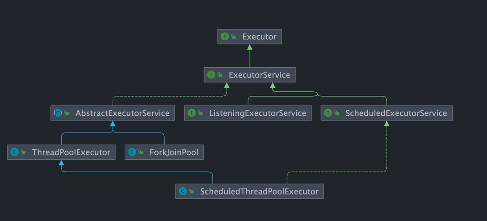
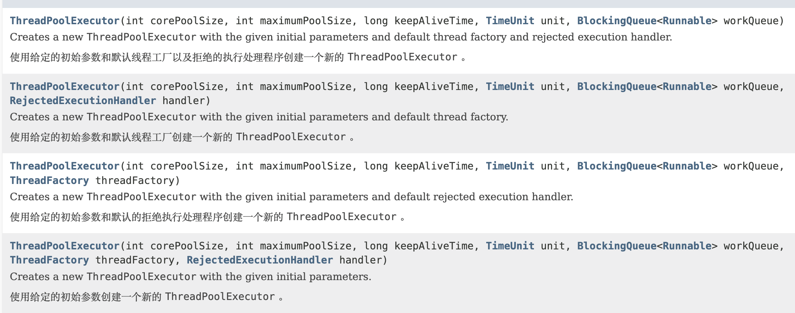
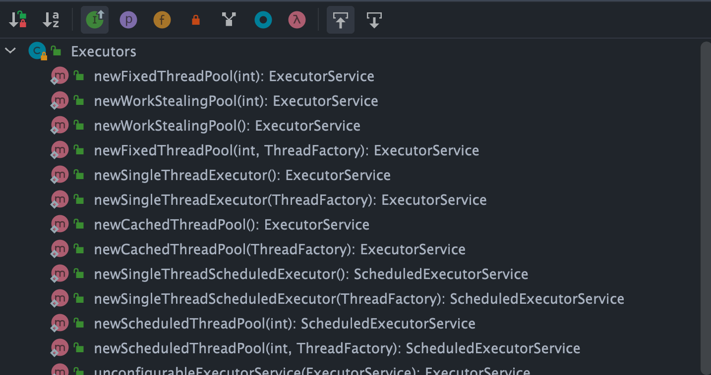

池化技术想必大家已经屡见不鲜了，线程池、数据库连接池、HTTP 连接池等等都是对这个思想的应用。池化技术的思想主要是为了减少每次获取资源的消耗，提高对资源的利用率。

这篇文章我会详细介绍一下线程池的基本概念以及核心原理。

# 一、线程池介绍

池化技术想必大家已经屡见不鲜了，线程池、数据库连接池、HTTP 连接池等等都是对这个思想的应用。池化技术的思想主要是为了减少每次获取资源的消耗，提高对资源的利用率。

线程池提供了一种限制和管理资源（包括执行一个任务）的方式。 每个线程池还维护一些基本统计信息，例如已完成任务的数量。使用线程池主要带来以下几个好处：

1. **降低资源消耗**：线程池里的线程是可以重复利用的。一旦线程完成了某个任务，它不会立即销毁，而是回到池子里等待下一个任务。这就避免了频繁创建和销毁线程带来的开销。
2. **提高响应速度**：因为线程池里通常会维护一定数量的核心线程（或者说“常驻工人”），任务来了之后，可以直接交给这些已经存在的、空闲的线程去执行，省去了创建线程的时间，任务能够更快地得到处理。
3. **提高线程的可管理性**：线程池允许我们统一管理池中的线程。我们可以配置线程池的大小（核心线程数、最大线程数）、任务队列的类型和大小、拒绝策略等。这样就能控制并发线程的总量，防止资源耗尽，保证系统的稳定性。同时，线程池通常也提供了监控接口，方便我们了解线程池的运行状态（比如有多少活跃线程、多少任务在排队等），便于调优。

# 二、Executor 框架介绍

`Executor` 框架是 Java5 之后引进的，在 Java 5 之后，通过 `Executor` 来启动线程比使用 `Thread` 的 `start` 方法更好，除了更易管理，效率更好（用线程池实现，节约开销）外，还有关键的一点：有助于避免 this 逃逸问题。

> this 逃逸是指在构造函数返回之前其他线程就持有该对象的引用，调用尚未构造完全的对象的方法可能引发令人疑惑的错误。

`Executor` 框架不仅包括了线程池的管理，还提供了线程工厂、队列以及拒绝策略等，`Executor` 框架让并发编程变得更加简单。

`Executor` 框架结构主要由三大部分组成：

**1、任务(`Runnable` /`Callable`)**

执行任务需要实现的 **`Runnable` 接口** 或 **`Callable`接口**。**`Runnable` 接口**或 **`Callable` 接口** 实现类都可以被 **`ThreadPoolExecutor`** 或 **`ScheduledThreadPoolExecutor`** 执行。

**2、任务的执行(`Executor`)**

如下图所示，包括任务执行机制的核心接口 **`Executor`** ，以及继承自 `Executor` 接口的 **`ExecutorService` 接口。`ThreadPoolExecutor`** 和 **`ScheduledThreadPoolExecutor`** 这两个关键类实现了 **`ExecutorService`** 接口。



这里提了很多底层的类关系，但是，实际上我们需要更多关注的是 `ThreadPoolExecutor` 这个类，这个类在我们实际使用线程池的过程中，使用频率还是非常高的。

**注意：** 通过查看 `ScheduledThreadPoolExecutor` 源代码我们发现 `ScheduledThreadPoolExecutor` 实际上是继承了 `ThreadPoolExecutor` 并实现了 `ScheduledExecutorService` ，而 `ScheduledExecutorService` 又实现了 `ExecutorService`，正如我们上面给出的类关系图显示的一样。

`ThreadPoolExecutor` 类描述:

```java
//AbstractExecutorService实现了ExecutorService接口
public class ThreadPoolExecutor extends AbstractExecutorService
```

`ScheduledThreadPoolExecutor` 类描述:

```java
//ScheduledExecutorService继承ExecutorService接口
public class ScheduledThreadPoolExecutor
        extends ThreadPoolExecutor
        implements ScheduledExecutorService
```

**3、异步计算的结果(`Future`)**

**`Future`** 接口以及 `Future` 接口的实现类 **`FutureTask`** 类都可以代表异步计算的结果。

当我们把 **`Runnable`接口** 或 **`Callable` 接口** 的实现类提交给 **`ThreadPoolExecutor`** 或 **`ScheduledThreadPoolExecutor`** 执行。（调用 `submit()` 方法时会返回一个 **`FutureTask`** 对象）

**`Executor` 框架的使用示意图**：


1. 主线程首先要创建实现 `Runnable` 或者 `Callable` 接口的任务对象。

2. 把创建完成的实现 `Runnable`/`Callable`接口的 对象直接交给 `ExecutorService` 执行: `ExecutorService.execute（Runnable command）`）或者也可以把 `Runnable` 对象或`Callable` 对象提交给 `ExecutorService` 执行（`ExecutorService.submit（Runnable task）`或 `ExecutorService.submit（Callable <T> task）`）。

3. 如果执行 `ExecutorService.submit（…）`，`ExecutorService` 将返回一个实现`Future`接口的对象（我们刚刚也提到过了执行 `execute()`方法和 `submit()`方法的区别，`submit()`会返回一个 `FutureTask 对象）。由于 FutureTask` 实现了 `Runnable`，我们也可以创建 `FutureTask`，然后直接交给 `ExecutorService` 执行。

4. 最后，主线程可以执行 `FutureTask.get()`方法来等待任务执行完成。主线程也可以执行 `FutureTask.cancel（boolean mayInterruptIfRunning）`来取消此任务的执行。

# ⭐️ 三、ThreadPoolExecutor 类介绍

线程池实现类 `ThreadPoolExecutor` 是 `Executor` 框架最核心的类。

## 1、线程池参数分析

`ThreadPoolExecutor` 类中提供的四个构造方法。我们来看最长的那个，其余三个都是在这个构造方法的基础上产生（其他几个构造方法说白点都是给定某些默认参数的构造方法比如默认制定拒绝策略是什么）。

```java
    /**
     * 用给定的初始参数创建一个新的ThreadPoolExecutor。
     */
    public ThreadPoolExecutor(int corePoolSize,//线程池的核心线程数量
                              int maximumPoolSize,//线程池的最大线程数
                              long keepAliveTime,//当线程数大于核心线程数时，多余的空闲线程存活的最长时间
                              TimeUnit unit,//时间单位
                              BlockingQueue<Runnable> workQueue,//任务队列，用来储存等待执行任务的队列
                              ThreadFactory threadFactory,//线程工厂，用来创建线程，一般默认即可
                              RejectedExecutionHandler handler//拒绝策略，当提交的任务过多而不能及时处理时，我们可以定制策略来处理任务
                               ) {
        if (corePoolSize < 0 ||
            maximumPoolSize <= 0 ||
            maximumPoolSize < corePoolSize ||
            keepAliveTime < 0)
            throw new IllegalArgumentException();
        if (workQueue == null || threadFactory == null || handler == null)
            throw new NullPointerException();
        this.corePoolSize = corePoolSize;
        this.maximumPoolSize = maximumPoolSize;
        this.workQueue = workQueue;
        this.keepAliveTime = unit.toNanos(keepAliveTime);
        this.threadFactory = threadFactory;
        this.handler = handler;
    }
```

下面这些参数非常重要，在后面使用线程池的过程中你一定会用到！所以，务必拿着小本本记清楚。

`ThreadPoolExecutor` 3 个最重要的参数：

- `corePoolSize` : 任务队列未达到队列容量时，最大可以同时运行的线程数量。
- `maximumPoolSize` : 任务队列中存放的任务达到队列容量的时候，当前可以同时运行的线程数量变为最大线程数。
- `workQueue`: 新任务来的时候会先判断当前运行的线程数量是否达到核心线程数，如果达到的话，新任务就会被存放在队列中。

`ThreadPoolExecutor`其他常见参数 :

- `keepAliveTime`:线程池中的线程数量大于 `corePoolSize` 的时候，如果这时没有新的任务提交，核心线程外的线程不会立即销毁，而是会等待，直到等待的时间超过了 `keepAliveTime`才会被回收销毁。
- `unit` : `keepAliveTime` 参数的时间单位。
- `threadFactory` :executor 创建新线程的时候会用到。
- `handler` :拒绝策略（后面会单独详细介绍一下）。

下面这张图可以加深你对线程池中各个参数的相互关系的理解（图片来源：《Java 性能调优实战》）：


## 2、线程池生命周期状态

`ThreadPoolExecutor` 使用 `ctl` 变量（`AtomicInteger` 类型）同时管理线程池的运行状态和工作线程数量。

线程池共有 5 种状态：

- **运行中（`RUNNING`）**：接受新任务，并处理队列中的任务。线程池创建后的初始状态。
- **关闭（`SHUTDOWN`）**：不再接受新任务，但会继续处理队列中已有的任务。调用 `shutdown()` 后进入。
- **停止（`STOP`）**：不接受新任务，不处理队列中的任务，并尝试中断正在执行的任务。调用 `shutdownNow()` 后进入。
- **整理中（`TIDYING`）**：所有任务已终止，工作线程数为 0，即将执行 `terminated()` 钩子方法。
- **已终止（`TERMINATED`）**：`terminated()` 方法执行完毕，线程池彻底终结。

状态只能单向流转：运行中（`RUNNING`）→ 关闭（`SHUTDOWN`）→ 整理中（`TIDYING`）→ 已终止（`TERMINATED`），或者运行中（`RUNNING`）→ 停止（`STOP`）→ 整理中（`TIDYING`）→ 已终止（`TERMINATED`）。在关闭（`SHUTDOWN`）状态下再调用 `shutdownNow()` 也会转为停止（`STOP`）。

`shutdown()` 是"温和关闭"——中断空闲线程，但队列中的任务仍会执行完毕。`shutdownNow()` 是"强制关闭"——尝试中断所有正在运行的线程，并将队列中未执行的任务以 `List<Runnable>` 返回。`terminated()` 是一个空的钩子方法，可以通过继承 `ThreadPoolExecutor` 来重写它，用于在线程池终止后做清理工作。

## 3、Worker 工作线程机制

`ThreadPoolExecutor` 将每个工作线程封装为内部类 `Worker`。`Worker` 继承了 AQS 并实现了 `Runnable` 接口。

**为什么 `Worker` 要继承 AQS？**

 `Worker` 实现了一个**不可重入的独占锁**，用于配合 `shutdown()` 区分线程是空闲还是正在工作——正在执行任务的 Worker 持有锁，`shutdown()` 对每个 Worker 尝试 `tryLock()`，失败则说明该线程正在工作，不会被中断。

**Worker 的生命周期：**

1. **创建**：`execute()` 判断需要新建线程时，调用 `addWorker()` 创建 `Worker` 实例，内部通过 `ThreadFactory` 创建线程。
2. **运行**：线程启动后进入 `runWorker()` 的 `while` 循环，通过 `getTask()` 不断从队列取任务执行。核心线程用 `workQueue.take()`（阻塞等待），非核心线程用 `workQueue.poll(keepAliveTime, unit)`（超时等待）。
3. **退出**：`getTask()` 返回 `null` 时 Worker 退出循环并清理。返回 `null` 的情况包括：线程池处于停止（`STOP`）状态、线程池处于关闭（`SHUTDOWN`）状态且队列为空、非核心线程等待超时、或运行时缩小了 `maximumPoolSize`。如果退出后工作线程数低于核心数，会自动补充一个新线程。

## 4、拒绝策略定义

如果当前同时运行的线程数量达到最大线程数量，并且队列也已经被放满了任务时（线程和队列都没空），`ThreadPoolExecutor` 定义一些策略:

- `ThreadPoolExecutor.AbortPolicy`：抛出 `RejectedExecutionException`来拒绝新任务的处理。

  > 📌 场景案例：订单系统
  >
  > ```java
  > executor.execute(() -> createOrder());
  > ```
  >
  > 当系统已经满载，直接报错：`RejectedExecutionException`
  >
  > 💥 影响
  >
  > - 调用方必须处理异常
  > - 否则直接导致接口报错（HTTP 500）
  >
  > ✅ 适用场景
  >
  > 👉 **不能丢任务，也不能降级**
  >
  > 例如：
  >
  > - 支付
  > - 核心交易
  > - 数据一致性强依赖

- `ThreadPoolExecutor.CallerRunsPolicy`：调用执行者自己的线程运行任务，也就是直接在调用`execute`方法的线程中运行(`run`)被拒绝的任务，如果执行程序已关闭，则会丢弃该任务。因此这种策略会降低对于新任务提交速度，影响程序的整体性能。如果你的应用程序可以承受此延迟并且你要求任何一个任务请求都要被执行的话，你可以选择这个策略。

  > 📌 场景案例：日志系统
  >
  > ```java
  > executor.execute(() -> writeLog());
  > ```
  >
  > 线程池满了之后，当前线程（比如 main / Tomcat 线程）执行：`main线程开始写日志...`
  >
  > 💡 核心效果：**反压（Back Pressure）**：调用者在此期间无法提交新任务，形成了一种天然的**反压（back-pressure）**机制
  >
  > 因为：👉 提交任务的线程被“拖慢了”
  >
  > 🔥 实际效果
  >
  > | 原来       | 现在       |
  > | ---------- | ---------- |
  > | 线程池处理 | 调用方处理 |
  > | 快速提交   | 被阻塞变慢 |
  >
  > ✅ 适用场景
  >
  > - 不允许丢任务
  > - 可以接受变慢
  >
  > 例如：
  >
  > - 日志系统
  > - 异步落库（但不能丢）
  >
  > ❗ 注意坑
  >
  > 如果你在 Web 服务中用：
  >
  > 👉 会拖慢请求线程（比如 Tomcat）

- `ThreadPoolExecutor.DiscardPolicy`：不处理新任务，直接丢弃掉。

  > 📌 场景案例：埋点统计
  >
  > ```java
  > executor.execute(() -> sendMetric());
  > ```
  >
  > 线程池满：👉 任务直接消失（无日志、无异常）
  >
  > 💥 风险
  >
  > 👉 **数据直接丢失且你不知道**
  >
  > ✅ 适用场景
  >
  > - 允许丢数据
  > - 非核心业务
  >
  > 例如：
  >
  > - 用户行为埋点
  > - 推荐系统曝光统计

- `ThreadPoolExecutor.DiscardOldestPolicy`：此策略将丢弃最早的未处理的任务请求。

  > 📌 场景案例：实时数据处理
  >
  > 队列中任务：
  >
  > ```
  > [任务A, 任务B]
  > ```
  >
  > 新任务 C 来了（线程池满）：
  >
  > 👉 执行：
  >
  > ```java
  > 丢弃 A
  > 队列变成 [任务B]
  > 加入 C → [任务B, 任务C]
  > ```
  >
  > 💡 本质
  >
  > 👉 **保新不保旧**
  >
  > ✅ 适用场景
  >
  > - 更关心“最新数据”
  >
  > 例如：
  >
  > - 实时监控
  > - UI刷新任务
  > - 股票行情推送
  >
  > ❗ 注意坑
  >
  > 👉 被丢弃的任务**完全不会执行**

### ⚖️ 四种策略对比总结

| 策略                | 是否丢任务 | 是否报错 | 特点     |
| ------------------- | ---------- | -------- | -------- |
| AbortPolicy         | ❌          | ✅        | 强制失败 |
| CallerRunsPolicy    | ❌          | ❌        | 降速执行 |
| DiscardPolicy       | ✅          | ❌        | 静默丢弃 |
| DiscardOldestPolicy | ✅（丢旧）  | ❌        | 保新任务 |

### 🧠 真实生产怎么选？

👉 一般建议：

| 场景      | 推荐策略            |
| --------- | ------------------- |
| 核心业务  | AbortPolicy         |
| 日志/异步 | CallerRunsPolicy    |
| 埋点/统计 | DiscardPolicy       |
| 实时系统  | DiscardOldestPolicy |

举个例子：Spring 通过 `ThreadPoolTaskExecutor` 或者我们直接通过 `ThreadPoolExecutor` 的构造函数创建线程池的时候，当我们不指定 `RejectedExecutionHandler` 拒绝策略来配置线程池的时候，默认使用的是 `AbortPolicy`。在这种拒绝策略下，如果队列满了，`ThreadPoolExecutor` 将抛出 `RejectedExecutionException` 异常来拒绝新来的任务 ，这代表你将丢失对这个任务的处理。如果不想丢弃任务的话，可以使用`CallerRunsPolicy`。`CallerRunsPolicy` 和其他的几个策略不同，它既不会抛弃任务，也不会抛出异常，而是将任务回退给调用者，使用调用者的线程来执行任务

```java
public static class CallerRunsPolicy implements RejectedExecutionHandler {

        public CallerRunsPolicy() { }

        public void rejectedExecution(Runnable r, ThreadPoolExecutor e) {
            if (!e.isShutdown()) {
                // 直接主线程执行，而不是线程池中的线程执行
                r.run();
            }
        }
    }
```

## 5、4 种拒绝策略的实际应用场景

上面介绍了 4 种内置拒绝策略的基本行为，下面结合实际生产经验，说明它们各自适合什么场景：

**`AbortPolicy`**：适用于对任务丢失零容忍的核心业务（如支付、转账）。任务被拒绝时调用方会收到 `RejectedExecutionException`，必须在业务代码中捕获并做补偿（如重试或持久化到数据库后补偿执行）。《阿里巴巴 Java 开发手册》指出，如果不做任何配置，队列满时会直接抛异常，开发者必须显式处理。

**`CallerRunsPolicy`**：适用于不允许丢弃任务、且允许降低提交速度的场景。由于任务在调用者线程中执行，调用者在此期间无法提交新任务，形成了一种天然的**反压（back-pressure）**机制。美团技术团队在《Java 线程池实现原理及其在美团业务中的实践》中提到，这是他们线上业务中较常使用的拒绝策略。但需要注意：如果提交任务的线程是 Web 容器的请求处理线程（如 Tomcat 的 Worker 线程），会导致该请求响应时间显著增加，在延迟敏感的场景中需谨慎。

**`DiscardPolicy`**：适用于任务允许丢失的非关键路径，如日志异步写入、监控指标上报。该策略完全静默（空实现），被拒绝的任务不会留下任何痕迹，排查问题时可能难以发现任务丢失。

**`DiscardOldestPolicy`**：适用于只关心最新数据、旧任务可被覆盖的场景，如实时行情推送、传感器数据采集。需要注意：如果使用了 `PriorityBlockingQueue`，`poll()` 弹出的是优先级最高的任务而非最旧的任务，可能导致重要任务被误丢。

**生产环境中的常见做法**：以上 4 种内置策略往往不能完全满足需求。Dubbo 框架自定义了 `AbortPolicyWithReport` 策略，在抛异常之外还会将被拒绝的任务信息 dump 到本地文件，方便事后排查。美团技术团队建议对线程池的拒绝次数进行监控和告警。常见的自定义策略思路包括：将被拒绝的任务写入数据库或消息队列后续补偿消费、递增监控计数器上报 Prometheus、或者调用 `workQueue.put(r)` 阻塞等待队列有空位（Netty 中有类似实现）。

### 🧪测试案例

```java
import java.util.concurrent.*;

public class ThreadPoolRejectDemo {

    public static void main(String[] args) throws InterruptedException {

        testPolicy("AbortPolicy", new ThreadPoolExecutor.AbortPolicy());
        testPolicy("CallerRunsPolicy", new ThreadPoolExecutor.CallerRunsPolicy());
        testPolicy("DiscardPolicy", new ThreadPoolExecutor.DiscardPolicy());
        testPolicy("DiscardOldestPolicy", new ThreadPoolExecutor.DiscardOldestPolicy());
    }

    private static void testPolicy(String name, RejectedExecutionHandler handler) throws InterruptedException {

        System.out.println("\n==============================");
        System.out.println("测试策略: " + name);
        System.out.println("==============================");

        ThreadPoolExecutor executor = new ThreadPoolExecutor(
                2,                      // core
                2,                      // max（故意设置一样，方便触发）
                10,
                TimeUnit.SECONDS,
                new ArrayBlockingQueue<>(2), // 队列容量2
                Executors.defaultThreadFactory(),
                handler
        );

        // 提交 6 个任务（一定会触发拒绝策略）
        for (int i = 1; i <= 6; i++) {
            final int taskId = i;

            try {
                executor.execute(() -> {
                    String threadName = Thread.currentThread().getName();
                    System.out.println("任务 " + taskId + " 执行线程: " + threadName);
                    try {
                        Thread.sleep(2000); // 模拟任务执行耗时
                    } catch (InterruptedException e) {
                        e.printStackTrace();
                    }
                });
                System.out.println("提交任务 " + taskId + " 成功");
            } catch (Exception e) {
                System.out.println("任务 " + taskId + " 被拒绝: " + e);
            }
        }

        executor.shutdown();
        executor.awaitTermination(10, TimeUnit.SECONDS);
    }
}
```

> ### 🔍一、典型输出（重点解读）
>
> #### 1️⃣ AbortPolicy（默认）
>
> ```java
> 提交任务 1 成功
> 提交任务 2 成功
> 提交任务 3 成功
> 提交任务 4 成功
> 任务 5 被拒绝: RejectedExecutionException
> 任务 6 被拒绝: RejectedExecutionException
> ```
>
> 👉 特点：
>
> - 超出的任务直接抛异常
> - **强制失败**
>
> #### 2️⃣ CallerRunsPolicy
>
> ```java
> 提交任务 1 成功
> 提交任务 2 成功
> 提交任务 3 成功
> 提交任务 4 成功
> 任务 5 执行线程: main
> 任务 6 执行线程: main
> ```
>
> 👉 特点：
>
> - 被拒绝的任务由 **主线程执行**
> - 明显看到：`main`
>
> #### 3️⃣ DiscardPolicy
>
> ```java
> 提交任务 1 成功
> 提交任务 2 成功
> 提交任务 3 成功
> 提交任务 4 成功
> 提交任务 5 成功
> 提交任务 6 成功
> ```
>
> 但会发现：👉 **任务5、6根本没执行（悄悄丢了）**
>
> #### 4️⃣ DiscardOldestPolicy
>
> ```java
> 提交任务 1 成功
> 提交任务 2 成功
> 提交任务 3 成功
> 提交任务 4 成功
> 提交任务 5 成功
> 提交任务 6 成功
> ```
>
> 但执行顺序可能变成：
>
> ```java
> 任务 3 执行
> 任务 4 执行
> 任务 5 执行
> 任务 6 执行
> ```
>
> 👉 说明：任务1、2 被“踢掉了”
>
> ### 🧠 二、为什么一定会触发拒绝？
>
> 配置是关键👇
>
> ```java
> core = 2
> max = 2
> queue = 2
> 总容量 = 4
> ```
>
> 但提交：
>
> ```java
> 6 个任务
> ```
>
> 👉 多出来的 2 个任务 → 必触发拒绝策略

### 🚀自定义拒绝策略（生产常用）

很多情况不会直接用默认策略，而是**自定义**：

```
class MyRejectHandler implements RejectedExecutionHandler {

    @Override
    public void rejectedExecution(Runnable r, ThreadPoolExecutor executor) {
        System.out.println("❗任务被拒绝，记录日志 + 告警");

        // 可以做：
        // 1. 记录日志
        // 2. 写入数据库
        // 3. 发送报警（钉钉/邮件）
        // 4. 降级处理
    }
}
```

使用：

```
new ThreadPoolExecutor(
        2, 2, 10, TimeUnit.SECONDS,
        new ArrayBlockingQueue<>(2),
        new MyRejectHandler()
);
```

### 🧠 一句话总结

👉 **拒绝策略不是“异常情况”，而是线程池“过载保护机制”的核心设计。**

## 6、线程池创建的两种方式

在 Java 中，创建线程池主要有两种方式：

**方式一：通过 `ThreadPoolExecutor` 构造函数直接创建 (推荐)**

这是最推荐的方式，因为它允许开发者明确指定线程池的核心参数，对线程池的运行行为有更精细的控制，从而避免资源耗尽的风险。

**方式二：通过 `Executors` 工具类创建 (不推荐用于生产环境)**

`Executors`工具类提供的创建线程池的方法如下图所示：



可以看出，通过`Executors`工具类可以创建多种类型的线程池，包括：

- `FixedThreadPool`：固定线程数量的线程池。该线程池中的线程数量始终不变。当有一个新的任务提交时，线程池中若有空闲线程，则立即执行。若没有，则新的任务会被暂存在一个任务队列中，待有线程空闲时，便处理在任务队列中的任务。
- `SingleThreadExecutor`： 只有一个线程的线程池。若多余一个任务被提交到该线程池，任务会被保存在一个任务队列中，待线程空闲，按先入先出的顺序执行队列中的任务。
- `CachedThreadPool`： 可根据实际情况调整线程数量的线程池。线程池的线程数量不确定，但若有空闲线程可以复用，则会优先使用可复用的线程。若所有线程均在工作，又有新的任务提交，则会创建新的线程处理任务。所有线程在当前任务执行完毕后，将返回线程池进行复用。
- `ScheduledThreadPool`：给定的延迟后运行任务或者定期执行任务的线程池。

《阿里巴巴 Java 开发手册》强制线程池不允许使用 `Executors` 去创建，而是通过 `ThreadPoolExecutor` 构造函数的方式，这样的处理方式让写的同学更加明确线程池的运行规则，规避资源耗尽的风险

`Executors` 返回线程池对象的弊端如下(后文会详细介绍到)：

- `FixedThreadPool` 和 `SingleThreadExecutor`:使用的是阻塞队列 `LinkedBlockingQueue`，任务队列最大长度为 `Integer.MAX_VALUE`，可以看作是无界的，可能堆积大量的请求，从而导致 OOM。
- `CachedThreadPool`:使用的是同步队列 `SynchronousQueue`, 允许创建的线程数量为 `Integer.MAX_VALUE` ，如果任务数量过多且执行速度较慢，可能会创建大量的线程，从而导致 OOM。
- `ScheduledThreadPool` 和 `SingleThreadScheduledExecutor`:使用的无界的延迟阻塞队列`DelayedWorkQueue`，任务队列最大长度为 `Integer.MAX_VALUE`,可能堆积大量的请求，从而导致 OOM。

```java
public static ExecutorService newFixedThreadPool(int nThreads) {
    // LinkedBlockingQueue 的默认长度为 Integer.MAX_VALUE，可以看作是无界的
    return new ThreadPoolExecutor(nThreads, nThreads,0L, TimeUnit.MILLISECONDS,new LinkedBlockingQueue<Runnable>());

}

public static ExecutorService newSingleThreadExecutor() {
    // LinkedBlockingQueue 的默认长度为 Integer.MAX_VALUE，可以看作是无界的
    return new FinalizableDelegatedExecutorService (new ThreadPoolExecutor(1, 1,0L, TimeUnit.MILLISECONDS,new LinkedBlockingQueue<Runnable>()));

}

// 同步队列 SynchronousQueue，没有容量，最大线程数是 Integer.MAX_VALUE`
public static ExecutorService newCachedThreadPool() {

    return new ThreadPoolExecutor(0, Integer.MAX_VALUE,60L, TimeUnit.SECONDS,new SynchronousQueue<Runnable>());

}

// DelayedWorkQueue（延迟阻塞队列）
public static ScheduledExecutorService newScheduledThreadPool(int corePoolSize) {
    return new ScheduledThreadPoolExecutor(corePoolSize);
}
public ScheduledThreadPoolExecutor(int corePoolSize) {
    super(corePoolSize, Integer.MAX_VALUE, 0, NANOSECONDS,
          new DelayedWorkQueue());
}
```

