# 一、时序数据库

## 1、定义

时序数据是随时间不断产生的一系列数据，简单来说，就是带 **时间戳** 的数据。时序数据库 (Time Series Database，TSDB) 是优化用于摄取、处理和存储时间戳数据的数据库。此类数据可能包括来自服务器和应用程序的指标、来自物联网传感器的读数、网站或应用程序上的用户交互或金融市场上的交易活动。

时序数据的主要数据属性如下：

- 每个 数据点 都包含用于索引、聚合和采样的时间戳。该数据也可以是多维的和相关的；
- 写多读少，需要支持秒级和毫秒级甚至纳秒级高频写入；查询通常是多维聚合查询，对查询的延迟要求比较高
- **数据的汇总视图（例如，下采样或聚合视图、趋势线）可能比单个数据点提供更多的洞察力。例如，考虑到网络不可靠性或传感器读数异常，可能会在一段时间内的某个平均值超过阈值时设置警报，而不是在单个数据点上这样做；**
- 分析数据通常需要在一段时间内访问它（例如，给我过去一周的点击率数据）；

虽然其他数据库也可以在数据规模较小时一定程度上处理时间序列数据，但 TSDB 可以更有效地处理随时间推移的数据摄取、压缩和聚合。以车联网场景为例，20000辆车，每个车60个指标，假设每秒采集一次，那么每秒将上报20000 * 60 = 1200000指标值，即120W数据指标值每秒，每个指标值为16字节（假设仅包括8字节时间戳和8字节的浮点数），则每小时将产生64GB左右的数据。而实际上每个指标值还会附带 **标签** 等额外数据，实际需要存储空间会更大。

**简而言之，时序数据库是专门用于存储和处理时间序列数据的数据库，支持时序数据高效读写、高压缩存储、插值和聚合等功能。**

## 2、时序数据库相关概念

时序数据库是专门处理时序数据的数据库，因此其相关概念是和时序数据紧密联系的，下面是时序数据库的一些基本概念。

- **度量 Metric**： 

  Metric 类似关系型数据库里的表（Table），代表一系列同类时序数据的集合，例如为空气质量传感器建立一个 Table，存储所有传感器的监测数据。

- **标签 Tag**：

  Tag 描述数据源的特征，通常不随时间变化，例如传感器设备，包含设备 Device Id、设备所在的 Region 等 Tag 信息，数据库内部会自动为 Tag 建立索引，支持根据 Tag 来进行多维检索查询；Tag 由 Tag Key、Tag Value 组成，两者均为 String 类型。

- **量测值 Field**：

  Field描述数据源的量测指标，通常随着时间不断变化，例如传感器设备包含温度、湿度等Field；

- **时间戳 Timestamp**：

  Timestamp 代表数据产生的时间点，可以写入时指定，也可由系统自动生成；  

- **数据点Data Point**: 

  数据源在某个时间产生的某个量测指标值（Field Value）称为一个数据点，数据库查询、写入时按数据点数来作为统计指标；

- **时间线 Time Series** ：

  数据源的某一个指标随时间变化，形成时间线，Metric + Tags + Field 组合确定一条时间线；针对时序数据的计算包括降采样、聚合（sum、count、max、min等）、插值等都基于时间线维度进行；

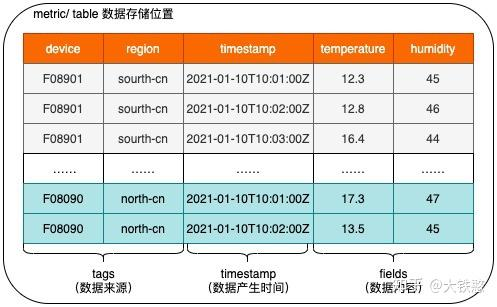

## 3、时序数据库应用场景

时序数据库的应用场景在物联网和互联网APM等场景应用比较多，下面是列举了一些时序数据库的应用场景，但不是全部：

- **公共安全**：上网记录、通话记录、个体追踪、区间筛选；

- **电力行业**：智能电表、电网、发电设备的集中监测；

* **互联网**：服务器/应用监测、用户访问日志、广告点击日志；

* **物联网**：电梯、锅炉、机械、水表等各种联网设备；

* **交通行业**：实时路况、路口流量监测、卡口数据；

* **金融行业**：交易记录、存取记录、ATM、POS机监测；

## 4、常见时序数据库


# 二、InfluxDB 安装

DBeaver企业版：https://blog.csdn.net/rothchil/article/details/125623705

入门：

https://blog.csdn.net/zhebushibiaoshifu/article/details/142604814

https://www.cnblogs.com/xm123/p/18663411

https://blog.csdn.net/qq_44766883/article/details/131511821

## 1、下载

需要下载两样东西：`influxd.exe` 数据库的服务端 和 `influx.exe`连接influx数据库用的cli工具

地址：https://influxdb.org.cn/downloads/

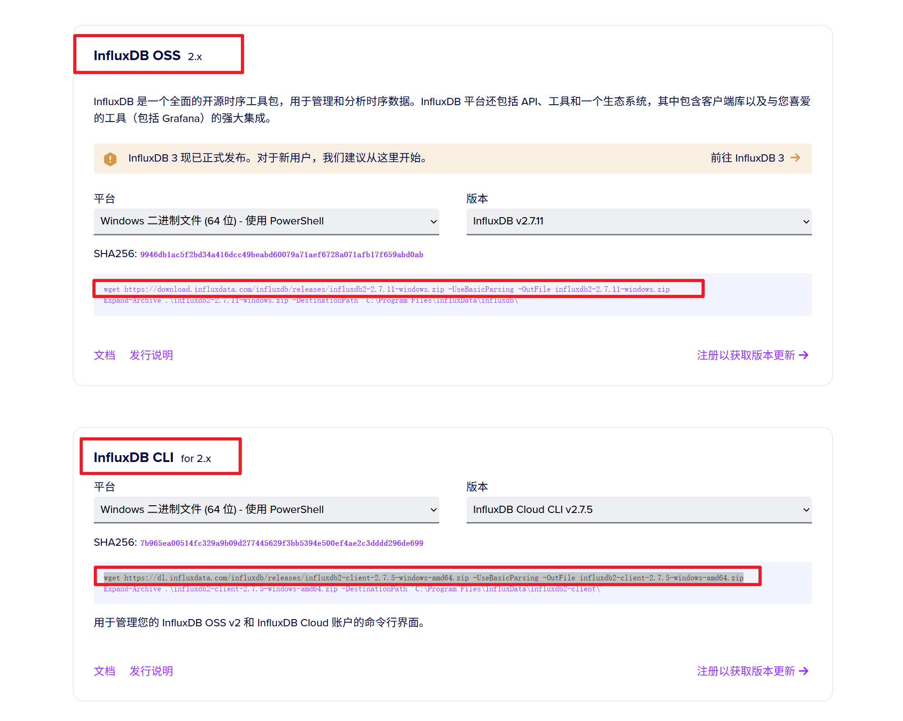

在安装路径中，通过 PowerShell 执行2个下载命令

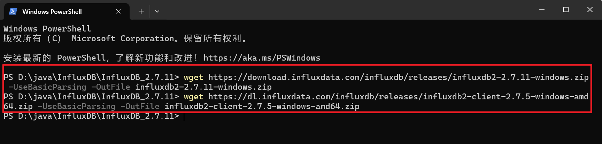

下载解压后，将2个`.exe`放到同一目录下

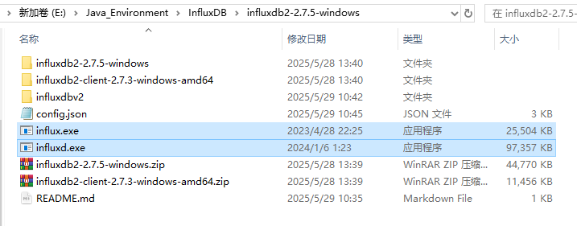

## 2、启动

在该目录下打开命令窗口，启动`influxd.exe`，即可启动 InfluxDB服务 ：

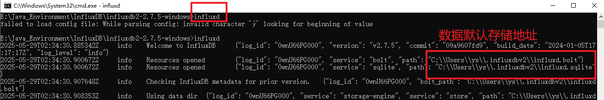

打开网址：`http://localhost:8086`

输入一些基本信息，点击Continue

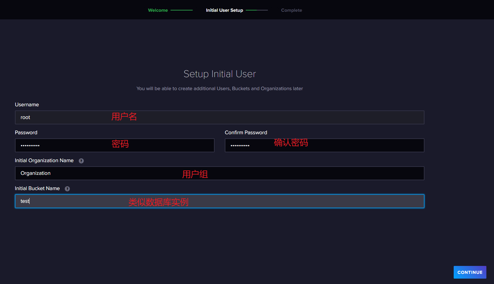

保存 token，并选择 快速开始：

> ⚠注：
>
> - 此版本的 Web UI 未提供后续查看token的功能，因此需此时就自己保存。token 会涉及其它的配置，例如Java连接、Grafana连接、 CLI 工具配置登录等。
>
> - 否则需要创建一个新的token，并更新与token相关的配置。

token【user: root】：

```
aK6x2Y4pfgKBX9vG1LZxTvakVV9mXqygt-6v3rWKlR4w_a1R7sCxWANixU2kxBceJnr-vbMf__a9ufnLzL-c0g==
```

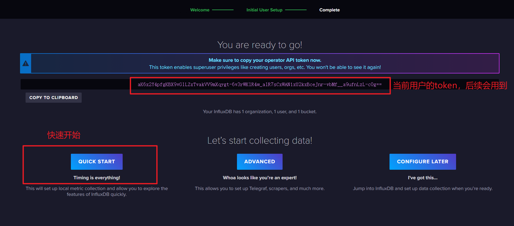

创建完成以后，进入到主页，可以看到它支持的客户端，支持的方案有很多，也可以支持从消息队列、系统日志、其他数据库等地方进行导入或写入数据

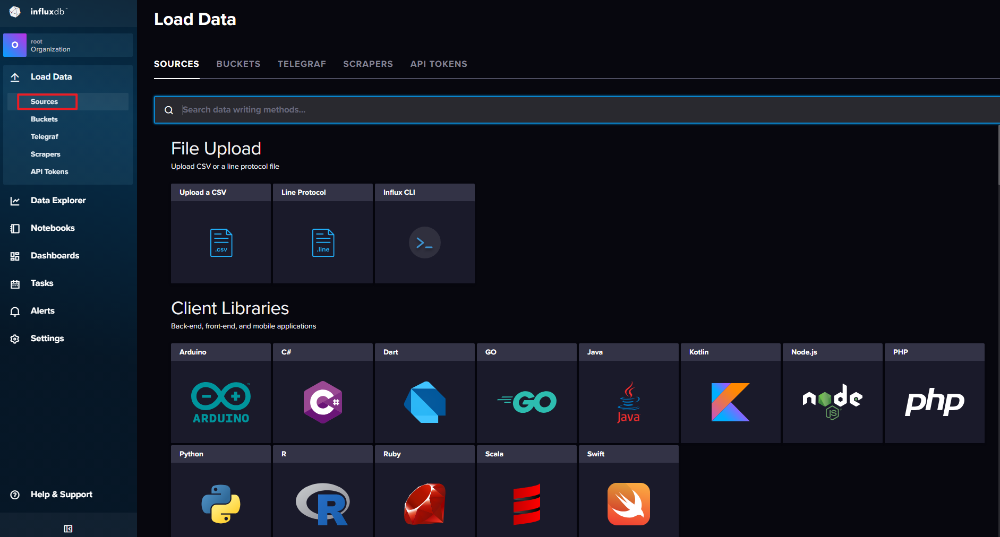

找到 `API TOKENS` 选项，这里会生成用户的一个唯一token信息，用来写代码时候会用到。

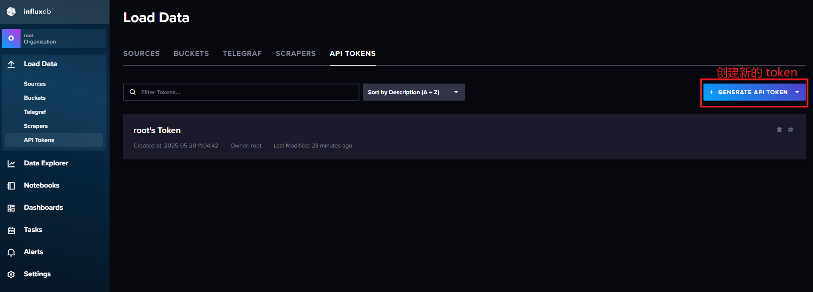

## 3、修改配置文件

通过 `influx.exe` 客户端获取当前配置，需要之前保存的 token 值作为 `--token ""` 的参数值。

进入 `influx.exe` 客户端所在目录，命令行中输入如下命令（引号内替换为自己的token）后，会在当前目录生成一个 `.json` 文件。

```
.\influx server-config --token "aK6x2Y4pfgKBX9vG1LZxTvakVV9mXqygt-6v3rWKlR4w_a1R7sCxWANixU2kxBceJnr-vbMf__a9ufnLzL-c0g==" > config.json
```

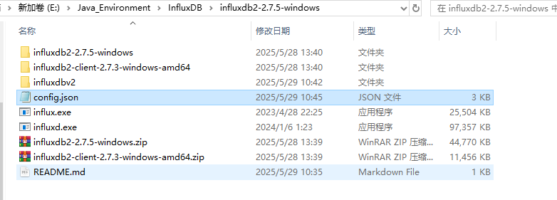

配置文件中，默认的数据存储相关内容如下：

```json
{
	"bolt-path": "C:\\Users\\ys\\.influxdbv2\\influxd.bolt",
	"engine-path": "C:\\Users\\ys\\.influxdbv2\\engine",
	"sqlite-path": "C:\\Users\\ys\\.influxdbv2\\influxd.sqlite",
}
```

- `bolt-path` ： InfluxDB 的数据库存储路径，存储了内部的数据库文件。
- `engine-path`：存储与查询引擎相关的数据文件路径。
- `sqlite-path`：存储 SQLite 数据库文件的路径，用于存储一些元数据。

修改存储路径后，重启 InfluxDB 服务 `influxd.exe`，该配置文件会被自动加载和执行。

由于修改了配置文件，InfluxDB 服务 `influxd.exe` 会在新路径中生成上述的存储文件，因此需要再次登录和配置用户、数据表等内容。

⚠如果配置文件的编码格式有问题，则会出现下图错误，配置文件的编码格式修改为 `UTF-8` 即可

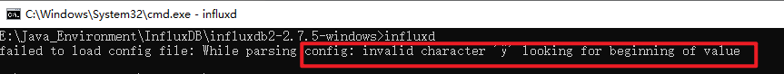

## 4、介绍

### 4.1、架构

大体上，数据的应用可以分为 4 步走：

- 数据采集
- 存储
- 查询（包括聚合操作）
- 报警

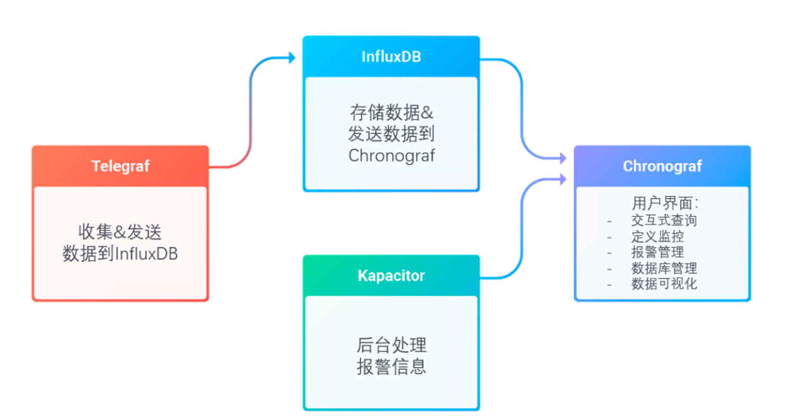

 InfluxData 在 InfluxDB**1.X** 的时候推出了 `TICK 生态`来推出start 全套的解决方案。

**TICK**4 个字母分别对应 4 个组件: 

- **T** : Telegraf - 数据采集组件，收集&发送数据到 InfluxDB。
- **I** : InfluxDB - 存储数据&发送数据到Chronograf
- **C** : Chronograf - 总的用户界面，起到总的管理功能。
- **K** : Kapacitor - 后台处理报警信息。

到了 **2.x**，TICK 进一步融合，ICK 的功能全部融入了 InfluxDB，仅需安装 InfluxDB 就能得到一个管理 页面，而且附带了定时任务和报警功能。

## 5、时序数据库中的数据模型


# 三、InfluxDB 生成服务（Windows端-NSSM）

使用 `NSSM`工具将 `influxd.exe` 包装为一个服务，并开机自启，免去每次手动启动 InfluxDB 的步骤

**NSSM (Non-Sucking Service Manager)** 是一个非常轻量且高效的工具，用于将任何普通的 `.exe` 程序转化为 Windows 服务。它解决了许多传统 Windows 服务管理工具（如 `sc`、`srvany`）的问题，提供了更加灵活和稳定的服务管理功能。

下载地址:https://nssm.cc/download

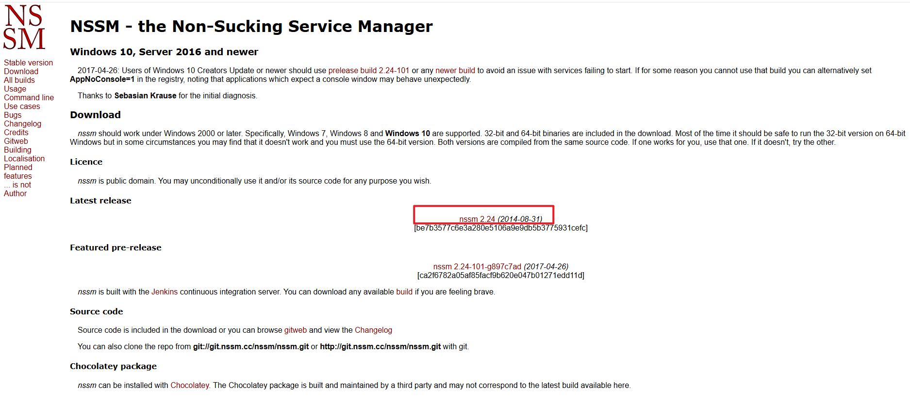

## 1、NSSM 配置服务

进入解压后的目录，选择对应系统的启动服务（win64）

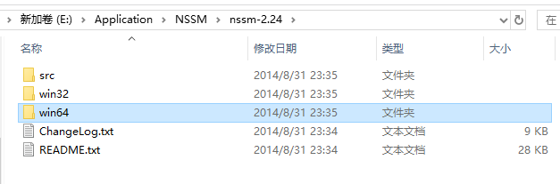

以**管理员身份**打开 `nssm.exe` 所在目录的命令行，执行服务注册命令 `nssm install [服务名] [程序路径]`，将 `Influxd.exe` 注册为服务。 

```cmd
nssm install InfluxDBService "E:\Java_Environment\InfluxDB\influxdb2-2.7.5-windows\influxd.exe"
```

或者通过命令  `nssm install [服务名]` 不指定路径，使用 NSSM 的 GUI界面 来选择需要被注册为服务的 `.exe` 路径

```cmd
nssm install InfluxDBService
```

可以看到，服务已经注册成功，并正常运行。

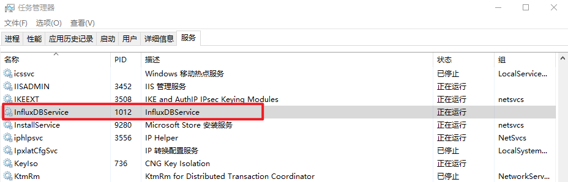

InfluxDB的服务端（`http://127.0.0.1:8086/`）能通过端口正常访问。

如果想要修改服务配置，通过 `nssm edit [服务名]` ，打开NSSM的GUI界面进行编辑。

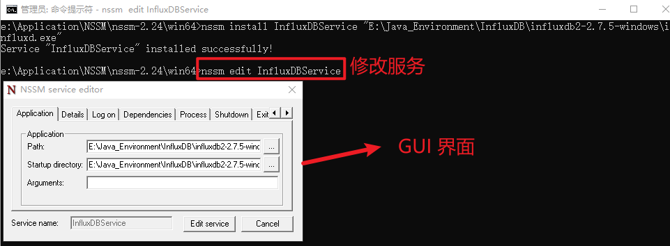

如果想要移除服务，通过命令 `nssm remove [服务名]` 的方式卸载。

# 四、InfluxDB 连接

## 1、Web UI 连接

在 Data Explore 中，将查询模式切换为 `Query Builder` ，查询刚才新建的 `test` Bucket ，查询范围为页面中指定的起始范围，Flux语句示例如下：

```json
from(bucket:"test")
    |> range(start: v.timeRangeStart, stop: v.timeRangeStop)
```

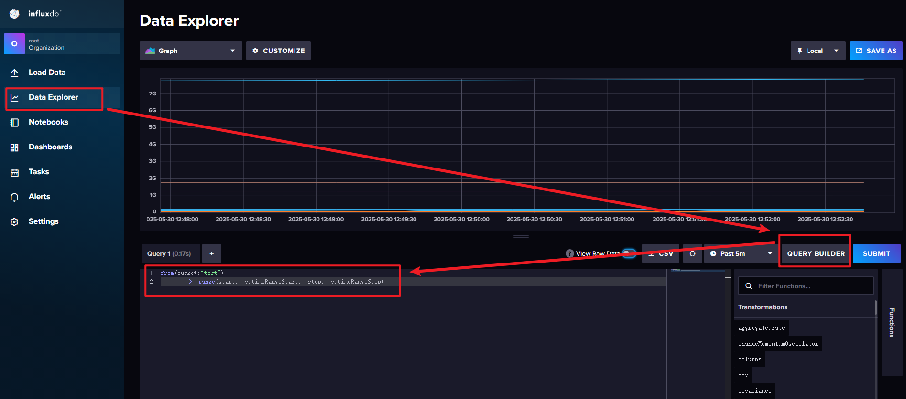

提交查询后，看到查询的结果，可以选择查看原始数据 Raw Data，也可以选择不同的展示模式。

## 2、Postman 连接

Postman 需要以 `Post` 的方式请求连接，连接需要以下参数

- **Params**

  - **org**

    连接用户所属的组织

    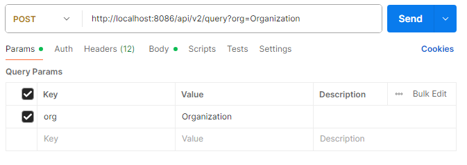

- **Headers**

  - **Authorization**

    当前登录授权为Token方式，因此格式为：`[Token] [token值]` 

    ⚠ `token值`前面的的 `Token` 不可以省略，否则查询失败

    ```
    Token aK6x2Y4pfgKBX9vG1LZxTvakVV9mXqygt-6v3rWKlR4w_a1R7sCxWANixU2kxBceJnr-vbMf__a9ufnLzL-c0g==
    ```

  - **Content-Type**

    ```
    application/vnd.flux
    ```

  - **Accept**

    ```
    application/json
    ```

    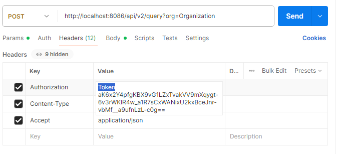

- **Bodys**

  请求的Flux语句，选择为 raw - text 或 raw - json 

  ```
  from(bucket: "test")
    |> range(start: -10s)
  ```

  ⚠ 如果查询范围太大，导致数据量太大，Postman 会请求失败，如下图所示

  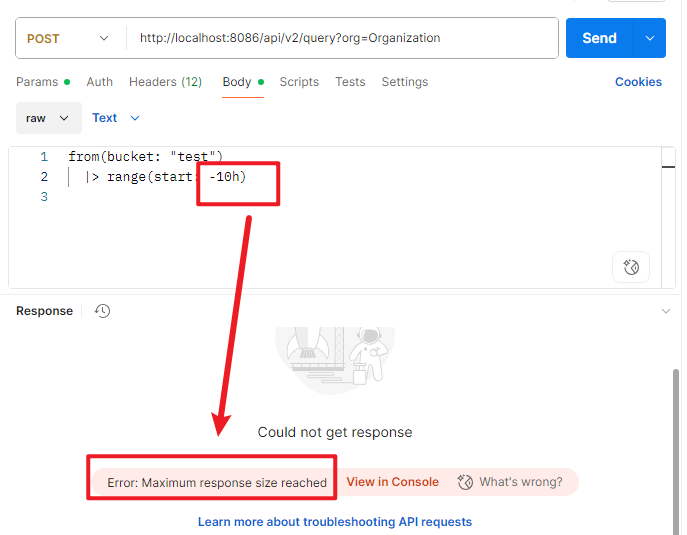

  请求成功后，显示数据如下：

  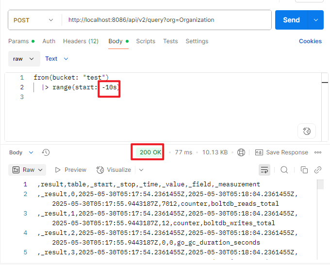

# 五、写入数据

## 1、行协议 Protocol

### 1.1、介绍

InfluxDB行协议是InfluxDB数据库独创的一种数据格式，它由纯文本构成，只要数据符合这种格式，就能使用InfluxDB的HTTP API将数据写入数据库。 

在InfluxDB行协议中，一条数据和另一条数据之间使用换行符分隔，所以一行就是一条数据。 一行数据由下面4种元素构成：

- **measurement（测量名称）**

	- ✅必需
	- 在 InfluxDB 行协议中，测量名称不可省略。
	- 大小写敏感，不可以用下划线_打头

- **Tag Set（标签集）**

	标签应该用在一些值的范围有限（可枚举）的，不太会变动的属性上。比如传感器的类型 和 id 等等。在 InfluxDB 中一个 Tag 相当于一个索引。给数据点加上 Tag 有利于将来对数据进行检索。但是如果 索引太多了，就会减慢数据的插入速度。

	- ❌可选
	- 键值关系使用=表示。**多个键值**对之间使用英文逗号 , 分隔
	- 标签的键和值都区分大小写。标签的键不能以下划线 _ 开头
	- 键的数据类型：字符串。值的数据类型：字符串

- **Field Set（字段集）**

	- ✅必需
	- 一个数据点上所有的字段键值对，键是字段名，值是数据点的值。
	- 一个数据点至少要有一个字段。
	- 字段集的键是大小写敏感的。
	- 字段键的数据类型：字符串。值的数据类型：浮点数 | 整数 | 无符号整数 | 字符串 | 布尔值

- **Timestamp（时间戳**）

	- ❌可选
	- 数据点的 Unix 时间戳，每个数据点都可以制定自己的时间戳。
	- 如果时间戳没有指定。那么 InfluxDB 就使用当前系统的时间戳。
	- 数据类型：Unix timestamp
	- 如果数据里的时间戳不是以**纳秒**为单位的，那么需要在数据写入时指定时间戳的精度。
	- 在线转换工具：[时间戳(Unix timestamp)转换工具 - 在线工具](https://tool.lu/timestamp/)

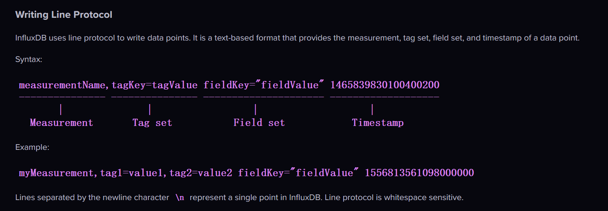

### 1.2、操作

选择上传数据中的 `Line Protocol`

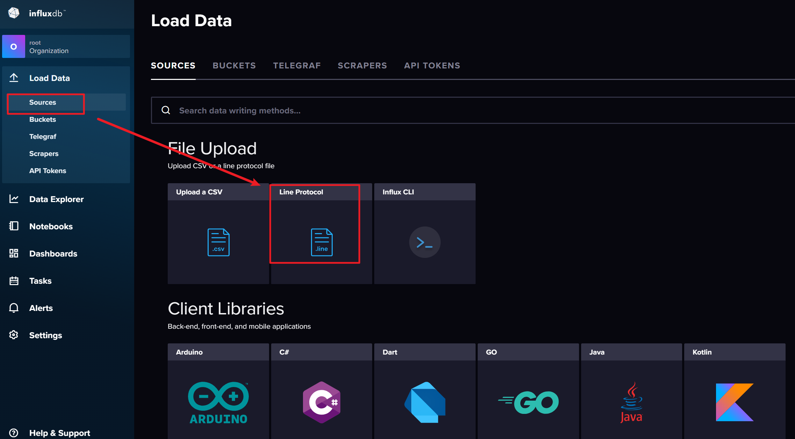

选择（或创建）桶，根据 `Line Protocol` 语法，写入数据

```
user,name=gc age=999 1748790691
```

⚠选填时间戳时，**需要选择对应单位的时间戳**，否则插入数据失败

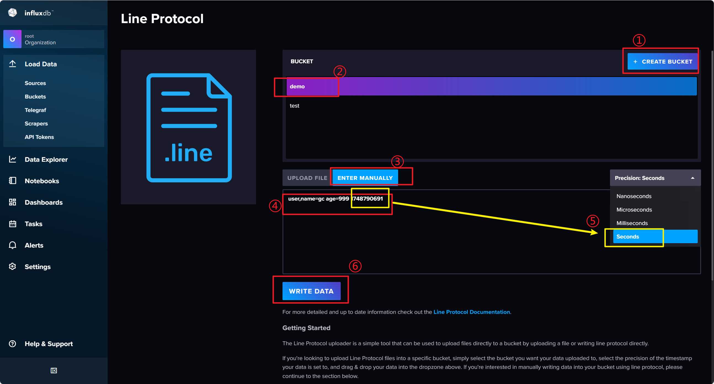

其中的标签集（如 name=gc）和 时间戳（如 1748965840）可以省略。

### 1.3、查询数据

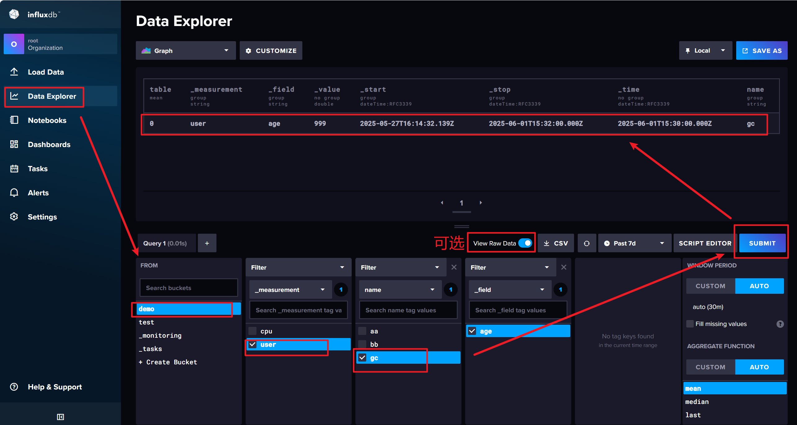

## 2、Telegraf

Telegraf是InfluxDB生态中的一个数据采集组件，它可以讲各种时序数据自动采集到 InfluxDB。

### 2.1、安装

#### 2.1.1、地址

https://influxdb.org.cn/downloads/

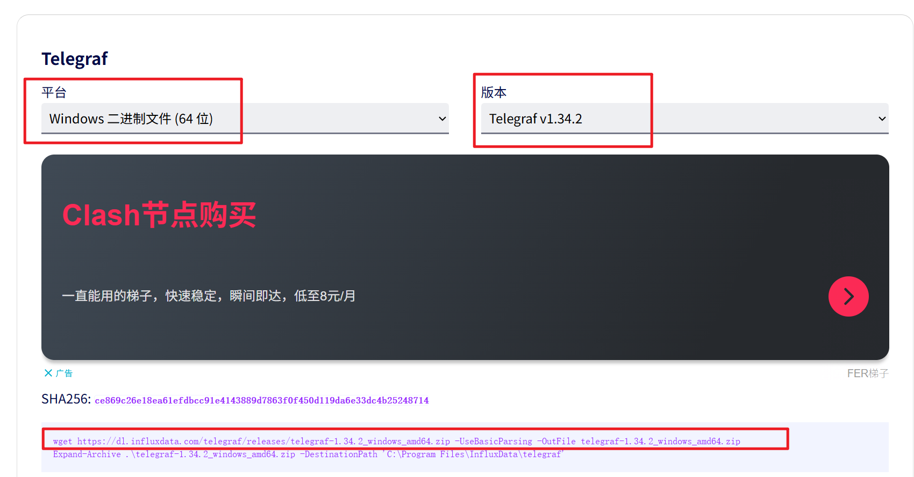

#### 2.1.2、安装

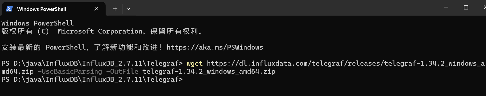

### 2.2、配置

InfluxDB 中，选择 “Load Data” –> ”Telegraf” ，新建配置，选择 Bucket。

以监控 CPU 为例，进行如下配置：

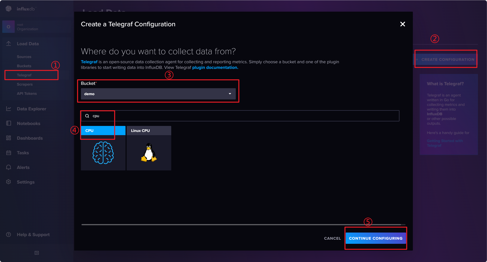

编辑配置名和描述，并记录下 Telegraf 的 **输入配置**、**生成的 Telegraf 的 Token**：

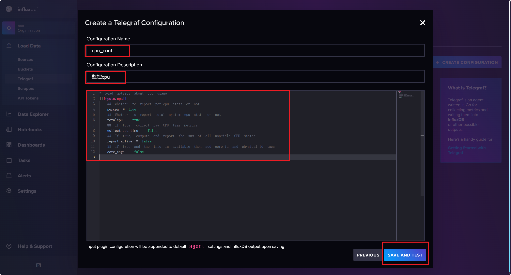

**输出配置**：

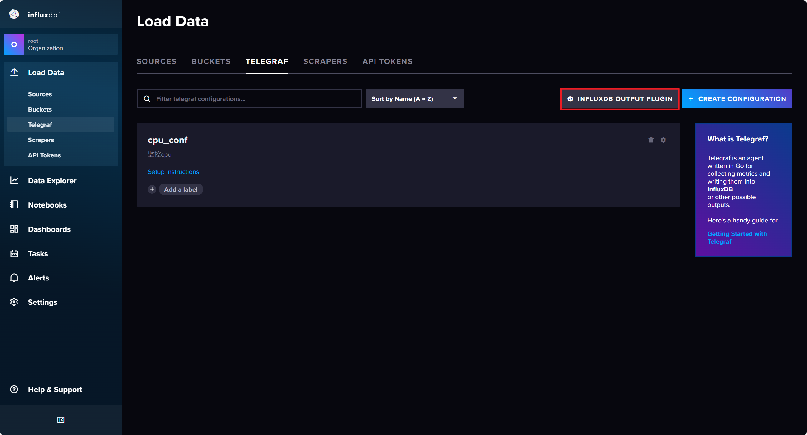

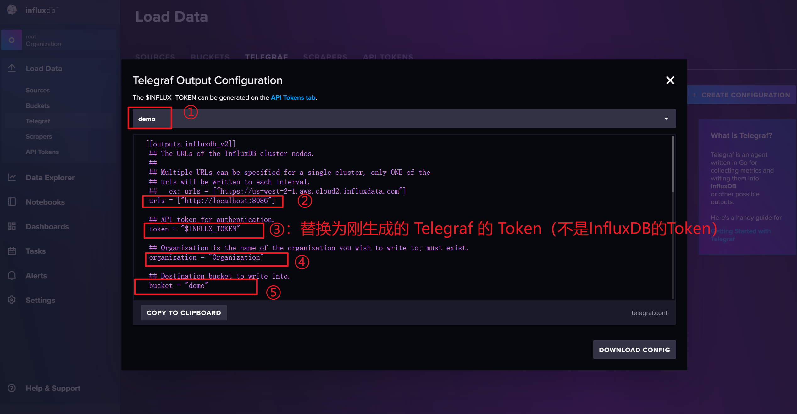

将 **输入配置** 和 **输出配置** 替换到解压后的 Telegraf 的 `telegraf.conf` 文件中

```json
[[inputs.cpu]]
  percpu = true
  totalcpu = true
  collect_cpu_time = false
  report_active = false 
 
 [[outputs.influxdb_v2]]
  ## The URLs of the InfluxDB cluster nodes.
  ##
  ## Multiple URLs can be specified for a single cluster, only ONE of the
  ## urls will be written to each interval.
  ##   ex: urls = ["https://us-west-2-1.aws.cloud2.influxdata.com"]
  urls = ["http://localhost:8086"]

  ## API token for authentication.
  token = "YOO07Dsd6dBmG4LA3bEhagrymndlgVUQt1gSDMrP8bg3Mtf8EjCPdmxcTdApLOhuVdCYU1EE_sDe8yhxjPh9pA=="

  ## Organization is the name of the organization you wish to write to; must exist.
  organization = "Organization"

  ## Destination bucket to write into.
  bucket = "demo"

```

### 2.3、运行

运行刚解压的 `telegraf.exe` 

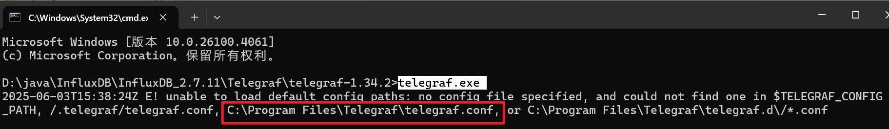

发现在指定路径 `C:\Program Files\Telegraf\` 中没有配置文件，新建该路径的文件夹，将配置文件`telegraf.conf`放置其中，再次运行。

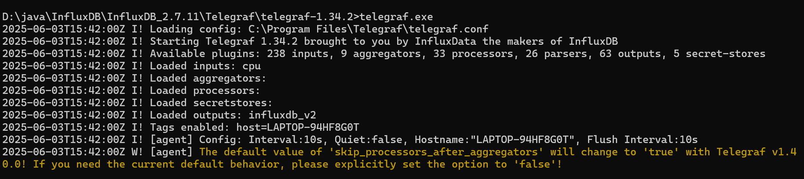

可以看到，根据配置文件，目前的采集频率（Flush Interval）为 10s。

### 2.4、查询

同 Protocol 查询。


# 六、Flux 语法

使用 Flux 查询 InfluxDB 时，可以使用三个主要函数：

- from（）：查询 InfluxDB 存储桶中的数据。

	```flux
	from(bucket: "bucket_name")
	```

	

- range（）： 根据时间限制筛选数据。Flux 需要“有界”查询，即查询 限制在特定的时间范围内。 

- filter（）： 根据列值筛选数据。每一行由r表示，每一列由r的一个属性表示。 可以应用多个后续筛选器。

	filter ()将每一行读取为名为 r 的记录。在 r 记录中，每个键值对表示一列及其值。例如:

	```flux
	 r = {
	    _time: 2020-01-01T00:00:00Z,
	    _measurement: "home",
	    room: "Kitchen",
	    _field: "temp",
	    _value: 21.0,
	 }
	```

- 前向操作符 ： Flux使用管道前向操作符(|>)将一个函数的输出作为输入管道到下一个函数。

下面的Flux查询返回存储在测量名为home中的co、hum和temp字段，时间戳介于2022-01-01 t8:00:00 z和2022-01 01T20:00:01Z之间：

```
 from(bucket: "get-started")
    |> range(start: 2022-01-01T08:00:00Z, stop: 2022-01-01T20:00:01Z)
    |> filter(fn: (r) => r._measurement == "home")
    |> filter(fn: (r) => r._field== "co" or r._field == "hum" or r._field == "temp")
```


# 七、CLI 客户端

之前已经安装过了 `influx` 客户端，因此可以直接使用

## 1、配置CLI客户端

```bash
influx config create --config-name influx_conf --host-url http://127.0.0.1:8086 --org Organization --token f8bAe7hkm9sluZovWk_MRTzi5VvijzvoszanqjiBoiIJv3YCaEgmTb7qcy_2C7R-Dva22gxPMf2OeMB6T3OOHw== --active
```

**参数说明**

| 参数                               | 作用                                               |
| ---------------------------------- | -------------------------------------------------- |
| `--config-name influx_conf`        | 给这组连接设置一个名字                             |
| `--host-url http://127.0.0.1:8086` | InfluxDB 服务器地址                                |
| `--org Organization`               | InfluxDB 组织名称（InfluxDB v2 开始支持组织概念）  |
| `--token ...`                      | 用于认证访问 InfluxDB 的 Token（必须拥有相应权限） |
| `--active`                         | 设置这个配置为当前默认使用的配置                   |

一旦配置成功，你就可以方便地通过 `influx` 命令行工具连接和操作 InfluxDB，而不需要每次都输入地址、组织、Token 等参数

## 2、查询

InfluxQL 是一种类似于 SQL 的查询语言，类似于大多数 SQL 语言，但 专门设计用于从 InfluxDB 0.x 和 1.x 查询时间序列数据。InflxuDB UI 和InfluxDB 2.X 及之后 不支持 InfluxQL。

InfluxDB 2.x 中虽然支持 InfluxQL，但必须在查询前**指定要使用的数据库和保留策略**

### 2.0、兼容 InfluxQL

```bash
influx v1 shell
```

执行后，命令行进入了 InfluxQL Shell 的交互式命令行

### 2.1、InfluxQL 查询（SELECT）

#### 2.1.1、**语法**

```sql
SELECT <fields> FROM "<bucket>"."<retention_policy>"."<measurement>"
WHERE <conditions>
GROUP BY <tags>, time(<interval>)
ORDER BY time [ASC|DESC]
LIMIT <n> OFFSET <m>
```

⚠注：`FROM` 之后，除了 `<bucket>`  和 `<measurement>` 外，中间必须加上 `<retention_policy>` ，否则会报错。

或者先指定 `<bucket>`，再执行查询语句

```sql
USE <bucket>

SELECT <fields> FROM "<measurement>"
WHERE <conditions>
GROUP BY <tags>, time(<interval>)
ORDER BY time [ASC|DESC]
LIMIT <n> OFFSET <m>
```

#### 2.1.2、**示例语句**

- 查询某 measurement 的所有字段

	```sql
	SELECT * FROM "demo".autogen."home"
	```

- 加上时间范围条件

	```sql
	SELECT * FROM "demo".autogen."home"
	WHERE time >= '2025-06-01T00:00:00Z' AND time <= '2025-06-02T00:00:00Z'
	```

- 查询指定字段（列）

	```sql
	SELECT temp, hum FROM "demo".autogen."home"
	WHERE time >= now() - 1h
	```

- 聚合函数（如 平均值）

	```sql
	SELECT MEAN(temp) FROM "demo".autogen."home"
	WHERE time >= now() - 1d
	GROUP BY time(1h)
	```

- 按 tag 分组

	```sql
	SELECT MEAN(temp) FROM "demo".autogen."home"
	WHERE time >= now() - 7d
	GROUP BY room, time(1d)
	```

- 排序、限制数量

	```sql
	SELECT * FROM "demo".autogen."home"
	ORDER BY time DESC
	LIMIT 10
	```

#### 2.1.3、常见聚合函数

| 函数           | 说明           |
| -------------- | -------------- |
| `MEAN()`       | 平均值         |
| `MAX()`        | 最大值         |
| `MIN()`        | 最小值         |
| `SUM()`        | 总和           |
| `COUNT()`      | 数据点个数     |
| `FIRST()`      | 最早的值       |
| `LAST()`       | 最新的值       |
| `DERIVATIVE()` | 导数（变化率） |


# 八、Java + InfluxDB

## 1、环境准备

- Maven 依赖

	⚠注：`influxdb-client-java`（尤其是 3.x 及以后版本）的一些内部组件（如 OkHttp、Okio）引入了 Kotlin 编写的类，例如：

	- `kotlin.jvm.internal.Intrinsics`
	- `kotlin.collections.*`
	- `kotlin.text.*`

	当没有添加 Kotlin runtime 到项目中时，就会在运行时抛出 `NoClassDefFoundError`。

	```xml
	<dependency>
	  <groupId>com.influxdb</groupId>
	  <artifactId>influxdb-client-java</artifactId>
	  <version>6.6.0</version>
	</dependency>
	
	<!-- Kotlin 标准库 -->
	<dependency>
	    <groupId>org.jetbrains.kotlin</groupId>
	    <artifactId>kotlin-stdlib</artifactId>
	    <version>1.9.22</version> <!-- 与 InfluxDB 客户端版本兼容 -->
	</dependency>
	```


## 2、语法

### 2.1、创建客户端

- **基本语法：**

	👉 同步方式

	```java
	InfluxDBClientFactory.create(String url, char[] token)
	```

	| 参数    | 类型     | 说明                                           |
	| ------- | -------- | ---------------------------------------------- |
	| `url`   | `String` | InfluxDB 服务地址，如：`http://localhost:8086` |
	| `token` | `char[]` | 身份验证用的访问令牌（通过 InfluxDB UI 获取）  |

	👉 异步方式

	```java
	InfluxDBClientFactory.create(String url, char[] token, String org, String bucket)
	```

	| 参数     | 类型     | 说明                                           |
	| -------- | -------- | ---------------------------------------------- |
	| `url`    | `String` | InfluxDB 服务地址，如：`http://localhost:8086` |
	| `token`  | `char[]` | 身份验证用的访问令牌（通过 InfluxDB UI 获取）  |
	| `org`    | `String` | Organization 名称                              |
	| `bucket` | `String` | 目标存储桶（类似数据库）                       |

- **示例**

	```java
	String url = "http://localhost:8086/";
	String token = "f8bAe7hkm9sluZovWk_MRTzi5VvijzvoszanqjiBoiIJv3YCaEgmTb7qcy_2C7R-Dva22gxPMf2OeMB6T3OOHw==";
	
	// 使用工厂类 InfluxDBClientFactory 创建一个 InfluxDBClient 客户端实例
	InfluxDBClient client = InfluxDBClientFactory.create(url, token.toCharArray());
	```

	```java
	String url = "http://localhost:8086/";
	String token = "f8bAe7hkm9sluZovWk_MRTzi5VvijzvoszanqjiBoiIJv3YCaEgmTb7qcy_2C7R-Dva22gxPMf2OeMB6T3OOHw==";
	String ort = "My-Org";
	String bucket = "My-Bucket"
	
	// 使用工厂类 InfluxDBClientFactory 创建一个 InfluxDBClient 客户端实例
	InfluxDBClient client = InfluxDBClientFactory.create(url, token.toCharArray(), org, bucket);
	```

- 📌同步客户端的获取，能否也用异步客户端获取的方式？

	可以，但是后续调用同步方法进行操作时，仍需要提供 `org` 和 `bucket`。

	> - 异步 `WriteApi` 设计为绑定一个 bucket/org，适合长期缓冲写入；
	>
	> - 同步 `WriteApiBlocking` 设计为**即时调用，即时写入**，可能**临时切换 bucket/org**，因此**不绑定默认值**；

### 2.2、获取API

1️⃣ **获取同步 API：**`WriteApiBlocking`

- 基本语法

	```java
	WriteApiBlocking writeApi = client.getWriteApiBlocking();
	```

	| 方法名                  | 返回类型           | 用途                         |
	| ----------------------- | ------------------ | ---------------------------- |
	| `getWriteApiBlocking()` | `WriteApiBlocking` | 同步写入数据，调用后立即生效 |

2️⃣ **获取异步 API：**`WriteApi`

- 基本语法（新版本）

	```java
	WriteApi writeApi = client.makeWriteApi();
	```

	| 方法名           | 返回类型   | 用途                       |
	| ---------------- | ---------- | -------------------------- |
	| `makeWriteApi()` | `WriteApi` | 异步写入（非阻塞，高吞吐） |

	> ⚠注：原有的老方法 `getWriteApi()` 不推荐，已被 `@Deprecated` 过时

	> 🧠 **为什么改名为 `makeWriteApi()`？**
	>
	> 根据官方代码提交记录和 Javadoc 的意思：
	>
	> - `getWriteApi()` 让人误以为是“复用/缓存”的写法
	> - 实际上每次都会返回新的 `WriteApi` 实例，而这在并发环境下是有性能代价的
	> - 新方法名 `makeWriteApi()` 更能表达它是 **“构造一个新实例”** 的行为
	> - 并且官方文档强调：**"WriteApi 应作为单例使用，不应反复创建"**
	>
	> > 官方建议做法：**创建一个全局单例的 `WriteApi` 实例**，而不是每次都调用 `makeWriteApi()`。

- 可选增强：写入配置

	```java
	WriteOptions options = WriteOptions.builder()
	    .batchSize(500)		   // 每500条一批
	    .flushInterval(1000)	// 每秒写一次
	    .build();
	
	WriteApi writeApi = client.makeWriteApi(options);
	```

	| 配置项                      | 类型                               | 含义                                                       |
	| --------------------------- | ---------------------------------- | ---------------------------------------------------------- |
	| `batchSize(int)`            | `int`                              | 每批写入的最大行数（默认：`1000`）                         |
	| `flushInterval(int)`        | `int(ms)`                          | 缓冲多久（毫秒）自动 flush 一次（默认：`1000`ms，即 1 秒） |
	| `jitterInterval(int)`       | `int(ms)`                          | flush 抖动间隔，防止所有客户端同一时间写入（默认：`0`）    |
	| `retryInterval(int)`        | `int(ms)`                          | 首次失败后的重试间隔时间（默认：`5000`ms）                 |
	| `maxRetries(int)`           | `int`                              | 最大重试次数（默认：`3`）                                  |
	| `maxRetryDelay(int)`        | `int(ms)`                          | 最大重试间隔时间（默认：`30_000`ms）                       |
	| `exponentialBase(int)`      | `int`                              | 重试指数退避的指数因子（默认：`2`）                        |
	| `writeScheduler(Scheduler)` | `reactor.core.scheduler.Scheduler` | 写入调度线程（可自定义线程池）                             |
	| `bufferLimit(int)`          | `int`                              | 缓冲队列最大条目数（默认：`10_000`），超过可能会丢数据     |

### 2.3、插入数据

#### 2.3.1、行协议

**基本语法：**

- **单条数据**

	👉 同步写入（推荐用于小批量/关键数据）

	```java
	writeApi.writeRecord(bucket, org, WritePrecision.NS, lineProtocol);
	```

	| 方法名           | 参数说明                       |
	| ---------------- | ------------------------------ |
	| `bucket`         | Bucket 名称，类似数据库        |
	| `org`            | Organization 名称              |
	| `WritePrecision` | 时间精度（如 `NS`, `MS`, `S`） |
	| `lineProtocol`   | 一条或多条行协议格式数据字符串 |

	同步示例：

	```java
	String data = "weather,location=beijing temperature=30.5";
	writeApiBlocking.writeRecord("demo", "Organization", WritePrecision.NS, data);
	```

	

	👉 异步写入（推荐用于大批量场景）

	```java
	writeApi.writeRecord(WritePrecision.NS, lineProtocol);
	```

	| 方法名           | 参数说明                     |
	| ---------------- | ---------------------------- |
	| `WritePrecision` | 精度（与实际时间戳格式匹配） |
	| `lineProtocol`   | 行协议字符串                 |

	异步示例：

	```java
	String data = "weather,location=shanghai temperature=27.8";
	writeApi.writeRecord(WritePrecision.NS, data);
	writeApi.flush(); // 可选，强制立即写入
	```

- 批量数据

	```java
	writeApiBlocking.writeRecords();
	```

	👉 同步写入示例

	```java
	List<String> lines = Arrays.asList(
	    "weather,location=beijing temperature=30.5",
	    "weather,location=shanghai temperature=28.2"
	);
	writeApiBlocking.writeRecords(bucket, org, WritePrecision.NS, lines);
	```

	👉 异步写入

	```java
	List<String> lines = Arrays.asList(
	    "weather,location=beijing temperature=30.5",
	    "weather,location=shanghai temperature=28.2"
	);
	writeApi.writeRecords(WritePrecision.NS, lines);
	writeApi.flush();
	```

**完整案例**

```java
String token = "f8bAe7hkm9sluZovWk_MRTzi5VvijzvoszanqjiBoiIJv3YCaEgmTb7qcy_2C7R-Dva22gxPMf2OeMB6T3OOHw==";
String bucket = "demo";
String org = "Organization";
String url = "http://localhost:8086/";

// 使用工厂类 InfluxDBClientFactory 创建一个 InfluxDBClient 客户端实例
InfluxDBClient client = InfluxDBClientFactory.create(url, token.toCharArray());

// 基于行协议写数据
/**
 * user: measurement 测量名，相当于表名
 * name：tag 标签，用于标记数据
 * age：field 字段，记录实际数值
 * 没有指定 timestamp 时间戳，InfluxDB 会使用当前时间
 */
String data = "user,name=gc age=1000";

// 获取一个阻塞式的API，这样会写完后再返回，适用于数据量不大或对写入时序要求强的场景
// 在高吞吐场景，可以使用非阻塞式异步写入：client.makeWriteApi();
WriteApiBlocking writeApi = client.getWriteApiBlocking();

// 使用阻塞API写入数据
/**
 * bucket：写入的 bucket
 * org：组织名
 * WritePrecision.NS：时间精度为纳秒，【也可以选择 秒S，毫秒MS 】
 * data：要写入行协议的字符串
 */
writeApi.writeRecord(bucket, org, WritePrecision.NS, data);
```


#### 2.3.2、POJO

✅ 基础准备：定义 POJO 类（带注解）

```java
import com.influxdb.annotations.Column;
import com.influxdb.annotations.Measurement;

import java.time.Instant;

@Measurement(name = "user") // measurement 相当于表名
public class User {

    @Column(tag = true)
    public String name;      // tag，作为索引字段

    @Column
    public Float age;        // field，存储数值

    @Column(timestamp = true)
    public Instant time;     // timestamp
}
```


##### **一、单条数据**

1️⃣  同步写入（推荐用于关键/小量数据）

```java
User user = new User();
user.name = "gc";
user.age = 32.5f;
user.time = Instant.now();

WriteApiBlocking writeApi = client.getWriteApiBlocking();
writeApi.writeMeasurement("bucket", "org", WritePrecision.NS, user);

```

✅ 方法说明：

```java
writeMeasurement(String bucket, String org, WritePrecision precision, Object pojo)
```


2️⃣异步写入（推荐用于高吞吐）

⚠ **client** 需要在创建时，指定 `org` 和 `bucket`

```java
User user = new User();
user.name = "gc";
user.age = 32.5f;
user.time = Instant.now();

// ⚠ 异步操作：client 需要在创建时，指定 org 和 bucket
WriteApi writeApi = client.makeWriteApi();
writeApi.writeMeasurement(WritePrecision.NS, user);
writeApi.flush(); // 可选，确保立即写入

```

✅ 方法说明：

```java
writeMeasurement(WritePrecision precision, Object measurement)
```


##### **二、多条数据**

1️⃣  同步写入

```java
List<User> users = new ArrayList<>();

for (int i = 0; i < 3; i++) {
    User user = new User();
    user.name = "user" + i;
    user.age = 25f + i;
    user.time = Instant.now();
    users.add(user);
}

WriteApiBlocking writeApi = client.getWriteApiBlocking();
writeApi.writeMeasurements("bucket", "org", WritePrecision.NS, users);

```

✅ 方法说明：

```java
writeMeasurements(String bucket, String org, WritePrecision precision, List<?> pojoList)
```


2️⃣异步写入

⚠ **client** 需要在创建时，指定 `org` 和 `bucket`

```java
List<User> users = new ArrayList<>();

for (int i = 0; i < 3; i++) {
    User user = new User();
    user.name = "user" + i;
    user.age = 25f + i;
    user.time = Instant.now();
    users.add(user);
}

// ⚠ 异步操作：client 需要在创建时，指定 org 和 bucket
WriteApi writeApi = client.makeWriteApi();
writeApi.writeMeasurements(WritePrecision.NS, users);
writeApi.flush(); // 可选

```

✅ 方法说明：

```java
writeMeasurements(WritePrecision precision, List<?> measurements)
```


##### 三、对比

| 写入方式     | 方法名                                | 是否需要指定 bucket/org | 说明                  |
| ------------ | ------------------------------------- | ----------------------- | --------------------- |
| 单条（同步） | `writeMeasurement(bucket, org, ...)`  | ✅ 是                    | 小量数据/关键写入     |
| 单条（异步） | `writeMeasurement(...)`               | ❌ 否（client 中已配置） | 实时数据/可高并发场景 |
| 批量（同步） | `writeMeasurements(bucket, org, ...)` | ✅ 是                    | 多条数据，写完再返回  |
| 批量（异步） | `writeMeasurements(...)`              | ❌ 否                    | 高性能缓冲式写入      |


### 2.4、查询数据 —— FLUX

- 获取 `QueryApi` 接口

	```java
	QueryApi queryApi = client.getQueryApi();
	```

- 执行查询语句

	```java
	queryApi.query();
	```

	查询语句执行方式有三种：

	| 查询方法                             | 说明                           |
	| ------------------------------------ | ------------------------------ |
	| `query(String flux)`                 | 返回原始 `FluxTable` 表结构    |
	| `query(String flux, Class<T> clazz)` | 将查询结果直接映射为 POJO 对象 |
	| `queryRaw(String flux)`              | 返回原始字符串（适合调试）     |

- 查询示例

	```java
	String flux = "from(bucket: \"demo\")"
	        + " |> range(start: -1h)"
	        + " |> filter(fn: (r) => r._measurement == \"user\" and r.name == \"gc\")";
	
	QueryApi queryApi = client.getQueryApi();
	List<FluxTable> tables = queryApi.query(flux);
	
	for (FluxTable table : tables) {
	    for (FluxRecord record : table.getRecords()) {
	        System.out.printf("time: %s, field: %s, value: %s%n",
	            record.getTime(), record.getField(), record.getValue());
	    }
	}
	```

## 3、Spring Boot 


# 九、搭建报警系统

在 Web UI 的左侧工具栏中，点击 Alerts 按钮，会打开一个报警的配置页面。上方的选项 栏 中 显 示 着 `CHECKS` （ 检 查 ）、 `NOTIFICATION ENDPOINTS` （ 报 警 终 端 ） 和 `NOTIFICATION RULES` （报警规则），分别对应着 InfluxDB 进行报警所需要的 3 个组件。 

三个组件的功能分别如下： 

- CHECKS（检查）：它其实也是一种定时任务，我们可以称之为检查任务。检查任务会从目标存储桶中读取部分 数据然后进行阈值检查，并最终出 4 类信号。CRIT（严重）、WARN（警戒）、INFO（信息）和 OK（良好）；
-  NOTIFICATION ENDPOINTS（报警终端）：是一个向指定地址发送报警信号的组件；
- NOTIFICATION RULES（报警规则）：它可以指定哪些 Check 出问题了发送微信报警，哪些 Check 出问题了可 以发邮件通知。它相当于 Check 与报警终端之间的路由。
