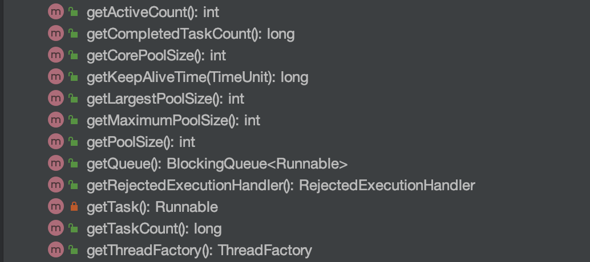
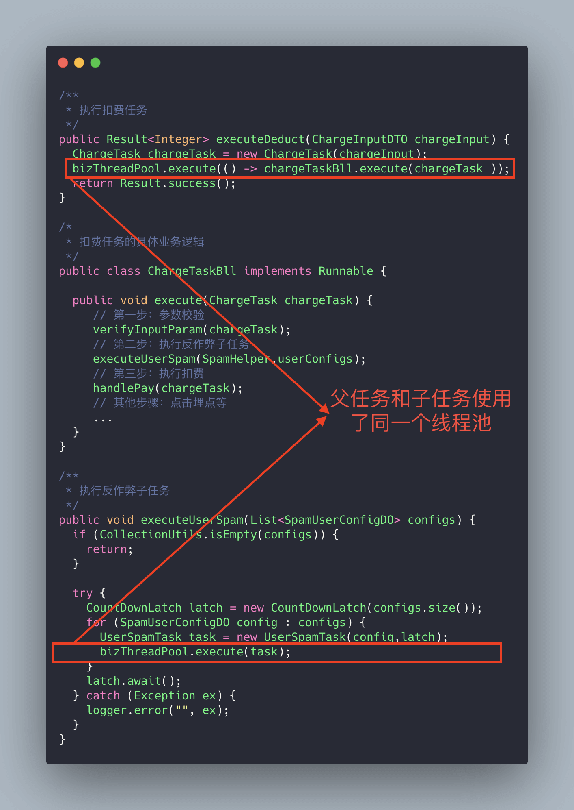
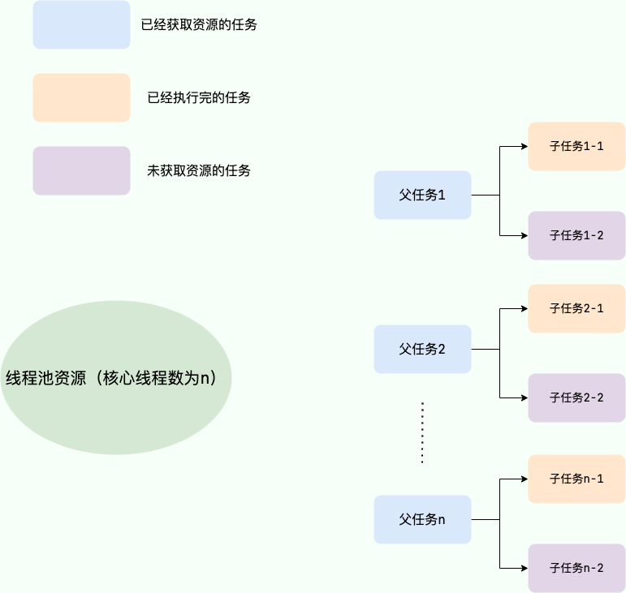
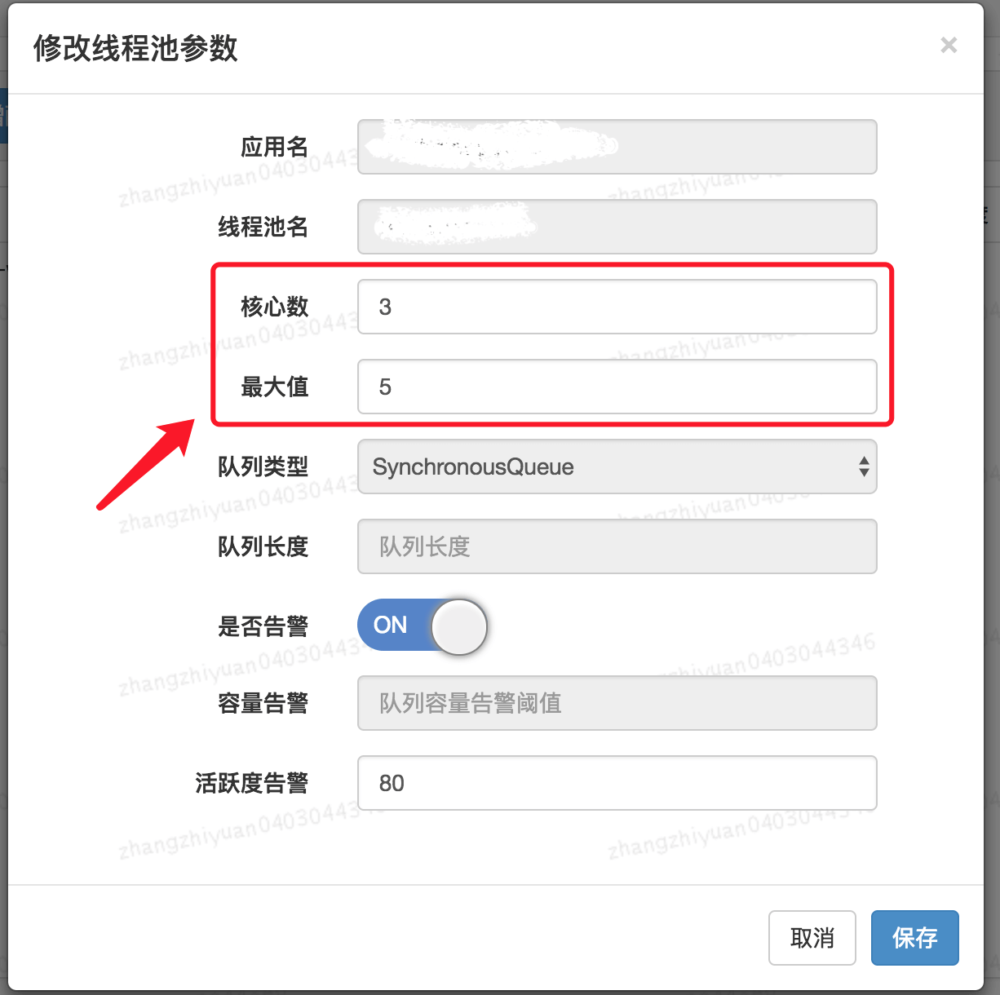

# 一、线程池最佳实践

简单总结一下我了解的使用线程池的时候应该注意的东西，网上似乎还没有专门写这方面的文章。

## 1、正确声明线程池

**线程池必须手动通过 `ThreadPoolExecutor` 的构造函数来声明，避免使用`Executors` 类创建线程池，会有 OOM 风险。**

`Executors` 返回线程池对象的弊端如下(后文会详细介绍到)：

- **`FixedThreadPool` 和 `SingleThreadExecutor`**：使用的是阻塞队列 `LinkedBlockingQueue`，任务队列的默认长度和最大长度为 `Integer.MAX_VALUE`，可以看作是无界队列，可能堆积大量的请求，从而导致 OOM。
- **`CachedThreadPool`**：使用的是同步队列 `SynchronousQueue`，允许创建的线程数量（最大线程数量）为 `Integer.MAX_VALUE` ，可能会创建大量线程，从而导致 OOM。
- **`ScheduledThreadPool` 和 `SingleThreadScheduledExecutor`** : 使用的无界的延迟阻塞队列`DelayedWorkQueue`，任务队列最大长度为 `Integer.MAX_VALUE`，可能堆积大量的请求，从而导致 OOM。

说白了就是：**使用有界队列，控制线程创建数量。**

除了避免 OOM 的原因之外，不推荐使用 `Executors`提供的两种快捷的线程池的原因还有：

- 实际使用中需要根据自己机器的性能、业务场景来手动配置线程池的参数比如核心线程数、使用的任务队列、饱和策略（拒绝策略）等等。

  > **示例1：自定义线程池**
  >
  > ```java
  > public class ThreadPoolDemo {
  > 
  >     public static void main(String[] args) {
  > 
  >         ThreadPoolExecutor executor = new ThreadPoolExecutor(
  > 
  >                 // 核心线程数
  >                 2,
  > 
  >                 // 最大线程数
  >                 4,
  > 
  >                 // 空闲线程存活时间
  >                 60,
  > 
  >                 // 时间单位
  >                 TimeUnit.SECONDS,
  > 
  >                 // 有界阻塞队列
  >                 new ArrayBlockingQueue<>(10),
  > 
  >                 // 自定义线程工厂（线程命名）
  >                 new MyThreadFactory(),
  > 
  >                 // 拒绝策略
  >                 new ThreadPoolExecutor.CallerRunsPolicy()
  >         );
  > 
  >         for (int i = 1; i <= 20; i++) {
  > 
  >             int taskId = i;
  > 
  >             executor.execute(() -> {
  > 
  >                 System.out.println(
  >                         Thread.currentThread().getName()
  >                                 + " 执行任务：" + taskId
  >                 );
  > 
  >                 try {
  >                     Thread.sleep(3000);
  >                 } catch (InterruptedException e) {
  >                     e.printStackTrace();
  >                 }
  > 
  >             });
  >         }
  > 
  >         executor.shutdown();
  >     }
  > }
  > ```
  >
  > 

- 我们应该显示地给我们的线程池命名，这样有助于我们定位问题。

  > **示例二：自定义线程工厂（推荐写为可复用的通用线程工厂）**
  >
  > ```java
  > import java.util.concurrent.ThreadFactory;
  > import java.util.concurrent.atomic.AtomicInteger;
  > 
  > public class NamedThreadFactory implements ThreadFactory {
  > 
  >     // 线程池名称
  >     private final String prefix;
  > 
  >     // 线程编号
  >     private final AtomicInteger threadNum =
  >             new AtomicInteger(1);
  > 
  >     public NamedThreadFactory(String prefix) {
  >         this.prefix = prefix;
  >     }
  > 
  >     @Override
  >     public Thread newThread(Runnable r) {
  > 
  >         return new Thread(
  >                 r,
  >                 prefix + "-" + threadNum.getAndIncrement()
  >         );
  >     }
  > }
  > ```
  >
  > 

## 2、监测线程池运行状态

你可以通过一些手段来检测线程池的运行状态，比如 SpringBoot 中的 `Actuator` 组件。

> ### 0、核心流程：
>
> ```
> ThreadPoolExecutor
>        ↓
> Micrometer
>        ↓
> Actuator
>        ↓
> /actuator/metrics
> ```
>
> 
>
> ### 1、Maven依赖
>
> ```xml
> <!-- actuator -->
> <dependency>
>     <groupId>org.springframework.boot</groupId>
>     <artifactId>spring-boot-starter-actuator</artifactId>
> </dependency>
> 
> <!-- micrometer -->
> <dependency>
>     <groupId>io.micrometer</groupId>
>     <artifactId>micrometer-core</artifactId>
> </dependency>
> ```
>
> ### 2、开启 Actuator 端点
>
> application.yml：开启所有 Actuator 端点
>
> ```yaml
> management:
>   endpoints:
>     web:
>       exposure:
>         include: "*"
> 
>   endpoint:
>     health:
>       show-details: always
> ```
>
> ### 3、线程池配置
>
> ```java
> @Configuration
> public class ThreadPoolConfig {
> 
>     @Bean("orderExecutor")
>     public ThreadPoolExecutor orderExecutor() {
> 
>         return new ThreadPoolExecutor(
>                 2,
>                 4,
>                 60,
>                 TimeUnit.SECONDS,
>                 new ArrayBlockingQueue<>(10),
>                 new NamedThreadFactory("order-thread"),
>                 new ThreadPoolExecutor.CallerRunsPolicy()
>         );
>     }
> }
> ```
>
> ### 4、自定义线程工厂
>
> ```java
> import java.util.concurrent.ThreadFactory;
> import java.util.concurrent.atomic.AtomicInteger;
> 
> public class NamedThreadFactory implements ThreadFactory {
> 
>     private final String prefix;
> 
>     private final AtomicInteger atomicInteger =
>             new AtomicInteger(1);
> 
>     public NamedThreadFactory(String prefix) {
>         this.prefix = prefix;
>     }
> 
>     @Override
>     public Thread newThread(Runnable r) {
> 
>         return new Thread(
>                 r,
>                 prefix + "-" + atomicInteger.getAndIncrement()
>         );
>     }
> }
> ```
>
> ### 5、模拟任务堆积
>
> ```java
> @RestController
> public class TestController {
> 
>     @Resource(name = "orderExecutor")
>     private ThreadPoolExecutor executor;
> 
>     @GetMapping("/test")
>     public String test() {
> 
>         for (int i = 0; i < 20; i++) {
> 
>             executor.execute(() -> {
> 
>                 try {
> 
>                     System.out.println(
>                             Thread.currentThread().getName()
>                     );
> 
>                     Thread.sleep(10000);
> 
>                 } catch (InterruptedException e) {
>                     e.printStackTrace();
>                 }
> 
>             });
>         }
> 
>         return "ok";
>     }
> }
> ```
>
> ### 6、真正的 Actuator 监控接口
>
> 直接访问（Actuator 提供的监控接口）：
>
> ```
> http://localhost:8080/actuator/metrics
> ```
>
> 你会看到：
>
> ```java
> {
>   "names": [
>     "executor.active",
>     "executor.completed",
>     "executor.pool.size",
>     "executor.queue.remaining",
>     "executor.queued"
>   ]
> }
> ```
>
> 这些：才是真正由 Actuator 暴露出来的线程池指标。
>
> ### 7、查看具体指标
>
> url 选择上面提供的指标
>
> #### 7.1、当前活跃线程数
>
> 访问：
>
> ```
> /actuator/metrics/executor.active
> ```
>
> 返回：
>
> ```json
> {
>   "name": "executor.active",
>   "measurements": [
>     {
>       "statistic": "VALUE",
>       "value": 4.0
>     }
>   ]
> }
> ```
>
> 说明：当前有4个线程正在执行任务
>
> 

除此之外，我们还可以利用 `ThreadPoolExecutor` 的相关 API 做一个简陋的监控。从下图可以看出， `ThreadPoolExecutor`提供了获取线程池当前的线程数和活跃线程数、已经执行完成的任务数、正在排队中的任务数等等。



下面是一个简单的 Demo。`printThreadPoolStatus()`会每隔一秒打印出线程池的线程数、活跃线程数、完成的任务数、以及队列中的任务数。

```java
/**
 * 打印线程池的状态
 *
 * @param threadPool 线程池对象
 */
public static void printThreadPoolStatus(ThreadPoolExecutor threadPool) {
    ScheduledExecutorService scheduledExecutorService = new ScheduledThreadPoolExecutor(1, createThreadFactory("print-images/thread-pool-status", false));
    scheduledExecutorService.scheduleAtFixedRate(() -> {
        log.info("=========================");
        log.info("ThreadPool Size: [{}]", threadPool.getPoolSize());
        log.info("Active Threads: {}", threadPool.getActiveCount());
        log.info("Number of Tasks : {}", threadPool.getCompletedTaskCount());
        log.info("Number of Tasks in Queue: {}", threadPool.getQueue().size());
        log.info("=========================");
    }, 0, 1, TimeUnit.SECONDS);
}
```

## 3、建议不同类别的业务用不同的线程池

很多人在实际项目中都会有类似这样的问题：**我的项目中多个业务需要用到线程池，是为每个线程池都定义一个还是说定义一个公共的线程池呢？**

一般建议是不同的业务使用不同的线程池，配置线程池的时候根据当前业务的情况对当前线程池进行配置，因为不同的业务的并发以及对资源的使用情况都不同，重心优化系统性能瓶颈相关的业务。

**我们再来看一个真实的事故案例！** (本案例来源自：[《线程池运用不当的一次线上事故》](../References\线程池运用不当的一次线上事故 _ HeapDump性能社区.mhtml) ，很精彩的一个案例)



上面的代码可能会存在死锁的情况，为什么呢？画个图给大家捋一捋。

试想这样一种极端情况：假如我们线程池的核心线程数为 **n**，父任务（扣费任务）数量为 **n**，父任务下面有两个子任务（扣费任务下的子任务），其中一个已经执行完成，另外一个被放在了任务队列中。由于父任务把线程池核心线程资源用完，所以子任务因为无法获取到线程资源无法正常执行，一直被阻塞在队列中。父任务等待子任务执行完成，而子任务等待父任务释放线程池资源，这也就造成了 **"死锁"** 。



解决方法也很简单，就是新增加一个用于执行子任务的线程池专门为其服务。

## 4、别忘记给线程池命名

初始化线程池的时候需要显示命名（设置线程池名称前缀），有利于定位问题。

默认情况下创建的线程名字类似 `pool-1-thread-n` 这样的，没有业务含义，不利于我们定位问题。

给线程池里的线程命名通常有下面两种方式：

**1、利用 Google guava的 `ThreadFactoryBuilder`**

```xml
 <dependency>
            <groupId>ch.qos.logback</groupId>
            <artifactId>logback-classic</artifactId>
            <version>1.2.12</version>
</dependency>
```


```java
import com.google.common.util.concurrent.ThreadFactoryBuilder;

ThreadFactory threadFactory = new ThreadFactoryBuilder()
                        .setNameFormat(threadNamePrefix + "-%d")
                        .setDaemon(true).build();
ExecutorService threadPool = new ThreadPoolExecutor(corePoolSize, maximumPoolSize, keepAliveTime, TimeUnit.MINUTES, workQueue, threadFactory)
```

**2、自己实现 `ThreadFactory`。**

```java
import java.util.concurrent.ThreadFactory;
import java.util.concurrent.atomic.AtomicInteger;

/**
 * 线程工厂，它设置线程名称，有利于我们定位问题。
 */
public final class NamingThreadFactory implements ThreadFactory {

    private final AtomicInteger threadNum = new AtomicInteger();
    private final String name;

    /**
     * 创建一个带名字的线程池生产工厂
     */
    public NamingThreadFactory(String name) {
        this.name = name;
    }

    @Override
    public Thread newThread(Runnable r) {
        Thread t = new Thread(r);
        t.setName(name + " [#" + threadNum.incrementAndGet() + "]");
        return t;
    }
}
```

## 5、正确配置线程池参数

说到如何给线程池配置参数，美团的骚操作至今让我难忘（后面会提到）！

我们先来看一下各种书籍和博客上一般推荐的配置线程池参数的方式，可以作为参考。

### 5.1、常规操作

很多人甚至可能都会觉得把线程池配置过大一点比较好！我觉得这明显是有问题的。就拿我们生活中非常常见的一例子来说：**并不是人多就能把事情做好，增加了沟通交流成本。你本来一件事情只需要 3 个人做，你硬是拉来了 6 个人，会提升做事效率嘛？我想并不会。** 线程数量过多的影响也是和我们分配多少人做事情一样，对于多线程这个场景来说主要是增加了**上下文切换** 成本。不清楚什么是上下文切换的话，可以看我下面的介绍。

> 上下文切换：
>
> 多线程编程中一般线程的个数都大于 CPU 核心的个数，而一个 CPU 核心在任意时刻只能被一个线程使用，为了让这些线程都能得到有效执行，CPU 采取的策略是为每个线程分配时间片并轮转的形式。当一个线程的时间片用完的时候就会重新处于就绪状态让给其他线程使用，这个过程就属于一次上下文切换。概括来说就是：当前任务在执行完 CPU 时间片切换到另一个任务之前会先保存自己的状态，以便下次再切换回这个任务时，可以再加载这个任务的状态。**任务从保存到再加载的过程就是一次上下文切换**。
>
> 上下文切换通常是计算密集型的。也就是说，它需要相当可观的处理器时间，在每秒几十上百次的切换中，每次切换都需要纳秒量级的时间。所以，上下文切换对系统来说意味着消耗大量的 CPU 时间，事实上，可能是操作系统中时间消耗最大的操作。
>
> Linux 相比与其他操作系统（包括其他类 Unix 系统）有很多的优点，其中有一项就是，其上下文切换和模式切换的时间消耗非常少。

类比于现实世界中的人类通过合作做某件事情，我们可以肯定的一点是线程池大小设置过大或者过小都会有问题，合适的才是最好。

- 如果我们设置的线程池数量太小的话，如果同一时间有大量任务/请求需要处理，可能会导致大量的请求/任务在任务队列中排队等待执行，甚至会出现任务队列满了之后任务/请求无法处理的情况，或者大量任务堆积在任务队列导致 OOM。这样很明显是有问题的，CPU 根本没有得到充分利用。
- 如果我们设置线程数量太大，大量线程可能会同时在争取 CPU 资源，这样会导致大量的上下文切换，从而增加线程的执行时间，影响了整体执行效率。

有一个简单并且适用面比较广的公式：

- **CPU 密集型任务 (N)：** 这种任务消耗的主要是 CPU 资源，线程数应设置为 N（CPU 核心数）。由于任务主要瓶颈在于 CPU 计算能力，与核心数相等的线程数能够最大化 CPU 利用率，过多线程反而会导致竞争和上下文切换开销。
- **I/O 密集型任务(M \* N)：** 这类任务大部分时间处理 I/O 交互，线程在等待 I/O 时不占用 CPU。 为了充分利用 CPU 资源，线程数可以设置为 M * N，其中 N 是 CPU 核心数，M 是一个大于 1 的倍数，**建议默认设置为 2** ，具体取值取决于 I/O 等待时间和任务特点，需要通过测试和监控找到最佳平衡点。

CPU 密集型任务不再推荐 N+1，原因如下：

- "N+1" 的初衷是希望预留线程处理突发暂停，但实际上，**处理缺页中断等情况仍然需要占用 CPU 核心**。

  > CPU 密集场景下，CPU 本身才是瓶颈，不是线程不够，多线程反而会增加上下文切换

  > 缺页中断：程序访问的内存数据“不在物理内存（RAM）里”，CPU就会触发缺页中断，让操作系统把数据调进来。

- CPU 密集场景下，CPU 始终是瓶颈，预留线程并不能凭空增加 CPU 处理能力，反而可能加剧竞争。

**如何判断是 CPU 密集任务还是 IO 密集任务？**

CPU 密集型简单理解就是利用 CPU 计算能力的任务比如你在内存中对大量数据进行排序。但凡涉及到网络读取，文件读取这类都是 IO 密集型，这类任务的特点是 CPU 计算耗费时间相比于等待 IO 操作完成的时间来说很少，大部分时间都花在了等待 IO 操作完成上。

🌈 拓展一下（参见：[issue#1737](https://github.com/Snailclimb/JavaGuide/issues/1737)）：

线程数更严谨的计算的方法应该是：`最佳线程数 = N（CPU 核心数）∗（1+WT（线程等待时间）/ST（线程计算时间））`，其中 `WT（线程等待时间）=线程运行总时间 - ST（线程计算时间）`。

线程等待时间所占比例越高，需要越多线程。线程计算时间所占比例越高，需要越少线程。

我们可以通过 JDK 自带的工具 VisualVM 来查看 `WT/ST` 比例。

CPU 密集型任务的 `WT/ST` 接近或者等于 0，因此， 线程数可以设置为 N（CPU 核心数）∗（1+0）= N，和我们上面说的 N（CPU 核心数）+1 差不多。

IO 密集型任务下，几乎全是线程等待时间，从理论上来说，你就可以将线程数设置为 2N（按道理来说，WT/ST 的结果应该比较大，这里选择 2N 的原因应该是为了避免创建过多线程吧）。

**注意**：上面提到的公示也只是参考，实际项目不太可能直接按照公式来设置线程池参数，毕竟不同的业务场景对应的需求不同，具体还是要根据项目实际线上运行情况来动态调整。接下来介绍的美团的线程池参数动态配置这种方案就非常不错，很实用！

### 5.2、美团的骚操作

美团技术团队在[《Java 线程池实现原理及其在美团业务中的实践》](./References\Java线程池实现原理及其在美团业务中的实践 - 美团技术团队.mhtml)这篇文章中介绍到对线程池参数实现可自定义配置的思路和方法。

美团技术团队的思路是主要对线程池的核心参数实现自定义可配置。这三个核心参数是：

- **`corePoolSize` :** 核心线程数定义了最小可以同时运行的线程数量。
- **`maximumPoolSize` :** 当队列中存放的任务达到队列容量的时候，当前可以同时运行的线程数量变为最大线程数。
- **`workQueue`:** 当新任务来的时候会先判断当前运行的线程数量是否达到核心线程数，如果达到的话，新任务就会被存放在队列中。

**为什么是这三个参数？**

在[Java 线程池详解](./★重要知识点\04_Java线程池详解.md) 这篇文章中就说过这三个参数是 `ThreadPoolExecutor` 最重要的参数，它们基本决定了线程池对于任务的处理策略。

**如何支持参数动态配置？** 且看 `ThreadPoolExecutor` 提供的下面这些方法。


格外需要注意的是`corePoolSize`， 程序运行期间的时候，我们调用 `setCorePoolSize()`这个方法的话，线程池会首先判断当前工作线程数是否大于`corePoolSize`，如果大于的话就会回收工作线程。

另外，你也看到了上面并没有动态指定队列长度的方法，美团的方式是自定义了一个叫做 `ResizableCapacityLinkedBlockIngQueue` 的队列（主要就是把`LinkedBlockingQueue`的 capacity 字段的 final 关键字修饰给去掉了，让它变为可变的）。

最终实现的可动态修改线程池参数效果如下。👏👏👏



还没看够？我在[《后端面试高频系统设计&场景题》](../../../补充\JavaGuide星球\02_后端面试高频系统&场景题\02_经典系统设计案例\04_如何设计一个动态线程池？.mhtml)中详细介绍了如何设计一个动态线程池，这也是面试中常问的一道系统设计题。

如果我们的项目也想要实现这种效果的话，可以借助现成的开源项目：

- **[Hippo4j](https://github.com/opengoofy/hippo4j)**：异步线程池框架，支持线程池动态变更&监控&报警，无需修改代码轻松引入。支持多种使用模式，轻松引入，致力于提高系统运行保障能力。

- **[Dynamic TP](https://github.com/dromara/dynamic-tp)**：轻量级动态线程池，内置监控告警功能，集成三方中间件线程池管理，基于主流配置中心（已支持 Nacos、Apollo，Zookeeper、Consul、Etcd，可通过 SPI 自定义实现）。

## 6、别忘记关闭线程池

当线程池不再需要使用时，应该显式地关闭线程池，释放线程资源。

线程池提供了两个关闭方法：

- **`shutdown（）`** :关闭线程池，线程池的状态变为 `SHUTDOWN`。线程池不再接受新任务了，但是队列里的任务得执行完毕。
- **`shutdownNow（）`** :关闭线程池，线程池的状态变为 `STOP`。线程池会终止当前正在运行的任务，停止处理排队的任务并返回正在等待执行的 List。

调用完 `shutdownNow` 和 `shuwdown` 方法后，并不代表线程池已经完成关闭操作，它只是异步的通知线程池进行关闭处理。如果要同步等待线程池彻底关闭后才继续往下执行，需要调用`awaitTermination`方法进行同步等待。

在调用 `awaitTermination()` 方法时，应该设置**合理的超时时间**，以避免程序长时间阻塞而导致性能问题。另外，由于线程池中的任务可能会被取消或抛出异常，因此在使用 `awaitTermination()` 方法时还需要进行**异常处理**。`awaitTermination()` 方法会抛出 `InterruptedException` 异常，需要捕获并处理该异常，以避免程序崩溃或者无法正常退出。

```java
// ...
// 关闭线程池
executor.shutdown();
try {
    // 等待线程池关闭，最多等待5分钟
    if (!executor.awaitTermination(5, TimeUnit.MINUTES)) {
        // 如果等待超时，则打印日志
        System.err.println("线程池未能在5分钟内完全关闭");
    }
} catch (InterruptedException e) {
    // 异常处理
}
```

## 7、线程池尽量不要放耗时任务

线程池本身的目的是为了提高任务执行效率，避免因频繁创建和销毁线程而带来的性能开销。如果将耗时任务提交到线程池中执行，可能会导致线程池中的线程被长时间占用，无法及时响应其他任务，甚至会导致线程池崩溃或者程序假死。

因此，在使用线程池时，我们应该尽量避免将耗时任务提交到线程池中执行。对于一些比较耗时的操作，如网络请求、文件读写等，可以采用 `CompletableFuture` 等其他异步操作的方式来处理，以避免阻塞线程池中的线程。

> ### 1、错误示例
>
> 把耗时 IO 直接丢进线程池：
>
> ```java
> ExecutorService executor = Executors.newFixedThreadPool(4);
> 
> public void badExample() {
> 
>     for (int i = 0; i < 10; i++) {
> 
>         executor.submit(() -> {
> 
>             try {
>                 // 模拟网络请求（耗时操作）
>                 Thread.sleep(3000);
> 
>                 System.out.println(
>                         Thread.currentThread().getName()
>                                 + " 完成任务"
>                 );
> 
>             } catch (InterruptedException e) {
>                 e.printStackTrace();
>             }
> 
>         });
>     }
> }
> ```
>
> **❌ 问题**
>
> 如果任务是 IO 型：
>
> - 线程长期阻塞
> - CPU 不工作但线程被占用
> - 线程池容量被“浪费”
> - 后续任务排队甚至拒绝
>
> ### 2、正确思路：使用 CompletableFuture
>
> 把 “阻塞等待” 变成 “非阻塞组合”
>
> 使用异步任务拆分 IO：
>
> ```java
> public class AsyncDemo {
> 
>     public void example() {
> 
>         CompletableFuture<String> future =
>                 CompletableFuture.supplyAsync(() -> {
> 
>                     // 模拟网络请求
>                     sleep(3000);
> 
>                     return "HTTP_RESULT";
>                 })
> 
>                 .thenApply(result -> {
> 
>                     // 模拟数据处理
>                     return result + "_PROCESSED";
>                 });
> 
>         future.thenAccept(System.out::println);
>     }
> 
>     private void sleep(long ms) {
>         try {
>             Thread.sleep(ms);
>         } catch (InterruptedException e) {
>             e.printStackTrace();
>         }
>     }
> }
> ```
>
> ## ✔ 优点
>
> - IO 操作不会阻塞业务线程池
> - 支持链式处理
> - 可组合多个异步任务
> - 提高吞吐量
>
> ### 3、结合自定义线程池（推荐写法）
>
> 默认 `ForkJoinPool` 不适合 IO 密集任务，可以自定义：
>
> ```java
> ExecutorService ioExecutor =
>         new ThreadPoolExecutor(
>                 10,
>                 20,
>                 60,
>                 TimeUnit.SECONDS,
>                 new LinkedBlockingQueue<>(100),
>                 new NamedThreadFactory("io-thread")
>         );
> ```
>
> **使用指定线程池执行 CompletableFuture**
>
> ```java
> public void example() {
> 
>     CompletableFuture.supplyAsync(() -> {
> 
>         // IO操作（HTTP/DB）
>         sleep(3000);
> 
>         return "DATA";
> 
>     }, ioExecutor)
> 
>     .thenApply(data -> {
> 
>         // CPU处理
>         return data + "_TRANSFORM";
> 
>     })
> 
>     .thenAccept(System.out::println);
> }
> ```
>
> 

## 8、线程池使用的一些小坑
### 8.1、重复创建线程池的坑

线程池是可以复用的，一定不要频繁创建线程池，比如一个用户请求到了就单独创建一个线程池。

```java
@GetMapping("wrong")
public String wrong() throws InterruptedException {
    // 自定义线程池
    ThreadPoolExecutor executor = new ThreadPoolExecutor(5,10,1L,TimeUnit.SECONDS,new ArrayBlockingQueue<>(100),new ThreadPoolExecutor.CallerRunsPolicy());

    //  处理任务
    executor.execute(() -> {
      // ......
    }
    return "OK";
}
```

出现这种问题的原因还是对于线程池认识不够，需要加强线程池的基础知识。

> ✔ 方案一：Spring Bean 单例线程池（推荐）
>
> ```java
> @Bean("bizExecutor")
> public ThreadPoolExecutor bizExecutor() {
> 
>     ThreadPoolExecutor executor =
>             new ThreadPoolExecutor(
>                     5,
>                     10,
>                     60,
>                     TimeUnit.SECONDS,
>                     new ArrayBlockingQueue<>(100),
>                     new NamedThreadFactory("biz-thread"),
>                     new ThreadPoolExecutor.CallerRunsPolicy()
>             );
> 
>     return executor;
> }
> ```

### 8.2、Spring 内部线程池的坑

使用 Spring 内部线程池时，一定要手动自定义线程池，配置合理的参数，不然会出现生产问题（一个请求创建一个线程）。

```java
@Configuration
@EnableAsync
public class ThreadPoolExecutorConfig {

    @Bean(name="threadPoolExecutor")
    public Executor threadPoolExecutor(){
        ThreadPoolTaskExecutor threadPoolExecutor = new ThreadPoolTaskExecutor();
        int processNum = Runtime.getRuntime().availableProcessors(); // 返回可用处理器的Java虚拟机的数量
        int corePoolSize = (int) (processNum / (1 - 0.2));
        int maxPoolSize = (int) (processNum / (1 - 0.5));
        threadPoolExecutor.setCorePoolSize(corePoolSize); // 核心池大小
        threadPoolExecutor.setMaxPoolSize(maxPoolSize); // 最大线程数
        threadPoolExecutor.setQueueCapacity(maxPoolSize * 1000); // 队列长度
        threadPoolExecutor.setThreadPriority(Thread.MAX_PRIORITY);
        threadPoolExecutor.setDaemon(false);
        threadPoolExecutor.setKeepAliveSeconds(300);// 线程空闲时间
        threadPoolExecutor.setThreadNamePrefix("test-Executor-"); // 线程名字前缀
        return threadPoolExecutor;
    }
}
```

> ### 一、问题背景（为什么必须自定义）
>
> 如果你只写：
>
> ```java
> @Async
> public void test() {
>     // 业务逻辑
> }
> ```
>
> 但**没有线程池配置**，Spring 默认是：
>
> SimpleAsyncTaskExecutor
>
> 特点：
>
> - ❌ 不复用线程
> - ❌ 每个任务创建一个新线程
> - ❌ 无队列
> - ❌ 无限制
>
> ❌ 结果
>
> ```
> 1000个请求 = 1000个线程
> ```
>
> 直接导致：
>
> - CPU飙高
> - 内存爆炸
> - JVM崩溃风险
>
> ### 二、正确使用方式（@Async）
>
> ```java
> @Service
> public class OrderService {
> 
>     @Async("threadPoolExecutor")
>     public void createOrder() {
> 
>         System.out.println(
>                 Thread.currentThread().getName()
>         );
> 
>     }
> }
> ```
>
> 

### 8.3、线程池和 ThreadLocal 共用的坑

线程池和 `ThreadLocal`共用，可能会导致线程从`ThreadLocal`获取到的是旧值/脏数据。这是因为线程池会复用线程对象，与线程对象绑定的类的静态属性 `ThreadLocal` 变量也会被重用，这就导致一个线程可能获取到其他线程的`ThreadLocal` 值。

不要以为代码中没有显示使用线程池就不存在线程池了，像常用的 Web 服务器 Tomcat 处理任务为了提高并发量，就使用到了线程池，并且使用的是基于原生 Java 线程池改进完善得到的自定义线程池。

当然了，你可以将 Tomcat 设置为单线程处理任务。不过，这并不合适，会严重影响其处理任务的速度。

```properties
server.tomcat.max-threads=1
```

解决上述问题比较建议的办法是使用阿里巴巴开源的 `TransmittableThreadLocal`(`TTL`)。`TransmittableThreadLocal`类继承并加强了 JDK 内置的`InheritableThreadLocal`类，在使用线程池等会池化复用线程的执行组件情况下，提供`ThreadLocal`值的传递功能，解决异步执行时上下文传递的问题。

`TransmittableThreadLocal` 项目地址：https://github.com/alibaba/transmittable-thread-local 。

