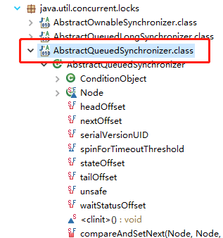
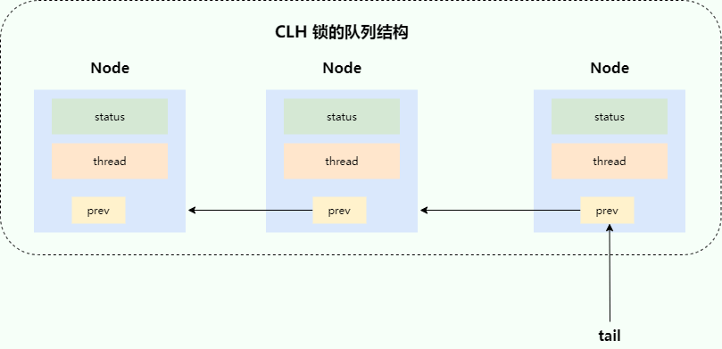
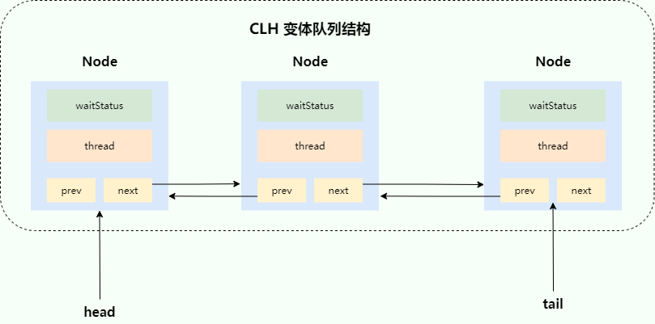
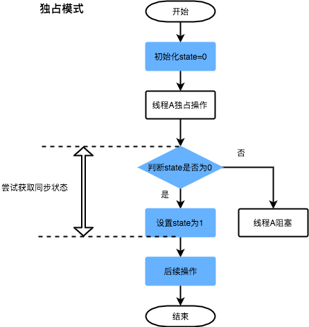
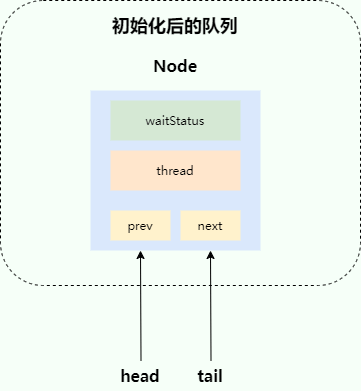

# 一、AQS 介绍

AQS 的全称为 `AbstractQueuedSynchronizer` ，翻译过来的意思就是抽象队列同步器。这个类在 `java.util.concurrent.locks` 包下面。



AQS 就是一个抽象类，主要用来构建锁和同步器。

```java
public abstract class AbstractQueuedSynchronizer extends AbstractOwnableSynchronizer implements java.io.Serializable {
}
```

AQS 为构建锁和同步器提供了一些通用功能的实现。因此，使用 AQS 能简单且高效地构造出应用广泛的大量的同步器，比如我们提到的 `ReentrantLock`，`Semaphore`，其他的诸如 `ReentrantReadWriteLock`，`SynchronousQueue`等等皆是基于 AQS 的。

# 二、AQS 原理

在面试中被问到并发知识的时候，大多都会被问到“请你说一下自己对于 AQS 原理的理解”。下面给大家一个示例供大家参考，面试不是背题，大家一定要加入自己的思想，即使加入不了自己的思想也要保证自己能够通俗的讲出来而不是背出来。

## 1、AQS 快速了解

在真正讲解 AQS 源码之前，需要对 AQS 有一个整体层面的认识。这里会先通过几个问题，从整体层面上认识 AQS，了解 AQS 在整个 Java 并发中所位于的层面，之后在学习 AQS 源码的过程中，才能更加了解同步器和 AQS 之间的关系。

### 1.1、AQS 的作用是什么？

AQS 解决了开发者在实现同步器时的复杂性问题。它提供了一个通用框架，用于实现各种同步器，例如 **可重入锁**（`ReentrantLock`）、**信号量**（`Semaphore`）和 **倒计时器**（`CountDownLatch`）。通过封装底层的线程同步机制，AQS 将复杂的线程管理逻辑隐藏起来，使开发者只需专注于具体的同步逻辑。

简单来说，AQS 是一个抽象类，为同步器提供了通用的 **执行框架**。它定义了 **资源获取和释放的通用流程**，而具体的资源获取逻辑则由具体同步器通过重写模板方法来实现。 因此，可以将 AQS 看作是同步器的 **基础“底座”**，而同步器则是基于 AQS 实现的 **具体“应用”**。

### 1.2、AQS 为什么使用 CLH 锁队列的变体？

CLH 锁是一种基于 **自旋锁** 的优化实现。

先说一下自旋锁存在的问题：自旋锁通过线程不断对一个原子变量执行 `compareAndSet`（简称 `CAS`）操作来尝试获取锁。在高并发场景下，多个线程会同时竞争同一个原子变量，容易造成某个线程的 `CAS` 操作长时间失败，从而导致 **“饥饿”问题**（某些线程可能永远无法获取锁）。

> AQS中的 `compareAndSet` 方法并没有自己实现原子操作，而是依赖于 `sun.misc.Unsafe` 类。Unsafe提供的CAS方法是 `compareAndSwap` 前缀的，这是一个与特定CPU指令集（如x86架构下的`CMPXCHG`）直接对应的底层操作
>
> 比如，在OpenJDK源码中，`compareAndSetState` 方法的典型实现如下：
>
> ```java
> protected final boolean compareAndSetState(int expect, int update) {
>     return unsafe.compareAndSwapInt(this, stateOffset, expect, update);
> }
> ```
>
> 你可能会困惑，为什么会有 `compareAndSwap` 和 `compareAndSet` 这两种叫法？其实就像 `JVM` 和 `JDK` 的关系一样，`compareAndSwap` 是偏向底层的硬件术语，更能反映它"比较并交换"的机制；而 `compareAndSet` 则是面向Java应用的API命名，语义更清晰，因此在`AtomicInteger`的API设计中也采用了 `compareAndSet()` 来命名。

CLH 锁通过引入一个队列来组织并发竞争的线程，对自旋锁进行了改进：

- 每个线程会作为一个节点加入到队列中，并通过自旋监控前一个线程节点的状态，而不是直接竞争共享变量。
- 线程按顺序排队，确保公平性，从而避免了 “饥饿” 问题。

AQS（AbstractQueuedSynchronizer）在 CLH 锁的基础上进一步优化，形成了其内部的 **CLH 队列变体**。主要改进点有以下两方面：

1. **自旋 + 阻塞**： 

   CLH 锁使用纯自旋方式等待锁的释放，但大量的自旋操作会占用过多的 CPU 资源。AQS 引入了 自旋 + 阻塞 的混合机制： 

   - 如果线程获取锁失败，会先短暂自旋尝试获取锁；
   - 如果仍然失败，则线程会进入阻塞状态，等待被唤醒，从而减少 CPU 的浪费。

2. **单向队列改为双向队列**：CLH 锁使用单向队列，节点只知道前驱节点的状态，而当某个节点释放锁时，需要通过队列唤醒后续节点。AQS 将队列改为 **双向队列**，新增了 `next` 指针，使得节点不仅知道前驱节点，也可以直接唤醒后继节点，从而简化了队列操作，提高了唤醒效率。

### 1.3、AQS 的性能比较好，原因是什么？

因为 AQS 内部大量使用了 `CAS` 操作。

AQS 内部通过队列来存储等待的线程节点。由于**队列是共享资源**，在多线程场景下，需要保证队列的同步访问。

AQS 内部通过 `CAS` 操作来控制队列的同步访问，`CAS` 操作主要用于控制 `队列初始化` 、 `线程节点入队` 两个操作的并发安全。虽然利用 `CAS` 控制并发安全可以保证比较好的性能，但同时会带来比较高的 **编码复杂度** 。

### 1.4、AQS 中为什么 Node 节点需要不同的状态？

AQS 中的 `waitStatus` 状态类似于 **状态机** ，通过不同状态来表明 Node 节点的不同含义，并且根据不同操作，来控制状态之间的流转。

可以把 AQS 的 `Node.waitStatus` 理解成：“**前驱节点对后继节点的承诺状态**”，它本质上不是“当前节点自己的状态”，而是：“当前节点在释放锁时，需不需要去唤醒后继节点”。

在 AQS 中，每个等待获取锁的线程，都会被包装成一个 `Node` 节点，加入到双向链表队列（CLH 队列）中，AQS 队列结构：

```
head <-> node1 <-> node2 <-> node3
```

每个 Node 中主要存储：

```java
static final class Node {
    volatile int waitStatus;

    volatile Node prev;
    volatile Node next;

    volatile Thread thread;

    Node nextWaiter;
}
```

核心字段：

| 字段       | 作用               |
| ---------- | ------------------ |
| thread     | 当前节点对应的线程 |
| prev       | 前驱节点           |
| next       | 后继节点           |
| waitStatus | 节点状态           |
| nextWaiter | Condition队列使用  |

- 状态 `0` ：新节点加入队列之后，初始状态为 `0` 。
- 状态 `SIGNAL(-1)` ：当有新的节点加入队列，此时新节点的前继节点状态就会由 `0` 更新为 `SIGNAL` ，表明前继节点释放锁之后，需要对后继节点进行唤醒操作。如果唤醒 `SIGNAL` 状态节点的后续节点，当前节点就会将 `SIGNAL` 状态更新为 `0` 。即通过清除 `SIGNAL` 状态，表示已经执行了唤醒操作。因此SIGNAL 是“一次性通知状态”，不是永久状态。
- 状态 `CANCELLED` ：如果一个节点在队列中等待获取锁锁时，因为某种原因失败了，该节点的状态就会变为 `CANCELLED` ，表明取消获取锁，这种状态的节点是异常的，无法被唤醒，也无法唤醒后继节点。

| 状态          | 含义                             |
| ------------- | -------------------------------- |
| 0             | 默认状态                         |
| SIGNAL(-1)    | 当前节点释放锁时需要唤醒后继节点 |
| CANCELLED(1)  | 节点失效                         |
| CONDITION(-2) | Condition队列                    |
| PROPAGATE(-3) | 共享锁传播                       |

> ### 一、Node 状态变化全过程（最重要）
>
> ### 场景：ReentrantLock 获取锁失败
>
> 假设：
>
> ```
> T1 已持有锁
> T2、T3 来竞争
> ```
>
> 队列变化：
>
> #### 1、第一阶段：T2 入队
>
> 初始：
>
> ```
> head
> ```
>
> T2 获取锁失败：
>
> ```
> head -> T2
> ```
>
> 此时：
>
> ```java
> T2.waitStatus = 0
> head.waitStatus = 0
> ```
>
> #### 2、第二阶段：T2 准备阻塞
>
> AQS 会检查：
>
> ```
> shouldParkAfterFailedAcquire(pred, node)
> ```
>
> 即：
>
> ```
> 当前线程是否应该挂起？
> ```
>
> 此时发现：
>
> ```
> head.waitStatus == 0
> ```
>
> 于是：
>
> ```
> CAS(head.waitStatus, 0, SIGNAL)
> ```
>
> **`head`** 的状态变为了 `SIGNAL` 。
>
> 队列：
>
> ```
> head(SIGNAL) -> T2(0)
> ```
>
> 表示：
>
> ```
> head 以后释放锁时，需要唤醒 T2
> ```
>
> 然后：
>
> T2 再次自旋一次。
>
> #### 3、第三阶段：T2 真正阻塞
>
> 下一轮：
>
> 发现：
>
> ```
> pred.waitStatus == SIGNAL
> ```
>
> 于是：
>
> ```
> LockSupport.park()
> ```
>
> T2 阻塞。
>
> #### 3、第四阶段：T3 入队
>
> 队列：
>
> ```
> head(SIGNAL) -> T2(0) -> T3(0)
> ```
>
> T3 获取锁失败。
>
> 于是：
>
> T3 会把：
>
> ```
> T2.waitStatus:
> 0 -> SIGNAL
> ```
>
> 队列：
>
> ```
> head(SIGNAL) -> T2(SIGNAL) -> T3(0)
> ```
>
> 表示：
>
> ```
> T2 释放锁时要唤醒 T3
> ```
>
> #### 4、第五阶段：T1 释放锁
>
> T1 unlock：
>
> ```
> unparkSuccessor(head)
> ```
>
> 先清除：
>
> ```
> head.waitStatus:
> SIGNAL -> 0
> ```
>
> 然后：
>
> ```
> LockSupport.unpark(T2)
> ```
>
> 队列：
>
> ```
> head(0) -> T2(SIGNAL) -> T3(0)
> ```
>
> #### 5、第六阶段：T2 被唤醒并获取锁
>
> T2 醒来：
>
> ```
> 获取锁成功
> ```
>
> 然后：
>
> ```
> setHead(node)
> ```
>
> 队列变成：
>
> ```
> head(T2) -> T3
> ```
>
> 注意：
>
> 旧 head 会断开：
>
> ```
> oldHead.next = null
> ```
>
> 帮助 GC。
>
> #### 6、CANCELLED 为什么特殊？
>
> ```
> CANCELLED = 1
> ```
>
> 表示：
>
> ```
> 这个节点彻底废了
> ```
>
> 原因可能：
>
> - 超时
> - interrupt
> - 获取锁异常
>
> 特点：
>
> ##### 6.1、永远不会恢复
>
> AQS 中：
>
> ```
> waitStatus > 0
> ```
>
> 就表示：
>
> ```
> 节点失效
> ```
>
> 不会再变回其它状态。
>
> ##### 6.2、不会参与唤醒
>
> 因为线程已经不等锁了。
>
> ##### 6.3、队列会跳过 CANCELLED 节点
>
> 源码中大量：
>
> ```
> while (pred.waitStatus > 0)
>     pred = pred.prev;
> ```
>
> 表示：
>
> ```
> 跳过所有取消节点
> ```
>
> #### 7、AQS 为什么设计成“前驱负责唤醒后继”？
>
> 这是 CLH 队列的经典思想：
>
> ```
> 每个节点只关心自己的前驱
> ```
>
> 优点：
>
> ##### 7.1、减少竞争
>
> 当前线程：
>
> 只修改：
>
> ```
> pred.waitStatus
> ```
>
> 而不是整个队列。
>
> ##### 7.2、避免惊群效应
>
> 只唤醒：
>
> ```
> 后继节点
> ```
>
> 不是全部线程。

### 1.5、Node 节点 waitStatus 状态含义

AQS 中的 `waitStatus` 状态类似于 **状态机** ，通过不同状态来表明 Node 节点的不同含义，并且根据不同操作，来控制状态之间的流转。

| Node 节点状态 | 值   | 含义                                                         |
| ------------- | ---- | ------------------------------------------------------------ |
| `CANCELLED`   | 1    | 表示线程已经**取消获取锁**。线程在等待获取资源时被中断、等待资源超时会更新为该状态。 |
| `SIGNAL`      | -1   | 表示后继节点需要当前节点唤醒。在当前线程节点释放锁之后，需要对后继节点进行唤醒。 |
| `CONDITION`   | -2   | 表示节点在等待 Condition。当其他线程调用了 Condition 的 `signal()` 方法后，节点会从等待队列转移到同步队列中等待获取资源。 |
| `PROPAGATE`   | -3   | 用于共享模式。在共享模式下，可能会出现线程在队列中无法被唤醒的情况，因此引入了 `PROPAGATE` 状态来解决这个问题。 |
|               | 0    | 加入队列的新节点的初始状态。                                 |

在 AQS 的源码中，经常使用 `> 0` 、 `< 0` 来对 `waitStatus` 进行判断。

如果 `waitStatus > 0` ，表明节点的状态**已经取消**等待获取资源。

如果 `waitStatus < 0` ，表明节点的状态处于正常的状态，即没有取消等待。

其中 `SIGNAL` 状态是最重要的，节点状态流转以及对应操作如下：

| 状态流转         | 对应操作                                                     |
| ---------------- | ------------------------------------------------------------ |
| `0`              | 新节点入队时，初始状态为 `0` 。                              |
| `0 -> SIGNAL`    | 新节点入队时，它的前继节点状态会由 `0` 更新为 `SIGNAL` 。`SIGNAL` 状态表明该节点的后续节点需要被唤醒。 |
| `SIGNAL -> 0`    | 在唤醒后继节点时，需要清除当前节点的状态。通常发生在 `head` 节点，比如 `head` 节点的状态由 `SIGNAL` 更新为 `0` ，表示已经对 `head` 节点的后继节点唤醒了。 |
| `0 -> PROPAGATE` | AQS 内部引入了 `PROPAGATE` 状态，为了解决并发场景下，可能造成的线程节点无法唤醒的情况。（在 AQS 共享模式获取资源的源码分析会讲到） |

## 2、AQS 核心思想

AQS 核心思想是，如果被请求的共享资源空闲，则将当前请求资源的线程设置为有效的工作线程，并且将共享资源设置为锁定状态。如果被请求的共享资源被占用，那么就需要一套线程阻塞等待以及被唤醒时锁分配的机制，这个机制 AQS 是基于 **CLH 锁** （Craig, Landin, and Hagersten locks） 进一步优化实现的。

**CLH 锁** 对自旋锁进行了改进，是基于单链表的自旋锁。在多线程场景下，会将请求获取锁的线程组织成一个单向队列，每个等待的线程会通过自旋访问前一个线程节点的状态，前一个节点释放锁之后，当前节点才可以获取锁。**CLH 锁** 的队列结构如下图所示。



AQS 中使用的 **等待队列** 是 CLH 锁队列的变体（接下来简称为 CLH 变体队列）。

AQS 的 CLH 变体队列是一个双向队列，会暂时获取不到锁的线程将被加入到该队列中，CLH 变体队列和原本的 CLH 锁队列的区别主要有两点：

- 由 **自旋** 优化为 **自旋 + 阻塞** ：自旋操作的性能很高，但大量的自旋操作比较占用 CPU 资源，因此在 CLH 变体队列中会先通过自旋尝试获取锁，如果失败再进行阻塞等待。
- 由 **单向队列** 优化为 **双向队列** ：在 CLH 变体队列中，会对等待的线程进行阻塞操作，当队列前边的线程释放锁之后，需要对后边的线程进行唤醒，因此增加了 `next` 指针，成为了双向队列。

AQS 将每条请求共享资源的线程封装成一个 CLH 变体队列的一个结点（Node）来实现锁的分配。在 CLH 变体队列中，一个节点表示一个线程，它保存着线程的引用（thread）、 当前节点在队列中的状态（waitStatus）、前驱节点（prev）、后继节点（next）。

AQS 中的 CLH 变体队列结构如下图所示：



关于 AQS 核心数据结构-CLH 锁的详细解读，强烈推荐阅读 [Java AQS 核心数据结构-CLH 锁 - Qunar 技术沙龙](../References\Java AQS 核心数据结构-CLH 锁.mhtml) 这篇文章。

AQS(`AbstractQueuedSynchronizer`)的核心原理图：


AQS 使用 **int 成员变量 `state` 表示同步状态**，通过内置的 **FIFO 线程等待/等待队列** 来完成获取资源线程的排队工作。

`state` 变量由 `volatile` 修饰，用于展示当前临界资源的获取情况。这里 `volatile` 的作用不仅仅是保证可见性，更重要的是通过 happens-before 规则（volatile 变量的写操作先行发生于后续的读操作）防止编译器和处理器对指令进行重排序，从而保证锁语义的正确性。

```java
// 共享变量，使用volatile修饰，保证线程可见性并防止指令重排序
private volatile int state;
```

另外，状态信息 `state` 可以通过 `protected` 类型的`getState()`、`setState()`和`compareAndSetState()` 进行操作。并且，这几个方法都是 `final` 修饰的，在子类中无法被重写。

```java
//返回同步状态的当前值
protected final int getState() {
     return state;
}
 // 设置同步状态的值
protected final void setState(int newState) {
     state = newState;
}
//原子地（CAS操作）将同步状态值设置为给定值update如果当前同步状态的值等于expect（期望值）
protected final boolean compareAndSetState(int expect, int update) {
      return unsafe.compareAndSwapInt(this, stateOffset, expect, update);
}
```

以可重入的互斥锁 `ReentrantLock` 为例，它的内部维护了一个 `state` 变量，用来表示锁的占用状态。`state` 的初始值为 0，表示锁处于未锁定状态。当线程 A 调用 `lock()` 方法时，会尝试通过 `tryAcquire()` 方法独占该锁，并让 `state` 的值加 1。如果成功了，那么线程 A 就获取到了锁。如果失败了，那么线程 A 就会被加入到一个等待队列（CLH 变体队列）中，直到其他线程释放该锁。假设线程 A 获取锁成功了，释放锁之前，A 线程自己是可以重复获取此锁的（`state` 会累加）。这就是可重入性的体现：一个线程可以多次获取同一个锁而不会被阻塞。但是，这也意味着，一个线程必须释放与获取的次数相同的锁，才能让 `state` 的值回到 0，也就是让锁恢复到未锁定状态。只有这样，其他等待的线程才能有机会获取该锁。

线程 A 尝试获取锁的过程如下图所示（图源[从 ReentrantLock 的实现看 AQS 的原理及应用 - 美团技术团队](https://javaguide.cn/java/concurrent/reentrantlock.html)）：



再以倒计时器 `CountDownLatch` 以例，任务分为 N 个子线程去执行，`state` 也初始化为 N（注意 N 要与线程个数一致）。这 N 个子线程开始执行任务，每执行完一个子线程，就调用一次 `countDown()` 方法。该方法会尝试使用 CAS(Compare and Swap) 操作，让 `state` 的值减少 1。当所有的子线程都执行完毕后（即 `state` 的值变为 0），`CountDownLatch` 会调用 `unpark()` 方法，唤醒主线程。这时，主线程就可以从 `await()` 方法（`CountDownLatch` 中的`await()` 方法而非 AQS 中的）返回，继续执行后续的操作。

## 3、自定义同步器

基于 AQS 可以实现自定义的同步器， AQS 提供了 5 个模板方法（模板方法模式）。如果需要自定义同步器一般的方式是这样（模板方法模式很经典的一个应用）：

1. 自定义的同步器继承 `AbstractQueuedSynchronizer` 。
2. 重写 AQS 暴露的模板方法。

**AQS 使用了模板方法模式，自定义同步器时需要重写下面几个 AQS 提供的钩子方法：**

```java
//独占方式。尝试获取资源，成功则返回true，失败则返回false。
protected boolean tryAcquire(int)
//独占方式。尝试释放资源，成功则返回true，失败则返回false。
protected boolean tryRelease(int)
//共享方式。尝试获取资源。负数表示失败；0表示成功，但没有剩余可用资源；正数表示成功，且有剩余资源。
protected int tryAcquireShared(int)
//共享方式。尝试释放资源，成功则返回true，失败则返回false。
protected boolean tryReleaseShared(int)
//该线程是否正在独占资源。只有用到condition才需要去实现它。
protected boolean isHeldExclusively()
```

**什么是钩子方法呢？** 钩子方法是一种被声明在抽象类中的方法，一般使用 `protected` 关键字修饰，它可以是空方法（由子类实现），也可以是默认实现的方法。模板设计模式通过钩子方法控制固定步骤的实现。

篇幅问题，这里就不详细介绍模板方法模式了，不太了解的小伙伴可以看看这篇文章：[用 Java8 改造后的模板方法模式真的是 yyds!](../References\用Java8改造后的模板方法模式真的是yyds!.mhtml)。

除了上面提到的钩子方法之外，AQS 类中的其他方法都是 `final` ，所以无法被其他类重写。

## 4、AQS 资源共享方式

AQS 定义两种资源共享方式：`Exclusive`（独占，只有一个线程能执行，如`ReentrantLock`）和`Share`（共享，多个线程可同时执行，如`Semaphore`/`CountDownLatch`）。

一般来说，自定义同步器的共享方式要么是独占，要么是共享，他们也只需实现`tryAcquire-tryRelease`、`tryAcquireShared-tryReleaseShared`中的一种即可。但 AQS 也支持自定义同步器同时实现独占和共享两种方式，如`ReentrantReadWriteLock`。

## 5、独占模式与共享模式的深入对比

上面简要介绍了 AQS 的两种资源共享方式，下面从多个维度对独占模式和共享模式进行系统对比，帮助更深入地理解二者的差异。

### 5.1、特性对比

| 对比维度               | 独占模式（Exclusive）                            | 共享模式（Share）                                            |
| ---------------------- | ------------------------------------------------ | ------------------------------------------------------------ |
| **并发度**             | 同一时刻只有一个线程能获取到资源                 | 同一时刻可以有多个线程同时获取到资源                         |
| **获取资源入口**       | `acquire(int arg)`                               | `acquireShared(int arg)`                                     |
| **释放资源入口**       | `release(int arg)`                               | `releaseShared(int arg)`                                     |
| **需要重写的模板方法** | `tryAcquire(int)` / `tryRelease(int)`            | `tryAcquireShared(int)` / `tryReleaseShared(int)`            |
| **tryXxx 返回值**      | `boolean`，`true` 表示获取/释放成功              | `int`（获取时），负数表示失败，0 表示成功但无剩余资源，正数表示成功且有剩余资源；`boolean`（释放时） |
| **唤醒后继节点**       | 释放资源时唤醒一个后继节点                       | 获取资源成功后，如果还有剩余资源，会继续唤醒后续节点（传播唤醒） |
| **Node 类型标识**      | `Node.EXCLUSIVE`（`null`）                       | `Node.SHARED`（一个静态的 `Node` 实例）                      |
| **典型实现**           | `ReentrantLock`、`ReentrantReadWriteLock` 的写锁 | `Semaphore`、`CountDownLatch`、`ReentrantReadWriteLock` 的读锁 |

### 5.2、state 在不同同步器中的语义

AQS 中的 `state` 是一个通用的同步状态变量，不同的同步器赋予它不同的含义：

| 同步器                   | 模式        | `state` 的语义                                               |
| ------------------------ | ----------- | ------------------------------------------------------------ |
| `ReentrantLock`          | 独占        | 表示锁的重入次数。`state == 0` 表示锁空闲；`state > 0` 表示锁被持有，值为重入次数 |
| `ReentrantReadWriteLock` | 独占 + 共享 | 高 16 位表示读锁的持有数量（共享），低 16 位表示写锁的重入次数（独占） |
| `Semaphore`              | 共享        | 表示可用许可证的**数量**。每次 `acquire()` 减少，`release()` 增加 |
| `CountDownLatch`         | 共享        | 表示需要等待的计数。每次 `countDown()` 减 1，到 0 时唤醒所有等待线程 |

> ⚠注意：
>
> 1. `Semaphore` 关心的是可用许可的**数量**，来一个线程消耗一个，释放一个增加一个，因此必须在创建`Semaphore`时指定许可数量；
> 2. `ReentrantReadWriteLock` 关注的是读写是否冲突，而不是多少个线程，因为读锁本身就是“无限共享”的设计，因此只要满足：**当前没有线程持有写锁**，那么任意数量的读线程都可以同时获取读锁（例如1000个线程理论都能同时获取到读锁），有时候加了读锁的线程个数限制，反而降低性能；
> 3. `ReentrantReadWriteLock`  真正限制的是：
>    - 写锁互斥：同一时刻只能一个线程写
>    - 读写互斥：写时不能读，读时不能写
>    - 读读不互斥：多个线程可同时读

下面通过一个代码示例来直观感受独占模式和共享模式在使用上的区别：

```java
import java.util.concurrent.CountDownLatch;
import java.util.concurrent.Semaphore;
import java.util.concurrent.locks.ReentrantLock;
import java.util.concurrent.locks.ReentrantReadWriteLock;

public class AQSModeDemo {

    public static void main(String[] args) throws Exception {

        /*
         * 1.ReentrantLock
         * 独占模式
         */
        reentrantLockDemo();

        Thread.sleep(3000);

        /*
         * 2.Semaphore
         * 共享模式
         */
        semaphoreDemo();

        Thread.sleep(3000);

        /*
         * 3.CountDownLatch
         * 共享模式
         */
        countDownLatchDemo();

        Thread.sleep(3000);

        /*
         * 4.ReentrantReadWriteLock
         * 读共享 + 写独占
         */
        readWriteLockDemo();
    }

    /**
     * ReentrantLock
     * 独占模式
     */
    public static void reentrantLockDemo() {

        ReentrantLock lock = new ReentrantLock();

        Runnable task = () -> {

            lock.lock();

            try {

                System.out.println(Thread.currentThread().getName()
                        + " 获取到独占锁");

                Thread.sleep(1000);

            } catch (Exception e) {
                e.printStackTrace();
            } finally {

                System.out.println(Thread.currentThread().getName()
                        + " 释放独占锁");

                lock.unlock();
            }
        };

        System.out.println("\n========== ReentrantLock（独占模式） ==========");

        for (int i = 0; i < 5; i++) {
            new Thread(task, "独占线程-" + i).start();
        }
    }

    /**
     * Semaphore
     * 共享模式
     */
    public static void semaphoreDemo() {

        // 同时允许3个线程获取许可证
        Semaphore semaphore = new Semaphore(3);

        Runnable task = () -> {

            try {

                semaphore.acquire();

                System.out.println(Thread.currentThread().getName()
                        + " 获取到许可证");

                Thread.sleep(1000);

            } catch (Exception e) {
                e.printStackTrace();
            } finally {

                System.out.println(Thread.currentThread().getName()
                        + " 释放许可证");

                semaphore.release();
            }
        };

        System.out.println("\n========== Semaphore（共享模式） ==========");

        for (int i = 0; i < 5; i++) {
            new Thread(task, "共享线程-" + i).start();
        }
    }

    /**
     * CountDownLatch
     * 共享模式
     */
    public static void countDownLatchDemo() throws Exception {

        // state = 3
        CountDownLatch latch = new CountDownLatch(3);

        Runnable task = () -> {

            try {

                System.out.println(Thread.currentThread().getName()
                        + " 正在执行任务");

                Thread.sleep(1000);

                System.out.println(Thread.currentThread().getName()
                        + " 执行完成");

            } catch (Exception e) {
                e.printStackTrace();
            } finally {

                // state--
                latch.countDown();

                System.out.println("剩余任务数："
                        + latch.getCount());
            }
        };

        System.out.println("\n========== CountDownLatch（共享模式） ==========");

        for (int i = 0; i < 3; i++) {
            new Thread(task, "任务线程-" + i).start();
        }

        System.out.println("主线程等待子任务完成...");

        // 主线程阻塞
        latch.await();

        System.out.println("所有任务执行完毕，主线程继续执行");
    }

    /**
     * ReentrantReadWriteLock
     * 读共享 + 写独占
     */
    public static void readWriteLockDemo() {

        ReentrantReadWriteLock rwLock
                = new ReentrantReadWriteLock();

        ReentrantReadWriteLock.ReadLock readLock
                = rwLock.readLock();

        ReentrantReadWriteLock.WriteLock writeLock
                = rwLock.writeLock();

        // 读任务
        Runnable readTask = () -> {

            readLock.lock();

            try {

                System.out.println(Thread.currentThread().getName()
                        + " 获取到读锁");

                Thread.sleep(1000);

            } catch (Exception e) {
                e.printStackTrace();
            } finally {

                System.out.println(Thread.currentThread().getName()
                        + " 释放读锁");

                readLock.unlock();
            }
        };

        // 写任务
        Runnable writeTask = () -> {

            writeLock.lock();

            try {

                System.out.println(Thread.currentThread().getName()
                        + " 获取到写锁");

                Thread.sleep(1000);

            } catch (Exception e) {
                e.printStackTrace();
            } finally {

                System.out.println(Thread.currentThread().getName()
                        + " 释放写锁");

                writeLock.unlock();
            }
        };

        System.out.println("\n========== ReentrantReadWriteLock ==========");

        // 多个读线程可以同时执行
        for (int i = 0; i < 3; i++) {
            new Thread(readTask, "读线程-" + i).start();
        }

        // 写线程必须独占
        for (int i = 0; i < 2; i++) {
            new Thread(writeTask, "写线程-" + i).start();
        }
    }
}
```

运行上面的代码可以观察到：独占模式下 5 个线程严格按顺序一个一个执行，而共享模式下最多有 3 个线程同时执行。

## 6、AQS 资源获取源码分析（独占模式）

AQS 中以独占模式获取资源的入口方法是 `acquire()` ，如下：

```java
// AQS
public final void acquire(int arg) {

    // 1. 先尝试获取锁
    if (!tryAcquire(arg)

        // 2. 获取失败后进入队列
        && acquireQueued(addWaiter(Node.EXCLUSIVE), arg))

        // 3. 如果等待期间被中断
        selfInterrupt();
}
```

在 `acquire()` 中，线程会先尝试获取共享资源；如果获取失败，会将线程封装为 Node 节点加入到 AQS 的等待队列中；加入队列之后，会让等待队列中的线程尝试获取资源，并且会对线程进行阻塞操作。分别对应以下三个方法：

- `tryAcquire()` ：尝试获取锁（模板方法），`AQS` 不提供具体实现，由子类实现。
- `addWaiter()` ：如果获取锁失败，会将当前线程封装为 Node 节点加入到 AQS 的 CLH 变体队列中等待获取锁。
- `acquireQueued()` ：对线程进行阻塞，并调用 `tryAcquire()` 方法让队列中的线程尝试获取锁。

### 6.1、`tryAcquire()` 分析

AQS 中对应的 `tryAcquire()` 模板方法如下：

```java
// AQS
protected boolean tryAcquire(int arg) {
    throw new UnsupportedOperationException();
}
```

`tryAcquire()` 方法是 AQS 提供的模板方法，不提供默认实现。

因此，这里分析 `tryAcquire()` 方法时，以 `ReentrantLock` 的非公平锁（独占锁）为例进行分析，`ReentrantLock` 内部实现的 `tryAcquire()` 会调用到下边的 `nonfairTryAcquire()` ：

```java
// ReentrantLock
final boolean nonfairTryAcquire(int acquires) {
    final Thread current = Thread.currentThread();
    // 1、获取 AQS 中的 state 状态
    int c = getState();
    // 2、如果 state 为 0，证明锁没有被其他线程占用
    if (c == 0) {
        // 2.1、通过 CAS 对 state 进行更新
        if (compareAndSetState(0, acquires)) {
            // 2.2、如果 CAS 更新成功，就将锁的持有者设置为当前线程
            setExclusiveOwnerThread(current);
            return true;
        }
    }
    // 3、如果当前线程和锁的持有线程相同，说明发生了「锁的重入」
    else if (current == getExclusiveOwnerThread()) {
        int nextc = c + acquires;
        if (nextc < 0) // overflow
            throw new Error("Maximum lock count exceeded");
        // 3.1、将锁的重入次数加 1
        setState(nextc);
        return true;
    }
    // 4、如果锁被其他线程占用，就返回 false，表示获取锁失败
    return false;
}
```

在上面的 `nonfairTryAcquire()` 方法内部，主要通过两个核心操作去完成资源的获取：

- 通过 `CAS` 更新 `state` 变量。`state == 0` 表示资源没有被占用。`state > 0` 表示资源被占用，此时 `state` 表示重入次数。
- 通过 `setExclusiveOwnerThread()` 设置持有资源的线程。

如果线程更新 `state` 变量成功，就表明获取到了资源， 因此将持有资源的线程设置为当前线程即可。

### 6.2、 `addWaiter()` 分析

在通过 `tryAcquire()` 方法尝试获取资源失败之后，会调用 `addWaiter()` 方法将当前线程封装为 Node 节点加入 `AQS` 内部的队列中。`addWaiter()` 代码如下：

```java
// AQS
private Node addWaiter(Node mode) {
    // 1、将当前线程封装为 Node 节点。
    Node node = new Node(Thread.currentThread(), mode);
    Node pred = tail;
    // 2、如果 pred ！= null，则证明 tail 节点已经被初始化，直接将 Node 节点加入队列即可。
    if (pred != null) {
        node.prev = pred;
        // 2.1、通过 CAS 控制并发安全。
        if (compareAndSetTail(pred, node)) {
            pred.next = node;
            return node;
        }
    }
    // 3、初始化队列，并将新创建的 Node 节点加入队列。
    enq(node);
    return node;
}
```

**节点入队的并发安全：**

在 `addWaiter()` 方法中，需要执行 Node 节点 **入队** 的操作。由于是在多线程环境下，因此需要通过 `CAS` 操作保证并发安全。

通过 `CAS` 操作去更新 `tail` 指针指向新入队的 Node 节点，`CAS` 可以保证只有一个线程会成功修改 `tail` 指针，以此来保证 Node 节点入队时的并发安全。

**AQS 内部队列的初始化：**

在执行 `addWaiter()` 时，如果发现 `pred == null` ，即 `tail` 指针为 null，则证明队列没有初始化，需要调用 `enq()` 方法初始化队列，并将 `Node` 节点加入到初始化后的队列中，代码如下：

```java
// AQS
private Node enq(final Node node) {
    for (;;) {
        Node t = tail;
        if (t == null) {
            // 1、通过 CAS 操作保证队列初始化的并发安全
            if (compareAndSetHead(new Node()))
                tail = head;
        } else {
            // 2、与 addWaiter() 方法中节点入队的操作相同
            node.prev = t;
            if (compareAndSetTail(t, node)) {
                t.next = node;
                return t;
            }
        }
    }
}
```

在 `enq()` 方法中初始化队列，在初始化过程中，也需要通过 `CAS` 来保证并发安全。

初始化队列总共包含两个步骤：初始化 `head` 节点、`tail` 指向 `head` 节点。

**初始化后的队列如下图所示：**



### 6.3、`acquireQueued()`  分析

为了方便阅读，这里再贴一下 `AQS` 中 `acquire()` 获取资源的代码：

```java
public final void acquire(int arg) {

    // 1. 先尝试获取锁
    if (!tryAcquire(arg)

        // 2. 获取失败后进入队列
        && acquireQueued(addWaiter(Node.EXCLUSIVE), arg))

        // 3. 如果等待期间被中断
        selfInterrupt();
}
```

在 `acquire()` 方法中，通过 `addWaiter()` 方法将 `Node` 节点加入队列之后，就会调用 `acquireQueued()` 方法。代码如下：

```java
// AQS：令队列中的节点尝试获取锁，并且对线程进行阻塞。
final boolean acquireQueued(final Node node, int arg) {
    boolean failed = true;
    try {
        boolean interrupted = false;
        // 自旋等待
        for (;;) {
            // 1、尝试获取锁。
            final Node p = node.predecessor();
            // 1.1 如果是第一个等待节点，那么尝试获取资源
            if (p == head && tryAcquire(arg)) {
                // 获取锁成功
                setHead(node);
                p.next = null; // help GC
                failed = false;
                return interrupted;
            }
            // 2、判断线程是否可以阻塞，如果可以，则阻塞当前线程。
            if (shouldParkAfterFailedAcquire(p, node) &&
                parkAndCheckInterrupt())
                interrupted = true;
        }
    } finally {
        // 3、如果获取锁失败，就会取消获取锁，将节点状态更新为 CANCELLED。
        if (failed)
            cancelAcquire(node);
    }
}
```

在 `acquireQueued()` 方法中，主要做两件事情：

- **尝试获取资源：** 当前线程加入队列之后，如果发现前继节点是 `head` 节点，说明当前线程是队列中第一个等待的节点，于是调用 `tryAcquire()` 尝试获取资源。
- **阻塞当前线程** ：如果尝试获取资源失败，就需要阻塞当前线程，等待被唤醒之后获取资源。

**1、尝试获取资源**

在 `acquireQueued()` 方法中，尝试获取资源总共有 2 个步骤：

- `p == head` ：表明当前节点的前继节点为 `head` 节点。此时当前节点为 AQS 队列中的第一个等待节点。
- `tryAcquire(arg) == true` ：表明当前线程尝试获取资源成功。

在成功获取资源之后，就需要将当前线程的节点 **从等待队列中移除** 。移除操作为：将当前等待的线程节点设置为 `head` 节点（`head` 节点是虚拟节点，并不参与排队获取资源）。

**2、阻塞当前线程**

在 `AQS` 中，当前节点的唤醒需要依赖于上一个节点。如果上一个节点取消获取锁，它的状态就会变为 `CANCELLED` ，`CANCELLED` 状态的节点没有获取到锁，也就无法执行解锁操作，对当前节点进行唤醒。因此在阻塞当前线程之前，需要跳过 `CANCELLED` 状态的节点。

通过 `shouldParkAfterFailedAcquire()` 方法来判断当前线程节点是否可以阻塞，如下：

```java
// AQS：判断当前线程节点是否可以阻塞。
private static boolean shouldParkAfterFailedAcquire(Node pred, Node node) {
    int ws = pred.waitStatus;
    // 1、前继节点状态正常，直接返回 true 即可。
    if (ws == Node.SIGNAL)
        return true;
    // 2、ws > 0 表示前继节点的状态异常，即为 CANCELLED 状态，需要跳过异常状态的节点。
    if (ws > 0) {
        do {
            node.prev = pred = pred.prev;
        } while (pred.waitStatus > 0);
        pred.next = node;
    } else {
        // 3、如果前继节点的状态不是 SIGNAL，也不是 CANCELLED，就将状态设置为 SIGNAL。
        compareAndSetWaitStatus(pred, ws, Node.SIGNAL);
    }
    return false;
}
```

`shouldParkAfterFailedAcquire()` 方法中的判断逻辑：

- 如果发现前继节点的状态是 `SIGNAL` ，则可以阻塞当前线程。
- 如果发现前继节点的状态是 `CANCELLED` ，则需要跳过 `CANCELLED` 状态的节点。
- 如果发现前继节点的状态不是 `SIGNAL` 和 `CANCELLED` ，表明前继节点的状态处于正常等待资源的状态，因此将前继节点的状态设置为 `SIGNAL` ，表明该前继节点需要对后续节点进行唤醒。

当判断当前线程可以阻塞之后，通过调用 `parkAndCheckInterrupt()` 方法来阻塞当前线程。内部使用了 `LockSupport` 来实现阻塞。`LockSupoprt` 底层是基于 `Unsafe` 类来阻塞线程，代码如下：

```java
// AQS
private final boolean parkAndCheckInterrupt() {
    // 1、线程阻塞到这里，阻塞（挂起）当前线程
    // LockSupport.park()的设计里，有一个非常重要的规则：如果线程的中断标记已经是 true，那么 park 不会阻塞，而是直接返回。
    LockSupport.park(this);
    // 2、线程被唤醒之后，读取（消费）线程中断状态，清除中断被读取，中断信号就消失了
    return Thread.interrupted();
}
```

其中的 `park()` 的设计里，有一个非常重要的规则：如果线程的中断标记已经是 true，那么 park 不会阻塞，而是直接返回。

**为什么在线程被唤醒之后，要返回线程的中断状态呢？**

在 `parkAndCheckInterrupt()` 方法中，当执行完 `LockSupport.park(this)` ，当前线程会被阻塞，代码如下：

```java
// AQS
private final boolean parkAndCheckInterrupt() {
    // 1、线程阻塞到这里，阻塞（挂起）当前线程
    // LockSupport.park()的设计里，有一个非常重要的规则：如果线程的中断标记已经是 true，那么 park 不会阻塞，而是直接返回。
    LockSupport.park(this);
    // 2、线程被唤醒之后，读取（消费）线程中断状态，清除中断被读取，中断信号就消失了
    return Thread.interrupted();
}
```

当线程被唤醒之后，需要执行 `Thread.interrupted()` 来返回线程的中断状态，这是为什么呢？

这个和线程的中断协作机制有关系，线程被唤醒之后，并不确定是被中断唤醒，还是被 `LockSupport.unpark()` 唤醒，因此需要通过线程的中断状态来判断。

Java 把中断设计成“协作机制”，即线程自己决定“我是否处理中断”，而`Thread.interrupted()`表示：“我已经收到并处理中断通知了”，既然已经处理，中断标记就应该清除，否则后面永远都是 `true`，系统无法区分“新的中断”还是“旧的中断”

> `LockSupport.unpark(thread)` 是 AQS 正常的线程调度机制，意思是恢复指定线程运行，例如：`ReentrantLock unlock()` 内部会 unpark 后继节点

park() 返回原因不唯一的可能原因：

| 原因            | 说明     |
| --------------- | -------- |
| unpark()        | 正常唤醒 |
| interrupt()     | 中断唤醒 |
| spurious wakeup | 虚假唤醒 |

**为什么 `acquireQueued()` 最后 return interrupted？**

因为虽然没有退出，但中断信息不能丢，最终再次恢复线程中断标记，即延迟中断。

```java
线程 lock()

获取锁失败
    ↓
进入AQS队列
    ↓
park()

interrupt()
    ↓
park 返回
    ↓
Thread.interrupted()

返回 true
并清除中断标记
    ↓
记录 interrupted=true
    ↓
继续抢锁
    ↓
最终获取锁成功
    ↓
selfInterrupt()

恢复中断标记
```

**interrupt 后还能不能 park？**

可以，但必须先清除中断标记，否则后续 park 会立即返回，后续 park 会立即返回

**acquireQueued 的本质**

忽略中断继续抢锁，只是记住“我曾经被中断过”，最后再恢复中断状态

**在 `acquire()` 方法中，为什么需要调用 `selfInterrupt()` ？**

`acquire()` 方法代码如下：

```java
// AQS
public final void acquire(int arg) {

    // 1. 先尝试获取锁
    if (!tryAcquire(arg)

        // 2. 获取失败后进入队列
        && acquireQueued(addWaiter(Node.EXCLUSIVE), arg))

        // 3. 如果获取锁失败，且等待期间被中断
        selfInterrupt();
}
```

在 `acquire()` 方法中，当 `if` 语句的条件返回 `true` 后，就会调用 `selfInterrupt()` ，该方法会中断当前线程，为什么需要中断当前线程呢？

当 `if` 判断为 `true` 时，需要 `tryAcquire()` 返回 `false` ，并且 `acquireQueued()` 返回 `true` 。

其中 `acquireQueued()` 方法返回的是线程被唤醒之后的 **中断状态** ，通过执行 `Thread.interrupted()` 来返回。该方法在返回中断状态的同时，会清除线程的中断状态。

因此如果 `if` 判断为 `true` ，表明线程的中断状态为 `true` ，但是调用 `Thread.interrupted()` 之后，线程的中断状态被清除为 `false` ，因此需要重新执行 `selfInterrupt()` 来重新设置线程的中断状态。

### 6.4、`selfInterrupt()`

能调用 `selfInterrupt` 说明if 条件为 true ：

- `!tryAcquire(arg)` 

  表示第一次抢锁失败，即锁已经被别的线程持有，所以当前线程进入 AQS 队列排队

- ` acquireQueued(...) == true`

  它的意思不是“获取锁成功”，而是“线程在等待过程中被 interrupt 过”

每个线程内部都有一个 interrupt 标记，`selfInterrupt()` 方法再次将该状态置为 `true` 。

**为什么吞掉中断很危险？**

因为很多上层框架依赖 `interrupt`  做线程协作，例如：

- 线程池关闭
- Future.cancel()
- 超时控制
- Spring shutdown
- Tomcat 停机
- MQ 消费停止

这些本质都依赖：`interrupt` 信号，因此AQS 的思想：

```
“我内部需要临时清除 interrupt，
但我不会替你决定如何处理中断”
```

最后把 interrupt 状态还给你，`selfInterrupt()`。

### 6.5、完整流程

**✔ AQS acquire 本质流程**

```java
1. 先抢锁（tryAcquire）
2. 抢不到 → 入队（CLH队列）
3. 自旋等待（acquireQueued）
4. 只有队头线程才竞争锁
5. 竞争失败 → park 阻塞
6. park 返回原因：
   - unpark
   - interrupt
7. interrupt 会被“消费”（清除标记）
8. acquireQueued 记录是否被中断过
9. 最终拿到锁后返回
10. 如果曾被中断 → selfInterrupt 恢复中断标记
```

**✔完整流程图（AQS acquire）**

```
acquire(arg)
   │
   ├── tryAcquire(arg)
   │        │
   │        ├── 成功 → 结束
   │        │
   │        └── 失败
   │
   ├── addWaiter(Node)
   │        ↓
   │   加入CLH队列
   │
   └── acquireQueued(node)
            │
            ┌─────────────────────────────┐
            │ for (;;)                                 │
            │                                       │
            │  if (node.prev == head)                       │
            │       tryAcquire                          │
            │          │                             │
            │          ├── 成功 → setHead → return interrupted
            │          │
            │          └── 失败   │
            │                    │
            │  shouldParkAfterFailedAcquire
            │          │
            │          ├── 处理 CANCELLED
            │          └── 设置 SIGNAL
            │
            │  parkAndCheckInterrupt()
            │          │
            │          ├── LockSupport.park()
            │          └── Thread.interrupted()
            │
            │          → interrupted=true/false
            │
            │  interrupted |= true
            └─────────────────────────────┘
                     ↓
          acquireQueued 返回 interrupted
                     ↓
        if (interrupted == true)
                selfInterrupt()
                     ↓
        恢复 Thread interrupt 状态
```

## 7、AQS 资源释放源码分析（独占模式）

AQS 中以独占模式释放资源的入口方法是 `release()` ，代码如下：

```java
// AQS
public final boolean release(int arg) {
    // 1、尝试释放锁
    if (tryRelease(arg)) {
        Node h = head;
        // 2、唤醒后继节点
        if (h != null && h.waitStatus != 0)
            unparkSuccessor(h);
        return true;
    }
    return false;
}
```

在 `release()` 方法中，主要做两件事：尝试释放锁和唤醒后继节点。对应方法如下：

