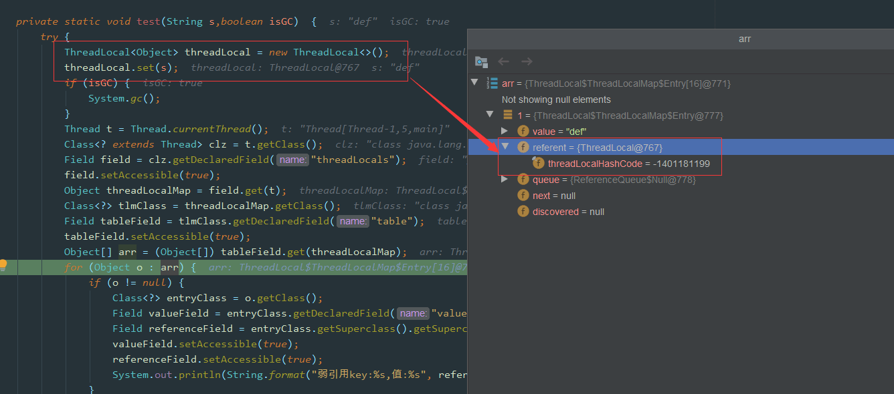

# 一、ThreadLocal 详解

## 前言

**注明：** 本文源码基于`JDK 1.8`


对于`ThreadLocal`，大家的第一反应可能是很简单呀，线程的变量副本，每个线程隔离。那这里有几个问题大家可以思考一下：

- `ThreadLocal`的 key 是**弱引用**，那么在 `ThreadLocal.get()`的时候，发生**GC**之后，key 是否为**null**？
- `ThreadLocal`中`ThreadLocalMap`的**数据结构**？
- `ThreadLocalMap`的**Hash 算法**？
- `ThreadLocalMap`中**Hash 冲突**如何解决？
- `ThreadLocalMap`的**扩容机制**？
- `ThreadLocalMap`中**过期 key 的清理机制**？**探测式清理**和**启发式清理**流程？
- `ThreadLocalMap.set()`方法实现原理？
- `ThreadLocalMap.get()`方法实现原理？
- 项目中`ThreadLocal`使用情况？遇到的坑？
- ……

上述的一些问题你是否都已经掌握的很清楚了呢？本文将围绕这些问题使用图文方式来剖析`ThreadLocal`的**点点滴滴**。

## 1、ThreadLocal代码演示

我们先看下`ThreadLocal`使用示例：

```java
import java.util.ArrayList;
import java.util.List;

public class ThreadLocalComplexDemo {

    /**
     * 保存当前线程的用户
     */
    private static final ThreadLocal<String> USER_HOLDER =
            new ThreadLocal<>();

    /**
     * 保存当前线程的日志集合
     * ArrayList::new，为之后每一个线程的 ThreadLocal LOG_HOLDER 都创建一个ArrayList
     */
    private static final ThreadLocal<List<String>> LOG_HOLDER =
            ThreadLocal.withInitial(ArrayList::new);

    public static void main(String[] args) {

        Runnable task = () -> {

            try {

                // 1.设置当前线程用户
                String userName = Thread.currentThread().getName();

                USER_HOLDER.set(userName);

                // 2.当前线程自己的list add数据【如果get()到的是集合，那么add()就是给集合增加元素；如果不是集合，add()就是覆盖】
                LOG_HOLDER.get().add("登录系统");
                LOG_HOLDER.get().add("查询订单");
                LOG_HOLDER.get().add("修改资料");

                // 3.打印
                System.out.println("============");

                System.out.println("线程："
                        + Thread.currentThread().getName());

                System.out.println("用户："
                        + USER_HOLDER.get());

                System.out.println("日志："
                        + LOG_HOLDER.get());

            } finally {

                // 4.清理（非常重要）
                USER_HOLDER.remove();
                LOG_HOLDER.remove();

                System.out.println(Thread.currentThread().getName()
                        + " 数据已清理");
            }
        };

        Thread t1 = new Thread(task, "张三");

        Thread t2 = new Thread(task, "李四");

        t1.start();
        t2.start();
    }
}
```

打印结果：

```
============
线程：张三
用户：张三
日志：[登录系统, 查询订单, 修改资料]
张三 数据已清理

============
线程：李四
用户：李四
日志：[登录系统, 查询订单, 修改资料]
李四 数据已清理
```

`ThreadLocal`对象可以提供线程局部变量，每个线程`Thread`拥有一份自己的**副本变量**，多个线程互不干扰。

## 2、ThreadLocal的数据结构


`Thread`类有一个类型为`ThreadLocal.ThreadLocalMap`的实例变量`threadLocals`，也就是说每个线程有一个自己的`ThreadLocalMap`。

`ThreadLocalMap`有自己的独立实现，可以简单地将它的`key`视作`ThreadLocal`，`value`为代码中放入的值（实际上`key`并不是`ThreadLocal`本身，而是它的一个**弱引用**）。

每个线程在往`ThreadLocal`里放值的时候，都会往自己的`ThreadLocalMap`里存，读也是以`ThreadLocal`作为引用，在自己的`map`里找对应的`key`，从而实现了**线程隔离**。

`ThreadLocalMap`有点类似`HashMap`的结构，只是`HashMap`是由**数组+链表**实现的，而`ThreadLocalMap`中并**没有链表**结构。

我们还要注意`Entry`， 它的`key`是`ThreadLocal<?> k` ，继承自`WeakReference`， 也就是我们常说的弱引用类型。

## 3、GC 之后 key 是否为 null？

回应开头的那个问题， `ThreadLocal` 的`key`是弱引用，那么在`ThreadLocal.get()`的时候，发生`GC`之后，`key`是否是`null`？

为了搞清楚这个问题，我们需要搞清楚`Java`的**四种引用类型**：

- **强引用**：我们常常 new 出来的对象就是强引用类型，只要强引用存在，垃圾回收器将**永远不会**回收被引用的对象，哪怕内存不足的时候
- **软引用**：使用 SoftReference 修饰的对象被称为软引用，软引用指向的对象在**内存要溢出**的时候被回收
- **弱引用**：使用 WeakReference 修饰的对象被称为弱引用，只要发生**垃圾回收**，若这个对象只被弱引用指向，那么就会被回收
- **虚引用**：虚引用是最弱的引用，在 Java 中使用 PhantomReference 进行定义。虚引用中唯一的作用就是**用队列接收对象即将死亡的通知**

接着再来看下代码，我们使用反射的方式来看看`GC`后`ThreadLocal`中的数据情况：(下面代码来源自：https://blog.csdn.net/thewindkee/article/details/103726942 本地运行演示 GC 回收场景)

```java
public class ThreadLocaGClDemo {

    public static void main(String[] args) throws NoSuchFieldException, IllegalAccessException, InterruptedException {
        Thread t = new Thread(()->test("abc",false));
        t.start();
        t.join();
        System.out.println("--gc后--");
        Thread t2 = new Thread(() -> test("def", true));
        t2.start();
        t2.join();
    }

    private static void test(String s,boolean isGC)  {
        try {
            // 直接 new ThreadLocal，没有给出引用对象
            new ThreadLocal<>().set(s);
            if (isGC) {
                System.gc();
            }
            Thread t = Thread.currentThread();
            Class<? extends Thread> clz = t.getClass();
            Field field = clz.getDeclaredField("threadLocals");
            field.setAccessible(true);
            Object ThreadLocalMap = field.get(t);
            Class<?> tlmClass = ThreadLocalMap.getClass();
            Field tableField = tlmClass.getDeclaredField("table");
            tableField.setAccessible(true);
            Object[] arr = (Object[]) tableField.get(ThreadLocalMap);
            for (Object o : arr) {
                if (o != null) {
                    Class<?> entryClass = o.getClass();
                    Field valueField = entryClass.getDeclaredField("value");
                    Field referenceField = entryClass.getSuperclass().getSuperclass().getDeclaredField("referent");
                    valueField.setAccessible(true);
                    referenceField.setAccessible(true);
                    System.out.println(String.format("弱引用key:%s,值:%s", referenceField.get(o), valueField.get(o)));
                }
            }
        } catch (Exception e) {
            e.printStackTrace();
        }
    }
}
```

结果如下：

```java
弱引用key:java.lang.ThreadLocal@433619b6,值:abc
弱引用key:java.lang.ThreadLocal@418a15e3,值:java.lang.ref.SoftReference@bf97a12
--gc后--
弱引用key:null,值:def
```


如图所示，因为这里创建的`ThreadLocal`并没有指向任何值，也就是没有任何引用：

```java
new ThreadLocal<>().set(s);
```

所以这里在`GC`之后，`key`就会被回收，我们看到上面`debug`中的`referent=null`, 如果**改动一下代码：**



结果：

```
弱引用key:java.lang.ThreadLocal@433619b6,值:abc
弱引用key:java.lang.ThreadLocal@418a15e3,值:java.lang.ref.SoftReference@bf97a12
--gc后--
弱引用key:key:java.lang.ThreadLocal@433619b7,值:def
弱引用key:java.lang.ThreadLocal@418a15e3,值:java.lang.ref.SoftReference@bf97a14
```

这个问题刚开始看，如果没有过多思考，**弱引用**，还有**垃圾回收**，那么肯定会觉得是`null`。

其实是不对的，因为题目说的是在做 `ThreadLocal.get()` 操作，证明其实还是有**强引用**存在的，所以 `key` 并不为 `null`，如下图所示，`ThreadLocal`的**强引用**仍然是存在的。


如果我们的**强引用**不存在的话，那么 `key` 就会被回收，也就是会出现我们 `value` 没被回收，`key` 被回收，导致 `value` 永远存在，出现内存泄漏。

> 例如
>
> ```java
> public class Demo {
> 
>     private static final ThreadLocal<String> USER_TL =
>             new ThreadLocal<>();
> 
>     public static void main(String[] args)
>             throws Exception {
> 
>         Thread t = new Thread(() -> {
> 
>             USER_TL.set("abc");
> 
>             System.gc();
> 
>             try {
>                 printThreadLocal();
>             } catch (Exception e) {
>                 e.printStackTrace();
>             }
> 
>         });
> 
>         t.start();
>         t.join();
>     }
> 
>     public static void printThreadLocal()
>             throws Exception {
> 
>         Thread t = Thread.currentThread();
> 
>         Field field =
>                 Thread.class.getDeclaredField("threadLocals");
> 
>         field.setAccessible(true);
> 
>         Object threadLocalMap = field.get(t);
> 
>         Class<?> tlmClass = threadLocalMap.getClass();
> 
>         Field tableField =
>                 tlmClass.getDeclaredField("table");
> 
>         tableField.setAccessible(true);
> 
>         Object[] arr =
>                 (Object[]) tableField.get(threadLocalMap);
> 
>         for (Object o : arr) {
> 
>             if (o != null) {
> 
>                 Class<?> entryClass = o.getClass();
> 
>                 Field valueField =
>                         entryClass.getDeclaredField("value");
> 
>                 Field referenceField =
>                         entryClass.getSuperclass()
>                                 .getSuperclass()
>                                 .getDeclaredField("referent");
> 
>                 valueField.setAccessible(true);
> 
>                 referenceField.setAccessible(true);
> 
>                 System.out.println(
>                         "key:"
>                                 + referenceField.get(o)
>                                 + ", value:"
>                                 + valueField.get(o)
>                 );
>             }
>         }
>     }
> }
> ```
>
> 运行后：
>
> ```
> key:java.lang.ThreadLocal@xxxx,value:abc
> ```
>
> 不会出现：
>
> ```java
> key:null
> ```
>
> ⚠ 因为存在 **强引用** `USER_TL` 

## 4、`ThreadLocal.set()` 方法源码详解


`ThreadLocal`中的`set`方法原理如上图所示，很简单，主要是判断`ThreadLocalMap`是否存在，然后使用`ThreadLocal`中的`set`方法进行数据处理。

代码如下：

```java
public void set(T value) {
    Thread t = Thread.currentThread();
    ThreadLocalMap map = getMap(t);
    if (map != null)
        map.set(this, value);
    else
        createMap(t, value);
}

void createMap(Thread t, T firstValue) {
    t.threadLocals = new ThreadLocalMap(this, firstValue);
}
```

主要的核心逻辑还是在`ThreadLocalMap`中的，一步步往下看，后面还有更详细的剖析。

## 5、`ThreadLocalMap` Hash 算法

既然是`Map`结构，那么`ThreadLocalMap`当然也要实现自己的`hash`算法来解决散列表数组冲突问题。

```java
int i = key.threadLocalHashCode & (len-1);
```

`ThreadLocalMap`中`hash`算法很简单，这里`i`就是当前 key 在散列表中对应的数组下标位置。

这里最关键的就是`threadLocalHashCode`值的计算，`ThreadLocal`中有一个属性为`HASH_INCREMENT = 0x61c88647`

```java
public class ThreadLocal<T> {
    private final int threadLocalHashCode = nextHashCode();

    private static AtomicInteger nextHashCode = new AtomicInteger();

    private static final int HASH_INCREMENT = 0x61c88647;

    private static int nextHashCode() {
        return nextHashCode.getAndAdd(HASH_INCREMENT);
    }

    static class ThreadLocalMap {
        ThreadLocalMap(ThreadLocal<?> firstKey, Object firstValue) {
            table = new Entry[INITIAL_CAPACITY];
            int i = firstKey.threadLocalHashCode & (INITIAL_CAPACITY - 1);

            table[i] = new Entry(firstKey, firstValue);
            size = 1;
            setThreshold(INITIAL_CAPACITY);
        }
    }
}
```

每当创建一个`ThreadLocal`对象，这个`ThreadLocal.nextHashCode` 这个值就会增长 `0x61c88647` 。

这个值很特殊，它是**斐波那契数** 也叫 **黄金分割数**。`hash`增量为 这个数字，带来的好处就是 `hash` **分布非常均匀**。

我们自己可以尝试下：


可以看到产生的哈希码分布很均匀，这里不去细纠**斐波那契**具体算法，感兴趣的可以自行查阅相关资料。

## 6、`ThreadLocalMap` Hash 冲突

> **注明：** 下面所有示例图中：
>
> - **绿色块**`Entry`代表**正常数据**；
> - **灰色**块**代表`Entry`的`key`值为`null`，**已被垃圾回收**；**
> - **白色**块表示`Entry`为`null`。

虽然`ThreadLocalMap`中使用了**黄金分割数**来作为`hash`计算因子，大大减少了`Hash`冲突的概率，但是仍然会存在冲突。

`HashMap`中解决冲突的方法是在数组上构造一个**链表**结构，冲突的数据挂载到链表上，如果链表长度超过一定数量则会转化成**红黑树**。

而 `ThreadLocalMap` 中并没有链表结构，所以这里不能使用 `HashMap` 解决冲突的方式了。


如上图所示，如果我们插入一个`value=27`的数据，通过 `hash` 计算后应该落入槽位 4 中，而槽位 4 已经有了 `Entry` 数据。

此时就会线性向后查找，一直找到 `Entry` 为 `null` 的槽位才会停止查找，将当前元素放入此槽位中。当然迭代过程中还有其他的情况，比如遇到了 `Entry` 不为 `null` 且 `key` 值相等的情况，还有 `Entry` 中的 `key` 值为 `null` 的情况等等都会有不同的处理，后面会一一详细讲解。

这里还画了一个`Entry`中的`key`为`null`的数据（**Entry=2 的灰色块数据**），因为`key`值是**弱引用**类型，所以会有这种数据存在。在`set`过程中，如果遇到了`key`过期的`Entry`数据，实际上是会进行一轮**探测式清理**操作的，具体操作方式后面会讲到。

## 7、`ThreadLocalMap.set()` 详解

### 7.1、`ThreadLocalMap.set()` 原理图解