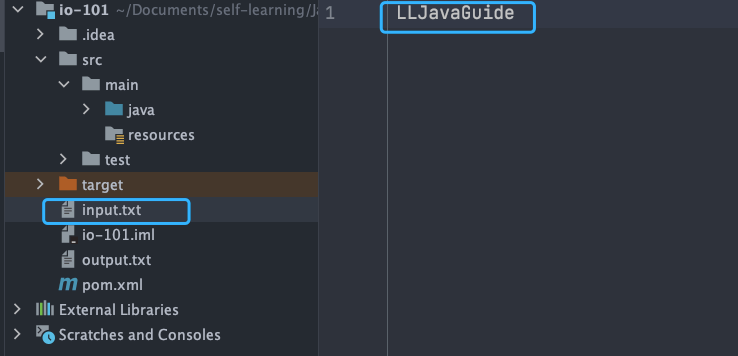
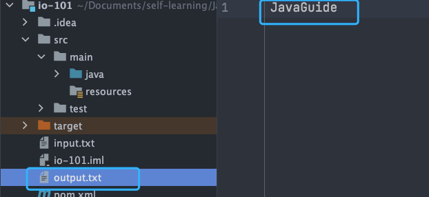
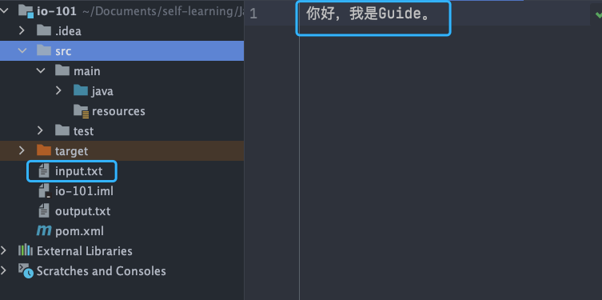

# 一、IO流简介

IO 即 `Input/Output`，输入和输出。数据输入到计算机内存的过程即输入，反之输出到外部存储（比如数据库，文件，远程主机）的过程即输出。数据传输过程类似于水流，因此称为 IO 流。IO 流在 Java 中分为输入流和输出流，而根据数据的处理方式又分为字节流和字符流。

Java IO 流的 40 多个类都是从如下 4 个抽象类基类中派生出来的。

- `InputStream`/`Reader`: 所有的输入流的**抽象基类**，前者是字节输入流，后者是字符输入流。
- `OutputStream`/`Writer`: 所有输出流的**抽象基类**，前者是字节输出流，后者是字符输出流。

# 二、字节流

## 1、InputStream（字节输入流）

`InputStream`用于从源头（通常是文件）读取数据（字节信息）到内存中，`java.io.InputStream`抽象类是所有字节输入流的父类。

`InputStream` 常用方法：

- `read()`：返回输入流中下一个字节的数据。返回的值介于 0 到 255 之间。如果未读取任何字节，则代码返回 `-1` ，表示文件结束。
- `read(byte b[ ])` : 从输入流中读取一些字节存储到数组 `b` 中。如果数组 `b` 的长度为零，则不读取。如果没有可用字节读取，返回 `-1`。如果有可用字节读取，则读取的字节数**最多等于** `b.length` ， 返回读取的字节数。这个方法等价于 `read(b, 0, b.length)`。
- `read(byte b[], int off, int len)`：在`read(byte b[ ])` 方法的基础上增加了 `off` 参数（偏移量）和 `len` 参数（要读取的最大字节数）。
- `skip(long n)`：忽略输入流中的 n 个字节 ,返回实际忽略的字节数。
- `available()`：返回输入流中可以**读取的字节数**。
- `close()`：关闭输入流释放相关的系统资源。

从 Java 9 开始，`InputStream` 新增加了多个实用的方法：

- `readAllBytes()`：读取输入流中的所有字节，返回字节数组。
- `readNBytes(byte[] b, int off, int len)`：阻塞直到读取 `len` 个字节。
- `transferTo(OutputStream out)`：将所有字节从一个输入流传递到一个输出流。

> 注意：
>
> - `read(byte b[], int off, int len)` 会尽量读取最多 len 个字节，不一定读满，但  `readNBytes(byte[] b, int off, int len)` 会尽量一直读取，直到读满指定长度、到达 EOF、或者发生异常

### 1.1、FileInputStream

`FileInputStream` 是一个比较常用的字节输入流对象，可直接指定文件路径，可以直接读取单字节数据，也可以读取至字节数组中。

`FileInputStream` 代码示例：

```java
try (InputStream fis = new FileInputStream("input.txt")) {
    System.out.println("Number of remaining bytes:"
            + fis.available());
    int content;
    long skip = fis.skip(2);
    System.out.println("The actual number of bytes skipped:" + skip);
    System.out.print("The content read from file:");
    while ((content = fis.read()) != -1) {
        System.out.print((char) content);
    }
} catch (IOException e) {
    e.printStackTrace();
}
```

`input.txt` 文件内容：



输出：

```plain
Number of remaining bytes:11
The actual number of bytes skipped:2
The content read from file:JavaGuide
```

不过，一般我们是不会直接单独使用 `FileInputStream` ，通常会配合 `BufferedInputStream`（字节缓冲输入流，后文会讲到）来使用。

像下面这段代码在我们的项目中就比较常见，我们通过 `readAllBytes()` 读取输入流所有字节并将其直接赋值给一个 `String` 对象。

```java
// 新建一个 BufferedInputStream 对象
BufferedInputStream bufferedInputStream = new BufferedInputStream(new FileInputStream("input.txt"));
// 读取文件的内容并复制到 String 对象中
String result = new String(bufferedInputStream.readAllBytes());
System.out.println(result);
```

### 1.2、DataInputStream

`DataInputStream` 用于读取指定类型数据，不能单独使用，必须结合其它流，比如 `FileInputStream` 。

```java
FileInputStream fileInputStream = new FileInputStream("input.txt");
//必须将fileInputStream作为构造参数才能使用
DataInputStream dataInputStream = new DataInputStream(fileInputStream);
//可以读取任意具体的类型数据
dataInputStream.readBoolean();
dataInputStream.readInt();
dataInputStream.readUTF();
```

> ### 一、完整实例
>
> #### 1、写入数据
>
> 先使用 `DataOutputStream` 写入：
>
> ```java
> import java.io.DataOutputStream;
> import java.io.FileOutputStream;
> 
> public class WriteDemo {
> 
>  public static void main(String[] args) throws Exception {
> 
>      DataOutputStream dos =
>              new DataOutputStream(
>                      new FileOutputStream("input.txt"));
> 
>      // 写入boolean
>      dos.writeBoolean(true);
> 
>      // 写入int
>      dos.writeInt(100);
> 
>      // 写入UTF字符串
>      dos.writeUTF("hello java");
> 
>      dos.close();
> 
>      System.out.println("写入完成");
>  }
> }
> ```
>
> ⚠注意：
>
> - 文件里**不是**如下的文本：
>
>   ```
>   true
>   100
>   hello java
>   ```
>
>   而是二进制数据，类似于：
>
>   ```
>   01 00 00 00 64 ...
>   ```
>
> #### 2、读取数据
>
> ```java
> import java.io.DataInputStream;
> import java.io.FileInputStream;
> 
> public class ReadDemo {
> 
>     public static void main(String[] args) throws Exception {
> 
>         DataInputStream dis =
>                 new DataInputStream(
>                         new FileInputStream("input.txt"));
> 
>         // 按写入顺序读取
>         boolean b = dis.readBoolean();
> 
>         int num = dis.readInt();
> 
>         String str = dis.readUTF();
> 
>         dis.close();
> 
>         System.out.println(b);
>         System.out.println(num);
>         System.out.println(str);
>     }
> }
> ```
>
> 输出：
>
> ```
> true
> 100
> hello java
> ```
>
> ### 二、为什么必须按顺序读取？
>
> 写入顺序：
>
> ```java
> dos.writeBoolean(true);
> dos.writeInt(100);
> dos.writeUTF("hello");
> ```
>
> 读取时必须：
>
> ```java
> readBoolean()
> readInt()
> readUTF()
> ```
>
> 顺序完全一致。
>
> ### 三、如果顺序错了会怎样？
>
> 例如 `dis.readInt();` 去读取 `writeBoolean(true)` 写入的数据，那么：
>
> - 会把后面的4个字节强行当int解析
> - 数据错乱
> - 甚至抛异常
>
> 因为：`DataInputStream` 根本不知道 当前数据到底是什么类型，它只会机械地按指定格式解析字节
>
> ### 四、DataInputStream 的本质
>
> 本质是字节流 + **类型解析**
>
> 例如
>
> ```
> int b = inputStream.read();
> ```
>
> 得自己解析。
>
> #### 1、DataInputStream
>
> 可以直接读取Java类型，例如：
>
> ```java
> int n = dis.readInt();
> ```
>
> 内部会：
>
> - 连续读取4个字节
> - 按大端序组合成int
>
> ### 五、readInt()底层原理
>
> 例如 文件中4字节：
>
> ```
> 00 00 00 64
> ```
>
> `readInt()` 会：
>
> ```
> (0 << 24)
> |
> (0 << 16)
> |
> (0 << 8)
> |
> 100
> ```
>
> 最终：
>
> ```
> 100
> ```
>
> ### 六、readUTF() 是什么？
>
> 很多人误以为：`readUTF()`  是读取普通字符串，实际上不是。
>
> #### 1、writeUTF() 的存储结构
>
> 它写入：
>
> ```
> 字符串长度 + UTF编码字节
> ```
>
> 例如：
>
> ```java
> dos.writeUTF("abc");
> ```
>
> 实际写入：
>
> ```
> 00 03 61 62 63
> ```
>
> 含义：
>
> | 数据  | 含义   |
> | ----- | ------ |
> | 00 03 | 长度=3 |
> | 61    | a      |
> | 62    | b      |
> | 63    | c      |
>
> ### 七、适合什么场景？
>
> #### 1. Java对象协议
>
> 例如：
>
> 客户端：
>
> ```
> writeInt()
> writeUTF()
> ```
>
> 服务端：
>
> ```
> readInt()
> readUTF()
> ```
>
> ------
>
> #### 2. Socket通信
>
> 很多TCP协议会这样：
>
> ```
> 消息长度 + 消息内容
> ```
>
> ------
>
> #### 3. 二进制文件
>
> 例如：
>
> - 游戏存档
> - 配置文件
> - 音视频头信息
>
> ### 八、不适合什么场景？
>
> 不适合：
>
> ```
> 文本文件
> ```
>
> 例如：
>
> ```
> hello
> 123
> ```
>
> 因为：`DataInputStream` 读的是二进制格式，不是文本。

### 1.3、ObjectInputStream

`ObjectInputStream` 用于从输入流中读取 Java 对象（反序列化），`ObjectOutputStream` 将对象写入到输出流（序列化）。

另外，用于序列化和反序列化的类必须实现 `Serializable` 接口，对象中如果有属性不想被序列化，使用 `transient` 修饰。

> ## 一、实例
>
> ### 1. Person类（必须实现 Serializable）
>
> ```java
> import java.io.Serializable;
> 
> public class Person implements Serializable {
> 
>     // 建议显式定义版本号
>     private static final long serialVersionUID = 1L;
> 
>     private String name;
> 
>     private String job;
> 
>     // 不想被序列化
>     private transient String password;
> 
>     public Person(String name, String job, String password) {
>         this.name = name;
>         this.job = job;
>         this.password = password;
>     }
> 
>     @Override
>     public String toString() {
>         return "Person{" +
>                 "name='" + name + '\'' +
>                 ", job='" + job + '\'' +
>                 ", password='" + password + '\'' +
>                 '}';
>     }
> }
> ```
>
> ### 2.对象序列化（写入对象）
>
> ```java
> import java.io.FileOutputStream;
> import java.io.ObjectOutputStream;
> 
> public class SerializeDemo {
> 
>     public static void main(String[] args) throws Exception {
> 
>         // 创建对象
>         Person person =
>                 new Person(
>                         "Guide哥",
>                         "JavaGuide作者",
>                         "123456"
>                 );
> 
>         // 创建对象输出流
>         ObjectOutputStream output =
>                 new ObjectOutputStream(
>                         new FileOutputStream("file.txt")
>                 );
> 
>         // 写入对象（序列化）
>         output.writeObject(person);
> 
>         output.close();
> 
>         System.out.println("对象序列化完成");
>     }
> }
> ```
>
> 输出：
>
> ```java
> Person{name='Guide哥', job='JavaGuide作者', password='null'}
> ```
>
> ## 二、为什么 password 变成 null？
>
> 因为：
>
> ```
> transient
> ```
>
> 修饰了该字段。
>
> ### 1、transient 的作用
>
> 表示：
>
> ```
> 该字段不参与序列化
> ```
>
> 因此：
>
> - 序列化时不会写入文件；
> - 反序列化时不会恢复数据。
>
> 因此：
>
> ```java
> password = null
> ```
>
> ## 三、Serializable 接口为什么必须实现？
>
> ### 1、Serializable 是什么？
>
> ```java
> public interface Serializable {
> }
> ```
>
> 它是 **标记接口（Marker Interface）**,  本身没有方法。
>
> 它的作用是告诉 JVM：“这个类允许被序列化”，
>
> ### 2、如果不实现 Serializable
>
> 那么 `output.writeObject(person);` 时会直接抛出异常：`java.io.NotSerializableException`
>
> ## 四、为什么建议写 serialVersionUID？
>
> 建议：
>
> ```
> private static final long serialVersionUID = 1L;
> ```
>
> ### 1、原因
>
> 反序列化时，JVM 会检查：**类版本号**是否一致。
>
> 如果类结构变了：
>
> ```java
> class Person {
>     String name;
> }
> ```
>
> 后来：
>
> ```java
> class Person {
>     String name;
>     int age;
> }
> ```
>
> JVM 自动生成的 UID 可能改变。
>
> 于是：
>
> ```
> InvalidClassException
> ```
>
> ### 2、显式指定 UID
>
> 可以避免：类小改动导致无法反序列化
>
> ## 五、static 为什么不会被序列化？
>
> 因为：
>
> ```
> static 属于类
> ```
>
> 不是对象。
>
> ## 六、实际开发中的应用
>
> ### 1、Redis缓存
>
> 很多 Java 项目：
>
> ```
> 对象 → 字节数组 → Redis
> ```
>
> ### 2、RPC远程调用
>
> 例如：
>
> - Dubbo
> - RMI
>
> 都会：
>
> ```
> 对象序列化后网络传输
> ```
>
> ### 3、MQ消息队列
>
> 对象：
>
> ```
> 订单对象
> ```
>
> 序列化后：
>
> ```
> 发送到Kafka/RabbitMQ
> ```
>
> 

## 2、OutputStream（字节输出流）

`OutputStream`用于将数据（字节信息）写入到目的地（通常是文件），`java.io.OutputStream`抽象类是所有字节输出流的父类。

`OutputStream` 常用方法：

- `write(int b)`：将特定字节写入输出流。
- `write(byte b[ ])` : 将数组`b` 写入到输出流，等价于 `write(b, 0, b.length)` 。
- `write(byte[] b, int off, int len)` : 在`write(byte b[ ])` 方法的基础上增加了 `off` 参数（偏移量）和 `len` 参数（要读取的最大字节数）。
- `flush()`：刷新此输出流并强制写出所有缓冲的输出字节。
- `close()`：关闭输出流释放相关的系统资源。

### 2.1、`FileOutputStream`

`FileOutputStream` 是最常用的字节输出流对象，可直接指定文件路径，可以直接输出单字节数据，也可以输出指定的字节数组。

`FileOutputStream` 代码示例：

```java
try (FileOutputStream output = new FileOutputStream("output.txt")) {
    byte[] array = "JavaGuide".getBytes();
    output.write(array);
} catch (IOException e) {
    e.printStackTrace();
}
```

运行结果：



类似于 `FileInputStream`，`FileOutputStream` 通常也会配合 `BufferedOutputStream`（字节缓冲输出流，后文会讲到）来使用。

```java
FileOutputStream fileOutputStream = new FileOutputStream("output.txt");
BufferedOutputStream bos = new BufferedOutputStream(fileOutputStream)
```

### 2.2、`DataOutputStream`

**`DataOutputStream`** 用于写入指定类型数据，不能单独使用，必须结合其它流，比如 `FileOutputStream` 。

```java
// 输出流
FileOutputStream fileOutputStream = new FileOutputStream("out.txt");
DataOutputStream dataOutputStream = new DataOutputStream(fileOutputStream);
// 输出任意数据类型
dataOutputStream.writeBoolean(true);
dataOutputStream.writeByte(1);
```

### 2.3、`ObjectInputStream` 

`ObjectInputStream` 用于从输入流中读取 Java 对象（反序列化），`ObjectOutputStream` 将对象写入到输出流（序列化）。

```java
ObjectOutputStream output = new ObjectOutputStream(new FileOutputStream("file.txt")
Person person = new Person("Guide哥", "JavaGuide作者");
output.writeObject(person);
```


# 三、字符流

不管是文件读写还是网络发送接收，信息的最小存储单元都是字节。 **那为什么 I/O 流操作要分为字节流操作和字符流操作呢？**

个人认为主要有两点原因：

- 字符流是由 Java 虚拟机将字节转换得到的，这个过程还算是比较耗时。
- 如果我们不知道编码类型就很容易出现乱码问题。

乱码问题这个很容易就可以复现，我们只需要将上面提到的 `FileInputStream` 代码示例中的 `input.txt` 文件内容改为**中文**即可，原代码不需要改动。



输出：

```java
Number of remaining bytes:9
The actual number of bytes skipped:2
The content read from file:§å®¶å¥½
```

可以很明显地看到读取出来的内容已经变成了乱码。

因此，I/O 流就干脆提供了一个直接操作字符的接口，方便我们平时对字符进行流操作。如果音频文件、图片等媒体文件用字节流比较好，如果涉及到字符的话使用字符流比较好。

字符流默认采用的是 `Unicode` 编码，我们可以通过构造方法自定义编码。

Unicode 本身只是一种字符集，它为每个字符分配一个唯一的数字编号，并没有规定具体的存储方式。UTF-8、UTF-16、UTF-32 都是 Unicode 的编码方式，它们使用不同的字节数来表示 Unicode 字符。例如，UTF-8 :英文占 1 字节，中文占 3 字节。

## 1、Reader（字符输入流）

`Reader`用于从源头（通常是文件）读取数据（字符信息）到内存中，`java.io.Reader`抽象类是所有字符输入流的父类。

`Reader` 用于读取文本， `InputStream` 用于读取原始字节。

`Reader` 常用方法：

- `read()` : 从输入流读取一个字符。
- `read(char[] cbuf)` : 从输入流中读取一些字符，并将它们存储到字符数组 `cbuf`中，等价于 `read(cbuf, 0, cbuf.length)` 。
- `read(char[] cbuf, int off, int len)`：在`read(char[] cbuf)` 方法的基础上增加了 `off` 参数（偏移量）和 `len` 参数（要读取的最大字符数）。
- `skip(long n)`：忽略输入流中的 n 个字符 ,返回实际忽略的字符数。
- `close()` : 关闭输入流并释放相关的系统资源。

`InputStreamReader` 是字节流转换为字符流的桥梁，其子类 `FileReader` 是基于该基础上的封装，可以直接操作字符文件。

```java
// 字节流转换为字符流的桥梁
public class InputStreamReader extends Reader {
}
// 用于读取字符文件
public class FileReader extends InputStreamReader {
}
```

### 1.1、`InputStreamReader` 

**内部本质：**

```
读取字节
    ↓
按指定编码解码
    ↓
转换成字符
```

**示例代码**

```java
import java.io.FileInputStream;
import java.io.InputStreamReader;

public class Demo2 {

    public static void main(String[] args) throws Exception {

        // 字节流
        FileInputStream fis =
                new FileInputStream("test.txt");

        // 指定编码, 转换成字符流
        InputStreamReader isr =
                new InputStreamReader(fis, "UTF-8");

        int ch;

        while ((ch = isr.read()) != -1) {

            System.out.print((char) ch);
        }

        isr.close();
    }
}
```

输出：

```
你好Java
```

InputStreamReader 常见构造方法有：

```java
// 1.使用系统默认的编码格式
InputStreamReader isr = new InputStreamReader(fis);

// 2.指定编码格式
InputStreamReader isr = new InputStreamReader(fis，"UTF-8");
```


### 1.2、`FileReader`

`FileReader` 本质就是 `InputStreamReader` 的简化版，**无法指定**编码格式，使用的是系统默认的编码格式

示例代码如下：

```java
import java.io.FileReader;

public class Demo3 {

    public static void main(String[] args) throws Exception {

        FileReader reader =
                new FileReader("test.txt");

        int ch;

        while ((ch = reader.read()) != -1) {

            System.out.print((char) ch);
        }

        reader.close();
    }
}
```


