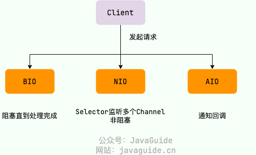
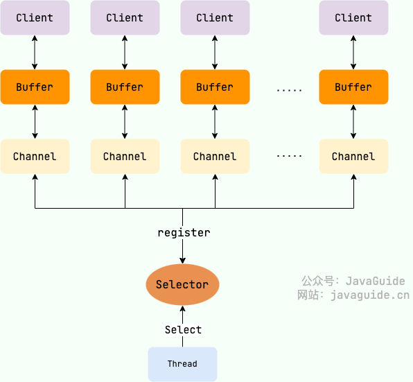
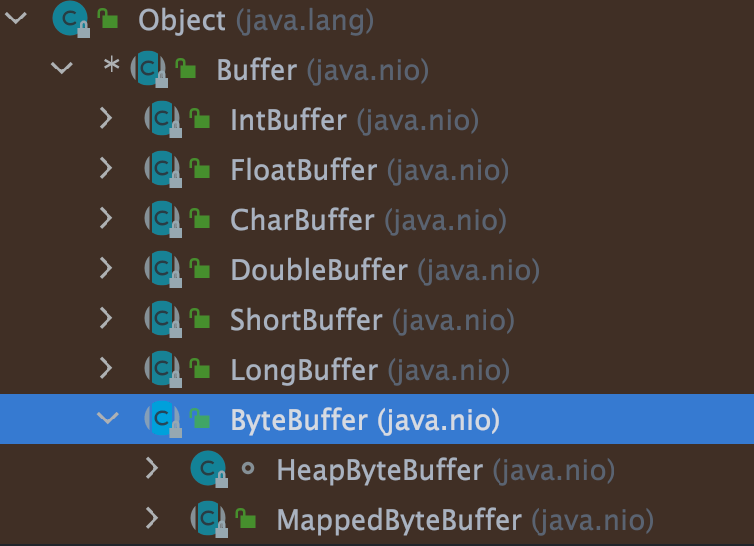
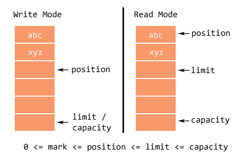
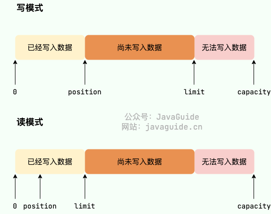
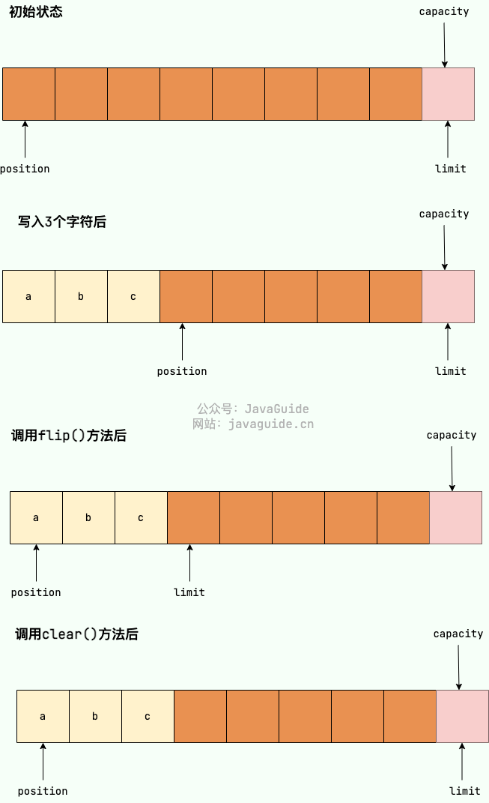
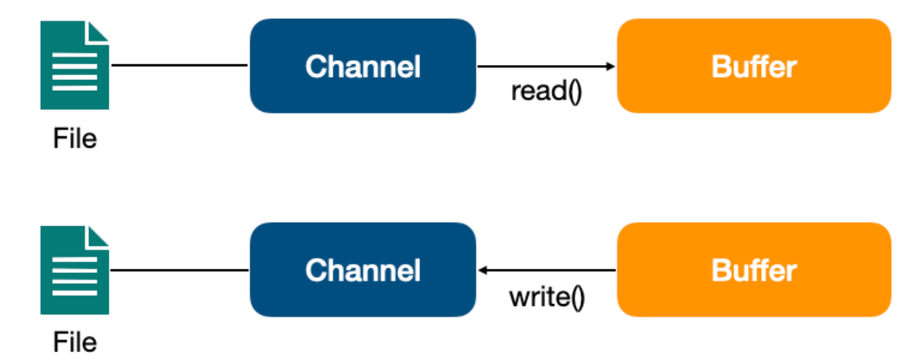
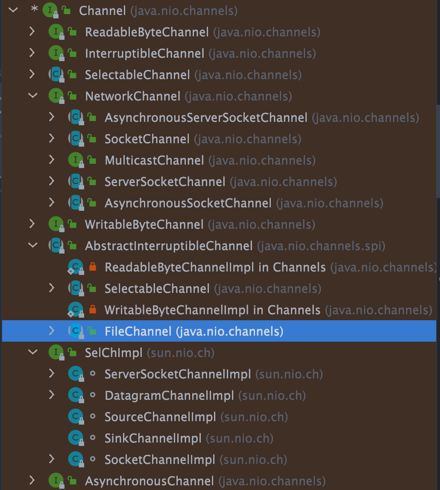
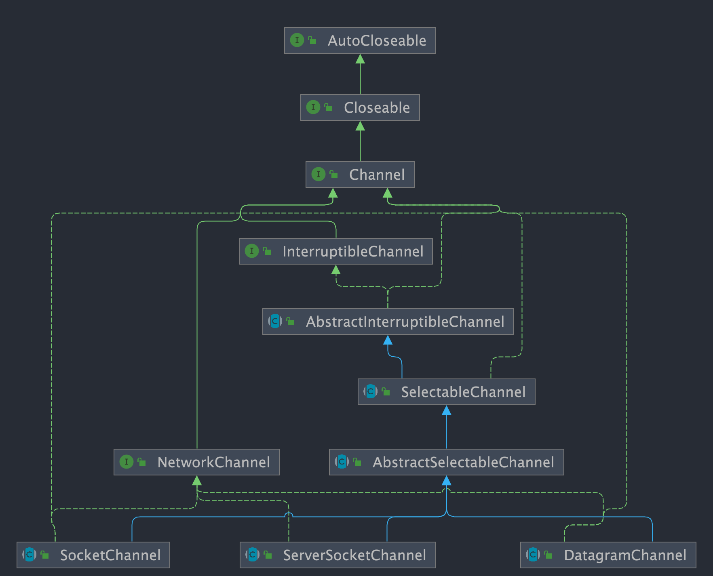
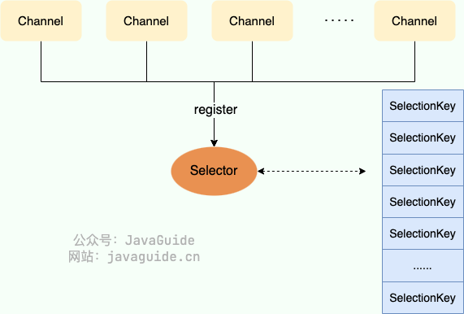

# 一、NIO 简介

在传统的 Java I/O 模型（BIO）中，I/O 操作是以阻塞的方式进行的。也就是说，当一个线程执行一个 I/O 操作时，它会被阻塞直到操作完成。这种阻塞模型在处理多个并发连接时可能会导致性能瓶颈，因为需要为每个连接创建一个线程，而线程的创建和切换都是有开销的。

为了解决这个问题，在 Java1.4 版本引入了一种新的 I/O 模型 — **NIO** （New IO，也称为 Non-blocking IO） 。NIO 弥补了同步阻塞 I/O 的不足，它在标准 Java 代码中提供了非阻塞、面向缓冲、基于通道的 I/O，可以使用少量的线程来处理多个连接，大大提高了 I/O 效率和并发。

下图是 BIO、NIO 和 AIO 处理客户端请求的简单对比图（关于 AIO 的介绍，可以看我写的这篇文章：[Java IO 模型详解](./03_Java-IO模型详解.md)，不是重点，了解即可）。



⚠️需要注意：使用 NIO 并不一定意味着高性能，它的性能优势主要体现在高并发和高延迟的网络环境下。当连接数较少、并发程度较低或者网络传输速度较快时，NIO 的性能并不一定优于传统的 BIO 。

# 二、NIO 核心组件

NIO 主要包括以下三个核心组件：

- **Buffer（缓冲区）**：NIO 读写数据都是通过缓冲区进行操作的。**读**操作的时候将 Channel 中的数据填充到 Buffer 中，而**写**操作时将 Buffer 中的数据写入到 Channel 中。
- **Channel（通道）**：Channel 是一个双向的、可读可写的数据传输通道，NIO 通过 Channel 来实现数据的输入输出。通道是一个抽象的概念，它可以代表文件、套接字或者其他数据源之间的连接。
- **Selector（选择器）**：允许一个线程处理多个 Channel，基于事件驱动的 I/O 多路复用模型。所有的 Channel 都可以注册到 Selector 上，由 Selector 来分配线程来处理事件。

三者的关系如下图所示（暂时不理解没关系，后文会详细介绍）：



下面详细介绍一下这三个组件。

## 1、Buffer（缓冲区）

在传统的 BIO 中，数据的读写是面向流的， 分为字节流和字符流。

在 Java 1.4 的 NIO 库中，所有数据都是用**缓冲区**处理的，这是新库和之前的 BIO 的一个重要区别，有点类似于 BIO 中的缓冲流。NIO 在读取数据时，它是直接读到缓冲区中的。在写入数据时，写入到缓冲区中。 使用 NIO 在读写数据时，都是通过缓冲区进行操作。

`Buffer` 的子类如下图所示。其中，最常用的是 `ByteBuffer`，它可以用来存储和操作字节数据。



你可以将 Buffer 理解为一个数组，`IntBuffer`、`FloatBuffer`、`CharBuffer` 等分别对应 `int[]`、`float[]`、`char[]` 等。

为了更清晰地认识缓冲区，我们来简单看看`Buffer` 类中定义的四个成员变量：

```java
public abstract class Buffer {
    // Invariants: mark <= position <= limit <= capacity
    
    private int mark = -1;
    private int position = 0;
    private int limit;
    private int capacity;
}
```

这四个成员变量的具体含义如下：

1. 容量（`capacity`）：`Buffer`可以存储的最大数据量，`Buffer`创建时设置且不可改变；
2. 界限（`limit`）：`Buffer` 中可以读/写数据的边界。写模式下，`limit` 代表最多能写入的数据，一般等于 `capacity`（可以通过`limit(int newLimit)`方法设置）；读模式下，`limit` 等于 Buffer 中实际写入的数据大小。
3. 位置（`position`）：**下一个**可以被读写的数据的**位置（索引）**。从写操作模式到读操作模式**切换的时候**（flip），**`position` 都会归零**，这样就可以从头开始读写了。
4. 标记（`mark`）：`Buffer`允许将位置直接定位到该标记处，这是一个可选属性；

并且，上述变量满足如下的关系：**0 <= mark <= position <= limit <= capacity** 。

另外，Buffer 有读模式和写模式这两种模式，分别用于从 Buffer 中读取数据或者向 Buffer 中写入数据。Buffer 被创建之后**默认是写模式**，调用 `flip()` 可以切换到读模式。如果要再次切换回写模式，可以调用 `clear()` 或者 `compact()` 方法。

Buffer 的可视区间在 `position` ~ `limit` 之间：

> ⚠注意：对于 `ChartBuffer` 而言，它的 `toString()` 被特殊重写过，因此直接输出 `CharBuffer` 会输出**可视区间**内容。





`Buffer` 对象**不能**通过 `new` 调用构造方法创建对象 ，只能通过静态方法实例化 `Buffer`。

这里以 `ByteBuffer`为例进行介绍：

```java
// 分配堆内存
public static ByteBuffer allocate(int capacity);
// 分配直接内存
public static ByteBuffer allocateDirect(int capacity);
```

Buffer 最核心的两个方法：

1. `get` : 读取缓冲区的数据

	> 读取 `position` 处的内容
	>
	> ⚠注意：如果在写模式下，直接`get()` 则会出错，因为 `position` 当前的位置没有有效值。

2. `put` ：向缓冲区写入数据

	> 向 `position` 处写入内容
	>
	> ⚠注意：如果在读模式下，直接 `put()` 则会覆盖 `position` 处的内容。

除上述两个方法之外，其他的重要方法：

- `flip` ：将缓冲区从写模式切换到读模式，它会将 `limit` 的值设置为当前 `position` 的值，将 `position` 的值设置为 0。
- `clear`: 清空缓冲区，将缓冲区从读模式切换到写模式，并将 `position` 的值设置为 0，将 `limit` 的值设置为 `capacity` 的值。
- ……

Buffer 中数据变化的过程：

```java
import java.nio.*;

public class CharBufferDemo {
    public static void main(String[] args) {
        // 分配一个容量为8的 CharBuffer
        CharBuffer buffer = CharBuffer.allocate(8);
        System.out.println("初始状态：");
        printState(buffer);

        // 向 Buffer 中写入3哥字符：
        buffer.put('a').put('b').put('c');
        System.out.println("写入3个字符后的状态：");
        printState(buffer);

        // 调用 flip 切换为读模式，limit=position，position=0，mark=-1
        buffer.flip();
        System.out.println("调用flip()后的状态：");
        printState(buffer);

        // 读取字符
        System.out.println("buffer中的内容：");
        while (buffer.hasRemaining()){
            System.out.print(buffer.get());
        }
        System.out.println("\n");

        // 调用 clear()，缓冲区的内容被彻底清空，position = 0，limit = capacity
        buffer.clear();
        System.out.println("调用clear()方法后的状态：");
        printState(buffer);
    }

    /**
     * 输出当前 CharBuffer 的状态
     * @param buffer
     */
    private static void printState(CharBuffer buffer){
        System.out.print("capacity: " + buffer.capacity());
        System.out.print(", limit: " + buffer.limit());
        System.out.print(", position: " + buffer.position());
        System.out.println(", mark 开始读取的字符：" + buffer.mark() + "\n");
    }
}
```

输出:

```bash
初始状态：
capacity: 8, limit: 8, position: 0, mark 开始读取的字符：        

写入3个字符后的状态：
capacity: 8, limit: 8, position: 3, mark 开始读取的字符：     

调用flip()后的状态：
capacity: 8, limit: 3, position: 0, mark 开始读取的字符：abc

buffer中的内容：
abc

调用clear()方法后的状态：
capacity: 8, limit: 8, position: 0, mark 开始读取的字符：abc     
```

为了帮助理解，我绘制了一张图片展示 `capacity`、`limit`和`position`每一阶段的变化。



### 1.1、capacity（容量）的单位是什么？

capacity 的单位不是“字节固定值”，而是：当前 Buffer 所能存储的“**元素个数**”，不同 Buffer 类型，单位不同。

#### ByteBuffer

```
xxxxxxxxxx1 1ByteBuffer buffer = ByteBuffer.allocate(1024);
```

这里：`capacity = 1024`，表示：可存储 1024 个 byte。由于 1 byte = 1 字节，因此这里也等于：1024 字节。

#### IntBuffer

```
IntBuffer buffer = IntBuffer.allocate(10);
```

这里：capacity = 10，表示：能存 10 个 int

而不是 10 字节，因为：1 int = 4 字节，因此实际占用：40 字节

#### 总结

| Buffer类型 | capacity含义 |
| ---------- | ------------ |
| ByteBuffer | byte个数     |
| CharBuffer | char个数     |
| IntBuffer  | int个数      |
| LongBuffer | long个数     |

所以：capacity 的单位 = 当前 Buffer 元素类型的个数，不是固定“字节”。

### 1.2、 position 的值是什么？

position 的本质表示：**下一个**可读/可写元素的位置索引。

⚠注意：不是当前元素，而是“下一次操作”的位置。

------

#### 写模式下

初始：

```
ByteBuffer buffer = ByteBuffer.allocate(10);
```

状态：

```
position = 0
limit = 10
capacity = 10
```

------

 `put()` 后 position 自动增加

```
buffer.put((byte)1);
```

发生：数据写入索引0，然后：`position -> 1`，表示：下一个写入位置是1。

继续：

```
buffer.put((byte)2);
```

状态：`position = 2`，因为：0、1 已经写过，下一个写入位置是2

------

#### 读模式下

调用`flip();`后：

```
limit = position原值
position = 0
```

例如：原来写了2个字节，`flip` 后：

```
limit = 2
position = 0
```

表示：只能读取 0~1。

#### get() 后 position 也会增加

```
buffer.get();
```

读取索引0后，

```
position = 1
```

再读一次：

```
position = 2
```

此时：

```
position == limit
```

说明：

```
数据读完了
```

------

### 1.3、position 如何修改？

有三种方式：

#### (1) put/get 自动修改

最常见。

------

#### (2) flip()/clear()/compact() 修改

**flip()**

```
position = 0
```

 **clear()**

```
position = 0
limit = capacity
```

------

**compact()**

会把未读数据前移：

例如：

```
[1 2 3 4]
```

已经读了：

```
1 2
```

剩余：

```
3 4
```

compact 后：

```
3 4 _ _
```

然后：

```
position = 2
```

因为：

```
前面已有2个有效数据
下次从索引2继续写
```

------

#### (3）手动修改

```
buffer.position(5);
```

直接设置 position，类似文件指针跳转。

### 1.4、mark（标记）的作用是什么？

mark 的本质相当于：“临时保存一个 position”，方便之后回退。

使用流程：

**mark()**：记录当前 position：

```java
buffer.mark();
```

> ⚠注意：`mark()` 并不是获取 mark 的值，而是设置 mark = 当前 position，它返回的也不是 mark 值，而是：**Buffer 本身（this）**，所以`mark()`实际上做了两件事：
>
> 源码逻辑类似：
>
> ```
> public final Buffer mark() {
>     mark = position;
>     return this;
> }
> ```
>
> 也就是说：
>
> ```
> 调用 mark()
> =
> 把当前位置保存为 mark
> ```
>
> Java NIO 根本 **没有提供 getMark()**，但是Buffer 提供：
>
> - mark()     → 设置 mark
> - reset()    → 回到 mark
>
> 

**reset()**：恢复到 mark：

```java
buffer.reset();
```

**示例**:

```java
ByteBuffer buffer = ByteBuffer.allocate(10);

buffer.put((byte)1);
buffer.put((byte)2);

buffer.flip();

System.out.println(buffer.get()); // 1

buffer.mark(); // 记录当前位置(position=1)

System.out.println(buffer.get()); // 2

buffer.reset(); // 回到position=1

System.out.println(buffer.get()); // 再次读取2
```

输出：

```
1
2
2
```

#### mark 的典型用途

1. **回溯读取**

例如协议解析：

```
先尝试读取
发现数据不完整
回退重新读
```

------

2. **类似“断点”**

像：

```
保存当前游标
```

------

⚠ 注意：

调用以下方法会丢失 mark：

- flip()
- clear()
- compact()

因为 position/limit 被重置了，因为 `mark` 的本质是：“某一时刻 position 的快照”，它是依附于当前 position/limit 状态体系，一旦position 或 limit 的语义发生重大变化，原来的 `mark` 就可能失效、越界或者语义错误，所以 Java NIO 设计成只要 Buffer 的整体读写状态被重置，mark 就直接作废。

### ⭐️1.5、 flip()、clear()、compact() 如何切换读写模式？

实际上，Buffer 并没有 readMode/writeMode 属性，所谓的读模式 / 写模式本质是：position 和 limit 的不同状态

**写模式 → 读模式：**使用`flip()`：

```java
limit = position;
position = 0;
mark = -1;
```

> 示例：
>
> 写了4个字节：
>
> ```
> position = 4
> limit = 10
> ```
>
> flip 后：
>
> ```
> position = 0
> limit = 4
> ```
>
> 于是：
>
> ```
> 只能读 0~3
> ```

**读模式 → 写模式：**

- **方式1：clear()：**

	> 用于：不需要旧数据，全部重写
	>
	> clear() 之后：
	>
	> ```
	> position = 0;
	> limit = capacity;
	> mark = -1;
	> ```
	>
	> 注意：并不会真正清空数据，只是认为旧数据无效了

- **方式2：compact()：**

	> 用于：保留未读数据，例如：读了一部分数据，还有剩余
	>
	> compact() 之后：把剩余数据移动到前面，然后继续写。

**典型循环：**网络读取经典流程

```java
ByteBuffer buffer = ByteBuffer.allocate(1024);

while (channel.read(buffer) > 0) {

    buffer.flip(); // 写 -> 读

    while (buffer.hasRemaining()) {
        System.out.println(buffer.get());
    }

    buffer.clear(); // 读 -> 写
}
```


## 2、Channel（通道）

Channel 是一个通道，它建立了与数据源（如文件、网络套接字等）之间的连接。我们可以利用它来读取和写入数据，就像打开了一条自来水管，让数据在 Channel 中自由流动。

BIO 中的流是单向的，分为各种 `InputStream`（输入流）和 `OutputStream`（输出流），数据只是在一个方向上传输。通道与流的不同之处在于通道是双向的，它可以用于读、写或者同时用于读写。

Channel 与前面介绍的 Buffer 打交道，读操作的时候将 Channel 中的数据填充到 Buffer 中，而写操作时将 Buffer 中的数据写入到 Channel 中。


另外，因为 Channel 是全双工的，所以它可以比流更好地映射底层操作系统的 API。特别是在 UNIX 网络编程模型中，底层操作系统的通道都是全双工的，同时支持读写操作。

`Channel` 的子类如下图所示。



其中，最常用的是以下几种类型的通道：

- `FileChannel`：文件访问通道；
- `SocketChannel`、`ServerSocketChannel`：TCP 通信通道；
- `DatagramChannel`：UDP 通信通道；



Channel 最核心的两个方法：

1. `read` ：读取数据并写入到 Buffer 中。
2. `write` ：将 Buffer 中的数据写入到 Channel 中。

这里我们以 `FileChannel` 为例演示一下是读取文件数据的。

```java
RandomAccessFile reader = new RandomAccessFile("/Users/guide/Documents/test_read.in", "r");
FileChannel channel = reader.getChannel();
ByteBuffer buffer = ByteBuffer.allocate(1024);
channel.read(buffer);
```

## 3、Selector（选择器）

Selector（选择器） 是 NIO 中的一个关键组件，它允许一个线程处理多个 Channel。Selector 是基于事件驱动的 I/O 多路复用模型，主要运作原理是：通过 Selector 注册通道的事件，Selector 会不断地轮询注册在其上的 Channel。当事件发生时，比如：某个 Channel 上面有新的 TCP 连接接入、读和写事件，这个 Channel 就处于就绪状态，会被 Selector 轮询出来。Selector 会将相关的 Channel 加入到就绪集合中。通过 SelectionKey 可以获取就绪 Channel 的集合，然后对这些就绪的 Channel 进行相应的 I/O 操作。


一个多路复用器 Selector 可以同时轮询多个 Channel，由于 JDK 使用了 `epoll()` 代替传统的 `select` 实现，所以它并没有最大连接句柄 `1024/2048` 的限制。这也就意味着只需要一个线程负责 Selector 的轮询，就可以接入成千上万的客户端。

Selector 可以监听以下四种事件类型：

1. `SelectionKey.OP_ACCEPT`：表示通道接受连接的事件，这通常用于 `ServerSocketChannel`。
2. `SelectionKey.OP_CONNECT`：表示通道完成连接的事件，这通常用于 `SocketChannel`。
3. `SelectionKey.OP_READ`：表示通道准备好进行读取的事件，即有数据可读。
4. `SelectionKey.OP_WRITE`：表示通道准备好进行写入的事件，即可以写入数据。

`Selector`是抽象类，可以通过调用此类的 `open()` 静态方法来创建 Selector 实例。Selector 可以同时监控多个 `SelectableChannel` 的 `IO` 状况，是非阻塞 `IO` 的核心。

一个 Selector 实例有三个 `SelectionKey` 集合：

1. 所有的 `SelectionKey` 集合：代表了注册在该 Selector 上的 `Channel`，这个集合可以通过 `keys()` 方法返回。
2. 被选择的 `SelectionKey` 集合：代表了所有可通过 `select()` 方法获取的、需要进行 `IO` 处理的 Channel，这个集合可以通过 `selectedKeys()` 返回。
3. 被取消的 `SelectionKey` 集合：代表了所有被取消注册关系的 `Channel`，在下一次执行 `select()` 方法时，这些 `Channel` 对应的 `SelectionKey` 会被彻底删除，程序通常无须直接访问该集合，也没有暴露访问的方法。

简单演示一下如何遍历被选择的 `SelectionKey` 集合并进行处理：

```java
Set<SelectionKey> selectedKeys = selector.selectedKeys();
Iterator<SelectionKey> keyIterator = selectedKeys.iterator();
while (keyIterator.hasNext()) {
    SelectionKey key = keyIterator.next();
    if (key != null) {
        if (key.isAcceptable()) {
            // ServerSocketChannel 接收了一个新连接
        } else if (key.isConnectable()) {
            // 表示一个新连接建立
        } else if (key.isReadable()) {
            // Channel 有准备好的数据，可以读取
        } else if (key.isWritable()) {
            // Channel 有空闲的 Buffer，可以写入数据
        }
    }
    keyIterator.remove();
}
```

Selector 还提供了一系列和 `select()` 相关的方法：

- `int select()`：监控所有注册的 `Channel`，当它们中间有需要处理的 `IO` 操作时，该方法返回，并将对应的 `SelectionKey` 加入被选择的 `SelectionKey` 集合中，该方法返回这些 `Channel` 的数量。
- `int select(long timeout)`：可以设置超时时长的 `select()` 操作。
- `int selectNow()`：执行一个立即返回的 `select()` 操作，相对于无参数的 `select()` 方法而言，该方法不会阻塞线程。
- `Selector wakeup()`：使一个还未返回的 `select()` 方法立刻返回。
- ……

使用 Selector 实现网络读写的简单示例：

```java
import java.io.IOException;
import java.net.InetSocketAddress;
import java.nio.ByteBuffer;
import java.nio.channels.SelectionKey;
import java.nio.channels.Selector;
import java.nio.channels.ServerSocketChannel;
import java.nio.channels.SocketChannel;
import java.util.Iterator;
import java.util.Set;

public class NioSelectorExample {

  public static void main(String[] args) {
    try {
      ServerSocketChannel serverSocketChannel = ServerSocketChannel.open();
      serverSocketChannel.configureBlocking(false);
      serverSocketChannel.socket().bind(new InetSocketAddress(8080));

      Selector selector = Selector.open();
      // 将 ServerSocketChannel 注册到 Selector 并监听 OP_ACCEPT 事件
      serverSocketChannel.register(selector, SelectionKey.OP_ACCEPT);

      while (true) {
        int readyChannels = selector.select();

        if (readyChannels == 0) {
          continue;
        }

        Set<SelectionKey> selectedKeys = selector.selectedKeys();
        Iterator<SelectionKey> keyIterator = selectedKeys.iterator();

        while (keyIterator.hasNext()) {
          SelectionKey key = keyIterator.next();

          if (key.isAcceptable()) {
            // 处理连接事件
            ServerSocketChannel server = (ServerSocketChannel) key.channel();
            SocketChannel client = server.accept();
            client.configureBlocking(false);

            // 将客户端通道注册到 Selector 并监听 OP_READ 事件
            client.register(selector, SelectionKey.OP_READ);
          } else if (key.isReadable()) {
            // 处理读事件
            SocketChannel client = (SocketChannel) key.channel();
            ByteBuffer buffer = ByteBuffer.allocate(1024);
            int bytesRead = client.read(buffer);

            if (bytesRead > 0) {
              buffer.flip();
              System.out.println("收到数据：" +new String(buffer.array(), 0, bytesRead));
              // 将客户端通道注册到 Selector 并监听 OP_WRITE 事件
              client.register(selector, SelectionKey.OP_WRITE);
            } else if (bytesRead < 0) {
              // 客户端断开连接
              client.close();
            }
          } else if (key.isWritable()) {
            // 处理写事件
            SocketChannel client = (SocketChannel) key.channel();
            ByteBuffer buffer = ByteBuffer.wrap("Hello, Client!".getBytes());
            client.write(buffer);

            // 将客户端通道注册到 Selector 并监听 OP_READ 事件
            client.register(selector, SelectionKey.OP_READ);
          }

          keyIterator.remove();
        }
      }
    } catch (IOException e) {
      e.printStackTrace();
    }
  }
}
```

在示例中，我们创建了一个简单的服务器，监听 8080 端口，使用 Selector 处理连接、读取和写入事件。当接收到客户端的数据时，服务器将读取数据并将其打印到控制台，然后向客户端回复 "Hello, Client!"。

# 三、NIO 零拷贝

零拷贝是提升 IO 操作性能的一个常用手段，像 ActiveMQ、Kafka 、RocketMQ、QMQ、Netty 等顶级开源项目都用到了零拷贝。

零拷贝是指计算机执行 IO 操作时，CPU 不需要将数据从一个存储区域复制到另一个存储区域，从而可以减少上下文切换以及 CPU 的拷贝时间。也就是说，零拷贝主要解决操作系统在处理 I/O 操作时频繁复制数据的问题。零拷贝的常见实现技术有： `mmap+write`、`sendfile`和 `sendfile + DMA gather copy` 。

下图展示了各种零拷贝技术的对比图：

|                            | CPU 拷贝 | DMA 拷贝 | 系统调用   | 上下文切换 |
| -------------------------- | -------- | -------- | ---------- | ---------- |
| 传统方法                   | 2        | 2        | read+write | 4          |
| mmap+write                 | 1        | 2        | mmap+write | 4          |
| sendfile                   | 1        | 2        | sendfile   | 2          |
| sendfile + DMA gather copy | 0        | 2        | sendfile   | 2          |

可以看出，无论是传统的 I/O 方式，还是引入了零拷贝之后，2 次 DMA(Direct Memory Access) 拷贝是都少不了的。因为两次 DMA 都是依赖硬件完成的。零拷贝主要是减少了 **CPU 拷贝** 及 **上下文的切换**。

Java 对零拷贝的支持：

- `MappedByteBuffer` 是 NIO 基于内存映射（`mmap`）这种零拷⻉⽅式的提供的⼀种实现，底层实际是调用了 Linux 内核的 `mmap` 系统调用。它可以将一个文件或者文件的一部分映射到内存中，形成一个虚拟内存文件，这样就可以直接操作内存中的数据，而不需要通过系统调用来读写文件。
- `FileChannel` 的`transferTo()/transferFrom()`是 NIO 基于发送文件（`sendfile`）这种零拷贝方式的提供的一种实现，底层实际是调用了 Linux 内核的 `sendfile`系统调用。它可以直接将文件数据从磁盘发送到网络，而不需要经过用户空间的缓冲区。关于`FileChannel`的用法可以看看这篇文章：[Java NIO 文件通道 FileChannel 用法](./Reference\Java NIO 文件通道 FileChannel 用法 - Robothy - 博客园.mhtml)。

代码示例：

```java
private void loadFileIntoMemory(File xmlFile) throws IOException {
  FileInputStream fis = new FileInputStream(xmlFile);
  // 创建 FileChannel 对象
  FileChannel fc = fis.getChannel();
  // FileChannel.map() 将文件映射到直接内存并返回 MappedByteBuffer 对象
  MappedByteBuffer mmb = fc.map(FileChannel.MapMode.READ_ONLY, 0, fc.size());
  xmlFileBuffer = new byte[(int)fc.size()];
  mmb.get(xmlFileBuffer);
  fis.close();
}
```
